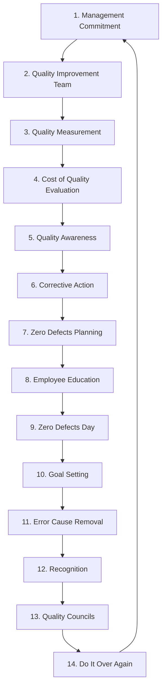

## Philip Crosby and the Zero Defects Philosophy

### Overview

Philip B. Crosby (1926–2001) was an American businessman and quality management thinker best known for the **Zero Defects** concept and the assertion that **"Quality is Free."** Unlike Deming's statistical/philosophical orientation or Juran's structured managerial trilogy, Crosby's approach was explicitly motivational and absolutist: quality is defined strictly as **conformance to requirements**, achieved through prevention, with **Zero Defects** as the only acceptable performance standard. His framework directly supplies the conceptual justification for why prevention investment pays for itself — the core economic claim underlying the Cost of Quality (CoQ) and 1-10-100 Rule.

### Historical Context

- **1952–1965:** Worked in quality roles at Crosley, Martin Company, and ITT, where he developed the Zero Defects concept while managing the Pershing missile program at Martin Marietta (early 1960s) — a context demanding extremely low defect tolerance.
- **1965–1979:** Served as Vice President and Director of Quality at ITT Corporation, applying and refining his methods across a large multinational.
- **1979:** Published *Quality Is Free: The Art of Making Quality Certain*, his most influential work, which became a bestseller and popularized the economic argument for prevention-based quality among general business audiences (not just quality specialists).
- **1979:** Founded Philip Crosby Associates and later Career IV, Inc., to consult and train organizations in his methodology.
- **1984:** Published *Quality Without Tears*, further disseminating his practical tools.
- Crosby's work is credited with shifting quality discourse in American management circles toward a business/financial framing accessible to non-technical executives, complementing the more statistically grounded work of Shewhart, Deming, and Juran.

### The Four Absolutes of Quality Management

Crosby's core philosophy is organized around four foundational, non-negotiable principles:

**Key Points**

1. **Quality is defined as conformance to requirements** — not "goodness," elegance, or an abstract aesthetic standard. A product either meets its specification or it does not.
2. **The system for causing quality is prevention**, not appraisal. Inspecting quality in after the fact is rejected as a strategy, echoing Deming's Point 3.
3. **The performance standard is Zero Defects**, not "acceptable quality levels" (AQLs) derived from statistical sampling tolerances. Crosby argued that any AQL implicitly authorizes a planned rate of failure.
4. **The measurement of quality is the Price of Nonconformance (PONC)** — not indices or vague quality scores, but the actual dollar cost of doing things wrong the first time.

### "Quality Is Free": The Central Economic Claim

Crosby's signature argument: the cost of achieving good quality (prevention investment) is more than offset by the costs it eliminates (failure costs) — meaning that, net, a well-run quality program costs the organization nothing and can even be a net financial gain.

**Key Points**

- **Price of Conformance (POC):** costs incurred to ensure things are done right — training, process control, quality planning (maps to Prevention + planned Appraisal in CoQ terms).
- **Price of Nonconformance (PONC):** costs incurred because things were done wrong — scrap, rework, warranty, lost customers, lost reputation (maps to Internal + External Failure in CoQ terms).
- Crosby's central claim: $PONC$ in a poorly managed quality system is typically far larger than the $POC$ required to prevent it — organizations that treat quality investment as optional are, in effect, choosing to pay far more via nonconformance.
- **[Inference]** Crosby's often-cited estimate that PONC can run **20% or more of revenue** in poorly managed organizations is an illustrative order-of-magnitude claim from his consulting experience rather than a universally derived statistic; actual figures vary substantially by industry and organizational maturity.

$$POC + PONC = \text{Total Cost of Quality (Crosby framing)}$$

### The 14 Steps to Quality Improvement

Crosby's implementation methodology, structured as a sequential organizational program:

1. Management commitment
2. Quality improvement team
3. Quality measurement
4. Cost of quality evaluation
5. Quality awareness
6. Corrective action
7. Zero Defects planning
8. Employee education
9. Zero Defects Day
10. Goal setting
11. Error cause removal
12. Recognition
13. Quality councils
14. Do it over again (institutionalize as a continuous cycle)

**Key Points**

- **Zero Defects Day** (Step 9) was a highly publicized, ceremonial launch event intended to create a visible, organization-wide commitment moment — a hallmark of Crosby's motivational, culture-driven approach.
- Step 11 ("Error cause removal") operationalizes prevention at the individual/team level: employees identify specific obstacles preventing error-free work, which management is then responsible for removing.
- The 14 Steps are explicitly sequential and cyclical (Step 14 loops back), reflecting continuous improvement rather than a one-time initiative.

### The Quality Vaccine

Crosby proposed a "vaccine" metaphor — three managerial ingredients that, administered consistently, "immunize" an organization against poor quality:

| Ingredient | Description |
| --- | --- |
| **Integrity** | Accurate data, honest measurement, and genuine commitment to standards rather than convenient fudging of results |
| **Systems** | Formal quality-cost measurement, education, and defect-prevention procedures built into normal operations |
| **Communications** | Continuous flow of information about progress, achievements, and problems, in a way that provides useful, non-punitive feedback |

### Zero Defects: Philosophy vs. Common Misinterpretation

**Key Points**

- Zero Defects is a **performance standard and attitude**, not a literal statistical claim that error rates can always be engineered to exactly zero in every process. Crosby framed it as analogous to "doing it right the first time" as the default expectation, replacing the implicit acceptance of some planned error rate.
- Crosby explicitly rejected statistically derived **Acceptable Quality Levels (AQLs)**, arguing that setting any planned defect tolerance psychologically authorizes workers and managers to expect and accept failure.
- **[Inference]** Critics (including some statistically oriented quality theorists) have argued Zero Defects can be difficult to reconcile with Shewhart's/Deming's acknowledgment that all processes exhibit some level of statistical variation; Crosby's response was that Zero Defects is a motivational/managerial standard for eliminating *preventable* error, not a claim about eliminating inherent statistical noise.

### Connection to the Cost of Quality (CoQ) Framework

| Crosby Concept | CoQ Category Mapping |
| --- | --- |
| Price of Conformance (POC) | Prevention Costs + planned Appraisal Costs |
| Price of Nonconformance (PONC) | Internal Failure Costs + External Failure Costs |
| Zero Defects standard | Target state that minimizes Internal + External Failure to near-zero |
| Cost of Quality Evaluation (Step 4) | Direct precursor to formal CoQ reporting/auditing |

### Connection to the 1-10-100 Rule

Crosby's PONC concept is the direct financial articulation of why the 1-10-100 Rule's escalation matters at an organizational level: every dollar not spent on POC (prevention) risks being paid back multiple times over as PONC, with the multiplier growing the later the defect is caught.

**Example**

A software company skips a $1-equivalent design-stage requirements review (POC) to save time. The resulting ambiguous requirement produces a defect caught during QA testing at a $10-equivalent cost (developer rework, re-testing). Because the ambiguity also affected an edge case QA missed, a second instance of the same defect reaches production and requires a $100-equivalent emergency patch, customer support escalation, and a public post-mortem. Crosby's framework would characterize the total PONC ($10 + $100, plus reputational cost) as vastly exceeding the $1 POC that would have prevented both instances — the empirical justification for treating "quality is free" as a literal net-cost claim.

### Crosby vs. Deming vs. Juran: Comparative Positioning

| Dimension | Crosby | Deming | Juran |
| --- | --- | --- | --- |
| Definition of quality | Conformance to requirements | Reduction of variation; fitness for use over time | Fitness for use |
| Performance standard | Zero Defects (absolute) | Continuous improvement (no fixed endpoint) | Planned, project-based improvement targets |
| View of AQLs/quotas | Explicitly rejected | Rejected numerical quotas without method | Used structured targets within projects |
| Primary audience/tone | Executive/motivational, business-financial | Statistical/systemic, philosophically deep | Managerial/operational, project-execution focused |
| Signature economic concept | "Quality Is Free" (POC vs. PONC) | Deming Chain Reaction | Cost of Poor Quality (COPQ) |

### Common Misconceptions

- **[Inference]** "Quality Is Free" does not mean quality *programs* have no implementation cost — POC (prevention/conformance investment) is real spending. The claim is that this spending is more than recovered by eliminated PONC, producing a net-positive or break-even financial outcome, not that quality initiatives require zero resources.
- Crosby's Zero Defects is sometimes confused with Six Sigma's 3.4-defects-per-million-opportunities standard; the two are conceptually related (both reject "acceptable" planned defect rates) but originate from distinct methodological traditions — Zero Defects as a motivational/managerial absolute, Six Sigma DPMO as a statistically derived process-capability metric. [Inference]

### Related Topics

- W. Edwards Deming's Quality Philosophy and the 14 Points
- Joseph Juran and the Quality Trilogy
- Armand Feigenbaum and Total Quality Control
- Cost of Quality (CoQ) Categories: Prevention, Appraisal, Internal Failure, External Failure
- The 1-10-100 Rule: Quantitative Models and Industry Benchmarks
- Six Sigma DPMO and Process Capability Standards
- Price of Nonconformance (PONC) Measurement in Modern Organizations