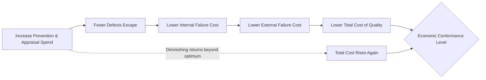

## The Economic Case for Investing in Quality

### Overview

The economic case for investing in quality rests on a counterintuitive premise: spending money to prevent defects costs less than spending money to fix them. This idea reframes quality from a discretionary expense into a strategic investment with measurable financial returns. The argument draws on cost accounting, decision theory under uncertainty, and empirical observation across manufacturing and service industries.

### Historical Foundations

**Key Points**

- Walter Shewhart (1920s, Bell Labs) first formalized the idea that variation itself carries a cost, laying groundwork for statistical process control.
- Joseph Juran popularized the phrase "gold in the mine" to describe the hidden savings recoverable by reducing the cost of poor quality (COPQ).
- Philip Crosby's 1979 book *Quality Is Free* argued that the cost of nonconformance (rework, scrap, warranty claims) typically exceeds the cost of conformance (prevention, training, process control), making net investment in quality a break-even or profitable proposition.
- Armand Feigenbaum introduced "Total Quality Control," embedding cost-of-quality thinking across the entire value chain rather than isolating it to the inspection function.

### The Core Economic Argument

Traditional cost accounting treats quality assurance as overhead — a cost center to be minimized. The economic case for quality inverts this by showing that underinvestment in prevention generates larger, often hidden, downstream costs:

- Scrap and rework consume labor and material twice.
- Field failures trigger warranty costs, recalls, and support burden.
- Customer attrition from poor quality carries a compounding revenue cost (lost lifetime value, negative word-of-mouth).
- Regulatory and liability exposure grows with defect rates in safety-critical domains.

The argument is not that quality should be maximized without limit — it is that quality investment should be pursued up to the point where the marginal cost of prevention equals the marginal cost of failure it prevents. This is the **economic conformance level**, discussed further below.

### Cost of Quality (CoQ) Framework

CoQ decomposes total quality-related spending into four categories, conventionally grouped into "cost of conformance" and "cost of nonconformance":

**Cost of Conformance (money spent to prevent defects)**

- *Prevention costs*: quality planning, training, process design, supplier qualification, design reviews.
- *Appraisal costs*: inspection, testing, audits, calibration of measurement equipment.

**Cost of Nonconformance (money spent because defects occurred)**

- *Internal failure costs*: scrap, rework, re-testing, downtime — defects caught before the customer receives the product.
- *External failure costs*: warranty claims, returns, complaint handling, litigation, brand damage — defects caught after delivery.

The economic case for quality is essentially the empirical observation that a dollar of prevention spending displaces multiple dollars of failure spending, particularly external failure spending.

### The 1-10-100 Rule

**Key Points**

The 1-10-100 Rule is a heuristic (not a physical law) stating that the cost of addressing a quality problem multiplies by roughly an order of magnitude at each stage it goes undetected:

| Stage | Relative Cost | Example |
| --- | --- | --- |
| Prevention | $1 | Catching a requirements ambiguity in a design review |
| Correction (internal) | $10 | Finding and fixing the defect during internal testing/QA |
| Failure (external) | $100 | The defect reaches the customer, requiring a field fix, refund, or reputational repair |

This is attributed in various forms to quality-management literature of the 1980s–1990s (often associated with George Labovitz and others popularizing it in service-quality contexts) and is best understood as a directional model, not a precise multiplier. [Inference] The exact ratios (1:10:100) are illustrative rather than empirically derived constants — actual multipliers vary widely by industry, defect type, and detection latency.

**Example**

Consider a software defect in a document management system (relevant to workflows like a document management platform for a government unit):

- **$1 — Prevention**: A code reviewer flags an ambiguous validation rule for uploaded documents before merge. Cost: ~30 minutes of review time.
- **$10 — Internal correction**: The same issue slips past review but is caught by QA during a test cycle. Cost: bug ticket, reproduction, fix, re-test — roughly a day of combined effort.
- **$100 — External failure**: The issue reaches production. A government office uploads a malformed document that corrupts a batch of records. Cost: incident response, data recovery, client communication, possible SLA penalty, and erosion of institutional trust.

The multiplier effect is driven by three compounding factors:

1. **Context loss** — the original developer's understanding of the code has faded by the time the defect surfaces later.
2. **Blast radius growth** — a defect caught early affects one component; caught late, it may have propagated into dependent systems or been replicated across records.
3. **Coordination overhead** — late-stage fixes require cross-team communication (support, QA, engineering, sometimes legal/compliance) that early fixes do not.

### Economic Conformance Level (Optimal Quality Investment)

**Key Points**

Classical CoQ theory models an optimum: as prevention/appraisal spending increases, failure costs decrease, and total cost follows a U-shaped curve. The minimum of that curve is the economic conformance level.

$$C_{total}(q) = C_{prevention}(q) + C_{appraisal}(q) + C_{failure}(q)$$

where $q$ represents the level of conformance (quality investment intensity), $C_{prevention}$ and $C_{appraisal}$ increase with $q$, and $C_{failure}$ decreases with $q$.

[Inference] The classical U-shaped curve assumes diminishing returns on prevention spending and a fixed cost per failure. In modern software and digitally replicable systems, some practitioners argue the curve is closer to monotonically decreasing (near-zero marginal cost of additional prevention automation, e.g., static analysis, combined with very high external failure costs from instant replication of defects), which shifts the optimum further toward heavier upfront investment than classical manufacturing models suggest. This is a debated, context-dependent claim rather than settled theory.

### Quantifying the Return on Quality Investment

**Key Points**

Organizations formalize the economic case using a Return on Quality (ROQ) approach:

$$ROQ = \frac{\Delta \text{Failure Cost Avoided} - \text{Cost of Quality Initiative}}{\text{Cost of Quality Initiative}}$$

To apply this in practice:

1. Baseline current COPQ (cost of poor quality) using failure cost categories above.
2. Estimate the reduction in defect escape rate from a proposed prevention investment (e.g., automated testing, code review tooling, staff training).
3. Translate the defect reduction into avoided internal/external failure costs using historical incident cost data.
4. Compare avoided cost against the investment cost over a defined period (typically 1–3 years for amortization).

**Example**

A government DMS project considering investment in automated document-validation testing:

- Current state: 15 validation-related defects reach production per quarter, each costing an estimated ₱50,000 in support, data correction, and rework (external failure cost).
- Proposed investment: ₱600,000 for a validation test suite and CI integration (prevention cost), estimated to catch 80% of these defects pre-release.
- Avoided cost per quarter: 12 defects × ₱50,000 = ₱600,000.
- Payback period: approximately one quarter; ROQ becomes strongly positive in subsequent quarters since the prevention cost is largely one-time (build) plus smaller maintenance cost, while the avoided failure cost recurs.

[Unverified] The specific defect counts and costs above are illustrative for demonstrating the calculation method, not derived from a real dataset.

### Non-Financial Multipliers of the Economic Case

Beyond direct cost avoidance, several effects amplify the economic argument but are harder to quantify:

- **Customer lifetime value erosion**: a single poor-quality experience can end a customer relationship worth many multiples of the immediate transaction.
- **Reputation and trust costs**: particularly acute for public-sector or regulated systems, where failures affect institutional credibility rather than just a single transaction.
- **Opportunity cost of engineering time**: time spent firefighting production defects is time not spent on new capability development — a real but often unbudgeted cost.
- **Compounding technical debt**: unresolved quality issues tend to increase the cost of *future* prevention and correction, not just the cost of the current defect.

### Common Objections and Their Rebuttals

**Key Points**

- *"Quality investment has no ceiling — we'll overspend."* Rebuttal: the economic conformance level model explicitly caps optimal investment; the case for quality is not "infinite quality" but "quality up to the point where prevention cost exceeds avoided failure cost."
- *"We can't measure COPQ precisely, so we can't justify the investment."* Rebuttal: even directional/order-of-magnitude estimates (as in the 1-10-100 heuristic) are sufficient to support prioritization decisions; precision is less important than avoiding gross misallocation.
- *"Our failures are rare, so prevention isn't worth it."* Rebuttal: rare-but-severe failures (e.g., data corruption in a government records system) often have asymmetric cost profiles where expected cost (probability × impact) still justifies prevention spend, especially when failure has reputational or legal tail risk.

### Illustration: Cost Escalation Curve (svg_diagram)

<svg xmlns="http://www.w3.org/2000/svg" viewBox="0 0 640 380">
<text x="320" y="24" text-anchor="middle" font-size="16" font-weight="bold" fill="#1a1a1a">1-10-100 Cost Escalation (svg_diagram)</text>
<line x1="70" y1="320" x2="600" y2="320" stroke="#333" stroke-width="2" />
<line x1="70" y1="320" x2="70" y2="50" stroke="#333" stroke-width="2" />
<text x="335" y="355" text-anchor="middle" font-size="13" fill="#333">Detection Stage</text>
<text x="30" y="190" text-anchor="middle" font-size="13" fill="#333" transform="rotate(-90 30 190)">Relative Cost</text>
<rect x="130" y="300" width="90" height="20" fill="#4a90d9" />
<text x="175" y="315" text-anchor="middle" font-size="11" fill="#fff">$1</text>
<text x="175" y="335" text-anchor="middle" font-size="12" fill="#333">Prevention</text>
<rect x="300" y="230" width="90" height="90" fill="#e0a030" />
<text x="345" y="280" text-anchor="middle" font-size="11" fill="#fff">$10</text>
<text x="345" y="335" text-anchor="middle" font-size="12" fill="#333">Internal Fix</text>
<rect x="470" y="70" width="90" height="250" fill="#d9534f" />
<text x="515" y="200" text-anchor="middle" font-size="12" fill="#fff">$100</text>
<text x="515" y="335" text-anchor="middle" font-size="12" fill="#333">External Failure</text>
</svg>

### Related Topics

- Cost of Poor Quality (COPQ) measurement frameworks
- Statistical Process Control and variation reduction (Shewhart, Deming)
- Crosby's Fourteen Steps to Quality Improvement
- Juran's Quality Trilogy (Planning, Control, Improvement)
- Total Quality Management (TQM) as an organizational system
- Shift-left testing and DevOps quality economics
- Failure Mode and Effects Analysis (FMEA) as a prevention-cost tool
- Six Sigma and defect-rate-driven cost modeling