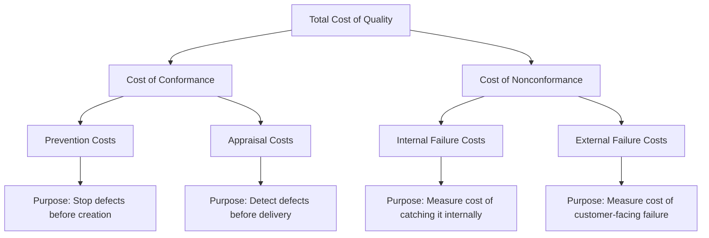

## Definition and Purpose of Cost of Quality

### Definition

Cost of Quality (CoQ) is a methodology for quantifying the total financial resources an organization spends on quality-related activities — both the money spent to *achieve* good quality and the money spent because *poor* quality occurred. It converts an abstract concept ("quality") into a measurable, budgetable, and comparable financial figure, enabling quality decisions to be evaluated with the same rigor as any other capital or operating expenditure.

Formally:

$$CoQ = C_{prevention} + C_{appraisal} + C_{internal\ failure} + C_{external\ failure}$$

A critical terminological distinction sits underneath this definition:

- **Cost of Conformance (CoC)**: money spent to ensure requirements are met (prevention + appraisal).
- **Cost of Nonconformance (CoNC)**: money spent as a consequence of requirements not being met (internal + external failure).

CoQ is the sum of both — it does not measure "how much quality costs" in the sense of gold-plating a product; it measures the *total economic footprint* of the quality function, including the costs incurred by its absence.

### Purpose

**Key Points**

CoQ serves several distinct organizational purposes:

1. **Make quality visible in financial terms.** Quality problems are often scattered across departmental budgets (support tickets in customer service, rework in engineering, returns in logistics) and never aggregated. CoQ consolidates them into a single figure decision-makers can act on.
2. **Justify investment in prevention.** Without a cost framework, prevention spending (training, tooling, process design) looks like pure overhead. CoQ reframes it as an investment with a quantifiable offset in avoided failure cost.
3. **Prioritize improvement efforts.** By breaking total CoQ into categories, an organization can identify whether its spending is concentrated in failure costs (a red flag indicating reactive, firefighting-mode quality management) or in prevention costs (indicative of a mature, proactive quality culture).
4. **Track quality maturity over time.** A declining ratio of failure cost to total CoQ, alongside a rising or stable prevention cost, is a standard indicator of improving quality management maturity.
5. **Support cross-functional communication.** Engineering, finance, and operations often speak different languages about quality. Cost figures are a shared vocabulary that lets quality issues compete fairly for budget against other business priorities.

### Why "Cost" and Not Just "Defect Count"

Defect counts and cost figures answer different questions. Defect counts tell you *how often* something goes wrong; cost tells you *how much it matters*. A system with a low defect count but catastrophic per-defect cost (e.g., a data-corruption bug in a records-management system) can have higher CoQ than a system with frequent, cheap-to-fix cosmetic defects. Cost-based measurement avoids the trap of treating all defects as equally important.

[Inference] This is a widely accepted rationale in quality-management literature, but the practical difficulty of accurately costing intangible failure effects (e.g., reputational damage) means CoQ figures are often understated relative to true economic impact, particularly for external failure costs.

### The Four Cost Categories (Structural Overview)

| Category | Question It Answers | Timing | Example |
| --- | --- | --- | --- |
| Prevention | "What are we spending to stop defects before they occur?" | Before defect creation | Requirements review, staff training, process design |
| Appraisal | "What are we spending to detect defects that were created?" | After creation, before delivery | Testing, inspection, code review, audits |
| Internal Failure | "What is a defect costing us because we caught it ourselves?" | After detection, before delivery | Rework, scrap, re-testing |
| External Failure | "What is a defect costing us because the customer found it?" | After delivery | Warranty claims, support costs, litigation, reputational harm |

### Scope of Application

CoQ was originally formalized in manufacturing contexts (Juran, Feigenbaum, Crosby — mid-20th century) but its logic generalizes to any domain with a distinguishable "specification" and a distinguishable "failure to meet specification," including:

- Software development (defects, bugs, failed deployments)
- Service delivery (SLA breaches, complaint handling)
- Public-sector systems (compliance failures, data integrity incidents, citizen-facing service disruptions)
- Healthcare (adverse events, readmissions)
- Financial services (transaction errors, regulatory fines)

**Example**

In a document management system context, CoQ purpose translates concretely:

- **Prevention**: time spent writing a data-validation schema before development begins.
- **Appraisal**: QA test cycles verifying uploaded documents are correctly classified and stored.
- **Internal failure**: a misclassification bug caught in staging, requiring a schema fix and re-test.
- **External failure**: a government office discovers that archived documents were mis-tagged after go-live, requiring manual data correction and a formal incident report.

The *purpose* of tracking these four numbers separately, rather than just noting "we had a bug," is that it tells the project owner *where in the lifecycle* money is leaking — which, in turn, tells them *where to invest next* to reduce total cost.

### Common Misconceptions

**Key Points**

- *"CoQ measures how expensive it is to be high-quality."* Incorrect — CoQ measures the *total* spend, including failure costs. A poorly-run organization has *higher* CoQ than a well-run one, not lower, because failure costs dominate.
- *"Lower CoQ is always better."* Generally true directionally, but CoQ of zero is not the goal — an organization with zero appraisal spend and zero failure cost is not "efficient," it may simply not be measuring failures at all (a measurement gap, not a quality achievement).
- *"CoQ is a quality-department metric."* In mature usage, CoQ is a cross-functional financial metric reviewed by finance and leadership, not confined to QA.

### Next Steps

- History and Origins of Cost of Quality Frameworks (Juran, Feigenbaum, Crosby)
- Prevention Costs: Categories and Measurement
- Appraisal Costs: Categories and Measurement
- Internal Failure Costs: Categories and Measurement
- External Failure Costs: Categories and Measurement
- Building a CoQ Reporting Model for an Organization
- Relationship Between CoQ and the 1-10-100 Rule