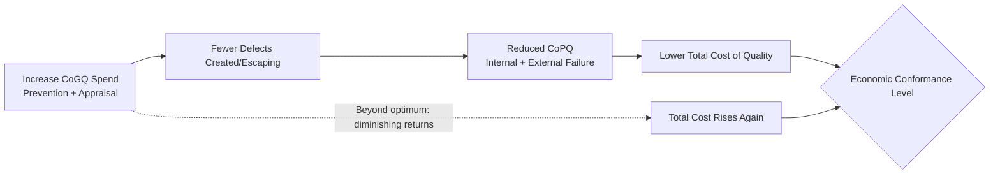

## Cost of Good Quality versus Cost of Poor Quality

### Definitions

**Cost of Good Quality (CoGQ)**, also called Cost of Conformance, is the money spent proactively to ensure a product or service meets requirements. It is investment-oriented spending: it exists to prevent problems or to verify their absence before delivery.

**Cost of Poor Quality (CoPQ)**, also called Cost of Nonconformance, is the money spent reactively because requirements were *not* met. It is consequence-oriented spending: it exists only because a defect occurred.

$$CoQ = CoGQ + CoPQ$$

$$CoGQ = C_{prevention} + C_{appraisal} \qquad CoPQ = C_{internal\ failure} + C_{external\ failure}$$

This split is the primary diagnostic lens within the broader CoQ framework: it separates spending that *creates* quality from spending that *is caused by the lack of it*.

### Structural Comparison

| Dimension | Cost of Good Quality (CoGQ) | Cost of Poor Quality (CoPQ) |
| --- | --- | --- |
| Timing | Before defect occurs / before delivery | After defect occurs |
| Nature | Discretionary, planned, budgeted | Often unplanned, variable |
| Categories | Prevention, Appraisal | Internal Failure, External Failure |
| Organizational view | Investment | Loss / waste |
| Trend when quality improves | Rises initially, then stabilizes | Falls over time |
| Predictability | High — fixed processes, scheduled activities | Low — depends on defect rate, severity, timing of discovery |
| Typical stakeholder | Quality/engineering management | Finance, customer support, legal |

### Cost of Good Quality: Subcomponents

**Prevention costs** — spent to stop defects before they are created:

- Quality planning and requirements review
- Staff training and certification
- Process design and process capability studies
- Supplier/vendor qualification
- Design reviews, architecture reviews

**Appraisal costs** — spent to detect defects that already exist, before the customer sees them:

- Inspection and testing (manual or automated)
- Code review, static analysis
- Audits and calibration of measurement/test equipment
- User acceptance testing (UAT)

Both are, by construction, costs an organization *chooses* to incur. They are visible on a budget line before any incident occurs.

### Cost of Poor Quality: Subcomponents

**Internal failure costs** — defects caught before the customer receives the product:

- Rework and re-testing
- Scrap or discarded output
- Downtime caused by defect investigation
- Re-processing of failed batches

**External failure costs** — defects discovered after delivery:

- Warranty claims and free repairs/replacements
- Customer support burden and complaint handling
- Returns and refunds
- Litigation, regulatory fines, contractual penalties
- Reputational damage and customer attrition (harder to quantify but real)

Both are, by construction, *unplanned* — they only exist because CoGQ spending was insufficient or imperfect.

### The Inverse Relationship

**Key Points**

CoGQ and CoPQ are not independent; they trade off against each other along a diminishing-returns curve. Increased prevention/appraisal spend reduces the defect escape rate, which reduces internal and external failure costs — up to a point.

This relationship is the basis for the CoQ optimization problem discussed under "The Economic Case for Investing in Quality": total cost is minimized not by maximizing CoGQ, but by finding the point where marginal CoGQ spend equals marginal CoPQ avoided.

### Why the Ratio Matters More Than the Absolute Numbers

A CoQ report showing only the total figure hides the organization's quality maturity. The **ratio of CoPQ to total CoQ** is the more diagnostic signal:

- **High CoPQ ratio (e.g., 70%+ of CoQ is failure cost)**: reactive, firefighting organization. Most spending happens *after* problems occur. This pattern is common in immature quality programs.
- **High CoGQ ratio (e.g., 70%+ of CoQ is prevention/appraisal)**: proactive organization, but if total CoQ is not also falling over time, this may indicate over-investment in appraisal without addressing root causes (inspecting quality in rather than building it in).
- **Mature target state**: total CoQ falls over time as prevention costs rise modestly, appraisal costs fall (fewer things need checking because fewer defects are created), and both failure categories shrink substantially.

[Inference] Specific target ratios (such as the commonly cited "prevention spend should exceed 50% of CoQ in mature organizations") appear in quality-management training materials but vary significantly by industry and are not derived from a universal empirical constant.

### Example: Applying the Split in a Document Management System Project

For a government DMS project, a quarterly CoQ breakdown might look like:

| Category | Type | Example Activity | Illustrative Cost |
| --- | --- | --- | --- |
| Prevention | CoGQ | Data schema design review, developer training on validation rules | ₱150,000 |
| Appraisal | CoGQ | Automated test suite runs, manual UAT with LGU staff | ₱200,000 |
| Internal Failure | CoPQ | Bug fixes found in staging before release | ₱100,000 |
| External Failure | CoPQ | Manual data correction after a misclassification issue reached production, plus incident report to the LGU | ₱450,000 |

Here, CoGQ = ₱350,000, CoPQ = ₱550,000. The dominant external failure cost signals that appraisal (testing/UAT) is under-catching defects relative to what reaches production — the natural next investment is stronger pre-release validation (shifting cost from external failure toward appraisal/prevention), which the 1-10-100 Rule predicts will lower total cost even though CoGQ line-items rise.

[Unverified] The peso figures above are illustrative for demonstrating the calculation method, not drawn from an actual project ledger.

### Common Pitfalls in Distinguishing the Two

**Key Points**

- **Misclassifying appraisal as prevention.** Testing does not prevent defects — it detects them after they exist. Confusing the two overstates how proactive an organization actually is.
- **Undercounting external failure cost.** Reputational damage, customer churn, and legal exposure are frequently omitted because they are hard to quantify, which systematically understates CoPQ and makes the economic case for prevention look weaker than it is.
- **Treating CoGQ as pure overhead to be minimized.** Since CoGQ is the *visible, budgeted* cost, it is often the first target for cost-cutting — even though doing so typically increases CoPQ by more than the CoGQ savings, raising total CoQ.

### Next Steps

- Prevention Costs: Categories and Measurement
- Appraisal Costs: Categories and Measurement
- Internal Failure Costs: Categories and Measurement
- External Failure Costs: Categories and Measurement
- Building a CoQ Reporting Model for an Organization
- The Economic Case for Investing in Quality (economic conformance level, ROQ)