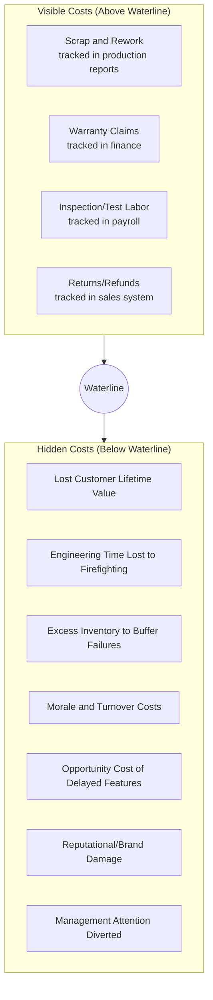

## Visible Costs versus Hidden Costs of Quality

### Definitions

**Visible costs of quality** are quality-related expenditures that are already captured in standard accounting systems — they appear on a ledger, a budget line, or an invoice, and are straightforward to attribute to a specific quality activity or failure.

**Hidden costs of quality** are quality-related expenditures that exist but are not captured by standard accounting practices — they are absorbed into general overhead, distributed across unrelated budget lines, or never measured at all because no accounting category exists for them. They are real economic costs, but they do not show up when someone runs a report labeled "cost of quality."

This distinction cuts across the four CoQ categories (prevention, appraisal, internal failure, external failure) rather than replacing them — visible and hidden costs exist within each category, but hidden costs are disproportionately concentrated in failure costs, especially external failure.

### The Iceberg Model

**Key Points**

The relationship between visible and hidden CoQ is classically illustrated as an iceberg: the visible costs are the small portion above the waterline, while the much larger mass of hidden costs sits below, unmeasured.

This model, popularized in Cost of Quality literature (often attributed to work extending Crosby's and Juran's frameworks in the 1980s–1990s), argues that organizations relying only on visible CoQ figures are systematically underestimating their true cost of poor quality — sometimes by a factor of several times the visible figure.

[Inference] The specific claim that hidden costs are "3 to 20 times" larger than visible costs appears in various quality-management training materials but is not a precisely derived empirical constant; it varies enormously by industry, and the magnitude should be treated as illustrative rather than a benchmark to apply literally.

### Comparative Table

| Dimension | Visible Costs | Hidden Costs |
| --- | --- | --- |
| Accounting treatment | Captured in existing cost/GL accounts | Absorbed into overhead or untracked |
| Ease of measurement | Straightforward — direct line items | Difficult — requires estimation or proxy metrics |
| Typical category concentration | Internal failure, appraisal | External failure, prevention gaps |
| Organizational awareness | High — routinely reported | Low — often invisible to leadership |
| Example | Cost of scrapped units, warranty payouts | Lost customer trust, diverted engineering time |
| Risk of the metric | Understates the case for prevention investment | N/A — but omission causes understatement above |

### Categorized Examples

**Visible Costs**

- Direct labor and materials for rework or scrap
- Warranty payments recorded in financial statements
- Cost of test equipment, calibration services
- Refunds and return-processing costs
- Salaries of dedicated QA/inspection staff

**Hidden Costs**

- **Lost customer lifetime value**: a churned customer's future revenue never appears as a "quality cost" in accounting — it appears as reduced sales, if it is noticed at all.
- **Engineering/support time diverted to firefighting**: hours spent investigating a production incident are usually absorbed into general payroll, not tagged to the specific defect that caused them.
- **Excess safety stock or buffer capacity**: organizations that don't trust their process quality often hold extra inventory or staff capacity to absorb expected failures — a cost caused by poor quality but booked as "inventory carrying cost" or "staffing cost."
- **Expediting costs**: rush shipping, overtime, or emergency vendor engagement to recover from a failure, often coded to logistics or operations budgets rather than quality.
- **Management and administrative time**: time spent by leadership handling escalations, writing incident reports, or managing client relationships strained by a quality failure.
- **Morale and turnover**: teams that spend disproportionate time firefighting quality issues experience burnout and attrition, which carries recruiting and onboarding costs rarely linked back to the original defect.
- **Loss of future business/opportunity cost**: a client who doesn't renew a contract, or declines to expand scope, due to accumulated quality frustration — a cost with no natural home in standard accounting.
- **Compliance and audit risk exposure**: in regulated environments, an unaddressed quality gap can create latent legal exposure that only becomes a "cost" if and when it is triggered.

### Why Hidden Costs Are Systematically Underreported

**Key Points**

1. **No natural accounting home.** Standard chart-of-accounts structures were designed around functional departments (sales, engineering, support), not around root-cause categories like "quality." A support ticket caused by a software defect is booked as "customer support cost," not "external failure cost of quality," unless someone deliberately re-tags it.
2. **Attribution difficulty.** It is often unclear how much of a customer's decision to churn was caused by a specific quality issue versus other factors, so the cost is left unattributed rather than guessed at.
3. **Delayed manifestation.** Reputational and relationship damage may not manifest financially until long after the triggering defect, breaking the causal link in most reporting periods.
4. **Incentive to under-measure.** Teams responsible for a failure may have limited incentive to fully surface its downstream cost, especially where doing so reflects on their own performance.

### Example: Government DMS Context

For a document management system serving a local government unit, consider a data-tagging defect that caused several archived documents to be misfiled:

**Visible costs (would appear in a report):**

- Developer hours to fix the tagging bug (~2 days, tracked in project time logs)
- QA hours to verify the fix and re-test related records
- Direct cost of a support engineer manually correcting mis-tagged records

**Hidden costs (would likely never appear in a report):**

- Time LGU staff spent searching for misfiled documents before the root cause was identified
- Erosion of the LGU's confidence in the system, potentially affecting future budget approval or expansion requests
- Informal, unlogged Slack/email time between the vendor's project lead and the LGU's IT officer managing the relationship after the incident
- Risk that the incident becomes a reference point in future procurement decisions, even if never explicitly cited

[Unverified] This scenario is illustrative to demonstrate the visible/hidden distinction, not a report of an actual incident.

### Practical Implication for Quality Management

**Key Points**

Because hidden costs are real but unmeasured, relying exclusively on visible CoQ figures to justify prevention investment tends to *undersell* the economic case — the visible numbers alone often make prevention spending look marginal, when the true total cost (visible + hidden) would justify significantly more investment. Mature quality programs address this by:

- Introducing proxy metrics for hidden costs (e.g., support ticket volume as a proxy for customer friction, employee time-tracking tags for firefighting work).
- Conducting periodic "cost of quality audits" that deliberately search for unattributed failure costs across departments.
- Using qualitative signals (customer satisfaction scores, staff sentiment, churn interviews) alongside quantitative CoQ figures to build a fuller picture.
- Treating the *known* visible CoQ as a conservative lower bound, not the complete picture, when making investment decisions.

### Next Steps

- Building a CoQ Reporting Model for an Organization
- External Failure Costs: Categories and Measurement
- Customer Lifetime Value and Its Link to Quality Costs
- Techniques for Estimating Hidden Costs (proxy metrics, cost-of-quality audits)
- The Economic Case for Investing in Quality