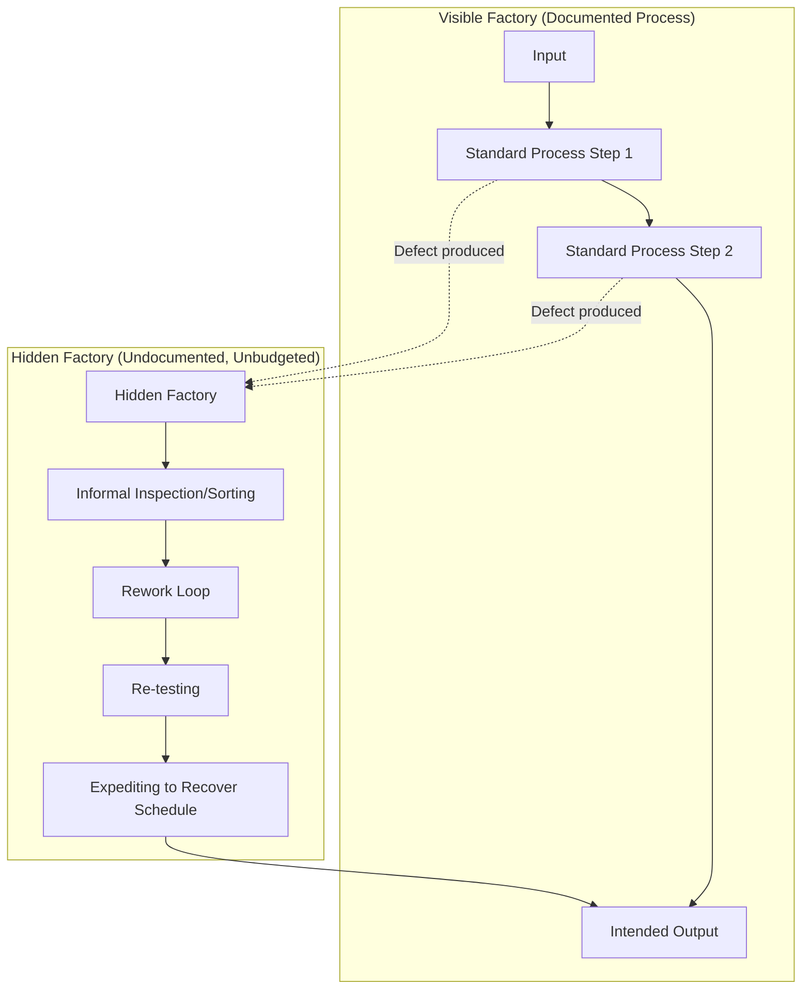

## The Hidden Factory Concept

### Definition

The Hidden Factory refers to the invisible portion of an organization's capacity — labor, time, equipment, and space — that is consumed not by producing value for customers, but by correcting, reworking, inspecting, and compensating for defects and errors. It operates in parallel with the "visible factory" (the process that produces intended output) but exists entirely because the visible factory's output is imperfect. It has no name on an org chart, no dedicated budget line, and often no formal recognition — yet it consumes real resources at real cost.

The term is generally attributed to Armand Feigenbaum, who used it to describe the portion of a plant's — or, by extension, any operation's — capacity silently absorbed by non-value-added rework rather than production.

### Core Concept

**Key Points**

Every organization has a designed, documented process for producing its output (the "visible factory"). When that process produces defects, a second, undocumented process springs up around it to catch and fix them — extra inspection steps, informal rework loops, expediting procedures, and workarounds. This second process is the Hidden Factory. It is:

- **Unplanned** — it was never designed; it emerged as a coping mechanism.
- **Unbudgeted** — its costs are absorbed into general labor/overhead rather than tracked as a discrete cost center.
- **Persistent** — because it is invisible, it tends to become normalized as "just how things are done" rather than being recognized and eliminated.
- **Capacity-consuming** — every hour spent in the hidden factory is an hour not spent on the visible factory's actual output, effectively reducing true production capacity without ever appearing as a capacity constraint in planning.

### Relationship to the Iceberg Model and CoQ

The Hidden Factory concept and the Iceberg Model of Quality Costs describe the same underlying phenomenon from different angles:

- The **Iceberg Model** focuses on *cost visibility* — which quality costs appear in accounting reports versus which do not.
- The **Hidden Factory** focuses on *capacity and process* — how much of an organization's actual working time and resources are consumed by unplanned correction activity, regardless of whether that time is separately costed.

In CoQ terms, the Hidden Factory is primarily composed of **internal failure costs** (rework, re-testing, scrap-sorting) along with some **appraisal costs** that exist only because of poor upstream quality (redundant inspection steps added informally to catch recurring problems). Because this labor is usually charged to the same cost center as normal production work, it is rarely broken out — making the Hidden Factory a structural cause of the Iceberg Model's "hidden costs."

### Why the Hidden Factory Is Hard to See

**Key Points**

1. **Labor is fungible on paper.** A developer's time spent debugging a recurring production issue is recorded simply as "engineering hours," indistinguishable in the timesheet from time spent building new features.
2. **Workarounds get normalized.** Once an informal rework loop exists for a recurring problem, staff adapt to it and stop flagging it as abnormal — it becomes part of "how the process works" rather than a symptom to investigate.
3. **No dedicated line item exists.** Standard cost accounting structures were designed around the visible, documented process; there is no natural place to record "time spent fixing things that shouldn't have been broken."
4. **Local optimization hides the systemic cost.** Individual teams often absorb hidden-factory work quietly to avoid escalating problems, which keeps the issue invisible to management even as it consumes significant aggregate capacity.

### Symptoms That Indicate a Hidden Factory Exists

**Key Points**

- Recurring "quick fixes" or "patches" applied to the same underlying issue without a permanent resolution.
- Informal double-checking steps that exist outside the documented process (e.g., "always have someone re-verify X before it goes out," with no formal QA gate).
- Capacity estimates that consistently underpredict actual time required, because planners account for the visible process but not the invisible rework loop around it.
- Staff who can describe workarounds fluently but whose time logs show no dedicated category for that work.
- A gap between nominal throughput (what the documented process should produce) and actual throughput (what is delivered after rework absorbs capacity).

### Example: Hidden Factory in a Software/DMS Context

Consider a document management system where uploaded files are automatically classified by document type.

**Visible factory (documented process):**

1. User uploads document.
2. Classification algorithm tags it.
3. Document is stored and indexed.

**Hidden factory (emerges around a known classification weakness):**

1. Staff learn that certain document types are frequently misclassified.
2. An informal habit develops: a records officer manually re-checks tags for those document types before archiving — a step not in any documented procedure.
3. When misclassifications are still missed, a second informal step emerges: periodic manual audits of archived batches to catch missed errors, run by whoever has spare time that week.
4. When a misclassification is eventually found in a formal audit, a developer is pulled off planned feature work to patch the classification rule — appearing in timesheets as generic "maintenance," not as a cost tied to the original defect.

None of steps 2–4 exist in the system's documentation or in the project's cost tracking, yet they consume records-officer time, developer time, and management attention every cycle. [Unverified] This scenario is illustrative for demonstrating the concept, not a report of an actual incident.

### Economic Implication

**Key Points**

The Hidden Factory represents a form of **structural capacity loss** that does not appear in standard throughput or utilization metrics. Because it is invisible, it cannot be optimized through normal capacity-planning methods — the organization believes it is running at a certain effective capacity when a meaningful fraction of that capacity is actually consumed by correcting for its own defects.

This has a direct link to the 1-10-100 Rule: hidden-factory activity is disproportionately internal-failure-stage work (the "$10" tier), and its existence signals that appraisal (the "$1" tier, e.g., automated validation, upstream checks) is insufficiently catching problems before they reach this informal correction stage. Eliminating a hidden factory typically means investing in prevention/appraisal to remove the *need* for the informal rework loop, rather than trying to formalize or optimize the rework loop itself.

[Inference] Some quality-management literature frames the Hidden Factory as potentially consuming a significant fraction (commonly cited figures range from 15% to 40%) of total organizational capacity in immature operations. These figures vary widely by source and industry and should be treated as illustrative ranges rather than precise, universally applicable benchmarks.

### How Organizations Surface and Eliminate the Hidden Factory

**Key Points**

1. **Process mapping including informal steps.** Map not just the documented process, but what staff *actually do*, including workarounds — the gap between the two is the Hidden Factory.
2. **Root-cause analysis on recurring "quick fixes."** Any workaround that recurs is a signal of an unresolved upstream defect; treating it as a permanent fixture rather than investigating root cause perpetuates the Hidden Factory.
3. **Time-tracking categories for unplanned/corrective work.** Giving hidden-factory labor an explicit tag makes it visible in reporting, converting a hidden cost into a visible one.
4. **Escalation culture.** Encouraging staff to flag workarounds rather than quietly absorbing them prevents normalization.
5. **Reinvestment in prevention/appraisal.** Once hidden-factory activity is identified and its cost estimated, the standard CoQ response is to invest further upstream (prevention/appraisal) to eliminate the root cause rather than to staff up the informal correction process.

### Next Steps

- The Iceberg Model of Quality Costs
- Visible Costs versus Hidden Costs of Quality
- Internal Failure Costs: Categories and Measurement
- Root Cause Analysis Techniques
- The 1-10-100 Rule
- Process Mapping for Quality Improvement