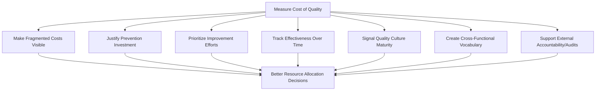

## Why Organizations Measure the Cost of Quality

### Overview

Measuring Cost of Quality (CoQ) is not an accounting exercise for its own sake — it exists to change organizational behavior and decision-making. Without a cost figure, quality is discussed in terms of defect counts, complaint volumes, or subjective satisfaction — all of which are difficult to compare against other business priorities competing for the same budget (new features, headcount, infrastructure). Translating quality into a financial figure gives it standing in decisions where money is the common currency.

### Primary Reasons Organizations Measure CoQ

**Key Points**

1. **To make an invisible problem visible.** Quality costs are naturally scattered across departments — a defect's cost shows up as a support ticket here, a piece of rework there, a lost renewal elsewhere. No one function sees the whole picture unless it is deliberately aggregated. Measurement consolidates fragmented costs into a single, trackable figure.
2. **To justify investment in prevention.** Prevention and appraisal spending competes for budget against every other initiative in the organization. Without a measured CoPQ (cost of poor quality) to point to, a request for a new test suite or a training program looks like discretionary overhead. With it, the request becomes a comparison: "this investment costs X, and avoids Y in failure costs" — a standard capital-allocation argument.
3. **To prioritize where to invest.** Not all quality problems are equally costly. Measurement allows an organization to rank problem areas by financial impact rather than by which one is most recently visible or loudest, directing limited improvement resources to where they will generate the largest return.
4. **To track whether quality efforts are working.** A quality initiative without a baseline and a follow-up measurement is an act of faith. CoQ tracked over time turns "we improved quality" into a falsifiable, quantifiable claim — either CoPQ declined by a measurable amount or it did not.
5. **To detect a maturing (or degrading) quality culture.** The composition of CoQ — not just its total — signals organizational maturity. A shift from failure-dominated spending toward prevention-dominated spending, accompanied by a falling total, is a standard indicator of improving quality management discipline.
6. **To create a shared vocabulary across functions.** Engineering, finance, operations, and customer-facing teams often disagree about the severity of a quality issue because they experience its symptoms differently. A cost figure translates each function's experience into a common unit, enabling cross-functional prioritization conversations.
7. **To support external accountability.** In regulated or contractually governed environments (government contracts, healthcare, safety-critical industries), a documented CoQ framework can serve as evidence of due diligence in quality management, supporting audits, certifications (e.g., ISO 9001 contexts), or contractual quality obligations.

### The Decision-Making Function of CoQ

**Key Points**

At its core, CoQ measurement exists to answer one recurring organizational question: *"Given limited resources, where should we spend the next dollar on quality — and is spending on quality at all worthwhile compared to alternatives?"*

Without measurement, this question is answered by intuition, politics, or whoever advocates most persuasively. With measurement, it becomes an allocation problem with a defensible answer:

$$\text{Invest where } \frac{\Delta CoPQ_{avoided}}{C_{investment}} \text{ is highest}$$

This reframes quality management from a compliance or craftsmanship activity into a resource-allocation discipline that can be evaluated on the same basis as any other investment decision (marketing spend, infrastructure spend, headcount).

### What Happens Without CoQ Measurement

**Key Points**

Organizations that do not measure CoQ tend to exhibit predictable failure patterns:

- **Prevention spend is the first cut in budget pressure**, because it is visible and discretionary, while failure costs remain invisible and are absorbed elsewhere — leading to a false appearance of savings while total cost actually rises.
- **Quality problems are addressed reactively**, prioritized by whoever escalates loudest rather than by actual financial impact.
- **The same defects recur**, because there is no financial signal strong enough to justify root-cause investment over a quick patch (see the Hidden Factory concept).
- **Improvement claims are unfalsifiable**, since there is no baseline to compare against — "quality has improved" cannot be verified or refuted.
- **External failure costs remain invisible** (per the Iceberg Model), systematically understating the case for prevention investment precisely where it is most needed.

### Example: The Measurement Decision in a Government DMS Project

For a project like a document management system serving a local government unit, a decision authority (e.g., a project owner) faces a recurring choice: allocate the next sprint to new features or to hardening data-validation logic. Without CoQ measurement, this decision defaults to whichever stakeholder is more vocal that week.

With CoQ measurement, the decision becomes evidence-based:

- Track internal failure cost (bugs caught in staging: developer hours × frequency).
- Track external failure cost (production incidents: correction time + LGU relationship impact, even if only roughly estimated per the Iceberg Model's hidden-cost logic).
- If external failure cost for validation-related issues is trending upward and represents a larger share of total engineering time than the two-agent workflow's feature backlog would suggest is acceptable, that is a quantifiable, defensible basis for prioritizing a validation-hardening task over a new feature — rather than a subjective judgment call.

[Unverified] This scenario illustrates how the measurement rationale applies in a specific project context; it does not describe an actual documented decision.

### Common Objections to Measuring CoQ (and Responses)

**Key Points**

- *"It's too much overhead to track."* Response: even a lightweight, order-of-magnitude approach (per the 1-10-100 Rule) provides enough signal to guide prioritization; precision is not the goal, directional accuracy is.
- *"Our failures are rare, so it's not worth tracking."* Response: rare-but-severe failures often carry disproportionate hidden costs (per the Iceberg Model) that are exactly the costs measurement is meant to surface — infrequency does not imply low impact.
- *"Quality is subjective; it can't be reduced to a number."* Response: CoQ does not claim to measure quality itself — it measures the *financial consequences* of quality outcomes, which is a narrower and more tractable claim.

### Next Steps

- Definition and Purpose of Cost of Quality
- Cost of Good Quality versus Cost of Poor Quality
- Building a CoQ Reporting Model for an Organization
- The Economic Case for Investing in Quality
- The Hidden Factory Concept