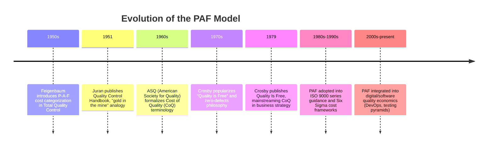

## Origins and Development of the PAF Model

### Historical Context

The Prevention-Appraisal-Failure (PAF) model emerged from the quality management movement of the mid-20th century, as manufacturing organizations sought systematic ways to categorize and quantify the economic impact of quality-related activities. Prior to PAF, quality costs were often treated as an unavoidable overhead rather than a measurable, manageable category of business expense.

The framework arose in response to a fundamental shift in thinking: quality was no longer viewed purely as a technical or inspection function, but as an economic variable that could be optimized. This reframing required a taxonomy that could translate quality activities into financial terms that executives and accountants could act upon.

### Key Contributors

**Armand V. Feigenbaum**

Feigenbaum is widely credited as the originator of the PAF cost categorization. In his work on Total Quality Control (TQC) during the 1950s, he proposed classifying quality-related costs into three (later organized as four, with failure split into internal and external) functional categories:

- Prevention costs
- Appraisal costs
- Failure costs (internal and external)

Feigenbaum's central argument was that money spent on prevention and appraisal was fundamentally different in character from money spent on failure — the former represented *investment*, while the latter represented *loss*. This distinction became the philosophical core of the PAF model.

**Joseph M. Juran**

Juran contributed significantly to popularizing and operationalizing the cost-of-quality concept through his *Quality Control Handbook* (first edition, 1951). Juran used the analogy of "gold in the mine" to describe unmeasured quality costs — implying that organizations were sitting on unrealized savings they had not yet identified or extracted. Juran's framing helped position quality cost accounting as a tool for financial justification of quality initiatives, rather than a purely technical exercise.

**Philip B. Crosby**

Crosby, writing later (notably in *Quality Is Free*, 1979), built on the PAF foundation to argue that investment in prevention could drive total quality costs down to near-zero failure cost, popularizing the idea that "quality is free" because the cost of nonconformance exceeds the cost of conformance. While Crosby's work is more associated with the 1-10-100 Rule's underlying philosophy than with originating PAF itself, his advocacy significantly increased industrial adoption of cost-of-quality frameworks.

### Evolution of the Framework

### Why a Four-Category Structure Emerged

Early quality cost discussions often lumped all "cost of poor quality" together. The PAF model's contribution was to split this into actionable categories based on **when** in the process lifecycle the cost was incurred and **why**:

| Category | Timing | Purpose |
| --- | --- | --- |
| Prevention | Before production/delivery | Avoid defects from occurring |
| Appraisal | During production/delivery | Detect defects before they escape |
| Internal Failure | After production, before delivery | Cost of catching defects internally |
| External Failure | After delivery to customer | Cost of defects reaching the customer |

This structure allowed organizations to see a **causal chain**: underinvestment in prevention tends to increase appraisal burden, and underinvestment in both tends to shift costs into the far more expensive failure categories — a relationship that would later be crystallized numerically by the 1-10-100 Rule.

### Conceptual Foundation for the 1-10-100 Rule

The PAF model's categorical separation was a necessary precondition for the 1-10-100 Rule to exist. Without a shared vocabulary distinguishing prevention, appraisal, and failure costs, it would not have been possible to make comparative claims like "a defect caught in appraisal costs roughly 10x what it would have cost to prevent, and a defect that escapes to the customer costs roughly 100x." The 1-10-100 Rule, generally attributed to later quality practitioners building on Crosby-era thinking (and popularized in various forms by authors including George Labovitz), is essentially an empirical/heuristic overlay on top of the PAF structure — it assigns relative *magnitude* to the cost escalation that PAF had already structurally implied.

### Institutionalization

- **ASQ (American Society for Quality)** formalized Cost of Quality (CoQ) definitions and reporting guidance, cementing PAF as the standard taxonomy still referenced in quality certifications (CQE, CMQ/OE) today.
- **ISO 9000 series** and later quality management standards incorporated cost-of-quality thinking, though PAF itself remains a management-accounting tool rather than a certification requirement.
- **Six Sigma and Lean methodologies** adopted PAF-derived cost categorization to justify process improvement investments using Cost of Poor Quality (COPQ) metrics, a term that largely refers to the sum of appraisal and failure costs.

**Key Points**

- Armand Feigenbaum originated the P-A-F cost categorization in the 1950s as part of Total Quality Control.
- Joseph Juran's "gold in the mine" analogy helped popularize quality cost measurement as a source of hidden savings.
- Philip Crosby's *Quality Is Free* (1979) extended PAF thinking into the "quality is free" philosophy, driving broader industrial adoption.
- PAF's temporal/causal structure (prevention → appraisal → internal failure → external failure) laid the conceptual groundwork later quantified by the 1-10-100 Rule.
- The framework was institutionalized through ASQ standards and later absorbed into Six Sigma's Cost of Poor Quality (COPQ) metrics.

**Related Topics**

- Feigenbaum's Total Quality Control (TQC) Framework
- Juran's Quality Trilogy (Planning, Control, Improvement)
- Crosby's Four Absolutes of Quality Management
- Cost of Poor Quality (COPQ) in Six Sigma
- Evolution of Cost of Quality Reporting Standards (ASQ, ISO 9000)
- Comparative Cost-of-Quality Models (Beyond PAF: Process Cost Model, Opportunity Cost Model)