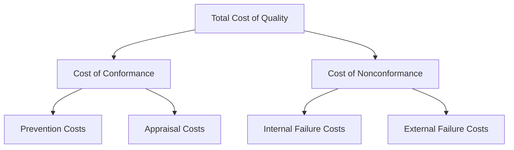

## Overview of the Four Quality Cost Categories

### Conceptual Framework

The PAF model divides all quality-related expenditures into four mutually exclusive categories based on when the cost is incurred relative to defect occurrence and detection. Together, Prevention and Appraisal costs are often called the **Cost of Good Quality (COGQ)** or **Cost of Conformance**, while Internal and External Failure costs form the **Cost of Poor Quality (COPQ)** or **Cost of Nonconformance**.

### 1. Prevention Costs

**Definition:** Costs incurred to prevent defects from occurring in the first place — investments made *before* a product, service, or process is executed.

**Key Points**

- Proactive by nature; incurred before any defect can materialize
- Generally the least expensive category per unit of quality improvement
- Represents deliberate investment rather than reactive spending

**Example**

- Quality planning and design reviews
- Employee training programs
- Process capability studies
- Supplier quality audits and qualification
- Statistical process control (SPC) system design
- Quality engineering during product design (Design for Six Sigma, DFMEA)
- Preventive maintenance programs

### 2. Appraisal Costs

**Definition:** Costs incurred to measure, evaluate, or audit products, services, or processes to ensure conformance to quality standards — essentially the cost of *detection* rather than prevention.

**Key Points**

- Incurred *during* production or service delivery, before the customer receives the output
- Does not reduce the defect rate itself; only catches defects already present
- Often the largest visible line item in traditional quality budgets because inspection is tangible and easy to track

**Example**

- Incoming material inspection
- In-process and final product testing
- Calibration of measurement and test equipment
- Quality audits of finished goods
- Test equipment depreciation
- Third-party certification/inspection fees

### 3. Internal Failure Costs

**Definition:** Costs resulting from defects discovered *before* the product or service reaches the customer.

**Key Points**

- The defect has already occurred — this is reactive, not preventive, spending
- Costs are contained within the organization; the customer is never exposed
- Approximately an order of magnitude more expensive than prevention costs under the 1-10-100 heuristic

**Example**

- Scrap and rework
- Re-inspection and re-testing after rework
- Failure analysis / root cause investigation
- Downtime caused by defects (line stoppages)
- Downgrading (selling a defective product at reduced price/grade)
- Excess inventory carried to buffer for scrap losses

### 4. External Failure Costs

**Definition:** Costs resulting from defects discovered *after* the product or service has reached the customer.

**Key Points**

- The most expensive category by far — this is where the "100" in the 1-10-100 Rule applies
- Includes both direct (measurable) and indirect (reputational, often unmeasured) costs
- Often underreported in accounting systems because reputational and opportunity costs are difficult to quantify

**Example**

- Warranty claims and repairs
- Product recalls
- Customer complaint handling and support costs
- Returns and replacements
- Liability claims and litigation
- Lost customer goodwill and future revenue (brand damage)
- Regulatory fines and penalties

### Comparative Summary Table

| Category | Timing | Nature | Typical Relative Cost (1-10-100 heuristic) | Controllability |
| --- | --- | --- | --- | --- |
| Prevention | Pre-production | Investment | 1x (baseline) | Fully controllable |
| Appraisal | During production | Detection | ~1-10x | Highly controllable |
| Internal Failure | Post-production, pre-delivery | Correction | ~10x | Moderately controllable |
| External Failure | Post-delivery | Damage control | ~100x | Least controllable |

### The Inverse Relationship

A central insight of the four-category structure is the **trade-off dynamic**: increased investment in prevention tends to reduce appraisal needs over time (fewer defects mean less need to inspect), and both reduce failure costs disproportionately. This relationship is the empirical basis for arguing that shifting spend "left" in the framework — toward prevention — yields outsized returns.

$$\text{Total CoQ} = C_p + C_a + C_{if} + C_{ef}$$

Where $C_p$ = prevention cost, $C_a$ = appraisal cost, $C_{if}$ = internal failure cost, $C_{ef}$ = external failure cost.

Organizations with immature quality systems typically show a cost distribution skewed heavily toward failure costs (both internal and external), while organizations with mature quality systems show costs concentrated in prevention, with failure costs minimized. [Inference — this distributional pattern is a widely cited heuristic in quality literature, but exact proportions vary significantly by industry and are not universal constants.]

### Visual: Typical Cost Distribution Shift

<svg xmlns="http://www.w3.org/2000/svg" viewBox="0 0 700 320" font-family="sans-serif">
<text x="350" y="20" text-anchor="middle" font-size="14" font-weight="bold">Cost Distribution: Immature vs. Mature Quality System (svg_diagram)</text>

<text x="150" y="45" text-anchor="middle" font-size="12" font-weight="bold">Immature System</text>

<rect x="60" y="60" width="180" height="30" fill="`#a3c9a8`" />

<text x="150" y="80" text-anchor="middle" font-size="11" fill="#000">Prevention 5%</text>

<rect x="60" y="90" width="180" height="40" fill="`#f2d388`" />

<text x="150" y="115" text-anchor="middle" font-size="11" fill="#000">Appraisal 15%</text>

<rect x="60" y="130" width="180" height="70" fill="`#e8a87c`" />

<text x="150" y="168" text-anchor="middle" font-size="11" fill="#000">Internal Failure 30%</text>

<rect x="60" y="200" width="180" height="100" fill="`#d1495b`" />

<text x="150" y="253" text-anchor="middle" font-size="11" fill="#fff">External Failure 50%</text>

<text x="530" y="45" text-anchor="middle" font-size="12" font-weight="bold">Mature System</text>

<rect x="440" y="60" width="180" height="90" fill="`#a3c9a8`" />

<text x="530" y="108" text-anchor="middle" font-size="11" fill="#000">Prevention 45%</text>

<rect x="440" y="150" width="180" height="70" fill="`#f2d388`" />

<text x="530" y="188" text-anchor="middle" font-size="11" fill="#000">Appraisal 35%</text>

<rect x="440" y="220" width="180" height="40" fill="`#e8a87c`" />

<text x="530" y="243" text-anchor="middle" font-size="11" fill="#000">Internal Failure 15%</text>

<rect x="440" y="260" width="180" height="20" fill="`#d1495b`" />

<text x="530" y="274" text-anchor="middle" font-size="10" fill="#fff">Ext. 5%</text>

</svg>

*(Note: the percentages above are illustrative approximations used to demonstrate the directional shift in cost composition, not derived from a specific empirical dataset.) [Illustrative]*

**Next Steps**

- Deep dive into Prevention Costs: specific cost elements and measurement techniques
- Deep dive into Appraisal Costs: inspection sampling strategies and their cost implications
- Deep dive into Internal Failure Costs: scrap/rework cost accounting methods
- Deep dive into External Failure Costs: warranty cost modeling and reputational cost estimation
- Building a Cost of Quality (CoQ) reporting system within an organization
- Connecting the four PAF categories numerically to the 1-10-100 Rule