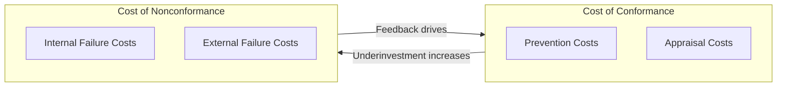
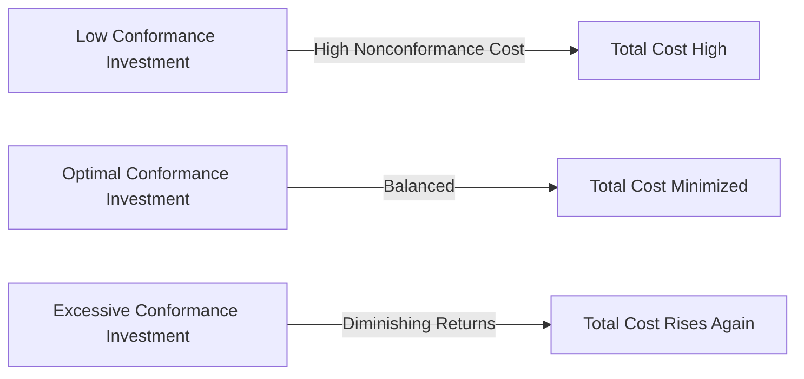

## Conformance Costs versus Nonconformance Costs

### Definitions

**Cost of Conformance (CoC)** refers to expenditures made to ensure that a product, service, or process meets specified quality requirements. It is the price of doing things right and encompasses the Prevention and Appraisal categories of the PAF model.

**Cost of Nonconformance (CoNC)** refers to expenditures resulting from failing to meet quality requirements. It is the price of doing things wrong and encompasses the Internal Failure and External Failure categories of the PAF model.

$$\text{CoC} = C_{prevention} + C_{appraisal}$$

$$\text{CoNC} = C_{internal failure} + C_{external failure}$$

$$\text{Total CoQ} = \text{CoC} + \text{CoNC}$$

### Mapping to the PAF Categories

### Key Points

- Conformance costs are **voluntary and controllable** — the organization chooses how much to invest and when.
- Nonconformance costs are **involuntary and reactive** — they are consequences imposed after the fact by defects that already occurred.
- Conformance costs tend to scale linearly or sub-linearly with effort invested; nonconformance costs tend to scale non-linearly (often exponentially) with the point of detection, which is the core logic behind the 1-10-100 Rule.
- A well-run quality system does not eliminate the Cost of Quality altogether — it shifts the *composition* of that cost from nonconformance toward conformance, and reduces the *total* over time.
- Crosby's "Quality is Free" thesis specifically argues that the cost of conformance, when properly invested, is more than offset by the reduction in cost of nonconformance — implying a net savings, not merely a cost shift.

### Behavioral and Economic Distinction

| Dimension | Cost of Conformance | Cost of Nonconformance |
| --- | --- | --- |
| Timing | Proactive, planned | Reactive, unplanned |
| Predictability | Budgetable, forecastable | Variable, often understated in budgets |
| Visibility in accounting | Explicit line items (training, inspection) | Often hidden or buried in overhead/COGS |
| Trend with quality maturity | Increases initially, then stabilizes | Decreases as system matures |
| Marginal return | Diminishing returns past a point | Highly sensitive to defect escape point |
| Organizational perception | Often seen as "quality department cost" | Often seen as "cost of doing business" |

### The Optimization Curve

Classical Cost of Quality theory (pre-Crosby) proposed that there exists an **optimal quality level** where the sum of conformance and nonconformance costs is minimized — implying that *some* nonconformance is economically acceptable, because pushing conformance costs beyond that point yields diminishing returns.

Crosby's more modern view challenges this classical "optimal defect level" model, arguing that in most practical cases, the curve does not actually turn upward at high conformance investment — instead, total cost continues to fall toward zero defects, because the marginal cost of additional prevention is nearly always less than the marginal cost of the failures it prevents. [Inference — this is a documented point of theoretical disagreement in quality management literature between the "economic conformance level" school and Crosby's zero-defects school, not a universally settled empirical fact.]

### Practical Implications for Reporting

**Example**

A manufacturing plant tracks the following monthly costs:

| Cost Element | Category | Amount |
| --- | --- | --- |
| Operator training | Prevention (CoC) | $8,000 |
| Final product inspection | Appraisal (CoC) | $22,000 |
| Scrap and rework | Internal Failure (CoNC) | $45,000 |
| Warranty claims | External Failure (CoNC) | $130,000 |

$$\text{CoC} = \$8{,}000 + \$22{,}000 = \$30{,}000$$

$$\text{CoNC} = \$45{,}000 + \$130{,}000 = \$175{,}000$$

This plant is spending roughly **5.8x more** on nonconformance than conformance — a strong signal that shifting even modest additional spend into prevention (e.g., improving operator training or upstream process controls) could yield outsized reductions in the far larger nonconformance bucket.

**Conclusion**

The conformance/nonconformance split is the primary lens through which organizations diagnose whether their quality spending is proactive or reactive. A CoNC-to-CoC ratio significantly greater than 1 is generally interpreted as a signal of an immature or reactive quality system, while organizations approaching a more balanced or CoC-dominant ratio are typically further along in quality maturity. This ratio, tracked over time, is often used as a leading indicator before absolute Cost of Quality figures show improvement.

**Next Steps**

- Calculating and interpreting the CoNC:CoC ratio as a maturity metric
- Economic Conformance Level (ECL) model vs. Zero Defects philosophy
- Building a quality cost reporting dashboard segmented by CoC/CoNC
- Linking conformance investment decisions to the 1-10-100 Rule's cost multipliers