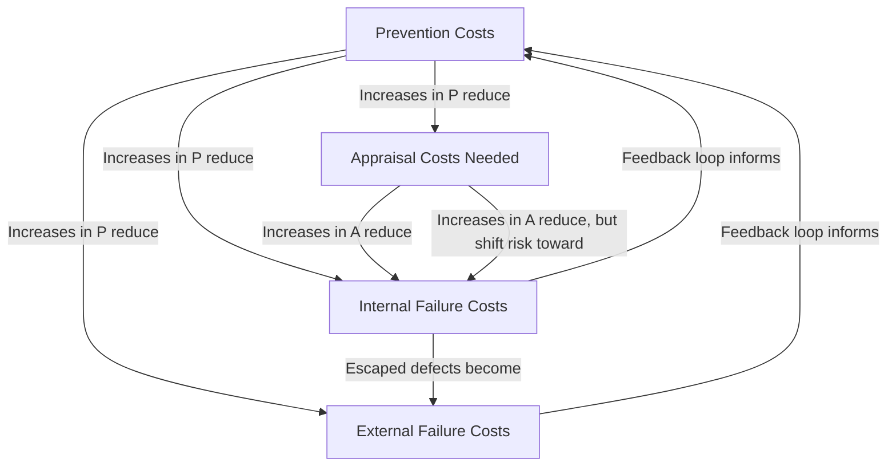
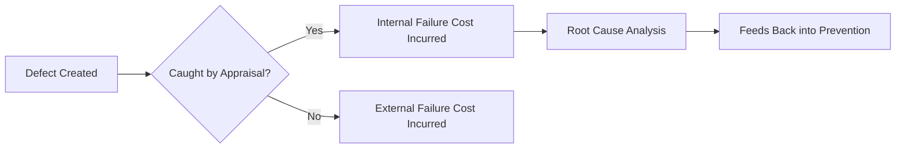

## Interrelationships Between the Four Cost Categories

### Overview

The four PAF categories do not operate independently — they exist in a dynamic, causal relationship where spending decisions in one category directly influence the magnitude of costs in the others. Understanding these interrelationships is essential to using the PAF model as a diagnostic and predictive tool rather than a simple accounting taxonomy.

### 1. Prevention Reduces Appraisal Burden

As prevention investment increases (better process design, tighter process control, improved training), the underlying defect rate falls. A lower defect rate means less inspection is statistically necessary to achieve the same confidence in outgoing quality — appraisal effort can be reduced or sampling rates lowered without increasing risk.

**Key Points**

- This relationship is not always linear or immediate; there is typically a lag between prevention investment and measurable appraisal reduction
- Organizations that cut appraisal spending *without* first increasing prevention investment are not realizing this relationship — they are simply reducing detection capability, which increases risk of failure cost exposure

### 2. Prevention and Appraisal Both Suppress Failure Costs — But Differently

Prevention costs suppress failure costs by reducing the *number* of defects created. Appraisal costs suppress failure costs by reducing the *proportion* of created defects that escape detection — but appraisal does not reduce the underlying defect rate at all.

$$\text{Defects Reaching Customer} = D_{created} \times (1 - \text{Detection Rate}_{appraisal})$$

Where $D_{created}$ is a function of prevention investment (lower prevention → higher $D_{created}$), and Detection Rate is a function of appraisal investment.

This distinction matters: a system that relies heavily on appraisal with weak prevention can still achieve low external failure costs, but at the expense of very high internal failure costs (rework, scrap) and high ongoing appraisal spend — it is treating symptoms, not causes.

### 3. Internal Failure Costs Convert to External Failure Costs When Detection Fails

The relationship between internal and external failure is essentially a **detection gate**. Every defect that is not caught internally (via appraisal) becomes a candidate for external failure. This is the mechanism by which weak appraisal directly inflates the most expensive cost category.

**Example**

A defect in a circuit board assembly:

- If caught during in-line testing (appraisal) → becomes an **internal failure**: cost of rework, re-testing, scrap of the unit — perhaps $50.
- If it passes testing and is caught by the customer after installation → becomes an **external failure**: cost of field service, replacement unit, shipping, customer goodwill damage, and possibly warranty/liability exposure — potentially $5,000 or more.

This example illustrates the mechanical link between the four categories: the *same underlying defect* generates a radically different cost depending on which category "catches" it, or whether it escapes entirely.

### 4. Failure Costs Feed Back into Prevention (The Learning Loop)

Mature quality systems use failure cost data — both internal and external — as direct input into future prevention investment decisions. Root cause analysis performed on internal and external failures identifies systemic weaknesses that prevention spending can then address, closing the loop.

**Key Points**

- Without this feedback loop, failure costs remain a stagnant, recurring drain rather than a diminishing one
- This loop is the mechanism by which the cost distribution shifts over time from failure-dominant to prevention-dominant, as previously discussed in the four-category cost distribution
- Failure Mode and Effects Analysis (FMEA), 8D reports, and Corrective and Preventive Action (CAPA) systems are the typical organizational mechanisms that formalize this feedback loop

### 5. The Non-Linear Cost Escalation Across Categories

Perhaps the most consequential interrelationship is that cost does not scale linearly as a defect moves rightward through the PAF chain (Prevention → Appraisal → Internal Failure → External Failure). Each stage a defect travels through before detection multiplies its remediation cost, which is the foundational logic of the 1-10-100 Rule.

| Stage Defect is Caught | Relative Cost Multiplier | Why |
| --- | --- | --- |
| Prevention (never created) | 1x | No remediation needed at all |
| Appraisal / Internal Failure | ~10x | Requires rework, re-testing, scrap |
| External Failure | ~100x | Requires field service, recalls, liability, reputational damage |

$$C_{external} \approx 10 \times C_{internal} \approx 100 \times C_{prevention}$$

[Inference — the specific multipliers (1, 10, 100) are a widely cited heuristic rather than a fixed universal constant; actual ratios vary substantially by industry, product complexity, and safety criticality.]

### Systemic View: Balancing the Four Categories

**Conclusion**

The four PAF categories function as a single interconnected system rather than four separate budget lines. Prevention and appraisal spending are *investments* that determine the magnitude of internal and external failure costs downstream; internal and external failure costs, in turn, provide the diagnostic signal that should redirect future prevention investment. Organizations that manage these categories in isolation — for instance, cutting appraisal spend to hit a budget target without addressing prevention — frequently see failure costs rise disproportionately, because the interrelationship between categories is asymmetric: small changes upstream (prevention) produce outsized effects downstream (failure), while the reverse is not true.

**Next Steps**

- Quantitative modeling of defect escape probability as a function of appraisal investment
- Root cause analysis methods (FMEA, 8D, CAPA) as feedback mechanisms into prevention
- Case studies illustrating cost multiplication across the PAF chain
- Deriving the 1-10-100 Rule mathematically from PAF cost escalation patterns