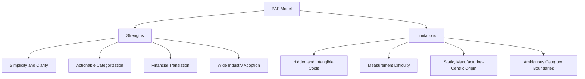

## Strengths and Limitations of the PAF Model

### Overview

The PAF model has remained the dominant Cost of Quality framework for over half a century because of its intuitive structure and actionable categorization. However, decades of practical application have surfaced consistent criticisms regarding its completeness, measurability, and applicability to modern (particularly service and software) contexts. A balanced technical assessment requires examining both dimensions.

### Strengths

**1. Simplicity and Intuitive Structure**

The four-category split (Prevention, Appraisal, Internal Failure, External Failure) maps naturally onto the timeline of a product or service lifecycle, making it easy to teach, communicate, and apply across departments without specialized accounting knowledge.

**2. Actionable Categorization**

Because each category corresponds to a distinct *type* of managerial decision (invest proactively vs. detect vs. remediate), the model directly supports resource allocation decisions rather than merely describing costs after the fact.

**3. Financial Translation of Quality**

PAF was the first framework to consistently translate quality activities into a common financial language, enabling comparison against other capital investment decisions using standard tools like ROI and payback period analysis.

**4. Diagnostic Power via Category Ratios**

The relationships between categories (as discussed in interrelationships between the four cost categories) allow organizations to diagnose the maturity of their quality system from the *shape* of their cost distribution, not just its total magnitude.

**5. Broad Industry Adoption and Standardization**

Decades of use across ASQ, Six Sigma, and ISO-adjacent quality frameworks mean the model is widely understood, has established benchmarking data in some industries, and requires no specialized software or tooling to implement at a basic level.

### Limitations

**1. Omission of Hidden and Intangible Costs**

The classical PAF model, as originally formulated, focuses primarily on directly measurable, accounting-visible costs. It historically underrepresents:

- Lost customer goodwill and lifetime value erosion
- Brand and reputational damage
- Lost future sales due to word-of-mouth or reviews
- Employee morale and turnover effects from chronic quality problems
- Opportunity cost of management time spent firefighting quality issues

These "hidden costs" are sometimes estimated to dwarf the visible/measured costs, particularly in the External Failure category, but they resist precise quantification and are frequently omitted from formal CoQ reports entirely. [Inference — the claim that hidden costs "dwarf" visible costs is a recurring theme in quality literature, but the magnitude is inherently difficult to verify empirically and varies significantly by case.]

**2. Measurement and Data Collection Difficulty**

Many organizations lack the cost accounting infrastructure to accurately attribute costs to PAF categories. Common practical issues include:

- Labor time spent on rework often not separately coded from normal production labor
- Appraisal costs embedded within general overhead rather than tracked discretely
- External failure costs (e.g., reputational impact) having no natural general ledger account
- Cross-functional costs (e.g., a customer service call that leads to a quality investigation) being difficult to cleanly categorize

**3. Manufacturing-Centric Origin**

PAF was developed in a manufacturing context where defects are physical, discrete, and detectable via inspection and testing. Its direct application to services, knowledge work, and software has required adaptation:

| Manufacturing Context | Service/Software Adaptation Challenge |
| --- | --- |
| Physical defect inspection | Intangible "defects" (bugs, service failures) harder to sample |
| Discrete units produced | Continuous or intangible deliverables |
| Rework = fixing a physical unit | Rework = re-coding, re-processing, which may be indistinguishable from normal iterative work |
| External failure = product recall | External failure = churn, negative reviews, SLA penalties — often lag indicators |

**4. Ambiguous Category Boundaries**

In practice, some costs do not cleanly fit into a single PAF category, creating classification inconsistency across organizations and reducing comparability:

- Is a design review a **prevention** cost, or does it overlap with **appraisal** if it includes testing of a prototype?
- Is customer support staff time responding to a complaint an **external failure** cost, or partially an **appraisal** cost if it also gathers quality feedback data?
- Is preventive maintenance a **prevention** cost or an operational cost unrelated to quality at all?

**5. Static Framework, Dynamic Reality**

The PAF model describes cost *categories* but does not, by itself, model the *rate* of change, feedback timing, or diminishing returns — extensions like the 1-10-100 Rule, Economic Conformance Level models, and later Cost of Poor Quality (COPQ) formulations were developed specifically to address dynamic behavior that PAF's static categorization does not capture on its own.

**6. Risk of Perverse Incentives**

Because PAF-based reporting is often used to justify budget allocation, there is a documented risk that organizations optimize *reported category totals* rather than actual quality outcomes — for example, reclassifying costs to make prevention spending appear higher without changing underlying practices, or under-reporting external failure costs that are politically sensitive to disclose. [Inference — this is a recognized risk in management accounting generally and has been raised specifically in critiques of CoQ reporting practices, though the prevalence of deliberate reclassification is not independently quantifiable.]

### Comparative Summary

| Aspect | Strength | Limitation |
| --- | --- | --- |
| Ease of use | High — simple 4-category model | Boundaries between categories can be ambiguous |
| Financial credibility | Strong — direct $ translation | Excludes many real costs (goodwill, morale) |
| Applicability | Proven across manufacturing for 70+ years | Requires significant adaptation for services/software |
| Diagnostic value | Strong via category ratios | Static; does not model feedback timing or velocity |
| Implementation cost | Low — no specialized tooling required | Requires disciplined cost accounting to be accurate |

### Modern Extensions Addressing These Limitations

Several frameworks have emerged specifically to address PAF's gaps:

- **Process Cost Model (PCM)** — reframes cost of quality around process conformance vs. non-conformance rather than discrete PAF buckets, better suited to service processes
- **Opportunity Cost Models** — attempt to formally incorporate lost sales and goodwill into CoQ calculations
- **Activity-Based Costing (ABC) integration** — improves measurement accuracy by tracing costs to specific quality-related activities rather than relying on broad category estimates

**Conclusion**

The PAF model's enduring value lies in its simplicity and its ability to make quality economically visible and actionable — a genuine innovation when introduced. Its principal limitations stem from what it leaves out (intangible and hidden costs), how hard it is to measure accurately in practice, and its manufacturing-era assumptions that require adaptation for modern service- and software-based organizations. Most practitioners today treat PAF not as a complete accounting system, but as a foundational taxonomy to be supplemented with modern measurement techniques and awareness of its blind spots.

**Related Topics**

- Process Cost Model (PCM) as an alternative to PAF
- Activity-Based Costing (ABC) applied to Cost of Quality
- Quantifying intangible costs: reputational damage and customer lifetime value
- Adapting Cost of Quality frameworks for software and service industries
- Critiques of Cost of Quality reporting practices in management accounting literature