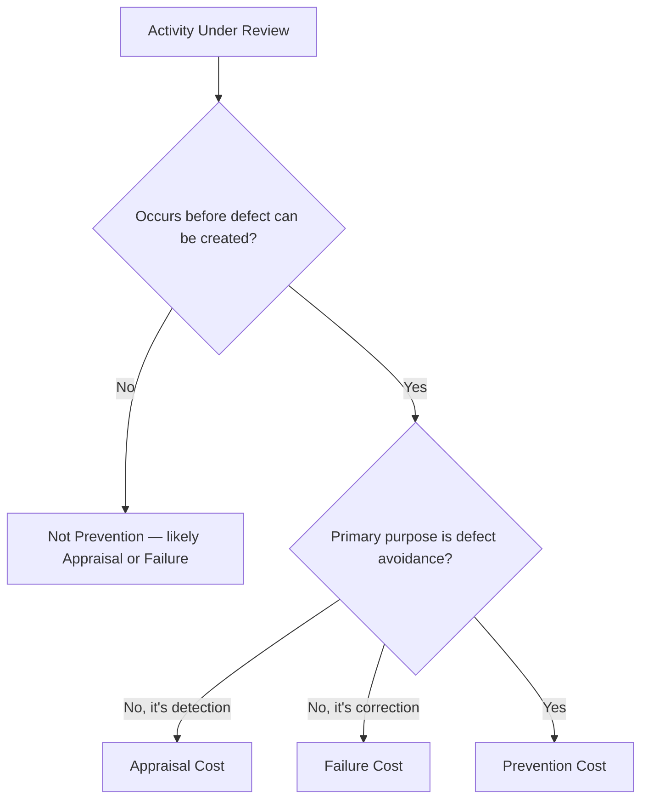

## Definition and Scope of Prevention Costs

### Definition

Prevention costs are expenditures incurred to keep defects, errors, and nonconformances from occurring in the first place. They are proactive, forward-looking investments made before a product is manufactured, a service is delivered, or a process is executed — designed to reduce the probability that a defect is ever created.

$$C_{prevention} = \sum_{i=1}^{n} \text{(cost of activity}_i\text{ undertaken to avoid defect creation)}$$

Prevention costs are, by definition, the only PAF category that acts on the **root cause** of quality problems rather than their symptoms or consequences.

### Scope Boundaries

Determining what qualifies as a prevention cost requires applying a consistent test:

**Key Points**

- The activity must occur *before* the defect-generating process (design, production, or service delivery) takes place, or must be structurally embedded to reduce future defect likelihood
- The activity's *primary purpose* must be defect avoidance, not defect detection (which would make it Appraisal) or defect correction (which would make it Failure)
- The cost must be attributable to quality-related intent, distinguishing it from general operational or administrative spending that happens to have a secondary quality benefit

### Categories Within Prevention Costs

Prevention costs are typically grouped into several functional sub-areas:

**1. Quality Planning**

- Development of quality plans, control plans, and quality manuals
- Design reviews and Design for Manufacturability (DFM) analysis
- Failure Mode and Effects Analysis (FMEA) conducted proactively during design
- New product/process quality planning (e.g., APQP in automotive contexts)

**2. Process Control**

- Statistical Process Control (SPC) system design and implementation
- Process capability studies (Cp, Cpk analysis)
- Development of standard operating procedures (SOPs) and work instructions

**3. Training and Education**

- Quality-related employee training programs
- Certification and skill development for quality-critical roles
- Onboarding programs that include quality standards education

**4. Supplier and Vendor Quality**

- Supplier qualification and audit programs
- Supplier quality agreements and specification development
- Collaborative supplier development initiatives

**5. Quality System Administration**

- Salaries of quality engineers and quality management personnel engaged in preventive activities
- Quality system audits (internal audits of the quality management system itself, as distinct from product audits)
- Maintenance of quality management system documentation (e.g., ISO 9001 documentation)

**6. Preventive Maintenance**

- Scheduled equipment maintenance intended to avoid process drift or equipment-caused defects
- Calibration scheduling systems (the *system design*, as distinct from the calibration act itself, which is often classified as Appraisal)

### Example

| Activity | Included in Prevention Scope? | Rationale |
| --- | --- | --- |
| Designing a control plan for a new production line | Yes | Proactive, pre-production, defect-avoidance intent |
| Training operators on new equipment | Yes | Reduces likelihood of operator-caused defects |
| Auditing a supplier's quality system before contracting | Yes | Prevents defective materials from entering the process |
| Final inspection of finished goods | No | Detection, not prevention — classified as Appraisal |
| Reworking a defective unit | No | Correction after the fact — classified as Internal Failure |
| Routine equipment lubrication (non-quality-driven) | No | General maintenance without quality-specific intent |
| FMEA performed during product design | Yes | Proactive risk identification before production begins |

### Distinguishing Prevention from Adjacent Categories

**Prevention vs. Appraisal**

The distinction hinges on *purpose*, not *timing* alone. A pilot production run intended to validate that a new process is capable (a form of testing) can appear similar to appraisal, but if its primary purpose is to inform process design changes before full-scale production, it is generally classified as prevention (process validation) rather than appraisal (ongoing conformance checking).

**Prevention vs. General Operating Cost**

Not all costs that happen to reduce defects qualify as prevention costs in CoQ reporting. A cost only belongs in the prevention category if it was undertaken specifically *because of* quality objectives. General capital equipment upgrades made for capacity or efficiency reasons, even if they incidentally reduce defect rates, are typically excluded unless quality improvement was an explicit driver.

### Why Scope Matters

**Conclusion**

Precisely scoping prevention costs is critical because, as established in the interrelationships between the four cost categories, prevention is the only lever that reduces the *creation* of defects rather than managing their consequences. Under-scoping prevention costs (failing to capture the full range of proactive quality activities) causes organizations to systematically underinvest in the category with the highest long-term return, since prevention spending appears smaller and less justified in cost reports than it actually is. Conversely, over-scoping — labeling general operational spending as "prevention" — inflates the apparent proactive investment without a genuine defect-avoidance mechanism, undermining the diagnostic value of the CoQ ratio discussed in conformance versus nonconformance costs.

**Next Steps**

- Detailed breakdown of Quality Planning activities and their cost measurement
- Statistical Process Control (SPC) as a prevention mechanism
- Training program design and ROI measurement for quality outcomes
- Supplier Quality Management programs as a prevention investment
- Common Examples of Prevention Costs (expanded catalog)