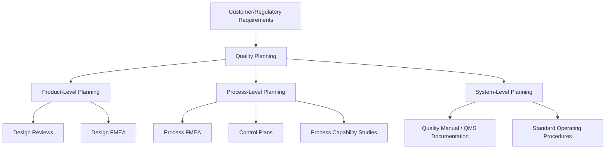
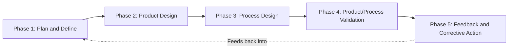

## Quality Planning and Process Design

### Definition

Quality Planning and Process Design refers to the structured, proactive activities undertaken before production or service delivery begins to define how quality requirements will be met, verified, and sustained. It represents the largest and most foundational subcategory within Prevention Costs, since it establishes the systems and standards that all downstream prevention activities operationalize.

### Scope of Quality Planning Activities

**Key Points**

- Quality planning translates customer and regulatory requirements into actionable specifications, control methods, and acceptance criteria
- It occurs at multiple levels: product-level, process-level, and organizational (quality management system) level
- Its output is typically documentation — plans, procedures, specifications — that governs how subsequent production or service activities will be executed and controlled

### Core Activities

**1. Design Reviews**

Formal, structured evaluations of a product or service design conducted at defined milestones (concept, preliminary, critical/final design) to identify potential quality, manufacturability, and reliability issues before they are locked into production.

- Cross-functional participation (engineering, quality, manufacturing, procurement) is standard practice
- Reviews assess design against customer requirements, regulatory standards, and historical failure data from similar products

**2. Failure Mode and Effects Analysis (FMEA)**

A systematic, proactive method for identifying potential ways a product or process could fail, evaluating the severity, occurrence, and detectability of each failure mode, and prioritizing mitigation actions.

- **Design FMEA (DFMEA):** applied to product design, before a product moves to manufacturing
- **Process FMEA (PFMEA):** applied to manufacturing/service processes, before full-scale production begins

$$\text{RPN} = S \times O \times D$$

Where $RPN$ = Risk Priority Number, $S$ = Severity, $O$ = Occurrence, $D$ = Detectability (each typically rated on a 1-10 scale). Higher RPN values indicate failure modes requiring more urgent preventive action.

**3. Control Plans**

Documented summaries of the quality controls (both process and product) that will be applied at each stage of production, including:

- Process parameters to be monitored
- Control methods (SPC, fixed inspection, automated sensors)
- Sample sizes and frequencies
- Reaction plans if a parameter drifts out of control

**4. Process Capability Studies**

Statistical analysis performed *before* full production commitment to determine whether a process is inherently capable of meeting specification limits consistently.

$$C_p = \frac{USL - LSL}{6\sigma}$$

$$C_{pk} = \min\left(\frac{USL - \mu}{3\sigma}, \frac{\mu - LSL}{3\sigma}\right)$$

Where $USL$ and $LSL$ are the upper and lower specification limits, $\mu$ is the process mean, and $\sigma$ is the process standard deviation. A $C_{pk}$ below an organization's threshold (commonly 1.33 in many manufacturing standards) signals the process requires redesign or tighter control before production release — a preventive action taken before defects accumulate.

**5. Advanced Product Quality Planning (APQP)**

A structured, phase-gated framework (widely used in the automotive industry via IATF 16949) that formalizes quality planning across five phases: Plan and Define, Product Design and Development, Process Design and Development, Product and Process Validation, and Feedback/Assessment/Corrective Action.

### Example

A consumer electronics manufacturer developing a new device performs the following quality planning sequence before production launch:

1. Conducts a Design FMEA identifying that a connector has a high RPN due to potential moisture ingress (severity: high, occurrence: moderate, detectability: low)
2. Redesigns the connector housing to add a gasket seal, reducing occurrence rating
3. Develops a Process FMEA for the assembly line identifying operator torque variance as a risk to the seal's effectiveness
4. Creates a control plan specifying automated torque monitoring with in-line SPC charts
5. Runs a process capability study on the torque application step, confirming $C_{pk} = 1.5$ before approving the line for production

**Key Points**

- Each step in this sequence is a prevention cost: no product has yet been produced, and no defect has yet occurred
- The cost of this planning sequence (engineering hours, FMEA workshops, capability study time) is small relative to what a field failure from moisture ingress would have cost post-launch — directly illustrating the 1x-versus-100x logic underlying the 1-10-100 Rule

### Cost Elements Typically Included

| Cost Element | Description |
| --- | --- |
| Engineering labor for design reviews | Salaried time of participants in structured review sessions |
| FMEA facilitation and documentation | Time and tools (software licenses) for conducting FMEAs |
| Control plan development and maintenance | Documentation creation and periodic revision |
| Capability study execution | Data collection, statistical analysis, and reporting |
| APQP program administration | Cross-functional program management overhead for phase-gated planning |

### Distinguishing Planning from Adjacent Prevention Activities

Quality Planning and Process Design differs from other prevention subcategories (such as training or supplier quality) in that its output is primarily **documented methodology** rather than **people capability** or **external qualification**. It answers the question "how will conformance be achieved and verified?" rather than "who is capable of achieving it?" or "can our suppliers deliver it?" — those questions are addressed by Training and Supplier Quality Management respectively.

**Conclusion**

Quality Planning and Process Design constitutes the analytical backbone of the Prevention category. By systematically anticipating failure modes and defining control mechanisms before a single unit is produced, organizations convert what would otherwise be reactive failure costs into a comparatively small, budgetable planning investment — the clearest practical demonstration of the cost escalation logic that motivates the entire PAF framework.

**Related Topics**

- FMEA methodology in depth: Severity, Occurrence, and Detectability scoring
- Process capability analysis (Cp, Cpk, Ppk) and statistical foundations
- Advanced Product Quality Planning (APQP) phase-by-phase breakdown
- Design reviews: structure, participants, and common failure points
- Control plan development and integration with SPC systems