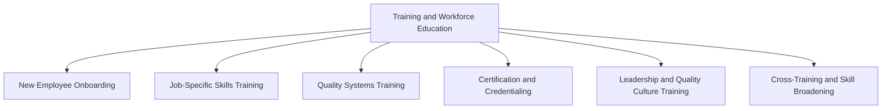

## Training and Workforce Education

### Definition

Training and Workforce Education, within the Prevention Costs category, refers to investments made to develop employee knowledge, skills, and quality-consciousness before defects occur, with the explicit purpose of reducing human-caused nonconformances. It is the human-capital counterpart to the systems-level planning covered in Quality Planning and Process Design.

### Rationale for Classification as Prevention

**Key Points**

- Training addresses a root cause of defects — lack of knowledge, skill, or awareness — before the individual performs the work that could produce a defect
- It is distinguished from Appraisal because its purpose is to prevent errors, not detect them after work is performed
- It is distinguished from corrective/failure-driven retraining only by intent and timing: proactive, scheduled training is prevention; retraining specifically triggered as a corrective action after a defect or audit finding is more precisely classified as part of the corrective action tied to that failure, though many organizations still track it under prevention if it targets systemic future avoidance

### Categories of Training and Education

**1. New Employee Onboarding**

- Introduction to quality standards, company quality policy, and relevant regulatory requirements
- Safety and procedural training that has direct bearing on defect avoidance

**2. Job-Specific Skills Training**

- Equipment operation training tied to specification adherence
- Technique training for manual or semi-manual processes (soldering, welding, assembly)
- Software/tool proficiency training where tool misuse could introduce defects

**3. Quality Systems Training**

- Training on the organization's quality management system (e.g., ISO 9001 awareness training)
- Statistical Process Control (SPC) training for operators expected to interpret control charts
- Root cause analysis methodology training (5 Whys, fishbone/Ishikawa diagrams)

**4. Certification and Credentialing**

- External certifications (e.g., ASQ Certified Quality Engineer, Six Sigma Green/Black Belt)
- Industry-specific certifications required for regulatory compliance (e.g., welding certifications, aerospace-specific credentials)

**5. Leadership and Quality Culture Training**

- Management training on quality leadership and driving a quality-first culture
- Training aimed at reducing organizational behaviors that indirectly cause defects (e.g., schedule pressure leading to shortcuts)

**6. Cross-Training and Skill Broadening**

- Training that builds redundancy, reducing defect risk from single-point-of-failure knowledge gaps (e.g., only one person knows how to correctly calibrate a machine)

### Cost Elements

| Cost Element | Description |
| --- | --- |
| Instructor/trainer time | Internal staff or external consultants delivering training |
| Training material development | Creation of manuals, e-learning modules, job aids |
| Employee time during training | Wages paid while employees are in training rather than production |
| Certification exam fees | External certification and re-certification costs |
| Training facility and equipment | Dedicated training stations, simulators, or classroom costs |
| Learning management system (LMS) costs | Software platforms used to track and deliver training |

### Measuring the Effectiveness of Training as Prevention Spend

Because training is an investment, its value is typically assessed through effectiveness metrics tied to downstream defect reduction, not merely completion rates.

**Key Points**

- **Training completion rate** is a leading input metric but does not by itself confirm defect reduction
- **Post-training assessment scores** measure knowledge transfer immediately after training
- **Defect rate correlation** — tracking whether departments or shifts with higher training completion show lower internal/external failure rates over time — is the strongest evidence connecting training spend to PAF outcomes
- **Time-to-competency** — how quickly a newly trained employee reaches an acceptable quality performance level — is a useful leading indicator for onboarding-related training investment

$$\text{Training ROI} = \frac{(\text{Failure Cost Reduction Attributable to Training}) - (\text{Training Cost})}{\text{Training Cost}} \times 100\%$$

[Inference — isolating the failure cost reduction specifically attributable to training, separate from concurrent process or design improvements, is methodologically difficult in practice and often requires controlled comparison between trained and untrained cohorts or time periods.]

### Example

An electronics assembler experiences a recurring internal failure pattern: a specific solder joint defect appears disproportionately on one shift. Investigation attributes this to inconsistent technique among newer operators on that shift.

1. The organization develops a targeted 4-hour hands-on soldering certification module (Prevention cost: instructor time, training materials, employee wages during training — estimated $3,200 total)
2. All operators on the affected shift complete certification within two weeks
3. Internal failure costs from solder joint rework on that shift drop by 70% over the following quarter, previously running approximately $18,000/quarter

$$\text{Training ROI} = \frac{(0.70 \times \$18{,}000) - \$3{,}200}{\$3{,}200} \times 100\% \approx 294\%$$

This example illustrates the prevention-to-failure cost relationship described in interrelationships between the four cost categories: a modest, one-time prevention investment produced a recurring reduction in internal failure costs, with the payback realized within a single quarter.

### Common Pitfalls in Training as a Prevention Investment

**Key Points**

- **Treating training as a one-time event** rather than a sustained program — skills decay over time without reinforcement, and defect rates can regress
- **Generic training not tied to specific failure modes** — training that is not informed by actual defect data (from FMEA or failure analysis) is less targeted and yields lower ROI
- **Under-tracking training costs separately** — many organizations bury training costs in general HR/administrative overhead rather than tagging them to Cost of Quality reporting, which understates the Prevention category and skews the Conformance/Nonconformance ratio discussed previously

**Conclusion**

Training and Workforce Education operationalizes the prevention principle at the individual employee level, converting the systemic controls established through Quality Planning and Process Design into consistently executed practice. Because human error remains a leading root cause across manufacturing and service defect data broadly, well-targeted training — informed by actual failure mode data rather than generic curricula — is frequently one of the highest-leverage prevention investments an organization can make, often yielding measurable reductions in internal and external failure costs within a single reporting cycle.

**Next Steps**

- Designing failure-mode-informed training curricula using FMEA and root cause data
- Statistical Process Control (SPC) training programs for shop-floor operators
- Measuring training ROI: methodologies for isolating training's effect on defect rates
- Building a Learning Management System (LMS) strategy aligned with Cost of Quality goals