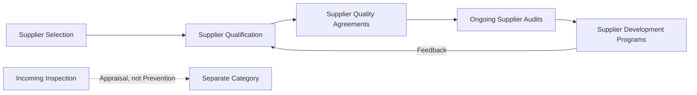
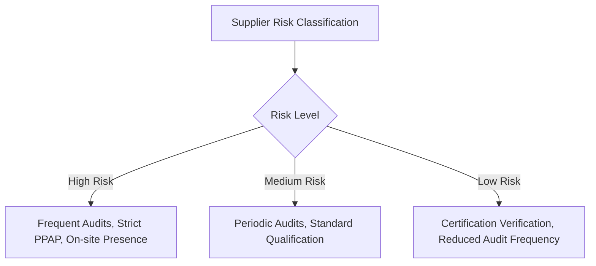

## Supplier Quality Assurance and Evaluation

### Definition

Supplier Quality Assurance and Evaluation encompasses the proactive activities an organization undertakes to ensure that materials, components, and services procured from external suppliers meet quality requirements *before* they enter the organization's own production or service delivery process. It extends the prevention principle beyond organizational boundaries to the upstream supply chain.

### Rationale for Classification as Prevention

**Key Points**

- These activities occur before supplied materials are incorporated into production, aligning with the prevention timing criterion established in the definition and scope of prevention costs
- Their purpose is to prevent defective inputs from entering the process at all, rather than catching them via incoming inspection (which would be classified as Appraisal)
- Supplier quality investment addresses a root cause category that is otherwise outside the organization's direct process control, making it a distinct and necessary extension of internal prevention activity

### Core Activities

**1. Supplier Selection and Qualification**

Evaluating prospective suppliers' quality capability *before* awarding business, typically including:

- Review of the supplier's quality management system certification (e.g., ISO 9001, IATF 16949)
- Process capability assessment of the supplier's manufacturing processes
- Sample part evaluation and Production Part Approval Process (PPAP) submissions in industries such as automotive

**2. Supplier Quality Audits**

On-site or remote audits conducted proactively to verify a supplier's ongoing conformance to agreed quality standards, distinct from reactive audits triggered by a specific failure.

- Scheduled periodic audits based on supplier risk classification
- Process audits examining specific manufacturing steps for capability and control

**3. Supplier Quality Agreements (SQAs)**

Formal documented agreements specifying quality expectations, inspection requirements, non-conformance handling procedures, and change notification requirements between the organization and its suppliers.

**4. Supplier Development Programs**

Collaborative initiatives where the organization invests resources to help a supplier improve their quality capability, rather than simply switching suppliers when problems arise.

- Joint problem-solving workshops
- Technical assistance and training provided to supplier personnel
- Shared investment in process improvement equipment or methods

**5. Supplier Scorecards and Risk-Based Segmentation**

Proactive systems that classify suppliers by risk and quality performance history, allowing prevention resources (audit frequency, qualification rigor) to be allocated where risk is highest.

### Cost Elements

| Cost Element | Description |
| --- | --- |
| Supplier audit team travel and labor | Personnel time and travel costs for on-site supplier audits |
| PPAP/qualification review | Engineering time reviewing supplier submissions before approval |
| Supplier scorecard system administration | Software/process for tracking supplier quality performance |
| Supplier development program investment | Training, consulting, or shared equipment investment at supplier sites |
| Quality agreement negotiation and legal review | Time spent drafting and finalizing supplier quality agreements |

### Distinguishing Supplier Prevention from Supplier Appraisal

This is one of the more commonly confused boundaries in PAF classification:

| Activity | Category | Rationale |
| --- | --- | --- |
| Auditing a supplier's QMS before qualifying them | Prevention | Occurs before any material is received; purpose is avoidance |
| Reviewing PPAP submission before production approval | Prevention | Pre-production validation of supplier capability |
| Incoming inspection of received materials | Appraisal | Occurs after materials arrive; purpose is detection |
| Supplier corrective action following a defect shipment | Internal/External Failure-adjacent | Reactive, triggered by an already-occurred nonconformance |
| Ongoing scheduled supplier process audits (not triggered by a defect) | Prevention | Proactive verification independent of any specific failure event |

### Example

An automotive parts manufacturer sources a critical stamped metal component from an external supplier.

1. Before qualifying the supplier, the organization conducts an on-site audit of the supplier's stamping process and reviews their process capability data ($C_{pk}$ for critical dimensions) — a **prevention** cost
2. The supplier submits a PPAP package; the organization's quality engineers review dimensional reports, material certifications, and control plans before approving the supplier for production volume — a **prevention** cost
3. Once approved, the organization still performs incoming dimensional inspection on a sampling basis for the first several shipments — this is an **appraisal** cost, not prevention, because it is a detection activity applied to material already received
4. Eighteen months later, a scheduled (non-defect-triggered) requalification audit is conducted per the risk-based schedule — this remains a **prevention** cost

This progression illustrates how the same supplier relationship generates costs in different PAF categories depending on the timing and purpose of each specific activity, consistent with the classification principles established in the interrelationships between the four cost categories.

### Strategic Value

**Key Points**

- Supplier-caused defects, if not caught until final inspection or after reaching the customer, generate the same disproportionate cost escalation described by the 1-10-100 Rule — a defect from an unqualified supplier discovered by the end customer is often the most expensive and reputationally damaging failure mode, since the organization bears responsibility despite the root cause being external
- Investment in supplier quality assurance is frequently justified specifically by this asymmetry: qualifying a supplier properly is inexpensive relative to a field failure caused by a supplied component
- Supplier development programs, while requiring upfront investment, can be more cost-effective long-term than repeatedly re-sourcing to new unqualified suppliers, each of which restarts the qualification risk cycle

**Conclusion**

Supplier Quality Assurance and Evaluation extends the prevention principle beyond the organization's own four walls, recognizing that a substantial share of nonconformances originate in purchased materials and outsourced processes. By investing in supplier qualification, agreements, and proactive audits before materials enter production, organizations reduce the likelihood that external quality problems surface downstream as internal failure (rework, scrap) or, worse, external failure (field defects, recalls) — making supplier-focused prevention spend one of the highest-leverage extensions of the PAF framework's core logic.

**Related Topics**

- Production Part Approval Process (PPAP) in depth
- Supplier scorecard design and risk-based audit scheduling
- Supplier development programs versus supplier switching cost-benefit analysis
- Incoming inspection strategy as an Appraisal cost (contrast and complement)
- Supply chain quality risk management frameworks