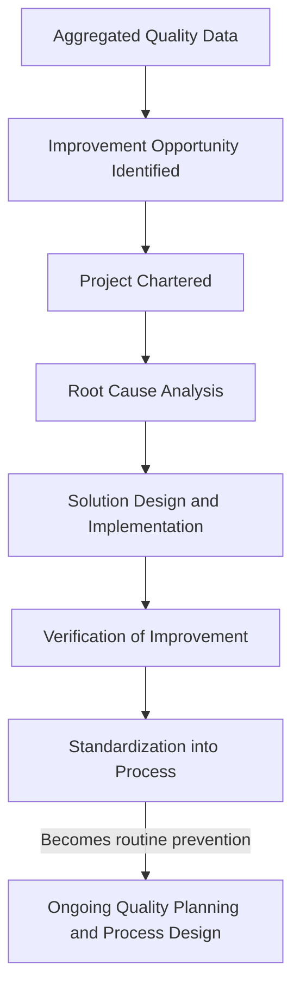
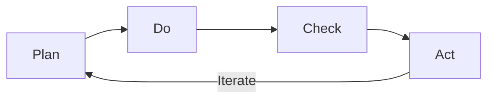

## Quality Improvement Projects and Programs

### Definition

Quality Improvement Projects and Programs encompass structured, resourced initiatives specifically undertaken to reduce defect rates, eliminate root causes of nonconformance, and elevate process capability beyond current baseline performance. Unlike routine prevention activities (standard training, standard planning), this subcategory covers *deliberate, often cross-functional improvement efforts* — typically time-bound projects with defined objectives, methodologies, and measurable targets.

### Rationale for Classification as Prevention

**Key Points**

- Improvement projects are forward-looking: their objective is to reduce future defect occurrence, satisfying the core prevention timing and intent criteria established in the definition and scope of prevention costs
- They are distinguished from routine prevention (e.g., standard SPC monitoring) by their project-based, resourced, and often data-driven improvement methodology
- They are distinguished from corrective action tied to a specific failure event by scope: improvement projects often address systemic or chronic issues identified through aggregated failure data, rather than responding to a single incident

### Common Methodologies

**1. Six Sigma (DMAIC)**

A structured five-phase methodology for improving existing processes:

- **Define** — project scope, customer requirements, business case
- **Measure** — baseline process performance and data collection
- **Analyze** — root cause identification using statistical tools
- **Improve** — solution design, piloting, and implementation
- **Control** — sustaining the improvement through control plans and monitoring

$$\sigma_{level} \propto \frac{1}{\text{Defects per Million Opportunities (DPMO)}}$$

**2. Lean / Kaizen**

Continuous improvement methodology focused on eliminating waste (including defect-related waste) through incremental, often team-driven changes.

- Kaizen events (focused, short-duration improvement workshops)
- Value stream mapping to identify quality-related waste points

**3. PDCA (Plan-Do-Check-Act)**

An iterative four-step management method used for continuous improvement of processes and products.

**4. Quality Circles / Cross-Functional Improvement Teams**

Organized small groups of employees who meet regularly to identify, analyze, and propose solutions to quality problems within their area of work.

### Cost Elements

| Cost Element | Description |
| --- | --- |
| Project team labor (internal) | Salaried time of employees dedicated to improvement project work |
| External consulting/facilitation fees | Six Sigma Black Belt consultants, Kaizen facilitators |
| Data collection and analysis tools | Statistical software, data logging equipment for baseline/post-improvement measurement |
| Pilot implementation costs | Cost of testing a proposed solution on a limited scale before full rollout |
| Training tied to specific methodology | Six Sigma belt certification training, Lean training specific to the improvement program |

### Distinguishing Improvement Projects from Adjacent Categories

| Activity | Category | Rationale |
| --- | --- | --- |
| Chartering a Six Sigma project to reduce a chronic defect rate | Prevention (Improvement Program) | Proactive, structured, targets future defect reduction |
| Root cause analysis performed as a one-off response to a specific customer complaint | Internal/External Failure-adjacent (Corrective Action) | Reactive, tied to a specific already-occurred failure |
| Standing SPC monitoring on an established, stable process | Prevention (Process Control) | Routine, not a distinct improvement project |
| Kaizen event addressing a recurring but not-yet-formally-tracked inefficiency | Prevention (Improvement Program) | Proactive and structured, even without a single triggering incident |

**Key Points**

- The boundary between an "improvement project" and "corrective action following a failure" can be subtle: if a project is chartered specifically because failure cost data revealed a chronic, aggregated pattern (rather than responding to one incident), it is generally still classified as a prevention investment, since its output is reduced *future* defect probability — but organizations should apply this classification consistently, as discussed in the strengths and limitations of the PAF model regarding ambiguous category boundaries

### Example

A plastics manufacturer's aggregated internal failure data shows that a specific injection-molded part has a consistent 4% scrap rate due to warping, costing approximately $96,000 annually in scrap and rework.

1. A Six Sigma Green Belt project is chartered (Define phase): target is to reduce warping-related scrap to under 1%
2. The team measures current process parameters (Measure phase) and identifies cooling time variability as the primary contributor (Analyze phase) using a fishbone diagram and regression analysis
3. A revised cooling cycle and mold temperature control upgrade is piloted and implemented (Improve phase)
4. A control plan and SPC monitoring are established to sustain the gain (Control phase)

Total project cost (team labor, data logging equipment, mold modification): approximately $22,000. Post-implementation scrap rate falls to 0.8%, reducing annual failure cost to roughly $19,200 — a savings of approximately $76,800/year against a one-time investment of $22,000.

$$\text{Payback Period} = \frac{\$22{,}000}{\$76{,}800/\text{year}} \approx 3.4 \text{ months}$$

This example demonstrates the same prevention-to-failure cost relationship discussed in interrelationships between the four cost categories, but applied to an *existing* process rather than a new product design — illustrating that prevention investment is valuable not only at initial quality planning but continuously, whenever failure cost data reveals a chronic root cause worth eliminating.

### Sustaining Improvement Gains

**Key Points**

- A common failure mode of improvement programs is **regression** — gains achieved during a project erode over time if the Control phase (or equivalent standardization step) is inadequately resourced
- Successful improvement projects typically transition their gains into the standing Quality Planning and Process Design infrastructure (updated control plans, updated SPC limits, updated training) rather than remaining a one-time event
- Organizations with mature improvement programs track a portfolio of active and completed projects against a cumulative Cost of Poor Quality (COPQ) reduction target, linking project-level activity to organization-level CoQ reporting

**Conclusion**

Quality Improvement Projects and Programs represent the prevention category's mechanism for continuous, data-driven advancement rather than static, one-time process design. By systematically targeting chronic sources of internal and external failure cost using structured methodologies such as Six Sigma, Lean, and PDCA, organizations convert accumulated failure cost evidence into deliberate prevention investment — closing the feedback loop described earlier and driving the cost distribution shift from failure-dominant toward prevention-dominant over an organization's quality maturity lifecycle.

**Next Steps**

- Six Sigma DMAIC methodology in depth: tools and statistical techniques per phase
- Lean/Kaizen event planning and facilitation
- Building a Cost of Poor Quality (COPQ) reduction project portfolio
- Sustaining improvement gains: control plan integration and SPC limit updates
- Calculating payback period and ROI for quality improvement investments