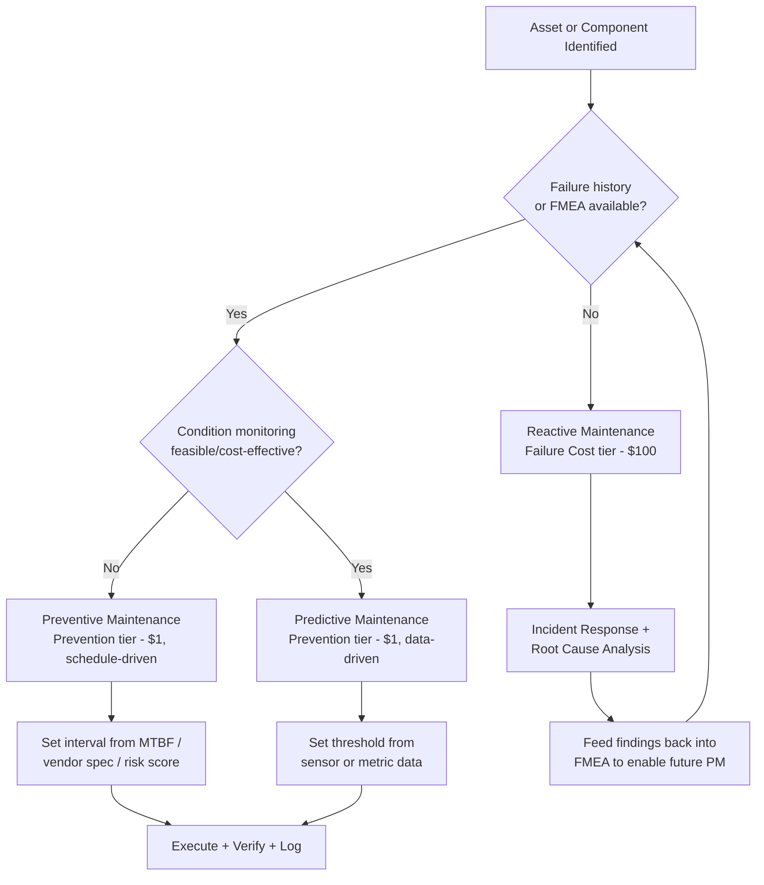

## Preventive Maintenance

### Definition and Classification

Preventive Maintenance (PM) is a **Prevention Cost** within the Cost of Quality (CoQ) framework — expenditures made to keep failure from occurring in the first place, as distinct from Appraisal Costs (finding defects) or Failure Costs (fixing them after the fact). In the 1-10-100 Rule, PM sits at the far-left, lowest-cost position: money spent here is structurally cheaper than money spent catching an error downstream ($10) or fixing a failure that has already reached production or the customer ($100).

Within manufacturing and reliability engineering, PM specifically refers to scheduled, condition-independent maintenance activities performed on equipment, systems, or processes to prevent degradation and unplanned failure. The software/systems-engineering analogue is scheduled technical maintenance: dependency upgrades, refactoring of decaying modules, database index maintenance, certificate rotation, and proactive load testing — all performed on a cadence rather than in reaction to an incident.

### Position in the 1-10-100 Rule

$$\text{Prevention Cost} : \text{Appraisal Cost} : \text{Failure Cost} \approx 1 : 10 : 100$$

- **$1 (Prevention)** — PM activities: scheduled lubrication, calibration, part replacement before wear-out, code refactoring before technical debt compounds, dependency patching before a CVE is exploited.
- **$10 (Appraisal)** — Inspection/detection activities that catch a defect PM failed to prevent: code review catching a bug, QA catching a regression, a monitoring alert catching drift.
- **$100 (Failure)** — Internal or external failure costs: production outage, customer-reported defect, recall, SLA breach penalty, reputational damage.

**Key Points**

- PM is not "no cost" — it is the *lowest*-cost point on the curve, not a free one.
- The 1-10-100 ratio is illustrative, not a literal universal constant; actual multipliers are domain- and severity-dependent. `[Inference]` The precise ratio for any given organization depends on its failure-detection latency and remediation complexity, and should be measured empirically rather than assumed.
- PM converts *unplanned* cost (unpredictable, disruptive, expensive) into *planned* cost (budgeted, scheduled, cheap).

### Preventive vs. Predictive vs. Reactive Maintenance

| Strategy | Trigger | CoQ Category | Typical Cost Position |
| --- | --- | --- | --- |
| Reactive (run-to-failure) | Equipment/system fails | Internal or External Failure | $100 tier |
| Preventive | Fixed schedule (time or usage-based) | Prevention | $1 tier |
| Predictive | Condition monitoring / data threshold | Prevention (advanced) | $1 tier, higher precision |
| Detection/Inspection | Periodic audit without action | Appraisal | $10 tier |

Preventive maintenance is *schedule-driven* (e.g., "replace every 5,000 hours" or "patch dependencies every sprint"), whereas predictive maintenance is *condition-driven* (e.g., vibration analysis triggers replacement only when a threshold is crossed). Predictive maintenance is generally more capital-efficient than pure time-based PM because it avoids replacing parts — or refactoring code — that still have useful life, but it requires monitoring infrastructure that PM does not.

### Core Components of a PM Program

1. **Asset/Component Inventory** — A complete register of what must be maintained (physical equipment, or in software: dependencies, certificates, database schemas, infrastructure configs).
2. **Failure Mode Baseline** — Historical or engineered understanding of *how* each asset typically fails, used to define maintenance intervals (often derived from FMEA — Failure Mode and Effects Analysis).
3. **Maintenance Schedule** — Calendar- or usage-based triggers (e.g., "every 90 days," "every 10,000 requests," "every major dependency release").
4. **Standard Operating Procedures (SOPs)** — Documented, repeatable steps for each maintenance action, so execution quality doesn't depend on who performs it.
5. **Verification Step** — Confirmation that the maintenance action succeeded (this step technically borders Appraisal Cost, since it is inspection-like, but is generally bundled into the Prevention budget as part of the PM task).
6. **Feedback Loop** — Post-maintenance data (did failures still occur despite PM?) feeding back into interval tuning.

### Software Engineering Analogue

`[Inference]` Direct engineering-equipment terminology doesn't map one-to-one to software, but the cost-structure logic transfers cleanly:

| Physical PM | Software/DMS Equivalent |
| --- | --- |
| Scheduled lubrication/calibration | Scheduled dependency updates (`npm outdated`, Drizzle migration audits) |
| Vibration monitoring | Automated test suite run on every merge |
| Filter replacement interval | Rotating credentials/certificates before expiry |
| Preventive part swap before wear-out | Refactoring a module before its complexity/coupling metrics degrade further |
| Lubrication schedule per equipment manual | Linting, type-checking, and CI gates enforced pre-merge rather than post-deploy |

For a system like a TypeScript/Fastify/tRPC/Drizzle/PostgreSQL monorepo, concrete PM activities include:

- Scheduled Drizzle schema/migration audits to catch drift between ORM models and live DB schema before it causes a runtime failure.
- Periodic dependency bumps (patch/minor versions) on a fixed cadence rather than only when a breaking issue forces an upgrade.
- Scheduled review of tRPC procedure input validation coverage, to catch unvalidated endpoints before they become an appraisal-cost finding (a bug report) or failure-cost incident (a data integrity issue in the DMS).
- Database index and query-plan review on a fixed interval, before slow-query failures manifest as a production incident.

### Cost Modeling Example

Assume a document management system's PostgreSQL instance suffers periodic connection-pool exhaustion under load.

- **Prevention (PM) option**: Scheduled quarterly load test + connection-pool tuning review. Estimated cost: 4 engineer-hours/quarter = 16 hours/year.
- **Appraisal option (if PM skipped)**: Rely on staging-environment load tests before each release to catch the issue. Estimated cost: 3 engineer-hours per release × 12 releases/year = 36 hours/year, *and* the defect still escapes to production periodically because staging load never perfectly mirrors production traffic.
- **Failure option (if both skipped)**: Production outage during peak LGU document-submission periods (e.g., permit renewal deadlines). Estimated cost: incident response (8 hours) + customer/citizen-facing downtime + potential SLA or public-trust cost. `[Unverified]` The reputational/political cost to a government LGU system is difficult to quantify in engineer-hours and would need to be estimated separately per incident.

This mirrors the 1:10:100 pattern: 16 hours (Prevention) vs. 36 hours plus recurring escape risk (Appraisal) vs. 8+ hours plus unbounded reputational cost (Failure).

### PM Interval Determination

Interval-setting typically draws on one of these approaches:

- **Manufacturer/vendor-specified intervals** — e.g., a library's own deprecation/EOL schedule dictates the latest safe upgrade window.
- **Statistical failure-rate analysis** — using historical Mean Time Between Failures (MTBF) to place PM intervals safely before the expected failure point.
- **Risk-based prioritization** — assets ranked by (failure probability × failure impact), with PM budget allocated first to the highest-risk items.

$$\text{Risk Priority} = P(\text{failure}) \times \text{Impact}(\text{failure})$$

### Process Flow (svg_diagram)

<svg xmlns="http://www.w3.org/2000/svg" viewBox="0 0 900 260">
<text x="450" y="24" text-anchor="middle" font-size="16" font-weight="bold" fill="#1a1a1a">Preventive Maintenance Cycle (svg_diagram)</text>
<rect x="20" y="70" width="150" height="60" rx="8" fill="#e8f0fe" stroke="#4a76d4" stroke-width="1.5" />
<text x="95" y="95" text-anchor="middle" font-size="12" fill="#1a1a1a">Asset</text>
<text x="95" y="112" text-anchor="middle" font-size="12" fill="#1a1a1a">Inventory</text>
<rect x="210" y="70" width="150" height="60" rx="8" fill="#e8f0fe" stroke="#4a76d4" stroke-width="1.5" />
<text x="285" y="95" text-anchor="middle" font-size="12" fill="#1a1a1a">Failure Mode</text>
<text x="285" y="112" text-anchor="middle" font-size="12" fill="#1a1a1a">Baseline (FMEA)</text>
<rect x="400" y="70" width="150" height="60" rx="8" fill="#e8f0fe" stroke="#4a76d4" stroke-width="1.5" />
<text x="475" y="95" text-anchor="middle" font-size="12" fill="#1a1a1a">Schedule</text>
<text x="475" y="112" text-anchor="middle" font-size="12" fill="#1a1a1a">Interval Set</text>
<rect x="590" y="70" width="150" height="60" rx="8" fill="#e8f0fe" stroke="#4a76d4" stroke-width="1.5" />
<text x="665" y="95" text-anchor="middle" font-size="12" fill="#1a1a1a">Execute PM</text>
<text x="665" y="112" text-anchor="middle" font-size="12" fill="#1a1a1a">Task (SOP)</text>
<rect x="590" y="180" width="150" height="60" rx="8" fill="#e6f4ea" stroke="#2e8b57" stroke-width="1.5" />
<text x="665" y="205" text-anchor="middle" font-size="12" fill="#1a1a1a">Verify</text>
<text x="665" y="222" text-anchor="middle" font-size="12" fill="#1a1a1a">Completion</text>
<rect x="400" y="180" width="150" height="60" rx="8" fill="#fdecea" stroke="#c0392b" stroke-width="1.5" />
<text x="475" y="205" text-anchor="middle" font-size="12" fill="#1a1a1a">Log Result /</text>
<text x="475" y="222" text-anchor="middle" font-size="12" fill="#1a1a1a">Feedback Data</text>
<rect x="210" y="180" width="150" height="60" rx="8" fill="#fff4e5" stroke="#d68910" stroke-width="1.5" />
<text x="285" y="205" text-anchor="middle" font-size="12" fill="#1a1a1a">Tune Interval /</text>
<text x="285" y="222" text-anchor="middle" font-size="12" fill="#1a1a1a">Update FMEA</text>
<path d="M170,100 H210" stroke="#555" stroke-width="1.5" marker-end="url(#arrow)" />
<path d="M360,100 H400" stroke="#555" stroke-width="1.5" marker-end="url(#arrow)" />
<path d="M550,100 H590" stroke="#555" stroke-width="1.5" marker-end="url(#arrow)" />
<path d="M665,130 V180" stroke="#555" stroke-width="1.5" marker-end="url(#arrow)" />
<path d="M590,210 H550" stroke="#555" stroke-width="1.5" marker-end="url(#arrow)" />
<path d="M400,210 H360" stroke="#555" stroke-width="1.5" marker-end="url(#arrow)" />
<path d="M285,180 V130" stroke="#555" stroke-width="1.5" marker-end="url(#arrow)" />
</svg>

### Decision Flow: When to Apply PM vs. Predictive vs. Reactive

### Common Pitfalls

- **Over-maintenance**: Scheduling PM more frequently than failure data justifies, which itself becomes a cost inefficiency — unnecessary Prevention spend with no corresponding risk reduction.
- **Under-maintenance**: Setting intervals too conservatively (too infrequent) based on optimistic assumptions rather than measured MTBF, which silently converts what should be a Prevention cost back into a Failure cost.
- **No feedback loop**: Running a PM schedule indefinitely without revisiting intervals against actual failure/incident data — the schedule becomes stale relative to the real risk profile.
- **Treating verification as optional**: Skipping the "did the PM task actually work" check turns PM into a checkbox exercise rather than a genuine failure-preventing activity.
- **Applying PM where predictive maintenance is more efficient**: For assets with monitorable degradation signals, fixed-interval PM can waste resources compared to condition-based triggers. `[Inference]` This trade-off depends on whether the cost of monitoring infrastructure is lower than the cost of the maintenance being scheduled unnecessarily often.

**Related Topics**

- Failure Mode and Effects Analysis (FMEA)
- Predictive Maintenance and Condition-Based Monitoring
- Mean Time Between Failures (MTBF) and Mean Time To Repair (MTTR)
- Total Productive Maintenance (TPM)
- Prevention Costs: Quality Planning and Design Review
- Appraisal Costs: Inspection and Testing
- Internal vs. External Failure Costs
- Reliability-Centered Maintenance (RCM)