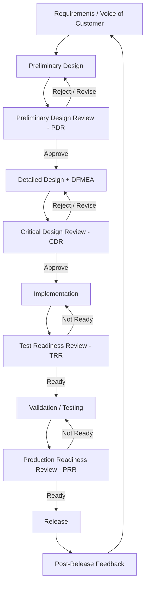

## Design Reviews and New Product Quality Planning

### Definition and Classification

Design Reviews and New Product Quality Planning (NPQP) are Prevention Costs within the Cost of Quality (CoQ) framework — structured activities performed *before* a product, feature, or system is built, aimed at catching design-level flaws while they are cheapest to fix. In the 1-10-100 Rule, this is the earliest possible intervention point: a flaw caught at the design-review stage costs a fraction of what the same flaw would cost if caught during testing (Appraisal) or after release (Failure), because no implementation work has yet been invested in the flawed approach.

$$\text{Prevention Cost} : \text{Appraisal Cost} : \text{Failure Cost} \approx 1 : 10 : 100$$

`[Inference]` The multiplier effect is typically steeper for design-stage defects than for late-lifecycle process defects (like preventive maintenance lapses), because a design flaw often invalidates downstream implementation work entirely rather than just requiring a patch — but the exact ratio is domain-specific and should be measured, not assumed.

### Design Reviews: Core Concept

A Design Review is a formal, structured evaluation of a design artifact (architecture diagram, schema, API contract, UI mockup, process flow) by qualified reviewers *before* implementation begins or continues, intended to surface defects, risks, and misalignments early.

**Key Points**

- Design reviews are a *gate*, not a formality — they should have explicit pass/fail or pass/revise outcomes.
- Reviews are most cost-effective the earlier they occur in the lifecycle; the cost curve for fixing a design flaw rises sharply once code exists that depends on it.
- Review scope should match design risk — a routine CRUD endpoint doesn't need the same rigor as a schema change affecting data integrity across a government records system.

### Standard Design Review Types (Stage-Gate Model)

| Review Type | Timing | Primary Question |
| --- | --- | --- |
| Concept/Feasibility Review | Before design starts | Is this problem worth solving, and is a solution technically feasible? |
| Preliminary Design Review (PDR) | Early design | Does the proposed architecture meet requirements at a high level? |
| Critical Design Review (CDR) | Design near-complete | Is the detailed design ready for implementation? |
| Test Readiness Review (TRR) | Pre-implementation/pre-test | Are test plans adequate to validate the design once built? |
| Production Readiness Review (PRR) | Pre-release | Is the implementation ready for deployment/production load? |

This stage-gate structure originates in systems and manufacturing engineering (e.g., NASA/DoD design review conventions) and has been adapted broadly into software engineering as Architecture Decision Records (ADRs), RFCs, and pre-merge design docs.

### New Product Quality Planning (NPQP)

NPQP — closely related to APQP (Advanced Product Quality Planning) in manufacturing quality systems — is a structured methodology for building quality into a product from the earliest planning stages, rather than inspecting it in afterward. The classical APQP framework (originating from the automotive industry, AIAG standard) defines five phases:

1. **Plan and Define** — Establish customer/stakeholder requirements, voice-of-customer data, and preliminary quality goals.
2. **Product Design and Development** — Translate requirements into a design; conduct Design Failure Mode and Effects Analysis (DFMEA).
3. **Process Design and Development** — Design the *process* that will produce/build the product; conduct Process FMEA (PFMEA).
4. **Product and Process Validation** — Run trial builds/pilot implementations to validate that design and process meet requirements.
5. **Feedback, Assessment, and Corrective Action** — Capture lessons learned and feed them back into future planning cycles.

`[Inference]` For software/systems contexts, "product" and "process" design map roughly to *what* is being built (feature/schema/API) and *how* it will be built and delivered (CI/CD pipeline, migration strategy, rollout plan), respectively — though this mapping is an adaptation of a manufacturing framework rather than a native software methodology.

### DFMEA — Design Failure Mode and Effects Analysis

DFMEA is the core risk-analysis tool underpinning both design reviews and NPQP. It systematically works through:

- **Failure Mode** — How could this design element fail?
- **Effect** — What happens if it does?
- **Severity (S)** — How bad is the effect? (1–10 scale)
- **Cause** — What could cause this failure mode?
- **Occurrence (O)** — How likely is the cause? (1–10 scale)
- **Current Controls** — What currently prevents or detects this?
- **Detection (D)** — How likely are current controls to catch it before it escapes? (1–10 scale)
- **Risk Priority Number (RPN)** — Composite risk score.

$$RPN = S \times O \times D$$

Items with the highest RPN are prioritized for design mitigation before implementation begins. A high-severity, high-occurrence, low-detection failure mode (e.g., a data-corrupting concurrent write bug in a DMS with no current test coverage) demands design-stage mitigation; a low-severity, low-occurrence item may be accepted as residual risk.

### Applying Design Reviews to a Software/DMS Context

For a system such as a TypeScript/Fastify/tRPC/Drizzle/PostgreSQL document management monorepo, design review artifacts typically include:

- **Schema Design Review** — Drizzle schema and migration plans reviewed for normalization correctness, index strategy, and referential integrity *before* migration is written, since a schema flaw discovered post-deployment against live LGU records data is a high-severity, high-remediation-cost failure.
- **API Contract Review** — tRPC procedure signatures and input/output types reviewed for consistency, authorization boundaries, and backward compatibility before client code is built against them.
- **Architecture Decision Records (ADRs)** — Lightweight, versioned documents capturing a design decision, the alternatives considered, and the rationale — functioning as an auditable design-review artifact.
- **Threat Modeling as Design Review** — For a government document system, a design-stage security review (who can access what document workflow state) is a Prevention Cost activity that avoids the Appraisal cost of a penetration test finding, or the Failure cost of an actual data-exposure incident.

### Cost Modeling Example

Consider a design flaw in a DMS workflow: a document approval state machine that permits an invalid transition (e.g., "Rejected" documents can be resubmitted without going through re-validation).

- **Prevention (Design Review) option**: Caught during CDR by a reviewer walking the state diagram against defined valid transitions. Cost: ~2 engineer-hours to redesign the state machine before any code is written.
- **Appraisal option (if design review skipped)**: Caught later by QA writing an edge-case test against the implemented state machine. Cost: ~6 engineer-hours (test writing, bug report, code rework, re-review, re-test) — because implementation and possibly downstream UI already depend on the flawed states.
- **Failure option (if both skipped)**: A citizen's document is incorrectly reprocessed without proper re-validation, an LGU audit flags the inconsistency, and remediation requires a data-integrity investigation, a hotfix under pressure, and potentially manual reconciliation of affected records. `[Unverified]` The reputational and compliance cost to a government records system in this scenario is difficult to bound in engineer-hours alone.

### Review Participants and RACI Structure

Effective design reviews define clear roles, commonly modeled with a RACI matrix:

| Role | Responsibility |
| --- | --- |
| Responsible | Author of the design; presents and defends the proposal |
| Accountable | Tech lead/architect who owns the go/no-go decision |
| Consulted | Domain experts (security, DBA, downstream API consumers) whose input shapes the design |
| Informed | Stakeholders who need visibility but no direct input (e.g., product owner, other squads) |

**Key Points**

- Reviews without a clear Accountable role tend to degrade into discussion without decision.
- Consulted reviewers should be selected based on the specific risk profile of the design (a schema change needs a DBA-equivalent reviewer; an auth change needs a security-minded reviewer).

### Process Flow: Design Review Gate in NPQP

### DFMEA Risk Scoring Diagram (svg_diagram)

<svg xmlns="http://www.w3.org/2000/svg" viewBox="0 0 900 320">
<text x="450" y="24" text-anchor="middle" font-size="16" font-weight="bold" fill="#1a1a1a">DFMEA Risk Priority Number Flow (svg_diagram)</text>
<rect x="20" y="60" width="180" height="70" rx="8" fill="#e8f0fe" stroke="#4a76d4" stroke-width="1.5" />
<text x="110" y="88" text-anchor="middle" font-size="12" fill="#1a1a1a">Failure Mode</text>
<text x="110" y="106" text-anchor="middle" font-size="11" fill="#555">(How could it fail?)</text>
<rect x="240" y="60" width="180" height="70" rx="8" fill="#e8f0fe" stroke="#4a76d4" stroke-width="1.5" />
<text x="330" y="88" text-anchor="middle" font-size="12" fill="#1a1a1a">Effect</text>
<text x="330" y="106" text-anchor="middle" font-size="11" fill="#555">(What happens?)</text>
<rect x="460" y="60" width="180" height="70" rx="8" fill="#fdecea" stroke="#c0392b" stroke-width="1.5" />
<text x="550" y="82" text-anchor="middle" font-size="12" fill="#1a1a1a">Severity (S)</text>
<text x="550" y="100" text-anchor="middle" font-size="11" fill="#555">1-10 scale</text>
<text x="550" y="116" text-anchor="middle" font-size="11" fill="#555">impact if it happens</text>
<rect x="20" y="180" width="180" height="70" rx="8" fill="#fff4e5" stroke="#d68910" stroke-width="1.5" />
<text x="110" y="202" text-anchor="middle" font-size="12" fill="#1a1a1a">Cause</text>
<text x="110" y="220" text-anchor="middle" font-size="11" fill="#555">(Why would it fail?)</text>
<rect x="240" y="180" width="180" height="70" rx="8" fill="#fff4e5" stroke="#d68910" stroke-width="1.5" />
<text x="330" y="200" text-anchor="middle" font-size="12" fill="#1a1a1a">Occurrence (O)</text>
<text x="330" y="218" text-anchor="middle" font-size="11" fill="#555">1-10 scale</text>
<text x="330" y="234" text-anchor="middle" font-size="11" fill="#555">likelihood of cause</text>
<rect x="460" y="180" width="180" height="70" rx="8" fill="#e6f4ea" stroke="#2e8b57" stroke-width="1.5" />
<text x="550" y="200" text-anchor="middle" font-size="12" fill="#1a1a1a">Detection (D)</text>
<text x="550" y="218" text-anchor="middle" font-size="11" fill="#555">1-10 scale</text>
<text x="550" y="234" text-anchor="middle" font-size="11" fill="#555">chance controls catch it</text>
<rect x="700" y="120" width="180" height="90" rx="8" fill="#eadcf7" stroke="#7d3ac1" stroke-width="1.5" />
<text x="790" y="150" text-anchor="middle" font-size="13" font-weight="bold" fill="#1a1a1a">RPN</text>
<text x="790" y="170" text-anchor="middle" font-size="12" fill="#1a1a1a">= S × O × D</text>
<text x="790" y="190" text-anchor="middle" font-size="11" fill="#555">Highest RPN = fix first</text>
<path d="M200,95 H240" stroke="#555" stroke-width="1.5" marker-end="url(#arrow2)" />
<path d="M420,95 H460" stroke="#555" stroke-width="1.5" marker-end="url(#arrow2)" />
<path d="M550,130 V180" stroke="#555" stroke-width="1.5" marker-end="url(#arrow2)" />
<path d="M200,215 H240" stroke="#555" stroke-width="1.5" marker-end="url(#arrow2)" />
<path d="M420,215 H460" stroke="#555" stroke-width="1.5" marker-end="url(#arrow2)" />
<path d="M640,95 L700,150" stroke="#555" stroke-width="1.5" marker-end="url(#arrow2)" />
<path d="M640,215 L700,165" stroke="#555" stroke-width="1.5" marker-end="url(#arrow2)" />
</svg>

### Common Pitfalls

- **Rubber-stamp reviews**: Reviews scheduled as a process checkbox with no reviewer authority to block progress, which eliminates the Prevention-cost benefit entirely.
- **Reviewing too late**: Conducting "design review" after implementation is largely complete, which collapses the cost advantage of catching issues before build effort is invested — this is effectively an Appraisal-cost activity wearing a Prevention-cost label.
- **Skipping DFMEA for "obvious" designs**: Assuming risk analysis is unnecessary for routine changes, when routine-looking changes (e.g., a schema migration) can carry disproportionate severity in a records-of-truth system.
- **No RACI clarity**: Reviews with no Accountable owner tend to produce discussion without a binding go/no-go decision.
- **Static, never-updated FMEA**: Treating DFMEA as a one-time document rather than a living artifact updated as failure data emerges from Appraisal and Failure cost events — breaking the feedback loop that connects NPQP phases.
- **Scope mismatch**: Applying CDR-level rigor uniformly to every change regardless of risk, which inflates Prevention cost without proportional risk reduction — the inverse failure mode to skipping review altogether.

**Related Topics**

- Design Failure Mode and Effects Analysis (DFMEA) vs. Process FMEA (PFMEA)
- Advanced Product Quality Planning (APQP) — Automotive Origin
- Architecture Decision Records (ADRs) and RFC Processes
- Preventive Maintenance (related Prevention Cost activity)
- Voice of Customer (VOC) and Requirements Elicitation
- Test Readiness Review and Production Readiness Review Gates
- Threat Modeling as a Design-Stage Prevention Activity
- Appraisal Costs: Code Review, QA Testing, and Inspection