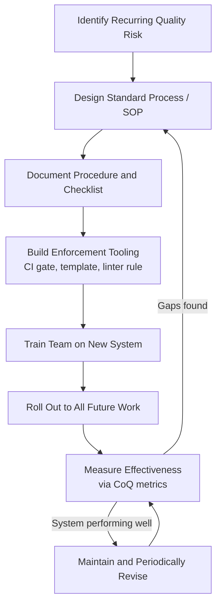

## Quality System Development Costs

### Definition and Classification

Quality System Development Costs are Prevention Costs incurred in designing, building, documenting, and maintaining the *infrastructure* — procedures, standards, tooling, and organizational systems — that make quality achievable across an organization or product line. This is distinguished from other Prevention subcategories (like Preventive Maintenance or Design Reviews) in that its output is not a single product decision but a reusable *system*: the quality management framework itself, applied repeatedly across many products, releases, or workflows.

Within the 1-10-100 Rule, Quality System Development sits at the most foundational and leveraged point of the Prevention tier. Where Preventive Maintenance and Design Review costs are typically incurred per-asset or per-feature, Quality System Development is incurred *once* (or periodically, for system upgrades) and amortized across every subsequent unit of work the system governs — giving it the highest leverage-per-dollar of any CoQ category. `[Inference]` This amortization effect means the effective per-unit Prevention cost of a mature quality system tends to decrease over time as more work passes through it, though the initial build-out cost is typically the largest single Prevention investment an organization makes.

$$\text{Prevention Cost} : \text{Appraisal Cost} : \text{Failure Cost} \approx 1 : 10 : 100$$

### Scope of Quality System Development

A Quality Management System (QMS) — the formal umbrella term (e.g., ISO 9001) — comprises several categories of development cost:

| Component | Description |
| --- | --- |
| Quality Planning Systems | Frameworks and templates for how quality objectives are set per product/project (e.g., NPQP/APQP templates) |
| Documentation Systems | Standard Operating Procedures (SOPs), work instructions, quality manuals |
| Process Design | The defined workflows themselves — how design reviews, testing, and releases are structured and gated |
| Training Program Development | Curricula, certification tracks, and onboarding material that teach the quality system to personnel |
| Tooling and Infrastructure | Software/systems that enforce or support the quality process (CI/CD pipelines, static analysis configuration, audit trail systems) |
| Metrics and Audit Systems | Frameworks for measuring quality system effectiveness itself (internal audits, KPI dashboards, CoQ tracking systems) |
| Standards Compliance Development | Work to align internal systems with external standards (ISO, industry-specific regulatory frameworks) |

### Quality System Development vs. Other Prevention Subcategories

| Category | Unit of Application | Frequency | Example |
| --- | --- | --- | --- |
| Preventive Maintenance | Per asset/component | Recurring (scheduled) | Quarterly dependency updates |
| Design Reviews / NPQP | Per product/feature | Per initiative | CDR for a new DMS module |
| **Quality System Development** | Organization-wide framework | One-time build + periodic revision | Building the CI/CD gate structure all reviews run through |
| Quality Training | Per person/role | Onboarding + recurring | Training engineers on the SOP for schema review |

Quality System Development is effectively the *meta-layer* — it defines and builds the very structures (templates, gates, tooling) that Design Reviews and Preventive Maintenance programs operate within. A design review process cannot function consistently without an underlying documented review procedure, review checklist, and RACI template — all of which are Quality System Development artifacts.

### Standard Frameworks Referenced

- **ISO 9001** — The dominant international QMS standard; defines requirements for a documented quality management system, including management responsibility, resource management, process control, and continual improvement (PDCA cycle).
- **CMMI (Capability Maturity Model Integration)** — A process-improvement framework, common in software/systems engineering, defining maturity levels (from ad hoc to optimized) that an organization's quality system can be assessed against.
- **Six Sigma / DMAIC** — Define-Measure-Analyze-Improve-Control methodology, often used to build and refine quality systems with statistical rigor.
- **AIAG APQP** — As covered under NPQP, provides a structured quality-planning system template originating in automotive manufacturing, widely adapted elsewhere.

`[Inference]` Small-to-mid-size software organizations (including single-developer or small-team projects like an LGU-scale DMS) rarely adopt these frameworks formally end-to-end; instead they typically borrow specific artifacts (checklists, gate structures, documented SOPs) without full certification overhead — this is a common and reasonable scaling-down rather than a deviation from best practice.

### Software Engineering Translation

For a TypeScript/Fastify/tRPC/Drizzle/PostgreSQL monorepo context, Quality System Development Costs manifest as:

- **CI/CD Pipeline Design** — Building the automated gate structure (lint → typecheck → test → build → deploy) that every future change passes through. This is a one-time (plus periodic revision) Prevention investment that governs all subsequent Appraisal activity (tests) running within it.
- **Coding Standards and Linter Configuration** — Developing and documenting the ESLint/Prettier/TypeScript strictness configuration that encodes organizational quality expectations into enforceable, automated rules.
- **PR/Review Templates and Checklists** — Creating the standard pull-request template, review checklist, and definition-of-done that every future code review is measured against (the *system* that governs future Design Review-type Prevention activity).
- **Schema Migration Governance** — Building the process (and possibly tooling) by which Drizzle migrations are proposed, reviewed, and rolled out safely — a reusable system rather than a one-off review.
- **Audit Trail / Compliance Architecture** — For a government-facing DMS, designing the system-wide logging and audit-trail architecture that satisfies public-sector accountability requirements is a Quality System Development cost, since it is infrastructure built once and relied upon across every document workflow thereafter.
- **CoQ Measurement Tooling** — Building the internal metrics/dashboarding needed to track Prevention/Appraisal/Failure costs themselves is, recursively, a Quality System Development cost — investment in the ability to measure quality investment.

### Cost Modeling Example

Consider a DMS team deciding whether to invest in building a standardized migration-review SOP and checklist versus handling each schema change ad hoc.

- **Prevention (Quality System Development) option**: One-time cost of ~16 engineer-hours to design and document a migration review checklist, plus tooling to enforce it (e.g., a CI check requiring checklist sign-off before merge). This cost is paid once and amortized across every future migration.
- **Without the system (ad hoc per-change reviews)**: Each migration requires ~3 hours of unstructured, non-standardized review effort, and review quality varies by reviewer — meaning some risky migrations slip through under a rushed or inconsistent review, generating Appraisal cost (bugs found in staging) or Failure cost (schema issues found in production) more frequently than a standardized checklist would allow.
- **Break-even**: `[Inference]` The 16-hour system-development investment pays for itself once the reduced per-migration review time and reduced escape rate across enough migrations offsets the build cost — the specific break-even point depends on migration frequency and historical escape rate, and should be measured rather than assumed for a given team.

### Quality System Maturity Levels

`[Inference]` A commonly referenced simplified maturity progression (loosely adapted from CMMI-style models) for how quality systems evolve:

1. **Ad Hoc** — No documented process; quality depends entirely on individual practitioner discipline.
2. **Defined** — Documented SOPs and checklists exist but are manually followed.
3. **Managed** — Processes are measured; deviations are tracked and analyzed.
4. **Enforced/Automated** — Tooling (CI/CD gates, automated checklist enforcement) makes compliance the default path rather than a manual choice.
5. **Optimizing** — The quality system itself is continuously revised based on CoQ metrics and feedback loops (closing the loop back into Design Reviews and NPQP's Phase 5).

### Process Flow: Building a Quality System

### Quality System as Leverage Layer (svg_diagram)

<svg xmlns="http://www.w3.org/2000/svg" viewBox="0 0 900 300">
<text x="450" y="24" text-anchor="middle" font-size="16" font-weight="bold" fill="#1a1a1a">Quality System Leverage Across Work Units (svg_diagram)</text>
<rect x="330" y="50" width="240" height="60" rx="8" fill="#eadcf7" stroke="#7d3ac1" stroke-width="1.5" />
<text x="450" y="75" text-anchor="middle" font-size="13" font-weight="bold" fill="#1a1a1a">Quality System</text>
<text x="450" y="93" text-anchor="middle" font-size="11" fill="#555">(built once, revised periodically)</text>
<rect x="60" y="180" width="150" height="55" rx="8" fill="#e8f0fe" stroke="#4a76d4" stroke-width="1.5" />
<text x="135" y="205" text-anchor="middle" font-size="11" fill="#1a1a1a">Design Review</text>
<text x="135" y="221" text-anchor="middle" font-size="11" fill="#1a1a1a">Feature A</text>
<rect x="240" y="180" width="150" height="55" rx="8" fill="#e8f0fe" stroke="#4a76d4" stroke-width="1.5" />
<text x="315" y="205" text-anchor="middle" font-size="11" fill="#1a1a1a">Migration Review</text>
<text x="315" y="221" text-anchor="middle" font-size="11" fill="#1a1a1a">Schema Change B</text>
<rect x="420" y="180" width="150" height="55" rx="8" fill="#e8f0fe" stroke="#4a76d4" stroke-width="1.5" />
<text x="495" y="205" text-anchor="middle" font-size="11" fill="#1a1a1a">Preventive</text>
<text x="495" y="221" text-anchor="middle" font-size="11" fill="#1a1a1a">Maintenance Cycle C</text>
<rect x="600" y="180" width="150" height="55" rx="8" fill="#e8f0fe" stroke="#4a76d4" stroke-width="1.5" />
<text x="675" y="205" text-anchor="middle" font-size="11" fill="#1a1a1a">CI Gate Check</text>
<text x="675" y="221" text-anchor="middle" font-size="11" fill="#1a1a1a">Release D</text>
<path d="M420,110 L135,180" stroke="#555" stroke-width="1.2" marker-end="url(#arrow3)" />
<path d="M440,110 L315,180" stroke="#555" stroke-width="1.2" marker-end="url(#arrow3)" />
<path d="M460,110 L495,180" stroke="#555" stroke-width="1.2" marker-end="url(#arrow3)" />
<path d="M480,110 L675,180" stroke="#555" stroke-width="1.2" marker-end="url(#arrow3)" />

<text x="450" y="270" text-anchor="middle" font-size="11" fill="#555">One Prevention investment governs N future work units — cost amortizes as N grows</text>

</svg>

### Common Pitfalls

- **Building the system but not enforcing it**: A documented SOP or checklist that isn't wired into an enforcement mechanism (CI gate, mandatory template field) tends to degrade into inconsistent practice, reducing it to documentation cost without corresponding Prevention benefit.
- **Over-investing before validating need**: Building an elaborate, heavily-templated quality system for a low-risk, low-frequency process, where the system-development cost exceeds the aggregate risk it mitigates.
- **Treating the system as static**: Failing to close the feedback loop (Phase 5 of NPQP / maturity level 5 above) means the system doesn't improve as CoQ data reveals where it's under- or over-performing.
- **Copying a framework wholesale without scaling to team size**: Adopting full ISO 9001-style documentation overhead for a small team can itself become a source of waste — process cost exceeding the risk it prevents. `[Inference]` The appropriate scale of formal quality-system investment is generally proportional to team size, regulatory exposure, and failure severity, rather than a fixed target regardless of context.
- **Siloed systems**: Building separate, inconsistent quality processes per team or per module (e.g., one team's PR checklist differs entirely from another's) undermines the leverage benefit that a shared system is meant to provide.

**Related Topics**

- ISO 9001 and Quality Management System Fundamentals
- CMMI Maturity Levels and Process Improvement
- Design Reviews and New Product Quality Planning (related Prevention Cost)
- Preventive Maintenance (related Prevention Cost)
- Six Sigma and DMAIC Methodology
- CI/CD Pipeline Design as Quality Infrastructure
- Cost of Quality Measurement Systems and Dashboards
- Training and Certification Program Development