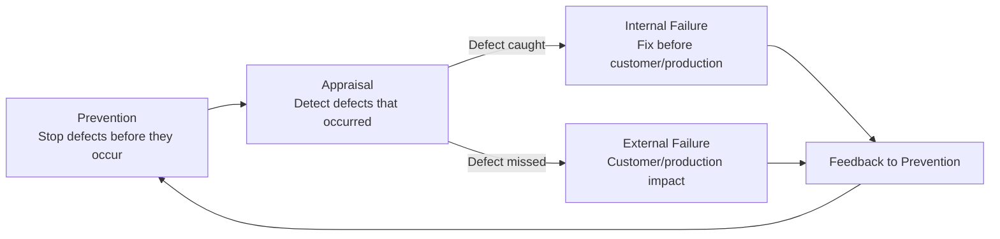

## Definition and Scope of Appraisal Costs

### Definition and Classification

Appraisal Costs are the second of the four canonical Cost of Quality (CoQ) categories, alongside Prevention Costs, Internal Failure Costs, and External Failure Costs. Where Prevention Costs are incurred to *stop* defects from occurring, Appraisal Costs are incurred to *detect* defects that already exist in a product, process output, or deliverable — before that defect reaches the next stage of the pipeline or, worst case, the end customer.

Formally: Appraisal Cost is the expenditure associated with measuring, evaluating, or auditing products, components, purchased materials, or process outputs to ensure conformance to quality standards and performance requirements.

Within the 1-10-100 Rule, Appraisal sits at the middle tier:

$$\text{Prevention Cost} : \text{Appraisal Cost} : \text{Failure Cost} \approx 1 : 10 : 100$$

Appraisal is structurally more expensive than Prevention because it operates *after* a defect has already been introduced — the cost of the defect's creation is sunk, and appraisal only adds the cost of finding it, not avoiding it. It remains cheaper than Failure because it catches the defect before it escapes to a customer, downstream system, or production environment, where remediation cost and consequence severity both increase sharply.

### Position in the Quality Cost Lifecycle

Appraisal is the *detection gate* between Prevention and Failure. A well-functioning Appraisal system does not reduce the number of defects created — that is Prevention's job — it reduces the number of defects that *escape* undetected into Internal or External Failure.

### Core Purpose and Boundary

**Key Points**

- Appraisal Costs answer the question: "How do we know if what we built is correct?"
- Appraisal does not prevent defects and does not fix them — it only identifies them. Any cost incurred *fixing* a defect found during appraisal is technically an Internal Failure Cost, not an Appraisal Cost, though the two are often incurred back-to-back and can be conflated in loose usage.
- Appraisal activities are inherently non-value-adding from a pure lean/Six Sigma perspective (they don't change the product, only verify it) — but they are necessary as long as Prevention is imperfect. `[Inference]` This framing implies that a theoretically perfect Prevention system would reduce required Appraisal spend toward zero, though in practice this limit is rarely approached in real systems given irreducible uncertainty in requirements, environments, and human execution.

### Standard Sub-Categories of Appraisal Cost

Traditional CoQ literature (Juran, Crosby, ASQ) decomposes Appraisal Costs into several recognized sub-categories:

| Sub-Category | Description | Example |
| --- | --- | --- |
| Incoming/Receiving Inspection | Verifying purchased materials, components, or third-party inputs meet spec before use | Validating a vendor-supplied dataset or dependency before integration |
| In-Process Inspection | Verifying work-in-progress at intermediate stages | Code review of a feature branch before merge |
| Final Inspection/Testing | Verifying the completed product before release | End-to-end test suite run before deployment |
| Product/Process Audits | Periodic sampling-based checks of process adherence and output quality | Scheduled audit of a subset of processed documents in a DMS for correctness |
| Calibration of Inspection Equipment | Ensuring the tools/instruments used to measure quality are themselves accurate | Verifying a testing/monitoring tool's own correctness (e.g., validating a linter config, a static analysis tool version) |
| Supplier/Vendor Rating | Evaluating and scoring external suppliers on quality performance | Tracking the defect rate of a third-party API or library over time |
| Evaluation of Stock/Inventory | Assessing quality of items held in storage for degradation | `[Inference]` Less directly applicable to software; the closest software analogue is periodic re-validation of cached or stored data for staleness/corruption |

### Appraisal vs. Prevention: Key Distinctions

| Dimension | Prevention | Appraisal |
| --- | --- | --- |
| Timing | Before defect creation | After defect creation, before escape |
| Cost Position (1-10-100) | $1 tier | $10 tier |
| Value-Adding? | Yes — changes how work is done | No — only verifies work already done |
| Typical Activities | Design review, training, process design, preventive maintenance | Testing, inspection, code review, audits |
| Failure Mode if Absent | Defects are created at baseline rate | Defects created at baseline rate *escape undetected* |
| Software Analogue | Architecture design, coding standards, CI/CD gate design | Unit/integration/E2E tests, QA, manual code review, static analysis runs |

An important nuance: some activities are ambiguous or hybrid depending on framing. Automated CI/CD *pipeline design* (deciding what gates should exist) is Prevention (Quality System Development); each individual *test run* executed by that pipeline against a specific change is Appraisal.

### Software Engineering Translation

For a TypeScript/Fastify/tRPC/Drizzle/PostgreSQL monorepo, Appraisal Cost activities typically include:

- **Automated Test Execution** — Unit, integration, and end-to-end test suite runs against each change; the *engineering time to write* tests is arguably Prevention/Quality System Development, but the *compute and review time per run* is Appraisal.
- **Code Review** — Human review of pull requests to catch logic errors, type misuse, or schema inconsistencies before merge (in-process inspection).
- **Static Analysis and Type-Checking Runs** — Each `tsc`/ESLint run against a change is an Appraisal activity, distinct from the Prevention cost of having configured the rules in the first place.
- **Manual QA / Exploratory Testing** — Human testers exercising DMS workflows (document submission, approval routing) to find defects before release.
- **Staging Environment Validation** — Deploying to a staging environment and verifying behavior against production-like conditions before promoting to production.
- **Security Audits / Penetration Testing** — Periodic third-party or internal security assessment of the live or staging system, distinguished from Prevention-stage threat modeling.
- **Data Integrity Audits** — Scheduled queries/scripts verifying that document workflow states in PostgreSQL are internally consistent (e.g., no orphaned records, no invalid state transitions that slipped past application-level checks).

### Cost Modeling Example

Consider a defect: a tRPC procedure that fails to validate a required field, allowing a malformed document submission into the DMS.

- **If caught by Appraisal** (code review flags missing Zod/input validation schema before merge): Cost ≈ 1–2 engineer-hours (reviewer time + author's fix time), incurred as Appraisal (review) plus a small Internal Failure cost (the fix itself).
- **If Appraisal misses it, caught by staging validation**: Cost ≈ 3–4 engineer-hours (QA reproduction, bug ticket, root-cause investigation, fix, re-test) — a larger Appraisal + Internal Failure combination, since more downstream assumptions (UI, other endpoints) may already depend on the incorrect behavior.
- **If both layers miss it, reaches production**: A citizen submits a malformed document that corrupts downstream state; cost includes incident response, manual data correction, and potential compliance/audit exposure for the LGU. This is External Failure cost, at the $100 tier. `[Unverified]` The specific multiplier for this scenario would need to be measured against the organization's actual incident data rather than assumed from the generic ratio.

This illustrates why Appraisal investment (test coverage, review rigor) is justified even though it is itself a non-value-adding cost: each additional Appraisal layer reduces the probability of a defect reaching the more expensive Failure tier.

### Appraisal Cost Efficiency Metrics

Organizations commonly track Appraisal effectiveness using:

$$\text{Defect Detection Efficiency (DDE)} = \frac{\text{Defects found pre-release}}{\text{Defects found pre-release} + \text{Defects found post-release}}$$

A DDE approaching 1.0 indicates Appraisal is catching nearly all defects before external escape; a low DDE indicates either insufficient Appraisal coverage or Appraisal activities that are not well-targeted at actual failure modes (often revealed by comparing DFMEA-predicted failure modes against what Appraisal activities actually check for).

**Key Points**

- Appraisal cost is not minimized by doing *more* inspection indiscriminately — it's minimized by targeting inspection at the highest-risk areas (informed by DFMEA/RPN from the Design Review stage).
- Appraisal Cost and Internal Failure Cost are frequently reported together in CoQ dashboards because they are temporally adjacent, but they represent conceptually distinct activities (detection vs. remediation).

### Common Pitfalls

- **Conflating Appraisal with Failure cost**: Counting the cost of *fixing* a bug found in code review as "Appraisal cost" when only the review time itself belongs in that category; the fix is Internal Failure cost.
- **Appraisal without traceability to risk**: Running a broad, unfocused test suite without any linkage to the highest-RPN failure modes identified during design review, resulting in appraisal effort misallocated relative to actual risk.
- **Treating 100% test coverage as the goal**: Coverage percentage is a proxy metric, not the objective — `[Inference]` a codebase can have high line coverage while still missing critical edge-case defects if tests don't target actual failure modes, meaning coverage percentage alone doesn't reliably indicate Appraisal effectiveness.
- **No Detection Efficiency tracking**: Without measuring DDE or equivalent, an organization cannot tell whether its Appraisal investment is actually working versus simply consuming cost without proportional defect capture.
- **Appraisal fatigue from redundant layers**: Running the same class of check at multiple stages with no differentiated purpose (e.g., overlapping manual QA and automated tests validating identical, low-risk behavior) inflates Appraisal cost without corresponding risk reduction.

**Related Topics**

- Defect Detection Efficiency (DDE) and Appraisal Metrics
- Incoming Inspection vs. In-Process Inspection vs. Final Inspection
- Testing Costs in Depth (Unit, Integration, E2E)
- Code Review as an Appraisal Activity
- Internal Failure Costs (downstream of missed Appraisal)
- External Failure Costs (downstream of missed Appraisal)
- Supplier/Vendor Quality Rating Systems
- DFMEA-to-Appraisal Traceability (linking Design Review risk to test targeting)