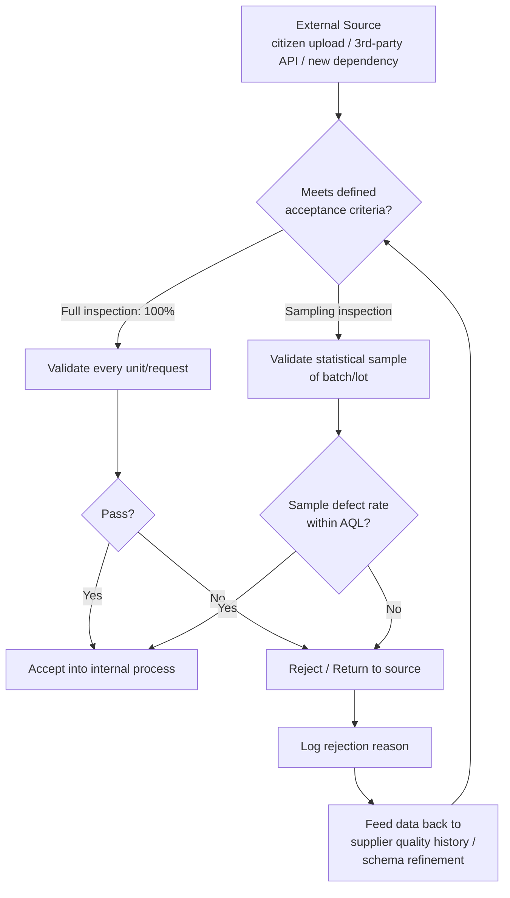

## Incoming and Receiving Inspection

### Definition and Classification

Incoming and Receiving Inspection is an Appraisal Cost sub-category covering the evaluation of externally-sourced materials, components, data, or deliverables *before* they are accepted into an organization's production process. It is the earliest possible Appraisal checkpoint — positioned at the boundary between an external supplier/source and the organization's own value chain — and exists to prevent defects originating outside the organization's direct control from propagating into internal work.

Within the 1-10-100 Rule, Incoming Inspection is Appraisal-tier ($10) but occupies the *earliest* position within that tier, making it the cheapest form of Appraisal available: a defective input caught at receipt costs far less to reject or return than the same defect discovered after it has already been integrated into downstream work (which then compounds into Internal or External Failure cost).

$$\text{Prevention Cost} : \text{Appraisal Cost} : \text{Failure Cost} \approx 1 : 10 : 100$$

### Purpose and Scope

**Key Points**

- Incoming Inspection answers: "Can we trust what we're about to build on top of?"
- It is a *gate*, not a guarantee — inspection samples or validates against defined acceptance criteria; it does not certify perfection.
- It applies to anything crossing an organizational or trust boundary: physical materials in manufacturing, but equally purchased data, third-party components, contractor deliverables, or dependencies in software contexts.

### Classical (Manufacturing) Scope

In traditional CoQ/quality-management literature, Incoming and Receiving Inspection covers:

| Activity | Description |
| --- | --- |
| Raw Material Inspection | Verifying purchased raw materials meet specification (dimensional, chemical, material-grade checks) |
| Component/Part Inspection | Verifying purchased parts or subassemblies before use in production |
| Sampling Inspection | Statistical sampling of a batch/lot rather than 100% inspection, using acceptance sampling plans (e.g., ANSI/ASQ Z1.4) |
| Certificate of Conformance (CoC) Review | Verifying supplier-provided documentation attesting to spec compliance, sometimes in lieu of physical re-inspection |
| Supplier Quality History Review | Using a vendor's historical defect rate to determine inspection rigor (a high-trust supplier may warrant reduced sampling) |

### Acceptance Sampling Fundamentals

Rather than inspecting every unit in a batch (100% inspection, which is often cost-prohibitive), Incoming Inspection frequently uses **acceptance sampling**: a statistically-defined subset of a lot is inspected, and the entire lot is accepted or rejected based on the sample's defect rate relative to a predefined threshold.

Key parameters in acceptance sampling plans:

- **Lot size (N)** — Total units in the batch.
- **Sample size (n)** — Number of units actually inspected.
- **Acceptance number (c)** — Maximum number of defects allowed in the sample for the lot to still be accepted.
- **AQL (Acceptable Quality Level)** — The worst tolerable defect rate that is still considered acceptable for routine acceptance.

$$P(\text{accept lot}) = \sum_{k=0}^{c} \binom{n}{k} p^k (1-p)^{n-k}$$

where $p$ is the true defect rate of the lot (binomial approximation, assuming $N \gg n$). `[Inference]` This binomial model assumes independent, identically-distributed defects across the lot; in practice, defect clustering (e.g., a bad production run within a lot) can make sampling less reliable than the idealized model suggests, which is why supplier trust history is often used to adjust sampling rigor beyond the pure statistical model.

### Software Engineering Translation: "Incoming Inspection" for Code and Data

`[Inference]` Software doesn't receive physical raw materials, but the underlying principle — validating externally-sourced inputs before they enter internal work — maps to several concrete practices:

| Manufacturing Concept | Software/DMS Equivalent |
| --- | --- |
| Raw material inspection | Validating third-party API responses / external data feeds before processing |
| Component inspection | Auditing a new npm/third-party dependency before adding it to the monorepo |
| Certificate of Conformance review | Trusting a package's published test coverage, security audit badge, or SBOM instead of re-auditing it in-house |
| Supplier quality history | Tracking a dependency's historical CVE frequency, maintenance activity, and community trust signals before adoption |
| Acceptance sampling | Schema/contract validation applied to a subset or 100% of incoming API payloads at a system boundary |
| Lot rejection | Rejecting a malformed upload/document submission at the API boundary rather than allowing it into the processing pipeline |

For a document management system specifically, "incoming inspection" concretely includes:

- **Upload Validation** — Validating file type, size, structure, and required metadata for citizen-submitted documents *at the API boundary* (tRPC input schema via Zod) before the document enters any internal workflow state.
- **Third-Party Dependency Vetting** — Reviewing a new npm package's maintenance status, license, known vulnerabilities (`npm audit`), and bundle-size impact before merging it into the monorepo — treating the dependency as an incoming "material" subject to inspection before acceptance.
- **External API Response Validation** — If the DMS integrates with external government systems or identity-verification services, validating response schemas and error conditions from those external APIs before trusting the data downstream.
- **Contractor/External Contribution Review** — If any part of the codebase accepts contributions from outside the core team, the code review applied specifically to that external contribution functions as Incoming Inspection, distinct from routine internal peer review.

### Incoming Inspection vs. In-Process vs. Final Inspection

| Dimension | Incoming Inspection | In-Process Inspection | Final Inspection |
| --- | --- | --- | --- |
| Boundary | External source → internal system | Within internal workflow | Internal system → external consumer |
| Timing | Before any internal processing | During internal processing | After processing, before release |
| Software Example | Validating an uploaded file's schema | Code review of a feature branch | End-to-end test before deployment |
| Failure if skipped | Bad external data corrupts internal state from the start | Defect introduced mid-process goes undetected | Defect reaches production/customer |

Incoming Inspection is unique among the three in that the *defect did not originate within the organization's process* — it originated externally. This has an important implication: fixing the root cause (true Prevention) may be outside the organization's direct control (you cannot re-engineer a third-party library's internals), so the organization's Prevention lever is often limited to *selection* (choosing better suppliers/dependencies) and *isolation* (validating and sandboxing untrusted input) rather than eliminating the defect at its source.

### Cost Modeling Example

Consider a DMS accepting citizen document uploads via a public-facing form.

- **Incoming Inspection in place**: Every upload is validated against a strict Zod schema (file type, size limits, required metadata fields) at the tRPC procedure boundary. Invalid submissions are rejected immediately with a clear error. Cost: negligible marginal compute cost per request, plus the one-time (Prevention-tier) cost of having built the validation schema.
- **Incoming Inspection skipped/weak**: A malformed or oversized file passes into the internal workflow. It may fail unpredictably at a later processing stage (e.g., a PDF-parsing step, or a downstream storage operation), where the error is harder to trace back to its root cause because more processing has already occurred. Cost: engineer time to trace the failure back through the pipeline (likely several hours), plus potential Internal Failure cost if it corrupted shared state (e.g., a workflow record left in an inconsistent status).
- **Worst case**: The malformed submission is a vector for a stored injection or path-traversal issue exploiting a missing incoming validation step, escalating from an Appraisal gap into a security-relevant External Failure. `[Unverified]` The specific severity and likelihood of an exploit path would depend on the DMS's actual file-handling implementation and would need direct security review to assess, not assumed from this general pattern.

### Process Flow: Incoming Inspection Gate

### Acceptance Sampling Decision Diagram (svg_diagram)

<svg xmlns="http://www.w3.org/2000/svg" viewBox="0 0 900 280">
<text x="450" y="24" text-anchor="middle" font-size="16" font-weight="bold" fill="#1a1a1a">Incoming Inspection: Sampling vs. Full Inspection (svg_diagram)</text>
<rect x="30" y="60" width="200" height="60" rx="8" fill="#e8f0fe" stroke="#4a76d4" stroke-width="1.5" />
<text x="130" y="85" text-anchor="middle" font-size="12" fill="#1a1a1a">Incoming Lot / Batch</text>
<text x="130" y="102" text-anchor="middle" font-size="11" fill="#555">Size N</text>
<rect x="330" y="60" width="220" height="60" rx="8" fill="#fff4e5" stroke="#d68910" stroke-width="1.5" />
<text x="440" y="85" text-anchor="middle" font-size="12" fill="#1a1a1a">High supplier trust /</text>
<text x="440" y="102" text-anchor="middle" font-size="11" fill="#555">low risk severity</text>
<rect x="650" y="60" width="220" height="60" rx="8" fill="#fdecea" stroke="#c0392b" stroke-width="1.5" />
<text x="760" y="85" text-anchor="middle" font-size="12" fill="#1a1a1a">Low supplier trust /</text>
<text x="760" y="102" text-anchor="middle" font-size="11" fill="#555">high risk severity</text>
<rect x="330" y="180" width="220" height="60" rx="8" fill="#e6f4ea" stroke="#2e8b57" stroke-width="1.5" />
<text x="440" y="205" text-anchor="middle" font-size="12" fill="#1a1a1a">Sampling Inspection</text>
<text x="440" y="222" text-anchor="middle" font-size="11" fill="#555">n &lt; N, AQL-based</text>
<rect x="650" y="180" width="220" height="60" rx="8" fill="#e6f4ea" stroke="#2e8b57" stroke-width="1.5" />
<text x="760" y="205" text-anchor="middle" font-size="12" fill="#1a1a1a">Full (100%) Inspection</text>
<text x="760" y="222" text-anchor="middle" font-size="11" fill="#555">n = N</text>
<path d="M230,90 H330" stroke="#555" stroke-width="1.5" marker-end="url(#arrow4)" />
<path d="M230,90 H650" stroke="#555" stroke-width="1.5" marker-end="url(#arrow4)" />
<path d="M440,120 V180" stroke="#555" stroke-width="1.5" marker-end="url(#arrow4)" />
<path d="M760,120 V180" stroke="#555" stroke-width="1.5" marker-end="url(#arrow4)" />
</svg>

### Common Pitfalls

- **Trusting supplier documentation without periodic re-validation**: Accepting a Certificate of Conformance or a dependency's published security posture indefinitely without periodic re-audit allows drift (a previously-trustworthy dependency can introduce a vulnerability in a later release).
- **Uniform inspection rigor regardless of risk**: Applying the same sampling rate to a low-risk, low-severity input as to a high-risk one wastes Appraisal budget on the former while potentially under-inspecting the latter — sampling rigor should scale with the risk/severity identified during design-stage DFMEA.
- **No rejection feedback loop**: Rejecting bad incoming input without logging *why* and feeding that back into schema refinement or supplier scoring means the same class of defect keeps recurring at the boundary indefinitely.
- **Validating format but not semantics**: A common software-specific pitfall — schema validation (e.g., "is this field a string") catching structural issues but missing semantic issues (e.g., a syntactically valid but logically invalid document reference ID) that only a more thorough check would catch.
- **Treating incoming inspection as a one-time integration decision**: For dependencies specifically, vetting a package only at initial adoption and never re-checking it as it receives updates skips the "supplier quality history" dimension of Incoming Inspection entirely.
- **Rejecting too late in the pipeline**: Performing what is conceptually an incoming check only after data has already touched multiple internal systems, eliminating the cost advantage that makes Incoming Inspection the cheapest Appraisal tier.

**Related Topics**

- Acceptance Sampling and AQL (Acceptable Quality Level)
- Definition and Scope of Appraisal Costs (parent category)
- In-Process Inspection and Final Inspection
- Supplier/Vendor Quality Rating Systems
- Input Validation and Schema Design (Zod, tRPC boundary validation)
- Software Composition Analysis and Dependency Vetting
- Certificate of Conformance and Documentation-Based Acceptance
- Internal Failure Costs from Undetected Incoming Defects