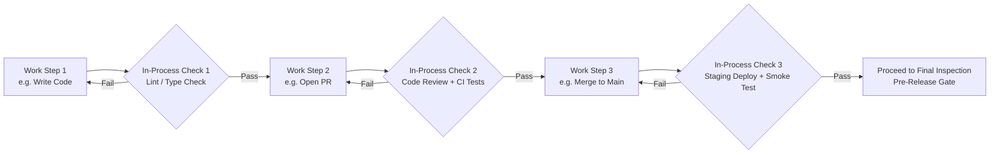

## In Process Inspection and Testing

### Definition and Classification

In-Process Inspection and Testing is an Appraisal Cost sub-category covering the evaluation of work *while it is still being produced* — at intermediate stages of a workflow, rather than at the boundary where material enters the process (Incoming Inspection) or at the boundary where the finished product leaves it (Final Inspection). It is positioned in the middle of the internal value chain, and its purpose is to catch defects as close as possible to the point where they were introduced, before additional work is layered on top of a flawed foundation.

Within the 1-10-100 Rule, In-Process Inspection remains Appraisal-tier ($10), but its cost-effectiveness within that tier depends heavily on *how early* within the process it occurs. A defect caught immediately after the stage that introduced it is cheaper to fix than the same defect caught several stages later, once downstream work has already been built on the flawed output.

$$\text{Prevention Cost} : \text{Appraisal Cost} : \text{Failure Cost} \approx 1 : 10 : 100$$

### Purpose and Scope

**Key Points**

- In-Process Inspection answers: "Is this intermediate work correct *before* we build further on top of it?"
- It differs from Incoming Inspection (external boundary) and Final Inspection (output boundary) by operating on *internally generated* work-in-progress.
- Its effectiveness is a function of placement: inspection points should sit immediately downstream of the highest-risk process steps (informed by DFMEA/Process FMEA RPN scores from the Design Review stage), not distributed arbitrarily.

### Classical (Manufacturing) Scope

| Activity | Description |
| --- | --- |
| Statistical Process Control (SPC) | Ongoing measurement of process outputs plotted against control limits to detect drift before it produces defects |
| First Article Inspection | Detailed inspection of the first unit produced by a new process/setup before full production run |
| Line/Station Inspection | Inspection performed at specific points along a production line, typically after high-risk operations |
| In-Process Sampling | Periodic sampling of units mid-process rather than only at the end |
| Operator Self-Inspection | Workers checking their own output against standards immediately after completing a step (poka-yoke-adjacent) |

### Statistical Process Control (SPC) Fundamentals

SPC is the dominant in-process inspection methodology in manufacturing quality systems. It uses control charts to monitor a process variable over time, distinguishing between:

- **Common cause variation** — Inherent, expected process noise within statistical control limits.
- **Special cause variation** — Anomalous variation signaling the process has shifted or degraded, requiring investigation.

Control limits are typically set at $\pm 3\sigma$ from the process mean:

$$UCL = \bar{x} + 3\sigma, \quad LCL = \bar{x} - 3\sigma$$

A process point falling outside these limits (or exhibiting certain non-random patterns, per Western Electric rules) triggers investigation *before* the process continues producing further units — allowing correction mid-stream rather than after a full batch is complete.

`[Inference]` SPC's core value proposition — catching process drift before it accumulates into a large batch of defects — is the direct manufacturing ancestor of software practices like continuous monitoring and canary analysis, though the underlying statistical machinery differs (SPC assumes a stable, repeatable physical process; software systems often have non-stationary load and usage patterns that complicate direct control-chart application).

### In-Process Inspection vs. Incoming vs. Final Inspection

| Dimension | Incoming Inspection | In-Process Inspection | Final Inspection |
| --- | --- | --- | --- |
| Boundary | External → internal | Within internal workflow | Internal → external |
| Timing | Before any internal processing | During internal processing | After processing, before release |
| Detects | Defects in externally-sourced input | Defects introduced by internal process steps | Defects surviving the entire process |
| Software Example | Validating an uploaded file's schema | Code review of a feature branch; CI checks on a PR | End-to-end test before deployment |
| Placement Principle | At the trust boundary | Immediately after highest-risk process steps | At the release gate |

### Software Engineering Translation

For a TypeScript/Fastify/tRPC/Drizzle/PostgreSQL monorepo, In-Process Inspection and Testing concretely includes:

- **Pull Request Code Review** — The canonical in-process inspection point in software: work-in-progress (a feature branch) is evaluated before it merges into the shared codebase, catching defects before they become part of the baseline other work builds on.
- **Unit and Integration Test Execution in CI** — Tests run automatically on every commit/PR, functioning as an automated in-process inspection station analogous to a line/station inspection in manufacturing.
- **Type-Checking and Static Analysis (`tsc`, ESLint)** — Continuous, automated checks applied to work-in-progress code, catching a class of defects (type mismatches, unused variables, unsafe patterns) immediately at the point of authorship.
- **Drizzle Migration Dry-Runs** — Validating a migration against a non-production database copy before it's applied to the shared development or staging schema, catching schema-level defects before they propagate to environments other developers depend on.
- **Branch Protection Gates** — CI/CD rules requiring specific checks (tests passing, review approval, up-to-date branch) before merge is permitted — the enforcement mechanism that makes in-process inspection mandatory rather than optional.
- **Feature-Flag Gated Rollout Monitoring** — Observing error rates/metrics on a feature flag enabled for a subset of traffic *before* full rollout — a form of in-process inspection applied to a partially-completed release process rather than a fully-finished one.
- **Pair Programming / Live Review** — Real-time review during the act of writing code itself, the earliest possible in-process inspection point, analogous to operator self-inspection in manufacturing.

### Inspection Point Placement Strategy

`[Inference]` Optimal in-process inspection placement follows from the DFMEA/RPN analysis conducted during Design Review: inspection resources should concentrate immediately downstream of process steps with the highest Risk Priority Number, rather than being spread evenly across every step regardless of risk.

For a DMS document workflow (e.g., Submit → Validate → Route for Approval → Approve/Reject → Archive), the highest-risk transition — say, the Approve/Reject step, given its irreversibility and compliance implications — warrants the most rigorous in-process inspection (e.g., mandatory dual-review, automated state-transition validation), while lower-risk steps (e.g., Archive) may warrant lighter-weight or purely automated checks.

### Cost Modeling Example

Consider a defect: a Drizzle schema migration that introduces a non-nullable column without a default value, which would break existing rows in a live table.

- **In-Process Inspection catches it (migration dry-run against staging DB copy + PR review)**: Cost ≈ 1–2 engineer-hours to catch during dry-run, revise the migration to include a safe default or backfill step, and re-review. This is Appraisal cost with a small immediately-adjacent Internal Failure cost (the fix).
- **In-Process Inspection misses it, caught at Final Inspection (staging deployment)**: The migration is applied to a shared staging database, breaking other developers' work against that environment until rolled back. Cost ≈ 4–6 engineer-hours (rollback, coordination with affected developers, re-migration, re-test).
- **Worst case, reaches production**: The migration is applied directly against the live DMS database, causing an outage or data-write failures across the LGU's document workflows during business hours. Cost includes emergency rollback, incident response, and potential downstream impact on citizens submitting documents. `[Unverified]` The magnitude of this cost for a public-sector system would depend on how disruption is measured (e.g., transaction volume, SLA terms) which would need to be assessed against the specific deployment's actual usage patterns.

This demonstrates the core In-Process Inspection value proposition: catching the defect immediately after the migration-authoring step (early in-process) is markedly cheaper than catching it at a later stage of the same internal pipeline, which is itself cheaper than an external escape.

### Process Flow: In-Process Inspection Points Along a Pipeline

### SPC Control Chart Concept (svg_diagram)

<svg xmlns="http://www.w3.org/2000/svg" viewBox="0 0 900 320">
<text x="450" y="24" text-anchor="middle" font-size="16" font-weight="bold" fill="#1a1a1a">Statistical Process Control: Detecting Drift In-Process (svg_diagram)</text>
<line x1="70" y1="270" x2="850" y2="270" stroke="#333" stroke-width="1.5" />
<line x1="70" y1="50" x2="70" y2="270" stroke="#333" stroke-width="1.5" />
<text x="20" y="275" font-size="11" fill="#555">Value</text>
<text x="800" y="290" font-size="11" fill="#555">Time / Unit #</text>
<line x1="70" y1="100" x2="850" y2="100" stroke="#c0392b" stroke-width="1.5" stroke-dasharray="6,4" />
<text x="855" y="104" font-size="11" fill="#c0392b">UCL</text>
<line x1="70" y1="160" x2="850" y2="160" stroke="#4a76d4" stroke-width="1.5" stroke-dasharray="2,3" />
<text x="855" y="164" font-size="11" fill="#4a76d4">Mean</text>
<line x1="70" y1="220" x2="850" y2="220" stroke="#c0392b" stroke-width="1.5" stroke-dasharray="6,4" />
<text x="855" y="224" font-size="11" fill="#c0392b">LCL</text>

<polyline points="90,165 140,150 190,170 240,155 290,145 340,165 390,150 440,160 490,140 540,165" fill="none" stroke="`#2e8b57`" stroke-width="2" />

<polyline points="540,165 590,120 640,95 690,80" fill="none" stroke="`#c0392b`" stroke-width="2.5" />

<circle cx="640" cy="95" r="6" fill="#c0392b" />
<circle cx="690" cy="80" r="6" fill="#c0392b" />
<text x="700" y="65" font-size="11" fill="#c0392b" font-weight="bold">Out of control —</text>
<text x="700" y="80" font-size="11" fill="#c0392b" font-weight="bold">special cause, investigate now</text>

<text x="150" y="190" font-size="11" fill="`#2e8b57`">In control — common cause variation only</text>

</svg>

### Common Pitfalls

- **Inspection concentrated only at the end**: Relying solely on Final Inspection while skipping in-process checkpoints means defects accumulate across multiple process steps before detection, increasing the cost and complexity of root-causing them.
- **Uniform inspection intensity regardless of step risk**: Applying identical review rigor to a trivial documentation change and a schema migration wastes reviewer attention on the former while potentially under-scrutinizing the latter.
- **In-process checks that don't block progression**: Running CI tests or SPC-style monitoring that produces a signal but doesn't actually gate the next process step (e.g., a "required" check that can be overridden without justification) undermines the entire purpose of in-process inspection.
- **No investigation of anomalies, only detection**: Flagging a special-cause signal (in SPC) or a flaky/failing test (in software) without follow-up investigation converts the appraisal signal into noise that gets ignored over time.
- **Reviewer/inspector fatigue from excessive checkpoint density**: `[Inference]` Too many low-value in-process gates can create alert fatigue or review fatigue, where reviewers begin rubber-stamping due to volume — this is a common failure mode though its severity varies by team and tooling.
- **Ignoring DFMEA-informed placement**: Distributing in-process inspection points evenly along a pipeline rather than concentrating them after the highest-RPN steps identified during design review, misallocating Appraisal spend relative to actual risk.

**Related Topics**

- Statistical Process Control (SPC) and Control Charts
- Definition and Scope of Appraisal Costs (parent category)
- Incoming and Receiving Inspection
- Final Inspection and Testing (pre-release gate)
- Code Review Practices and Pull Request Workflows
- CI/CD Pipeline Design as an Appraisal Enforcement Mechanism
- DFMEA/PFMEA-Informed Inspection Point Placement
- Canary Deployments and Feature-Flag Monitoring