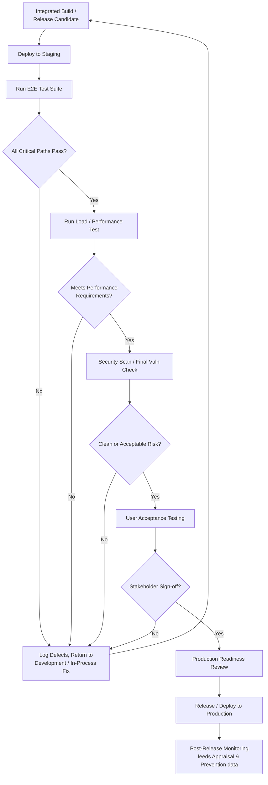

## Final Inspection and Product Testing

### Definition and Classification

Final Inspection and Product Testing is an Appraisal Cost sub-category covering the evaluation of a *completed* product, feature, or release before it crosses the boundary from internal control into external release — to a customer, to production, or to whatever environment the organization does not fully control after handoff. It is the last Appraisal checkpoint in the pipeline: the final opportunity to catch a defect while it is still classified as Internal Failure cost ($10-adjacent) rather than External Failure cost ($100 tier).

$$\text{Prevention Cost} : \text{Appraisal Cost} : \text{Failure Cost} \approx 1 : 10 : 100$$

Because Final Inspection sits at the very end of the internal process, a defect caught here has already accumulated the full cost of every preceding process step — design, construction, and any earlier appraisal layers that failed to catch it. It remains cheaper than an External Failure only because remediation is still contained within the organization's own environment and has not yet affected a customer, citizen, or live production system.

### Purpose and Scope

**Key Points**

- Final Inspection answers: "Is the completed product ready to be released, as a whole, against its full requirements?"
- Unlike In-Process Inspection (checking intermediate work) or Incoming Inspection (checking external inputs), Final Inspection evaluates the *integrated, finished* deliverable — it is the only appraisal point positioned to catch defects arising from interaction between components that individually passed their own checks.
- Final Inspection is the last line of defense before Appraisal Cost gives way to Failure Cost; its effectiveness is often measured via Defect Detection Efficiency (DDE), covered under Appraisal Cost scope generally.

### Classical (Manufacturing) Scope

| Activity | Description |
| --- | --- |
| Final Product Inspection | Physical/functional inspection of the completed, assembled product against full specification |
| Functional/Performance Testing | Verifying the product performs its intended function under expected operating conditions |
| Packaging and Labeling Inspection | Verifying the product is correctly packaged, labeled, and documented for shipment |
| Certificate of Compliance Issuance | Formal sign-off that the product meets regulatory/contractual requirements before release |
| Pre-Shipment Sampling | Statistical sampling of a finished batch before it ships, analogous to incoming inspection but applied outbound |
| Customer Acceptance Testing (when performed pre-handoff) | Verification against customer-specific acceptance criteria before formal delivery |

### Final Inspection vs. Incoming vs. In-Process Inspection

| Dimension | Incoming Inspection | In-Process Inspection | Final Inspection |
| --- | --- | --- | --- |
| Boundary | External → internal | Within internal workflow | Internal → external |
| Timing | Before any internal processing | During internal processing | After all processing, before release |
| Detects | Defects in externally-sourced input | Defects introduced by internal process steps | Defects surviving the entire process, including integration defects |
| Software Example | Validating an uploaded file's schema | Code review of a feature branch; CI checks on a PR | End-to-end test suite; staging validation before production deploy |
| Unique Capability | N/A | N/A | Catches emergent/integration defects invisible at component level |

### Software Engineering Translation

For a TypeScript/Fastify/tRPC/Drizzle/PostgreSQL monorepo, Final Inspection and Product Testing concretely includes:

- **End-to-End (E2E) Test Suites** — Automated tests exercising complete user workflows (e.g., a citizen submitting a document through approval to archival) against a fully integrated build, catching defects that only manifest when components interact.
- **Staging Environment Validation** — Deploying the complete, integrated application to a production-like staging environment and verifying full workflows before promoting to production.
- **Release Candidate Smoke Testing** — A focused pass verifying critical-path functionality (login, document submission, approval routing) works correctly on the exact build about to be released.
- **Load and Performance Testing** — Verifying the integrated system meets performance requirements under realistic load, a category of defect (e.g., connection-pool exhaustion under concurrent document uploads) that is essentially invisible at the unit or in-process testing level.
- **Security Regression Testing / Final Vulnerability Scan** — A pre-release security pass (SAST/DAST tooling, dependency vulnerability scan) run against the complete build, distinct from earlier in-process dependency vetting.
- **User Acceptance Testing (UAT)** — For a government LGU system, formal sign-off from actual end-users (city staff, department heads) verifying the system meets operational requirements before go-live.
- **Release Notes / Changelog Accuracy Review** — Verifying that documented changes match actual shipped behavior — a lightweight but real Final Inspection activity ensuring downstream consumers (other developers, LGU IT staff) have accurate release information.
- **Production Readiness Review (PRR)** — As referenced under Design Reviews, the formal go/no-go gate combining Final Inspection results (test pass rates, open defect severity) into a release decision.

### Why Final Inspection Catches What Earlier Stages Cannot

`[Inference]` The distinguishing value of Final Inspection is its ability to detect **emergent defects** — problems that arise specifically from the interaction of correctly-functioning individual components, which by definition cannot be caught by inspecting those components in isolation. Examples in a DMS context:

- Two independently correct tRPC procedures that, when called in sequence during a real user workflow, produce a race condition in document state updates.
- A correctly implemented Drizzle schema and a correctly implemented API layer that, together, exhibit an N+1 query problem only visible under realistic data volume and concurrent access.
- Individually-passing unit tests for a document upload handler and a notification service that, when integrated, reveal a webhook timing assumption that doesn't hold under real network latency.

This is why Final Inspection cannot be fully substituted by exhaustive unit-level or in-process testing alone — some defect classes are structurally invisible until the full system is assembled and exercised as a whole.

### Cost Modeling Example

Consider a defect: under concurrent load, two DMS users approving different documents simultaneously cause a database connection pool exhaustion, resulting in dropped requests.

- **Caught by Final Inspection (load testing in staging before release)**: Cost ≈ 6–8 engineer-hours (identifying the bottleneck, tuning pool configuration or query efficiency, re-running load test to confirm). This is Appraisal cost (the load test itself) plus an adjacent Internal Failure cost (the fix), both still contained pre-release.
- **Final Inspection skipped, defect reaches production**: The connection pool exhaustion occurs during a real peak period (e.g., a permit-renewal deadline with high citizen traffic), causing dropped submissions and failed approvals during business-critical hours. Cost includes emergency incident response, potential data reconciliation for partially-processed requests, and citizen-facing service disruption. `[Unverified]` The specific cost of a public-sector service disruption during a compliance deadline would need to be assessed against the LGU's actual operational and reputational exposure, which is not quantifiable from the generic 1-10-100 ratio alone.

This illustrates the core rationale for maintaining a Final Inspection stage even when earlier Appraisal layers (unit tests, code review) are strong: some defect classes are only observable at the fully-integrated, realistic-load level that only Final Inspection provides.

### Process Flow: Final Inspection as Release Gate

### Final Inspection Gate Position (svg_diagram)

<svg xmlns="http://www.w3.org/2000/svg" viewBox="0 0 900 260">
<text x="450" y="24" text-anchor="middle" font-size="16" font-weight="bold" fill="#1a1a1a">Final Inspection as Last Appraisal Checkpoint (svg_diagram)</text>
<rect x="20" y="90" width="160" height="60" rx="8" fill="#e8f0fe" stroke="#4a76d4" stroke-width="1.5" />
<text x="100" y="115" text-anchor="middle" font-size="12" fill="#1a1a1a">Incoming</text>
<text x="100" y="132" text-anchor="middle" font-size="12" fill="#1a1a1a">Inspection</text>
<rect x="220" y="90" width="160" height="60" rx="8" fill="#e8f0fe" stroke="#4a76d4" stroke-width="1.5" />
<text x="300" y="115" text-anchor="middle" font-size="12" fill="#1a1a1a">In-Process</text>
<text x="300" y="132" text-anchor="middle" font-size="12" fill="#1a1a1a">Inspection</text>
<rect x="420" y="90" width="180" height="60" rx="8" fill="#fff4e5" stroke="#d68910" stroke-width="2" />
<text x="510" y="115" text-anchor="middle" font-size="12" font-weight="bold" fill="#1a1a1a">Final Inspection</text>
<text x="510" y="132" text-anchor="middle" font-size="12" font-weight="bold" fill="#1a1a1a">/ Product Testing</text>
<rect x="660" y="90" width="200" height="60" rx="8" fill="#fdecea" stroke="#c0392b" stroke-width="1.5" />
<text x="760" y="115" text-anchor="middle" font-size="12" fill="#1a1a1a">External Failure</text>
<text x="760" y="132" text-anchor="middle" font-size="12" fill="#1a1a1a">(if missed) — $100 tier</text>
<path d="M180,120 H220" stroke="#555" stroke-width="1.5" marker-end="url(#arrow6)" />
<path d="M380,120 H420" stroke="#555" stroke-width="1.5" marker-end="url(#arrow6)" />
<path d="M600,120 H660" stroke="#555" stroke-width="1.5" marker-end="url(#arrow6)" stroke-dasharray="5,4" />

<text x="630" y="105" text-anchor="middle" font-size="10" fill="`#c0392b`">if missed</text>

<text x="510" y="190" text-anchor="middle" font-size="11" fill="#555">Last point where cost remains Appraisal/Internal Failure,</text>

<text x="510" y="206" text-anchor="middle" font-size="11" fill="#555">not yet External Failure</text>

</svg>

### Common Pitfalls

- **Treating Final Inspection as redundant with earlier layers**: Assuming strong unit-test coverage and code review make integrated E2E/load testing unnecessary overlooks emergent defects that are structurally invisible at those earlier stages.
- **Testing in a non-representative environment**: Running Final Inspection against a staging environment that doesn't mirror production scale, data volume, or configuration reduces its ability to catch the exact defect classes (load, integration) it exists to catch.
- **Skipping Final Inspection under release-date pressure**: Compressing or bypassing the final gate to hit a deadline reintroduces exactly the risk the gate was designed to eliminate, often converting a contained Appraisal cost into an uncontained External Failure cost.
- **No formal go/no-go authority**: Similar to the RACI gap noted in Design Reviews, a Final Inspection stage without a clearly accountable sign-off role can be overridden informally, undermining its function as a real gate.
- **Narrow test scope missing non-functional requirements**: Focusing Final Inspection exclusively on functional correctness while omitting performance, security, or accessibility checks leaves entire defect categories unappraised until External Failure surfaces them.
- **No feedback loop to Prevention**: `[Inference]` Defects caught at Final Inspection represent the most expensive Appraisal-stage findings; failing to feed them back into Design Review checklists or Quality System Development (e.g., adding a load-test-worthy scenario to the standard PRR checklist) means the same class of defect can recur in future releases despite the cost already paid to find it once.

**Related Topics**

- Definition and Scope of Appraisal Costs (parent category)
- In-Process Inspection and Testing
- Incoming and Receiving Inspection
- Production Readiness Review (PRR) as Release Gate
- End-to-End Testing and Load/Performance Testing Strategy
- User Acceptance Testing (UAT) Methodology
- Defect Detection Efficiency (DDE) Metrics
- External Failure Costs (consequence of a missed Final Inspection)