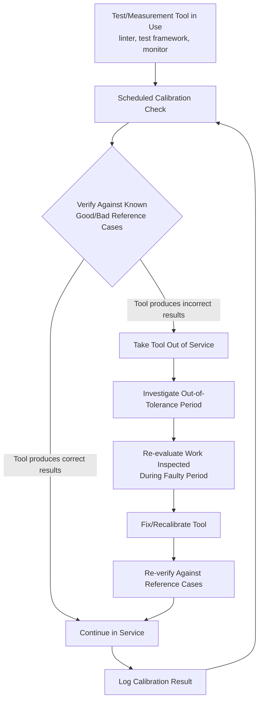

## Calibration and Maintenance of Test Equipment

### Definition and Classification

Calibration and Maintenance of Test Equipment is an Appraisal Cost sub-category covering the verification and upkeep of the *instruments used to measure quality itself* — the tools, gauges, sensors, and (by software analogy) testing/monitoring infrastructure that other Appraisal activities depend on. It is a distinctive, second-order category within Appraisal: rather than inspecting a product, it inspects the *inspector*.

Within the 1-10-100 Rule, this category remains Appraisal-tier ($10), but it carries outsized leverage risk: if the measurement tool itself is inaccurate, every Appraisal activity relying on it produces unreliable results, which can silently degrade the entire Appraisal layer without any individual inspection appearing to fail. A mis-calibrated instrument can cause both **false accepts** (defects pass through undetected, later surfacing as Internal or External Failure) and **false rejects** (good units are wrongly flagged, wasting Appraisal and Internal Failure effort on non-existent defects).

$$\text{Prevention Cost} : \text{Appraisal Cost} : \text{Failure Cost} \approx 1 : 10 : 100$$

### Purpose and Scope

**Key Points**

- This category answers: "Can we trust the tools we use to judge quality?"
- It is meta-Appraisal — quality assurance applied to the quality-assurance apparatus itself.
- Its failure mode is uniquely dangerous because it is *silent*: a miscalibrated gauge doesn't announce its own inaccuracy, it simply produces wrong Appraisal outcomes that look identical to correct ones until a downstream failure or an external audit exposes the discrepancy.

### Classical (Manufacturing) Scope

| Activity | Description |
| --- | --- |
| Instrument Calibration | Periodic comparison of a measurement device's output against a traceable reference standard, with adjustment if drift is found |
| Calibration Certification | Formal documentation (often traceable to national/international standards, e.g., NIST in the US) proving an instrument's accuracy at a point in time |
| Preventive Maintenance of Test Equipment | Scheduled servicing of inspection tools themselves (distinct from Preventive Maintenance of production equipment) |
| Gauge Repeatability and Reproducibility (Gauge R&R) | Statistical study measuring how much variation in inspection results comes from the measurement system itself versus the actual product |
| Calibration Interval Management | Determining and tracking how frequently each instrument must be recalibrated, based on drift history and criticality |
| Out-of-Tolerance Investigation | When an instrument is found out of calibration, retroactively assessing whether products previously inspected with it need re-evaluation |

### Gauge R&R: Why Measurement System Quality Matters

Gauge Repeatability and Reproducibility (Gauge R&R) is the standard statistical method for quantifying how much of the observed variation in inspection results is attributable to the *measurement system* itself, rather than genuine variation in the product being measured.

$$\sigma^2_{\text{total}} = \sigma^2_{\text{part}} + \sigma^2_{\text{measurement}}$$

where $\sigma^2_{\text{measurement}} = \sigma^2_{\text{repeatability}} + \sigma^2_{\text{reproducibility}}$

- **Repeatability** — Variation when the same operator measures the same part multiple times with the same instrument.
- **Reproducibility** — Variation when different operators measure the same part with the same instrument.

A Gauge R&R study producing a high measurement-variation percentage relative to total variation indicates the inspection system itself is a significant source of noise — meaning Appraisal results from that system cannot be trusted to reliably distinguish good parts from defective ones, regardless of how rigorously the inspection process is otherwise followed.

### Software Engineering Translation

`[Inference]` Software has no physical gauges, but the underlying principle — that the tools used to detect defects must themselves be verified and maintained — maps to several concrete, less commonly examined practices:

| Manufacturing Concept | Software/DMS Equivalent |
| --- | --- |
| Instrument calibration | Verifying a static analysis tool, linter, or test framework produces correct results against known-good and known-bad reference cases |
| Calibration certification | Pinning tool versions and documenting which config/ruleset was validated, so results are traceable and reproducible |
| Gauge R&R | Flaky test detection — quantifying how much test "pass/fail" variation is due to the test itself (non-determinism, environment) rather than actual code correctness |
| Out-of-tolerance investigation | When a testing tool is found to have a false-negative bug (e.g., a linter rule silently disabled, a broken test assertion), auditing what shipped while it was broken |
| Preventive maintenance of test equipment | Keeping CI runners, test databases, and monitoring/alerting infrastructure themselves updated and healthy |
| Calibration interval | Periodic review of whether test coverage tools, security scanners, and monitoring thresholds are still accurately reflecting current risk |

Concrete examples for a TypeScript/Fastify/tRPC/Drizzle/PostgreSQL monorepo:

- **Test Framework Integrity** — Verifying that the test runner itself correctly reports failures — e.g., confirming a test suite actually fails when it should (a deliberately broken assertion should turn the suite red) rather than silently passing due to a misconfigured async/await or a swallowed exception.
- **Linter/Static Analysis Rule Verification** — Periodically confirming that ESLint/TypeScript strict-mode rules are still active and correctly configured, since a silently disabled rule (e.g., an accidentally broadened `.eslintrc` override) degrades in-process Appraisal without any visible failure.
- **Flaky Test Detection and Quarantine** — Treating test non-determinism as a "measurement system" reliability problem: a test that intermittently fails/passes on identical code has low repeatability, and its results should be distrusted (or the test fixed/quarantined) rather than treated as reliable Appraisal signal.
- **Monitoring/Alerting Threshold Calibration** — Verifying that production monitoring thresholds (e.g., error-rate alert triggers) are still accurate relative to current traffic patterns; a threshold set when the DMS had low traffic may produce false negatives (missed real incidents) or false positives (alert fatigue) as usage grows.
- **CI Environment Parity** — Ensuring the CI/staging test environment's configuration (Node version, PostgreSQL version, environment variables) matches what tests are meant to validate against, since environment drift in the "instrument" (the CI runner) can produce misleading pass/fail signals relative to production behavior.
- **Security Scanner Currency** — Confirming that static/dynamic security scanning tools (e.g., `npm audit`, SAST tooling) are running against current vulnerability databases, since a stale scanner "instrument" can produce false-negative Appraisal results indistinguishable from a genuinely clean scan.

### Consequences of Uncalibrated/Unmaintained Test Equipment

| Failure Mode | Manufacturing Example | Software Example |
| --- | --- | --- |
| False Accept | Worn gauge reads within-tolerance for an out-of-spec part | Flaky test passes despite an actual regression (non-deterministic false-negative) |
| False Reject | Drifted instrument rejects good parts as defective | Overly strict/broken lint rule blocks valid code, wasting developer time |
| Silent Degradation | Gauge accuracy drifts gradually, unnoticed until audit | A monitoring dashboard's metric collection silently breaks, producing a flat "all green" line that isn't actually measuring anything |
| Retroactive Exposure | Discovering a mis-calibrated gauge means months of "passed" inspections must be re-evaluated | Discovering a broken test assertion means every release since the break must be audited for the defect it should have caught |

### Cost Modeling Example

Consider a scenario where a DMS test suite includes an assertion that was accidentally written to always pass (e.g., `expect(result).toBeDefined()` instead of checking the actual value), silently making a critical validation test a no-op.

- **Caught quickly via test-suite self-audit (e.g., periodic mutation testing or test-quality review)**: Cost ≈ 2–3 engineer-hours to identify the broken assertion, fix it, and re-run the corrected test against the current codebase to confirm no regression slipped through in the interim. This is the Appraisal-of-Appraisal cost — relatively cheap because it's caught proactively.
- **Undetected for months, discovered only when a related defect reaches production**: Cost includes the External Failure cost of the original defect *plus* the retroactive investigation of how many other changes shipped while that test provided false confidence — potentially requiring a broader audit of everything merged since the assertion was introduced. `[Unverified]` The scope of a retroactive audit in this scenario depends heavily on version control history and how isolated the affected code path is, which cannot be estimated generically.

This illustrates why this category, though a relatively small direct cost, carries asymmetric risk: an unmaintained "instrument" doesn't just fail to add value — it actively provides false assurance, which is often worse than having no Appraisal coverage at all, since false assurance suppresses the search for alternative detection.

### Process Flow: Test Equipment Calibration Cycle

### Gauge R&R Variance Decomposition (svg_diagram)

<svg xmlns="http://www.w3.org/2000/svg" viewBox="0 0 900 280">
<text x="450" y="24" text-anchor="middle" font-size="16" font-weight="bold" fill="#1a1a1a">Total Observed Variation Decomposition (svg_diagram)</text>
<rect x="330" y="50" width="240" height="50" rx="8" fill="#eadcf7" stroke="#7d3ac1" stroke-width="1.5" />
<text x="450" y="80" text-anchor="middle" font-size="12" font-weight="bold" fill="#1a1a1a">Total Observed Variation</text>
<rect x="120" y="150" width="220" height="70" rx="8" fill="#e6f4ea" stroke="#2e8b57" stroke-width="1.5" />
<text x="230" y="178" text-anchor="middle" font-size="12" fill="#1a1a1a">Part-to-Part Variation</text>
<text x="230" y="196" text-anchor="middle" font-size="11" fill="#555">(genuine product difference)</text>
<rect x="560" y="150" width="220" height="70" rx="8" fill="#fdecea" stroke="#c0392b" stroke-width="1.5" />
<text x="670" y="172" text-anchor="middle" font-size="12" fill="#1a1a1a">Measurement System Variation</text>
<text x="670" y="190" text-anchor="middle" font-size="11" fill="#555">Repeatability + Reproducibility</text>
<text x="670" y="207" text-anchor="middle" font-size="11" fill="#555">(the "gauge" itself)</text>
<path d="M400,100 L230,150" stroke="#555" stroke-width="1.5" marker-end="url(#arrow7)" />
<path d="M500,100 L670,150" stroke="#555" stroke-width="1.5" marker-end="url(#arrow7)" />

<text x="450" y="255" text-anchor="middle" font-size="11" fill="#555">High measurement-variation share → Appraisal results cannot be trusted,</text>

<text x="450" y="271" text-anchor="middle" font-size="11" fill="#555">regardless of inspection process rigor</text>

</svg>

### Common Pitfalls

- **Assuming automated tooling is inherently trustworthy**: Treating a linter, test suite, or monitoring dashboard as infallible simply because it's automated, without periodic verification that it still correctly distinguishes good from bad — a broken "instrument" is often more dangerous than a broken manual process because its output is trusted implicitly.
- **No reference/known-bad test cases**: Lacking a deliberate set of known-good and known-bad cases to periodically validate a testing tool against means drift or breakage in the tool itself can go undetected indefinitely.
- **Ignoring flaky tests instead of treating them as a measurement problem**: Re-running a flaky test until it passes, rather than investigating and fixing its non-determinism, is the software equivalent of ignoring a gauge with poor repeatability — it degrades trust in the entire Appraisal signal from that test.
- **No retroactive investigation when a tool is found broken**: Fixing a broken linter rule or test assertion without asking "what shipped while this was broken" skips the out-of-tolerance investigation step, leaving latent defects unaudited.
- **Version/config drift between environments**: Allowing the CI "instrument" (Node version, dependency lockfile, database version) to silently diverge from production configuration undermines the validity of every Appraisal result produced by that environment.
- **Treating calibration as a one-time setup task**: `[Inference]` Configuring a test framework or monitoring threshold once at project inception and never revisiting it, even as the system's scale, traffic patterns, or risk profile change, is analogous to skipping the periodic recalibration interval — the tool's accuracy relative to current conditions degrades even if its original configuration was correct.

**Related Topics**

- Definition and Scope of Appraisal Costs (parent category)
- Gauge Repeatability and Reproducibility (Gauge R&R) Studies
- Flaky Test Detection and Test Suite Reliability
- Statistical Process Control (related measurement-dependent Appraisal activity)
- CI/CD Environment Parity and Configuration Drift
- Mutation Testing (verifying test suite effectiveness)
- Defect Detection Efficiency (DDE) Metrics
- Internal Failure Costs from Undetected Measurement System Failures