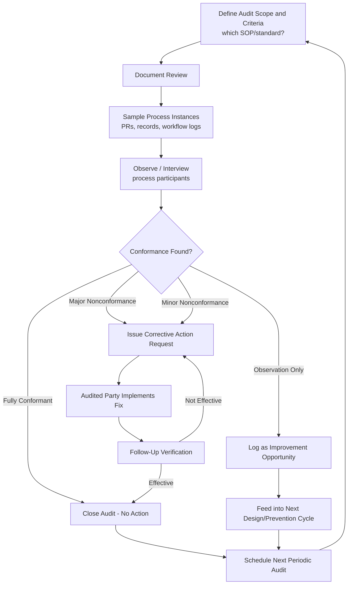

## Quality Audits and Assessments

### Definition and Classification

Quality Audits and Assessments are an Appraisal Cost sub-category covering the systematic, periodic evaluation of whether a process, system, or organization is actually operating in conformance with its own defined quality procedures and standards — as distinct from inspecting individual units of product output. Where Incoming/In-Process/Final Inspection evaluate *what was produced*, Quality Audits evaluate *whether the system producing it is being followed correctly and remains fit for purpose*.

Within the 1-10-100 Rule, Quality Audits remain Appraisal-tier ($10), but they are the broadest-scope Appraisal activity: rather than sampling individual outputs, they sample the *process itself*, making them a form of meta-level detection — closely related to, but distinct from, Calibration of Test Equipment (which audits the measurement tools) and Quality System Development (which audits/builds the Prevention infrastructure).

$$\text{Prevention Cost} : \text{Appraisal Cost} : \text{Failure Cost} \approx 1 : 10 : 100$$

### Purpose and Scope

**Key Points**

- Quality Audits answer: "Is our documented process actually being followed, and is that process still adequate?"
- They are inherently sampling-based and periodic (not continuous), distinguishing them from in-process inspection, which typically operates on every unit or a statistically-driven continuous sample.
- Audits can surface both **process non-conformance** (the SOP wasn't followed) and **process inadequacy** (the SOP was followed correctly, but the SOP itself no longer prevents the defects it was designed to prevent) — the latter feeds directly back into Prevention-tier Quality System Development.

### Types of Quality Audits

| Audit Type | Scope | Conducted By |
| --- | --- | --- |
| Internal (First-Party) Audit | Organization's own processes against its own documented QMS | Internal quality team or trained internal auditors |
| Supplier (Second-Party) Audit | A supplier's/vendor's processes, conducted by the purchasing organization | Purchasing organization's auditors |
| Certification (Third-Party) Audit | Organization's QMS against an external standard (e.g., ISO 9001) | Independent, accredited certification body |
| Process Audit | A specific process (e.g., document approval workflow) against its documented procedure | Internal or external, process-focused |
| Product Audit | A finished product/output, re-examined after normal inspection, as a check on the inspection system itself | Internal quality team, often independent of the original inspectors |
| Compliance Audit | Conformance to external regulatory, legal, or contractual requirements | Internal compliance function or external regulator |

### Audit Methodology: Standard Structure

`[Inference]` Most formal audit methodologies (ISO 19011 being the common reference standard for auditing management systems) follow a broadly consistent structure:

1. **Audit Planning** — Define scope, criteria (which standard/SOP the audit is measured against), and schedule.
2. **Document Review** — Verify that required documentation (SOPs, records, prior audit findings) exists and is current.
3. **On-Site/In-Process Observation** — Directly observe the process being performed, or review records of it having been performed, sampling a representative subset rather than reviewing every instance.
4. **Interviews** — Speaking with process participants to verify understanding matches documented procedure.
5. **Finding Classification** — Categorizing discovered issues by severity:
   - **Major Nonconformance** — A systemic failure to meet a requirement, or absence of a required process entirely.
   - **Minor Nonconformance** — An isolated deviation that doesn't indicate systemic failure.
   - **Observation/Opportunity for Improvement** — Not a nonconformance, but a noted area for potential enhancement.
6. **Corrective Action Request (CAR)** — Formal requirement for the audited party to address major/minor nonconformances within a defined timeframe.
7. **Follow-Up/Closure** — Verifying corrective actions were actually implemented and effective.

### Quality Audits vs. Other Appraisal Sub-Categories

| Dimension | Incoming/In-Process/Final Inspection | Calibration of Test Equipment | Quality Audits |
| --- | --- | --- | --- |
| Object of Evaluation | A specific unit of product/work | A measurement/testing tool | The process or system itself |
| Frequency | Continuous or per-unit | Periodic, per-instrument | Periodic, scheduled (e.g., quarterly, annually) |
| Sampling Basis | Statistical sampling of units | Reference standard comparison | Sampling of process instances/records |
| Primary Output | Accept/reject decision on a unit | Pass/fail on instrument accuracy | Conformance findings + corrective actions |
| Feeds Back Into | Immediate rework/rejection | Instrument recalibration or replacement | Process redesign (Prevention-tier) or retraining |

### Software Engineering Translation

`[Inference]` For a TypeScript/Fastify/tRPC/Drizzle/PostgreSQL monorepo, Quality Audits and Assessments concretely include:

- **Process Conformance Audit** — Periodically sampling a set of recently-merged PRs to verify the documented code review checklist and branch-protection requirements were actually followed in practice, not just nominally satisfied (e.g., checking whether "approved" reviews reflect substantive review or rubber-stamping).
- **Code Quality/Architecture Audit** — A periodic, broader review of codebase health (coupling, technical debt accumulation, adherence to established architectural patterns) distinct from any single PR's in-process review — sampling the system as a whole rather than individual changes.
- **Security/Compliance Audit** — For a government-facing DMS, a periodic formal audit of access controls, audit-trail completeness, and data-handling practices against relevant public-sector data-protection requirements, distinct from any single Final Inspection security scan.
- **Test Suite Health Audit** — Reviewing overall test coverage trends, flaky test rates, and whether test cases still map to current, actual failure modes (as opposed to historical ones) — auditing the Appraisal system's continued adequacy, closely related to but broader than instrument calibration.
- **Dependency/Supply Chain Audit** — A periodic, holistic review of the full dependency tree (not just individual incoming-inspection checks at adoption time) for license compliance, abandonment risk, and aggregate vulnerability exposure.
- **Incident Postmortem Pattern Audit** — Periodically reviewing a set of past incident postmortems collectively (not just individually) to identify whether the same root-cause category keeps recurring — indicating the corrective actions from individual postmortems aren't systemically closing the gap.
- **Documentation Currency Audit** — Verifying that SOPs, runbooks, and architecture documentation still accurately reflect the current system, since a Quality System's documentation drifting from reality silently undermines every process that depends on it.

### Cost Modeling Example

Consider a DMS team that has a documented code review policy requiring two approvals for changes touching document-approval workflow logic.

- **Quality Audit in place (quarterly sampling of merged PRs)**: Cost ≈ 4–6 engineer-hours per quarter to sample and review whether the two-approval requirement was substantively followed. Suppose the audit finds that 15% of relevant PRs were merged with only cursory second approvals ("LGTM" with no evidence of actual review) — a **major nonconformance** requiring a corrective action (e.g., adding an automated checklist requirement, retraining reviewers).
- **No audit in place**: The gap between documented process and actual practice persists undetected. Eventually, a substantive defect (e.g., an unauthorized workflow state transition) ships because a "second approval" was nominal rather than real. Cost includes the Internal or External Failure cost of that defect, *plus* the fact that the organization has no visibility into how many other similar gaps exist across the rest of the codebase, since the underlying process weakness was never surfaced.
- **Audit finding leads to Prevention-tier fix**: The corrective action (e.g., a CI check requiring reviewer comments beyond a single-word approval, or reviewer training) is itself a Quality System Development (Prevention) cost, illustrating how Quality Audit findings route back into the Prevention tier rather than only producing a one-time fix. `[Inference]` This routing is the mechanism by which Appraisal-tier audit spend generates compounding value — the corrective action reduces the *rate* of future nonconformance, rather than only catching a single instance.

### Process Flow: Quality Audit Cycle

### Audit Finding Severity Classification (svg_diagram)

<svg xmlns="http://www.w3.org/2000/svg" viewBox="0 0 900 260">
<text x="450" y="24" text-anchor="middle" font-size="16" font-weight="bold" fill="#1a1a1a">Quality Audit Finding Classification (svg_diagram)</text>
<rect x="30" y="70" width="250" height="100" rx="8" fill="#fdecea" stroke="#c0392b" stroke-width="1.5" />
<text x="155" y="100" text-anchor="middle" font-size="13" font-weight="bold" fill="#1a1a1a">Major Nonconformance</text>
<text x="155" y="120" text-anchor="middle" font-size="11" fill="#555">Systemic failure or missing</text>
<text x="155" y="136" text-anchor="middle" font-size="11" fill="#555">required process entirely</text>
<text x="155" y="155" text-anchor="middle" font-size="11" fill="#c0392b">→ Mandatory CAR</text>
<rect x="325" y="70" width="250" height="100" rx="8" fill="#fff4e5" stroke="#d68910" stroke-width="1.5" />
<text x="450" y="100" text-anchor="middle" font-size="13" font-weight="bold" fill="#1a1a1a">Minor Nonconformance</text>
<text x="450" y="120" text-anchor="middle" font-size="11" fill="#555">Isolated deviation, not</text>
<text x="450" y="136" text-anchor="middle" font-size="11" fill="#555">indicative of systemic failure</text>
<text x="450" y="155" text-anchor="middle" font-size="11" fill="#d68910">→ CAR, lower urgency</text>
<rect x="620" y="70" width="250" height="100" rx="8" fill="#e6f4ea" stroke="#2e8b57" stroke-width="1.5" />
<text x="745" y="100" text-anchor="middle" font-size="13" font-weight="bold" fill="#1a1a1a">Observation</text>
<text x="745" y="120" text-anchor="middle" font-size="11" fill="#555">Not a nonconformance —</text>
<text x="745" y="136" text-anchor="middle" font-size="11" fill="#555">noted improvement opportunity</text>
<text x="745" y="155" text-anchor="middle" font-size="11" fill="#2e8b57">→ Logged, no mandatory action</text>

<text x="450" y="210" text-anchor="middle" font-size="11" fill="#555">Severity determines whether finding routes to immediate corrective action</text>

<text x="450" y="226" text-anchor="middle" font-size="11" fill="#555">or into the backlog of future Prevention-tier improvements</text>

</svg>

### Common Pitfalls

- **Auditing documentation instead of actual practice**: Verifying that SOPs exist and read well, without directly sampling whether the documented process is actually followed in real instances, produces a false sense of conformance.
- **No independence between auditor and audited process**: An engineer auditing their own team's adherence to a process they authored is prone to confirmation bias; internal audits are more reliable when conducted with some organizational separation from the process owner.
- **Findings without corrective action follow-through**: Issuing a Corrective Action Request but never verifying it was actually implemented and effective (skipping step 7) means audits generate paperwork without generating actual risk reduction.
- **Audit scope frozen at original design**: Auditing against an outdated version of the SOP or standard, rather than confirming the criteria itself is still current, can mean an audit certifies conformance to a process that is itself no longer adequate.
- **Treating audits as punitive rather than systemic**: `[Inference]` Framing audit findings primarily as individual accountability issues rather than signals about process or tooling gaps tends to produce defensive behavior and underreporting rather than genuine process improvement — findings are generally more actionable when routed toward system-level corrective action (better checklists, better tooling) rather than only individual correction.
- **No aggregation across audits over time**: Reviewing each audit's findings in isolation without tracking recurring finding categories across multiple audit cycles misses systemic patterns that only become visible in aggregate.

**Related Topics**

- Definition and Scope of Appraisal Costs (parent category)
- Calibration and Maintenance of Test Equipment (related meta-level Appraisal)
- Quality System Development Costs (where audit corrective actions often land)
- ISO 19011 Auditing Guidelines for Management Systems
- Corrective and Preventive Action (CAPA) Processes
- Code Review Process Conformance Auditing
- Security and Compliance Auditing for Regulated Systems
- Root Cause Analysis and Postmortem Pattern Review