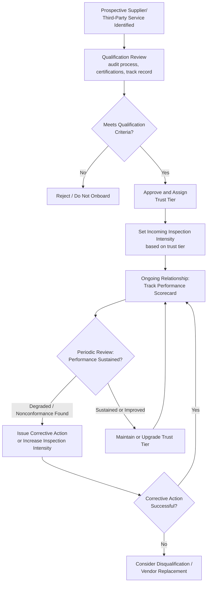

## Supplier Verification and Vendor Surveys

### Definition and Classification

Supplier Verification and Vendor Surveys are an Appraisal Cost sub-category covering the systematic evaluation of external suppliers' or vendors' capability to consistently deliver conforming materials, components, or services — conducted *before* onboarding a supplier (qualification) and *periodically thereafter* (ongoing surveillance) to confirm that capability is being sustained over time. It is closely related to, but distinct from, Incoming/Receiving Inspection: where Incoming Inspection evaluates *individual shipments or deliverables* as they arrive, Supplier Verification evaluates the *supplier's overall quality system and track record*, functioning as a higher-leverage, less frequent Appraisal activity applied at the supplier-relationship level rather than the per-shipment level.

Within the 1-10-100 Rule, Supplier Verification remains Appraisal-tier ($10), but it offers a distinctive leverage advantage similar to Quality System Development: a rigorous supplier qualification process, done once (and revisited periodically), can reduce the *rate* at which defective incoming materials need to be caught at all — shifting some of the burden from per-shipment Incoming Inspection toward upfront and periodic supplier-level assurance.

$$\text{Prevention Cost} : \text{Appraisal Cost} : \text{Failure Cost} \approx 1 : 10 : 100$$

### Purpose and Scope

**Key Points**

- Supplier Verification answers: "Can we trust this supplier's *process* to consistently produce conforming output, not just this one shipment?"
- It operates at a different cadence and granularity than Incoming Inspection: qualification (before the relationship begins) and periodic surveillance (throughout the relationship), rather than continuous per-unit checking.
- A strong supplier verification program allows an organization to calibrate the *intensity* of ongoing Incoming Inspection (e.g., reduced sampling rates for high-trust, well-audited suppliers) — directly linking this category back to the acceptance-sampling risk calibration discussed under Incoming Inspection.

### Classical (Manufacturing/Procurement) Scope

| Activity | Description |
| --- | --- |
| Supplier Qualification Audit | On-site or documentation-based assessment of a prospective supplier's quality management system before approving them as a source |
| Supplier Performance Scorecards | Ongoing tracking of a supplier's defect rate, on-time delivery rate, and responsiveness to corrective action requests |
| Vendor Quality Surveys | Structured questionnaires assessing a supplier's process controls, certifications, and quality history |
| Second-Party Audits | Periodic on-site audits conducted by the purchasing organization against the supplier's own facility/process |
| Supplier Certification Programs | Tiered supplier status (e.g., "certified," "preferred," "probationary") based on sustained performance, used to calibrate inspection rigor |
| Corrective Action Tracking (Supplier-Facing) | Formal process for requiring and verifying supplier fixes when nonconformances are traced back to their output |

### Supplier Verification vs. Incoming Inspection

| Dimension | Incoming Inspection | Supplier Verification |
| --- | --- | --- |
| Unit of Evaluation | Individual shipment/lot | Supplier's overall process and track record |
| Frequency | Per shipment/batch | At onboarding + periodic (e.g., annual) |
| Basis for Decision | Sample inspection results of this lot | Historical performance, audit findings, certifications |
| Primary Lever | Accept/reject this specific lot | Approve/disqualify/tier the supplier relationship |
| Feedback Effect | Localized to the lot in question | Adjusts required inspection intensity for *all future* lots from this supplier |

This relationship is captured in a simple governing principle: **the more rigorous and well-verified a supplier's own process, the less inspection intensity is required per incoming shipment** — a direct, quantifiable trade-off between Supplier Verification investment and ongoing Incoming Inspection cost.

### Software Engineering Translation

`[Inference]` Software organizations rarely use the term "supplier" internally, but the underlying pattern — evaluating and periodically re-evaluating the trustworthiness of an external dependency source — maps to several concrete practices, distinct from the per-adoption dependency vetting covered under Incoming Inspection:

| Manufacturing Concept | Software/DMS Equivalent |
| --- | --- |
| Supplier qualification audit | Initial due-diligence review of a critical third-party service (e.g., a payment gateway, identity-verification API, or cloud provider) before integrating it into the DMS architecture |
| Vendor scorecard | Ongoing tracking of a critical dependency's release cadence, CVE frequency, breaking-change history, and maintainer responsiveness over time |
| Supplier certification tiers | Distinguishing between dependencies pinned to strict version ranges with manual review (lower trust tier) versus those allowed automated minor/patch updates (higher trust tier) |
| Second-party audit | Reviewing a critical vendor's own security posture (e.g., SOC 2 report, penetration test summary) for a cloud/SaaS provider the DMS depends on |
| Corrective action tracking (supplier-facing) | Formally tracking and following up on whether a reported upstream bug/CVE in a dependency was actually patched by the maintainer within an acceptable window |

Concrete examples for a TypeScript/Fastify/tRPC/Drizzle/PostgreSQL monorepo serving a government LGU context:

- **Critical Vendor Qualification** — Before integrating an external identity-verification or payment-processing service into the DMS, conducting a structured review of that vendor's security certifications, uptime history, and data-handling practices — analogous to a supplier qualification audit, since a government system has heightened accountability for third-party data handling.
- **Cloud/Infrastructure Provider Assessment** — Periodically reviewing the hosting/infrastructure provider's compliance posture (relevant for public-sector data residency or availability requirements) rather than assuming initial due diligence remains valid indefinitely.
- **Dependency Maintainer Health Tracking** — Monitoring whether core dependencies (Fastify, tRPC, Drizzle ORM) remain actively maintained, have responsive maintainers for security disclosures, and have a track record of well-communicated breaking changes — effectively a "supplier scorecard" for the open-source ecosystem the DMS is built on.
- **Tiered Dependency Trust Policy** — Establishing an internal policy where well-established, actively-maintained core dependencies are allowed faster automated update adoption, while newer or less-established packages require manual review per update — directly mirroring the supplier-tier-to-inspection-intensity relationship.
- **Vendor Incident Response Verification** — When a critical third-party dependency or service experiences a security incident, tracking whether their disclosed remediation and communication met acceptable standards, feeding into future trust-tier decisions.

### Cost Modeling Example

Consider a DMS integrating a third-party document-scanning/OCR service to process physical document submissions.

- **With Supplier Verification (qualification review before integration + periodic reassessment)**: Cost ≈ 8–12 engineer/analyst-hours upfront to review the OCR vendor's accuracy claims, data-handling practices, and uptime SLA, plus ~2–4 hours annually to reassess. Based on this review, the team sets a lighter per-transaction validation approach (spot-checking output accuracy on a sample) rather than manually verifying every OCR result.
- **Without Supplier Verification (integrate first, discover issues reactively)**: The OCR service's actual accuracy or reliability under real document variety (handwriting, poor scan quality, non-standard formats common in citizen submissions) turns out far worse than assumed, discovered only after processing volume ramps up. Cost includes emergency implementation of a fallback/manual review process, potential rework of documents processed with inaccurate OCR output, and citizen-facing delays. `[Unverified]` The specific accuracy shortfall and resulting rework cost would depend on the actual vendor and document characteristics, which is not estimable generically.
- **Ongoing trade-off**: A well-verified, high-trust vendor relationship allows the DMS team to reduce per-transaction Appraisal cost (spot-checking rather than exhaustive review) — directly illustrating how Supplier Verification investment reduces downstream Incoming Inspection burden.

### Process Flow: Supplier Qualification and Ongoing Surveillance

### Supplier Trust Tier vs. Inspection Intensity (svg_diagram)

<svg xmlns="http://www.w3.org/2000/svg" viewBox="0 0 900 300">
<text x="450" y="24" text-anchor="middle" font-size="16" font-weight="bold" fill="#1a1a1a">Supplier Trust Tier Governs Incoming Inspection Intensity (svg_diagram)</text>
<line x1="80" y1="250" x2="820" y2="250" stroke="#333" stroke-width="1.5" />
<line x1="80" y1="60" x2="80" y2="250" stroke="#333" stroke-width="1.5" />
<text x="450" y="285" text-anchor="middle" font-size="12" fill="#555">Supplier Verification / Trust Level</text>
<text x="30" y="150" text-anchor="middle" font-size="12" fill="#555" transform="rotate(-90 30 150)">Required Inspection Intensity</text>

<polyline points="100,80 250,110 400,150 550,190 700,220" fill="none" stroke="`#c0392b`" stroke-width="2.5" />

<rect x="100" y="70" width="140" height="35" rx="6" fill="#fdecea" stroke="#c0392b" />
<text x="170" y="93" text-anchor="middle" font-size="11" fill="#1a1a1a">Unverified / New</text>
<rect x="330" y="140" width="140" height="35" rx="6" fill="#fff4e5" stroke="#d68910" />
<text x="400" y="163" text-anchor="middle" font-size="11" fill="#1a1a1a">Qualified</text>
<rect x="580" y="200" width="140" height="35" rx="6" fill="#e6f4ea" stroke="#2e8b57" />
<text x="650" y="223" text-anchor="middle" font-size="11" fill="#1a1a1a">Certified / Long-Track-Record</text>

<text x="170" y="60" text-anchor="middle" font-size="10" fill="`#c0392b`">100% incoming inspection</text>

<text x="650" y="290" text-anchor="middle" font-size="10" fill="`#2e8b57`">Minimal sampling / spot-check only</text>

</svg>

### Common Pitfalls

- **Treating initial qualification as permanent**: Approving a supplier or third-party service once and never conducting periodic reassessment allows undetected drift in their quality or security posture over time.
- **No linkage between trust tier and actual inspection policy**: Maintaining a nominal "trusted vendor" designation without concretely adjusting inspection/validation intensity based on it means the leverage benefit of Supplier Verification is never realized.
- **Scorecard metrics that don't reflect actual risk**: Tracking superficial vendor metrics (e.g., delivery speed) while ignoring the metrics most relevant to actual defect risk (e.g., accuracy rate, security disclosure responsiveness) produces a scorecard that looks rigorous but doesn't predict real failure risk.
- **No corrective action escalation path**: Identifying supplier nonconformance through surveillance but lacking a defined process for demanding correction (or disqualifying the supplier if correction fails) leaves known risk unaddressed indefinitely.
- **Applying uniform qualification rigor regardless of criticality**: `[Inference]` Subjecting a low-risk, easily-replaceable dependency to the same qualification overhead as a critical, hard-to-replace vendor (e.g., a core identity-verification provider for a government system) misallocates Appraisal effort relative to actual risk exposure.
- **Ignoring the software-ecosystem equivalent of supplier risk**: Assuming open-source dependencies carry no "supplier" risk simply because there's no formal vendor relationship, when maintainer abandonment, security responsiveness, and breaking-change discipline are functionally equivalent risk factors requiring analogous ongoing surveillance.

**Related Topics**

- Definition and Scope of Appraisal Costs (parent category)
- Incoming and Receiving Inspection (per-shipment counterpart)
- Quality Audits and Assessments (second-party/supplier audit overlap)
- Acceptance Sampling and AQL-Based Inspection Calibration
- Software Composition Analysis and Dependency Risk Management
- Vendor Security Assessment (SOC 2, Penetration Test Review)
- Corrective and Preventive Action (CAPA) Processes
- External Failure Costs from Undetected Supplier Nonconformance