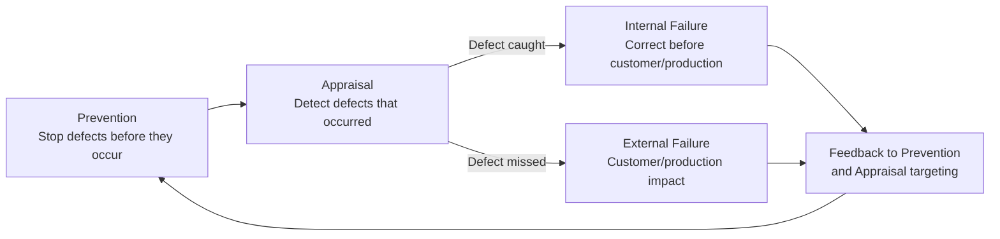
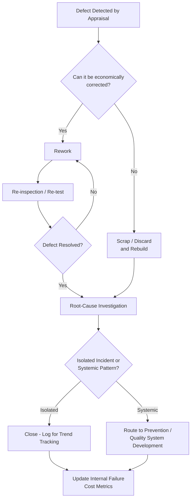

## Definition and Scope of Internal Failure Costs

### Definition and Classification

Internal Failure Costs are the third of the four canonical Cost of Quality (CoQ) categories, following Prevention and Appraisal. They represent the cost incurred when a defect is discovered *after* it has been created but *before* the product, deliverable, or system reaches the customer or external/production environment. Internal Failure Costs are the direct downstream consequence of Appraisal succeeding at detection but Prevention having failed to stop defect creation in the first place — the defect exists, Appraisal caught it, and now it must be dealt with.

Formally: Internal Failure Cost is the expenditure associated with correcting defects, nonconformances, or deficiencies discovered before delivery or release, including rework, scrap, re-inspection, downtime, and root-cause investigation contained entirely within the organization's own boundary.

Within the 1-10-100 Rule, Internal Failure sits between Appraisal and External Failure, though it is frequently discussed as sharing the same order of magnitude as Appraisal cost in the simplified ratio, with External Failure representing the sharp escalation:

$$\text{Prevention Cost} : \text{Appraisal Cost} \approx \text{Internal Failure Cost} : \text{External Failure Cost} \approx 1 : 10 : 100$$

`[Inference]` The exact relationship between Appraisal and Internal Failure cost varies by source and industry convention — some CoQ models treat them as roughly comparable in magnitude at the "$10" tier, while others place Internal Failure as a distinct, somewhat higher tier between Appraisal and External Failure; the precise multiplier is illustrative rather than a fixed empirical law and should be validated against an organization's own data.

### Position in the Quality Cost Lifecycle

Internal Failure is the *consequence* of a successful Appraisal outcome applied to an unsuccessful Prevention outcome. It represents cost that is real and often substantial, but contained — the organization retains control over remediation, timeline, and communication, unlike External Failure where the defect's consequences are at least partially outside the organization's direct control.

### Purpose and Scope

**Key Points**

- Internal Failure Cost answers: "Now that we found this defect, what does it cost us to fix it before anyone outside the organization is affected?"
- Unlike Prevention and Appraisal, Internal Failure Cost is inherently *reactive* — it cannot be planned as precisely in advance, since its magnitude depends on how many defects Prevention failed to stop and Appraisal succeeded in catching.
- A rising Internal Failure Cost trend, even with stable or falling External Failure Cost, is itself a diagnostic signal: it indicates Appraisal is working (catching more) but Prevention is not improving (the underlying defect rate isn't dropping) — the cost is simply being caught earlier rather than eliminated at the source.

### Standard Sub-Categories of Internal Failure Cost

Traditional CoQ literature (Juran, Crosby, ASQ) decomposes Internal Failure Costs into several recognized sub-categories:

| Sub-Category | Description | Example |
| --- | --- | --- |
| Scrap | Cost of materials/work that cannot be economically repaired and must be discarded entirely | A manufactured part with an unfixable defect; a prototype feature branch that must be abandoned and rebuilt from scratch |
| Rework | Cost of correcting a defective unit so it meets specification | Reworking a physical assembly; fixing and re-testing a code defect found in review |
| Re-inspection/Re-testing | Cost of re-verifying a unit after rework, to confirm the correction actually resolved the defect | Re-running a test suite after a bug fix |
| Downtime/Failure Analysis | Cost of production line stoppage or investigation time spent diagnosing why a defect occurred | Engineering time spent root-causing a failed CI pipeline or a broken staging environment |
| Materials Review / Disposition | Cost of formally deciding what to do with nonconforming material (scrap, rework, use-as-is with waiver) | Deciding whether a schema migration with a minor issue can be patched forward or must be rolled back entirely |
| Price/Yield Losses | Cost from reduced output or lower-grade classification due to quality issues in the production process | `[Inference]` Less directly applicable to software; the closest analogue is reduced feature scope or degraded functionality shipped to meet a deadline after defects consumed the originally planned time budget |

### Internal Failure vs. Appraisal vs. External Failure

| Dimension | Appraisal | Internal Failure | External Failure |
| --- | --- | --- | --- |
| Activity Type | Detection (does not change the product) | Correction/remediation (changes the product) | Consequence management (damage already done externally) |
| Timing | Before/during production, pre-release | After detection, pre-release | After release/delivery |
| Control | Fully within organizational control | Fully within organizational control | Partially outside organizational control |
| Cost Driver | Inspection/testing effort | Rework, scrap, re-test, root-cause time | Warranty, returns, reputational damage, liability, incident response |
| Software Example | Running a test suite | Fixing a bug the test suite found, then re-testing | Production incident, customer-reported defect, data breach |

An important distinction from Appraisal: the *cost of finding* a defect (a code review session, a test run) is Appraisal Cost; the *cost of fixing* what was found (rewriting the code, re-running tests to confirm the fix, investigating why it happened) is Internal Failure Cost. These two categories are frequently incurred back-to-back and sometimes conflated in informal reporting, but they represent conceptually distinct activities within the CoQ model.

### Software Engineering Translation

For a TypeScript/Fastify/tRPC/Drizzle/PostgreSQL monorepo, Internal Failure Cost activities typically include:

- **Bug Fixing (Pre-Release)** — Engineer time spent correcting a defect discovered via code review, CI test failure, or staging validation, before that code reaches production.
- **Rework After Failed Review** — Revising a pull request in response to reviewer-identified issues, including the time to re-submit and undergo a second review pass.
- **Re-running Test Suites Post-Fix** — Compute and wait-time cost of re-executing CI pipelines after a fix, to confirm the defect is actually resolved and no new regression was introduced.
- **Rollback and Re-Migration** — If a Drizzle migration is found defective in staging, the cost of rolling back the migration, correcting it, and re-applying it against the shared environment.
- **Root-Cause Investigation (Pre-Release)** — Engineering time spent diagnosing *why* a defect occurred (not just fixing the symptom) when the defect is caught internally — e.g., investigating why a schema change broke an existing query, distinct from the fix itself.
- **Abandoned/Discarded Work (Scrap Equivalent)** — A feature branch or architectural approach built and then discarded entirely after a design flaw is discovered too late to salvage through rework — the software analogue of manufacturing scrap.
- **Environment Downtime** — Time a shared staging or development environment is unusable due to a defect (e.g., a broken migration blocking other developers), including the coordination cost of that disruption.
- **Delayed Release / Schedule Slip** — `[Inference]` Time spent addressing internally-caught defects that pushes back a planned release date represents an opportunity cost that is often tracked as Internal Failure cost in mature CoQ programs, though its accounting treatment varies by organization.

### Cost Modeling Example

Consider a defect discovered during code review: a tRPC procedure incorrectly handles a document status transition, allowing an "Archived" document to be re-submitted for approval.

- **Detection (Appraisal Cost)**: Reviewer time spent identifying the issue during PR review — approximately 30 minutes, already counted under Appraisal Cost (In-Process Inspection).
- **Correction (Internal Failure Cost)**: Author time to understand the issue, redesign the state-transition guard logic, and re-implement it — approximately 2 hours.
- **Re-verification (Internal Failure Cost, adjacent to Appraisal)**: Re-running the affected test suite and undergoing a second review pass to confirm the fix is correct and complete — approximately 1 hour combined.
- **Root-cause follow-up (Internal Failure Cost)**: If this defect pattern (missing state-transition validation) is found to be systemic rather than isolated, additional time spent auditing other state-transition logic in the codebase for the same class of issue — potentially several additional hours, which may also feed into a Quality Audit or Prevention-tier corrective action (e.g., a shared state-machine validation utility to prevent recurrence).

Total Internal Failure Cost for this single defect: roughly 3–4+ engineer-hours, substantially more than the Appraisal cost that found it (30 minutes), illustrating why the "10" in the simplified ratio is often understood to represent the *combined* Appraisal-plus-Internal-Failure cost relative to Prevention, even when the two are tracked as separate CoQ categories.

### Internal Failure Cost as a Diagnostic Signal

**Key Points**

- A high and stable Internal Failure Cost, paired with low External Failure Cost, generally indicates a *healthy Appraisal system* catching most defects before escape — but it does not by itself indicate a healthy overall quality system, since the underlying defect-creation rate (a Prevention-tier concern) may still be high.
- Organizations sometimes mistake low External Failure Cost as evidence of "good quality" without examining Internal Failure Cost, missing the fact that they may simply be paying a large, hidden rework tax to catch defects that better Prevention investment could have avoided creating in the first place.
- Tracking Internal Failure Cost by defect *category* (not just aggregate total) allows it to be routed back to specific Prevention or Quality System Development investments — e.g., if a large share of Internal Failure cost traces to schema-migration rework, that specific risk area (rather than generic "more testing") is where Prevention investment should concentrate.

### Internal Failure Cost Categories Breakdown (svg_diagram)

<svg xmlns="http://www.w3.org/2000/svg" viewBox="0 0 900 300">
<text x="450" y="24" text-anchor="middle" font-size="16" font-weight="bold" fill="#1a1a1a">Internal Failure Cost: From Detection to Resolution (svg_diagram)</text>
<rect x="30" y="70" width="180" height="70" rx="8" fill="#e8f0fe" stroke="#4a76d4" stroke-width="1.5" />
<text x="120" y="95" text-anchor="middle" font-size="12" fill="#1a1a1a">Appraisal Detects</text>
<text x="120" y="112" text-anchor="middle" font-size="11" fill="#555">(review, test, audit)</text>
<rect x="250" y="70" width="180" height="70" rx="8" fill="#fff4e5" stroke="#d68910" stroke-width="1.5" />
<text x="340" y="92" text-anchor="middle" font-size="12" fill="#1a1a1a">Disposition Decision</text>
<text x="340" y="109" text-anchor="middle" font-size="11" fill="#555">rework, scrap,</text>
<text x="340" y="124" text-anchor="middle" font-size="11" fill="#555">or accept-with-waiver</text>
<rect x="470" y="70" width="180" height="70" rx="8" fill="#fdecea" stroke="#c0392b" stroke-width="1.5" />
<text x="560" y="92" text-anchor="middle" font-size="12" fill="#1a1a1a">Rework / Scrap</text>
<text x="560" y="109" text-anchor="middle" font-size="11" fill="#555">correction or</text>
<text x="560" y="124" text-anchor="middle" font-size="11" fill="#555">discard effort</text>
<rect x="690" y="70" width="180" height="70" rx="8" fill="#e6f4ea" stroke="#2e8b57" stroke-width="1.5" />
<text x="780" y="95" text-anchor="middle" font-size="12" fill="#1a1a1a">Re-inspection</text>
<text x="780" y="112" text-anchor="middle" font-size="11" fill="#555">confirm fix</text>
<rect x="250" y="200" width="400" height="70" rx="8" fill="#eadcf7" stroke="#7d3ac1" stroke-width="1.5" />
<text x="450" y="225" text-anchor="middle" font-size="12" fill="#1a1a1a">Root-Cause Investigation</text>
<text x="450" y="242" text-anchor="middle" font-size="11" fill="#555">feeds back to Prevention / Quality System Development</text>
<text x="450" y="258" text-anchor="middle" font-size="11" fill="#555">and refines Appraisal targeting</text>
<path d="M210,105 H250" stroke="#555" stroke-width="1.5" marker-end="url(#arrow8)" />
<path d="M430,105 H470" stroke="#555" stroke-width="1.5" marker-end="url(#arrow8)" />
<path d="M650,105 H690" stroke="#555" stroke-width="1.5" marker-end="url(#arrow8)" />
<path d="M780,140 L450,200" stroke="#555" stroke-width="1.5" marker-end="url(#arrow8)" />
</svg>

### Process Flow: Defect Disposition Decision

### Common Pitfalls

- **Conflating Internal Failure Cost with Appraisal Cost**: Recording the entire cost of a "found and fixed" defect as a single undifferentiated line item obscures whether the organization is spending more on detection or on correction — a distinction that matters for deciding where to invest next.
- **Treating low External Failure as sufficient evidence of quality**: Ignoring high Internal Failure Cost because it "never reached the customer" misses the substantial hidden cost of a high defect-creation rate that Prevention should be reducing.
- **No root-cause tracking, only fix tracking**: Recording that a defect was fixed without investigating and categorizing *why* it occurred means the same class of defect can recur indefinitely, generating repeat Internal Failure cost without ever being routed to a Prevention-tier fix.
- **Underestimating re-verification cost**: Focusing cost estimates only on the rework/fix time while omitting the re-inspection/re-test time needed to confirm the fix actually worked, which often adds meaningfully to total Internal Failure Cost.
- **Scrap decisions made without economic analysis**: `[Inference]` Defaulting to rework even when a defect is severe enough that rebuilding from scratch (scrap) would be cheaper, or vice versa, without an explicit cost comparison, can inflate Internal Failure Cost unnecessarily in either direction.
- **No categorization by defect type**: Aggregating all Internal Failure Cost into a single total without breaking it down by defect category (schema issues, validation gaps, logic errors) prevents targeted Prevention investment and instead encourages generic, less effective "do more testing" responses.

**Related Topics**

- Definition and Scope of Appraisal Costs (upstream detection layer)
- Rework, Scrap, and Disposition Decision-Making
- Root Cause Analysis Methodologies (5 Whys, Fishbone/Ishikawa)
- External Failure Costs (consequence of undetected Internal Failure)
- Defect Categorization and Trend Analysis
- Quality System Development Costs (destination for systemic corrective action)
- Cost of Quality Measurement and Reporting Systems
- Rollback and Recovery Procedures in Deployment Pipelines