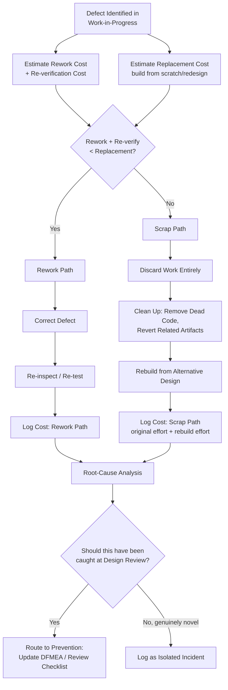

## Scrap and Material Waste

### Definition and Classification

Scrap and Material Waste is an Internal Failure Cost sub-category covering the cost of work, materials, or components that are defective beyond economical repair and must be discarded entirely, rather than corrected through rework. It represents the most severe disposition outcome within Internal Failure Cost: where Rework assumes a defect can be economically corrected, Scrap is the acknowledgment that the investment already made in a unit of work cannot be recovered, and the associated cost — materials, labor, time — is a complete loss.

Within the Internal Failure Cost tier, Scrap is generally the more expensive of the two primary disposition paths (Scrap vs. Rework), because it represents a total loss of invested effort rather than a partial, incremental correction cost.

$$\text{Prevention Cost} : \text{Appraisal Cost} \approx \text{Internal Failure Cost} : \text{External Failure Cost} \approx 1 : 10 : 100$$

`[Inference]` Within the Internal Failure tier itself, Scrap cost is typically higher per-incident than Rework cost for a comparable defect, since Scrap forfeits all labor and material value already invested, whereas Rework preserves and builds on a portion of that investment — though the actual ratio depends heavily on how much of the original work was salvageable at the point the defect was discovered.

### Purpose and Scope

**Key Points**

- Scrap and Material Waste answers: "When a defect cannot be economically fixed, what is the cost of the effort and materials we must now discard entirely?"
- It is distinguished from Rework by economics, not defect severity alone: a severe defect discovered early (with little invested effort) might still be reworked cheaply, while a minor defect discovered very late (after extensive dependent work) might make scrapping the more economical choice.
- Scrap cost should always be evaluated against the Rework alternative — the disposition decision itself (scrap vs. rework) is a deliberate economic comparison, not a default response to any given defect severity level.

### Classical (Manufacturing) Scope

| Activity | Description |
| --- | --- |
| Material Scrap | Raw material or components consumed in producing a defective unit that cannot be reclaimed |
| Scrapped Work-in-Progress | Partially completed assemblies discarded due to unrecoverable defects |
| Yield Loss | The gap between units started and units successfully completed to specification, expressed as wasted input |
| Obsolescence Scrap | Materials/components that become unusable due to a design change made necessary by a defect, even though the materials themselves weren't defective |
| Scrap Disposal Cost | The direct cost of disposing of or recycling discarded materials, distinct from the cost of the materials themselves |
| Setup/Changeover Waste | Cost of production time and materials consumed during process re-setup necessitated by a scrapped batch |

### Scrap vs. Rework: The Disposition Decision

The choice between scrapping and reworking a defective unit is fundamentally an economic comparison, formalized as:

$$\text{Rework if: } C_{\text{rework}} + C_{\text{re-inspection}} < C_{\text{scrap}} + C_{\text{replacement}}$$

Where:

- $C_{\text{rework}}$ — Cost to correct the existing defective unit
- $C_{\text{re-inspection}}$ — Cost to re-verify the corrected unit
- $C_{\text{scrap}}$ — Sunk cost of the discarded unit (already incurred, but relevant for comparing *total* cost of each path)
- $C_{\text{replacement}}$ — Cost to produce a new, correct unit from scratch

`[Inference]` In practice, $C_{\text{scrap}}$ is often treated as a sunk cost that shouldn't influence the forward-looking decision (a classic sunk-cost-fallacy consideration), meaning the real comparison is usually just $C_{\text{rework}} + C_{\text{re-inspection}}$ versus $C_{\text{replacement}}$ alone — whichever is cheaper going forward, regardless of what has already been spent.

### Software Engineering Translation

`[Inference]` Software has no physical raw material, so "scrap" maps to discarded engineering effort rather than discarded matter — but the core economic logic (is it cheaper to fix what exists, or abandon it and rebuild) transfers directly:

| Manufacturing Concept | Software/DMS Equivalent |
| --- | --- |
| Scrapped work-in-progress | A feature branch or prototype abandoned entirely after a design flaw makes incremental fixing impractical |
| Material scrap | Engineering hours already invested in an approach that is discarded, not reused |
| Yield loss | The proportion of sprint/cycle time lost to abandoned work relative to total time invested |
| Obsolescence scrap | Code rendered unusable by a necessary architectural pivot, even though that code wasn't itself defective |
| Scrap disposal cost | Cleanup cost: removing dead code, reverting related documentation, communicating the abandonment to stakeholders |
| Setup/changeover waste | Time spent re-planning or re-architecting after a scrapped approach, before productive rebuilding can resume |

Concrete examples for a TypeScript/Fastify/tRPC/Drizzle/PostgreSQL monorepo:

- **Abandoned Feature Branch** — A significant feature (e.g., a new document-routing workflow) built over several days, then discovered during review to be architecturally incompatible with the existing approval state machine in a way that can't be incrementally patched — the branch is discarded and rebuilt from a different design.
- **Discarded Schema Design** — A Drizzle schema designed and partially migrated, then found to violate a normalization requirement discovered only after downstream queries were written against it, where reworking in place would require more effort than redesigning from scratch.
- **Obsoleted Integration Code** — Code written to integrate with a third-party service that is later found (during Supplier Verification) to be unsuitable, requiring the integration layer to be discarded entirely rather than adapted.
- **Prototype/Spike Work** — Exploratory code deliberately built to validate a technical approach, where the "scrap" designation is expected and appropriate — the spike's purpose was learning, not shipping, so its disposal isn't a failure so much as an accepted cost of investigation. `[Inference]` This distinguishes *planned* scrap (an intentional spike) from *unplanned* scrap (a production-track feature abandoned due to a design defect) — only the latter is properly counted as Internal Failure Cost, since the former was never intended to ship.
- **Reverted Migrations with No Salvageable State** — A migration applied, found defective, and rolled back where the intermediate schema state cannot be incrementally corrected and must be redesigned from the pre-migration baseline.

### Cost Modeling Example

Consider a scenario where a developer spends 3 days building a new document-archival feature using a particular caching strategy, only to discover during integration testing that the caching approach is fundamentally incompatible with the DMS's audit-trail requirements (cached reads could serve stale data that would violate a compliance requirement for real-time accuracy).

- **Rework option evaluated**: Estimated cost to retrofit cache invalidation logic to satisfy audit-trail accuracy: ~2.5 days additional engineering time, with residual risk that some edge cases remain unaddressed.
- **Scrap option evaluated**: Estimated cost to discard the caching approach entirely and rebuild the archival feature using direct-query access (no caching layer): ~1.5 days, since much of the surrounding feature logic (API contracts, UI) can be preserved even though the caching implementation itself is discarded.
- **Decision**: Scrap is the more economical path (1.5 days versus 2.5 days), even though it means the original 3 days of caching-layer work is a complete loss. Total Internal Failure Cost for this incident: 3 days (scrapped effort) + 1.5 days (rebuild) = 4.5 days, against an original estimate of 3 days — a meaningful cost overrun directly attributable to the defect being caught only at integration testing rather than at the design-review stage (where the audit-trail incompatibility could have been identified as a Prevention-tier concern).
- **Root-cause note**: `[Unverified]` Whether this specific incompatibility should have been caught at Design Review depends on whether audit-trail-vs-caching tension was a documented architectural constraint at the time — this would need to be verified against the project's actual design documentation rather than assumed.

### Process Flow: Scrap vs. Rework Decision

### Scrap Cost Accumulation Curve (svg_diagram)

<svg xmlns="http://www.w3.org/2000/svg" viewBox="0 0 900 300">
<text x="450" y="24" text-anchor="middle" font-size="16" font-weight="bold" fill="#1a1a1a">Sunk Effort vs. Detection Point (svg_diagram)</text>
<line x1="80" y1="250" x2="820" y2="250" stroke="#333" stroke-width="1.5" />
<line x1="80" y1="50" x2="80" y2="250" stroke="#333" stroke-width="1.5" />
<text x="450" y="285" text-anchor="middle" font-size="12" fill="#555">Time / Effort Invested Before Defect Found</text>
<text x="30" y="150" text-anchor="middle" font-size="12" fill="#555" transform="rotate(-90 30 150)">Potential Scrap Cost</text>

<polyline points="100,230 250,190 400,140 550,90 700,55" fill="none" stroke="`#c0392b`" stroke-width="2.5" />

<circle cx="250" cy="190" r="5" fill="#2e8b57" />
<text x="250" y="215" text-anchor="middle" font-size="10" fill="#2e8b57">Design Review</text>
<text x="250" y="228" text-anchor="middle" font-size="10" fill="#2e8b57">catch: low scrap risk</text>
<circle cx="550" cy="90" r="5" fill="#c0392b" />
<text x="550" y="70" text-anchor="middle" font-size="10" fill="#c0392b">Integration test</text>
<text x="550" y="83" text-anchor="middle" font-size="10" fill="#c0392b">catch: high scrap risk</text>

<text x="450" y="50" text-anchor="middle" font-size="11" fill="#555">Later detection → more sunk effort → greater incentive toward scrap over rework</text>

</svg>

### Common Pitfalls

- **Sunk-cost bias delaying the scrap decision**: Continuing to invest in rework because of effort already spent, even when an objective cost comparison favors scrapping and rebuilding — a well-documented cognitive bias that inflates total Internal Failure Cost by delaying the more economical path.
- **No explicit cost comparison before disposition**: Defaulting to rework as a reflexive response to any defect, without calculating whether replacement would actually be cheaper, especially for defects discovered late after substantial dependent work has accumulated.
- **Conflating planned spikes with unplanned scrap**: Counting intentional, exploratory prototype work (where disposal was always the expected outcome) as Internal Failure Cost alongside genuinely unplanned scrap, which distorts CoQ metrics and obscures the true defect-driven waste rate.
- **Not tracking scrap cost by root cause**: Recording that work was discarded without categorizing *why* (design flaw missed at review, requirement misunderstanding, incompatible technical approach) prevents the pattern from informing future Prevention-tier investment.
- **Ignoring cleanup/disposal cost**: Focusing only on the discarded work's original cost while omitting the cost of cleanly removing it (dead code, reverted documentation, stakeholder communication) understates total Scrap cost.
- **Late detection normalized as routine**: `[Inference]` If scrap incidents cluster around late-stage detection points (integration testing, staging validation) rather than early ones (design review, code review), this pattern itself is a signal that earlier Appraisal or Prevention layers are systematically under-catching the relevant defect class — a trend worth surfacing through Quality Audits rather than treating each incident as isolated.

**Related Topics**

- Definition and Scope of Internal Failure Costs (parent category)
- Rework and Correction Costs (the alternative disposition path)
- Root Cause Analysis Methodologies (5 Whys, Fishbone/Ishikawa)
- Design Reviews and New Product Quality Planning (earlier catch point, lower scrap risk)
- Sunk Cost Fallacy in Engineering Decision-Making
- Spike/Prototype Practices and Planned Disposal
- Architecture Decision Records (documenting constraints to prevent recurrence)
- Cost of Quality Measurement and Trend Analysis by Defect Category