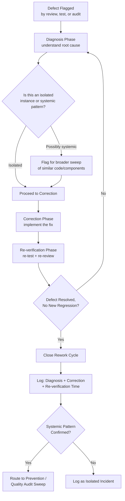

## Rework and Repair

### Definition and Classification

Rework and Repair is an Internal Failure Cost sub-category covering the cost of correcting a defective unit, component, or deliverable so that it meets specification — as opposed to Scrap, where the unit is discarded entirely. Rework represents the more common and generally less expensive of the two primary Internal Failure disposition paths, since it preserves and builds upon the investment already made rather than forfeiting it completely.

$$\text{Prevention Cost} : \text{Appraisal Cost} \approx \text{Internal Failure Cost} : \text{External Failure Cost} \approx 1 : 10 : 100$$

Within the Internal Failure tier, Rework and Repair typically represents the majority of Internal Failure Cost volume in most organizations — most defects caught internally are correctable rather than requiring complete abandonment — making it the primary lever for controlling overall Internal Failure Cost, even though individual Scrap incidents may be more expensive on a per-incident basis.

### Purpose and Scope

**Key Points**

- Rework and Repair answers: "Given that this defect can be economically corrected, what does that correction actually cost?"
- It is distinguished from Scrap by the disposition decision covered in that category: Rework is chosen specifically because $C_{\text{rework}} + C_{\text{re-inspection}} < C_{\text{scrap}} + C_{\text{replacement}}$.
- Rework cost is not just the correction itself — it typically includes diagnosis time (understanding what's wrong), the correction effort, and re-verification (confirming the correction actually resolved the defect without introducing new ones).

### Classical (Manufacturing) Scope

| Activity | Description |
| --- | --- |
| Repair Labor | Direct labor cost to correct a defective unit |
| Repair Materials | Additional materials consumed in the correction process (distinct from the original materials, which are not scrapped) |
| Re-testing After Repair | Cost of re-verifying the repaired unit meets specification |
| Retrofit | Correcting units already completed (or even already shipped internally between stages) to incorporate a design or process change |
| Downgrading | Reclassifying a unit to a lower-grade specification when full repair to original spec isn't economical, but the unit still has usable value |
| Repeated Operations | Cost of re-performing a production step that didn't meet spec on the first attempt |

### Rework/Repair vs. Scrap: Division of Internal Failure Cost

| Dimension | Rework/Repair | Scrap |
| --- | --- | --- |
| Disposition | Correct the existing unit | Discard the existing unit entirely |
| Investment Treatment | Preserved and built upon | Forfeited completely |
| Typical Frequency | Higher — most correctable defects | Lower — reserved for economically unsalvageable defects |
| Typical Per-Incident Cost | Lower (incremental correction) | Higher (total loss + replacement) |
| Software Example | Fixing a bug flagged in code review | Abandoning and rebuilding a branch with a fundamental design flaw |

### Diagnosis, Correction, and Re-Verification: The Three Phases of Rework Cost

`[Inference]` Rework cost is rarely a single undifferentiated activity; it typically decomposes into three distinguishable phases, each contributing to total cost:

1. **Diagnosis** — Understanding precisely what is wrong and why, before attempting correction. Skipping or rushing this phase risks a "fix" that addresses symptoms rather than the actual defect.
2. **Correction** — The actual work of modifying the unit/component/code to meet specification.
3. **Re-verification** — Confirming the correction resolved the original defect *and* did not introduce a new one (a regression) — this phase is frequently underestimated in cost planning.

$$C_{\text{rework, total}} = C_{\text{diagnosis}} + C_{\text{correction}} + C_{\text{re-verification}}$$

A common estimation error is to budget only for the correction phase while treating diagnosis and re-verification as negligible — in practice, diagnosis time can rival or exceed correction time for non-obvious defects, and re-verification cost scales with how much surrounding functionality could plausibly be affected by the fix.

### Software Engineering Translation

For a TypeScript/Fastify/tRPC/Drizzle/PostgreSQL monorepo, Rework and Repair concretely includes:

- **Bug Fixing in Response to Review/Test Findings** — The canonical software rework activity: a defect flagged by code review, a failing CI test, or a staging validation issue is diagnosed and corrected in place, without discarding the surrounding work.
- **Regression Fixes** — Correcting a defect introduced by a previous fix (a "fix for the fix"), which is itself a rework cost but signals that the original re-verification phase may have been insufficient.
- **Migration Patch-Forward** — When a Drizzle migration has a minor, correctable issue (e.g., a missing index, a suboptimal default value) that can be addressed with a follow-up migration rather than rolling back and redesigning entirely.
- **Retrofit for Changed Requirements** — Adjusting already-implemented functionality to accommodate a newly clarified or corrected requirement, distinct from a defect but handled through the same rework mechanics (diagnose the gap, correct, re-verify).
- **Failing Test Triage and Fix** — Diagnosing why a CI test failed (is it a genuine regression, a flaky test, or an outdated test expectation), then correcting the actual underlying issue rather than merely making the test pass superficially.
- **Code Review Iteration Cycles** — Each round-trip of a pull request through review, correction, and re-review is a rework cycle; tracking the *number* of iterations required per PR is a useful proxy metric for underlying defect rate and review effectiveness.

### Cost Modeling Example

Consider a defect: a code reviewer flags that a new tRPC procedure for document approval doesn't properly authorize the caller's role before allowing a state transition.

- **Diagnosis**: Author reviews the flagged code, confirms the authorization check is missing (not just incorrectly implemented), and identifies which other procedures in the same module may share the same gap — approximately 45 minutes.
- **Correction**: Implementing the missing authorization check, including handling the edge case of role changes mid-session — approximately 1.5 hours.
- **Re-verification**: Re-running the affected test suite, adding a new test case specifically covering the previously-missing authorization path, and undergoing a second review pass — approximately 1 hour.

Total Rework cost: ~3.25 engineer-hours for this single defect. Compare this to the Appraisal cost that found it (the original review pass, perhaps 20–30 minutes of the reviewer's attention specifically on this procedure) — illustrating the typical pattern where Rework cost substantially exceeds the Appraisal cost that detected the underlying defect, even when the defect doesn't require scrapping any work.

**Systemic follow-up**: If the diagnosis phase revealed that *other* procedures in the same module likely share the missing-authorization pattern, this single Rework incident should trigger a broader Quality Audit-style sweep of the module — converting a one-off fix into a signal that feeds back into Prevention (e.g., a shared authorization-check utility or a linter rule) or into Quality Audits (a review of similar patterns elsewhere in the codebase). `[Inference]` Without this follow-up step, the same defect class can recur across other procedures, generating repeated Rework cost that a single systemic fix could have prevented.

### Process Flow: Rework Cycle

### Rework Cost Composition (svg_diagram)

<svg xmlns="http://www.w3.org/2000/svg" viewBox="0 0 900 280">
<text x="450" y="24" text-anchor="middle" font-size="16" font-weight="bold" fill="#1a1a1a">Three-Phase Composition of Rework Cost (svg_diagram)</text>
<rect x="60" y="70" width="230" height="100" rx="8" fill="#e8f0fe" stroke="#4a76d4" stroke-width="1.5" />
<text x="175" y="105" text-anchor="middle" font-size="13" font-weight="bold" fill="#1a1a1a">Diagnosis</text>
<text x="175" y="125" text-anchor="middle" font-size="11" fill="#555">Understand what's wrong</text>
<text x="175" y="141" text-anchor="middle" font-size="11" fill="#555">and why — often</text>
<text x="175" y="157" text-anchor="middle" font-size="11" fill="#555">underestimated</text>
<rect x="335" y="70" width="230" height="100" rx="8" fill="#fff4e5" stroke="#d68910" stroke-width="1.5" />
<text x="450" y="105" text-anchor="middle" font-size="13" font-weight="bold" fill="#1a1a1a">Correction</text>
<text x="450" y="125" text-anchor="middle" font-size="11" fill="#555">The actual fix —</text>
<text x="450" y="141" text-anchor="middle" font-size="11" fill="#555">usually the most</text>
<text x="450" y="157" text-anchor="middle" font-size="11" fill="#555">visible cost component</text>
<rect x="610" y="70" width="230" height="100" rx="8" fill="#e6f4ea" stroke="#2e8b57" stroke-width="1.5" />
<text x="725" y="105" text-anchor="middle" font-size="13" font-weight="bold" fill="#1a1a1a">Re-verification</text>
<text x="725" y="125" text-anchor="middle" font-size="11" fill="#555">Confirm fix works AND</text>
<text x="725" y="141" text-anchor="middle" font-size="11" fill="#555">no new regression —</text>
<text x="725" y="157" text-anchor="middle" font-size="11" fill="#555">frequently underbudgeted</text>
<path d="M290,120 H335" stroke="#555" stroke-width="1.5" marker-end="url(#arrow9)" />
<path d="M565,120 H610" stroke="#555" stroke-width="1.5" marker-end="url(#arrow9)" />

<text x="450" y="220" text-anchor="middle" font-size="11" fill="#555">All three phases are real cost — budgeting only for Correction</text>

<text x="450" y="236" text-anchor="middle" font-size="11" fill="#555">systematically understates total Rework Cost</text>

</svg>

### Common Pitfalls

- **Skipping or rushing diagnosis**: Attempting correction before fully understanding the root cause often produces a fix that addresses symptoms rather than the actual defect, leading to a regression or repeat occurrence — and additional Rework cost later.
- **Underestimating re-verification cost**: Treating re-testing as a formality rather than budgeting real time for it, especially for fixes that touch shared or widely-depended-upon code, where the blast radius of a potential new regression is larger than the fix itself suggests.
- **Not tracking rework iteration counts**: Failing to monitor how many correction/re-review cycles a given PR or defect requires obscures whether the underlying issue is genuinely being resolved or merely patched repeatedly.
- **Treating every defect as isolated**: Fixing a defect without asking whether the same pattern likely exists elsewhere in the codebase means systemic issues get fixed one occurrence at a time, generating repeated Rework cost that a single Prevention-tier or Quality-Audit-driven sweep could have avoided.
- **No distinction between rework cost and the appraisal cost that found it**: Blending diagnosis/correction/re-verification time into the same reporting bucket as the original review or test time obscures which category (Appraisal vs. Internal Failure) is actually driving total cost.
- **Rework chosen reflexively without comparing to Scrap**: `[Inference]` Defaulting to "just fix it" without an explicit cost comparison to the replacement/scrap alternative can result in sinking more total effort into rework than a clean rebuild would have required, particularly for defects discovered late after substantial dependent work has accumulated.

**Related Topics**

- Definition and Scope of Internal Failure Costs (parent category)
- Scrap and Material Waste (the alternative disposition path)
- Root Cause Analysis Methodologies (5 Whys, Fishbone/Ishikawa)
- Regression Testing and Re-verification Practices
- Code Review Iteration Metrics and PR Cycle Time
- Quality Audits and Assessments (systemic pattern detection)
- Defect Categorization and Trend Analysis
- Quality System Development Costs (destination for systemic corrective action)