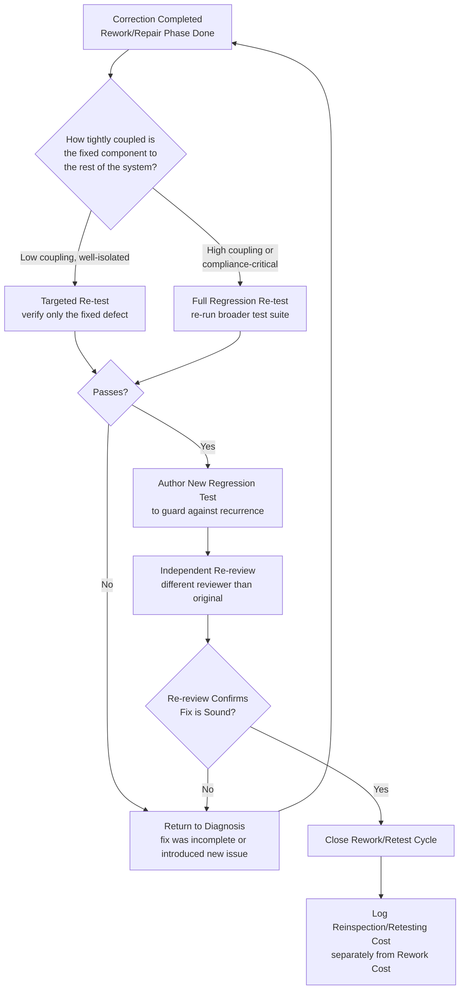

## Reinspection and Retesting

### Definition and Classification

Reinspection and Retesting is an Internal Failure Cost sub-category covering the cost of re-verifying a unit, component, or deliverable *after* it has undergone rework or repair, to confirm the correction actually resolved the original defect and did not introduce a new one. It is the final phase of the rework cycle — distinct from the diagnosis and correction phases covered under Rework and Repair — and represents a cost that is frequently underestimated in planning despite being a necessary, non-optional part of any legitimate correction process.

$$\text{Prevention Cost} : \text{Appraisal Cost} \approx \text{Internal Failure Cost} : \text{External Failure Cost} \approx 1 : 10 : 100$$

Reinspection and Retesting sits at an interesting conceptual boundary: it is procedurally identical in *method* to ordinary Appraisal activity (the same inspection or test techniques are used), but it is classified as Internal Failure Cost because its necessity is a direct *consequence* of a defect having occurred and been corrected — it would not exist at all if the original unit had been correct the first time. This distinguishes it from routine Appraisal, which occurs regardless of whether a defect is present.

### Purpose and Scope

**Key Points**

- Reinspection and Retesting answers: "Now that we've corrected the defect, how do we confirm the correction actually worked — and that it didn't break anything else?"
- It is not optional or a formality: a correction that is not re-verified is, from a quality-assurance standpoint, indistinguishable from an uncorrected defect until proven otherwise.
- Its scope should generally be broader than "recheck only the specific thing that was fixed" — the correction may have side effects, meaning re-verification often needs to cover adjacent functionality, not just the originally-defective element (this is the software-specific concept of regression testing, discussed below).

### Classical (Manufacturing) Scope

| Activity | Description |
| --- | --- |
| Post-Repair Inspection | Re-inspecting a specific unit after rework to confirm it now meets the original specification |
| Full Re-test | Re-running the complete original test/inspection protocol, not just the portion relevant to the fixed defect |
| Partial/Targeted Re-test | Re-testing only the specific characteristic that was corrected, used when the fix is well-isolated and side-effect risk is low |
| Batch Re-inspection | When a defect is found to be systemic across a batch, re-inspecting the entire batch (not just the originally-sampled units) after a process correction |
| Second-Party or Independent Re-verification | Having a different inspector (not the one who performed or approved the original work) conduct the re-inspection, to reduce confirmation bias |
| Documentation of Re-verification | Formally recording that re-inspection occurred and passed, distinct from the original inspection record |

### Full Re-test vs. Targeted Re-test: The Core Trade-off

A central decision in Reinspection and Retesting is scope: does the correction warrant re-verifying *only* the specific defect that was fixed, or the *entire* unit/system, given the possibility that the fix introduced a new problem elsewhere?

$$\text{Re-test scope} \propto \text{Coupling of fixed component to rest of system}$$

`[Inference]` This trade-off is fundamentally a risk/cost calibration: targeted re-testing is cheaper but assumes the fix is well-isolated with no side effects; full re-testing is more expensive but provides higher confidence, particularly warranted when the corrected component has high coupling to other parts of the system. The appropriate choice depends on the specific defect and codebase, not a fixed rule — highly-coupled or safety/compliance-critical corrections generally warrant broader re-verification regardless of how "obviously isolated" the fix appears to be.

### Software Engineering Translation: Regression Testing

The direct software analogue of Reinspection and Retesting is **regression testing** — re-running tests (often the full existing suite, sometimes an expanded one) after a change, specifically to catch the case where a fix for one defect introduces or reveals a different one.

For a TypeScript/Fastify/tRPC/Drizzle/PostgreSQL monorepo, Reinspection and Retesting concretely includes:

- **Full CI Suite Re-run After a Fix** — Re-executing the complete automated test suite (not just tests directly related to the fixed code) after a correction is merged, to catch unintended side effects elsewhere in the system.
- **Targeted Re-test for Well-Isolated Fixes** — For a narrowly-scoped correction (e.g., fixing a single validation message string with no logic change), running only the directly affected test file rather than the full suite, when the fix's blast radius is genuinely minimal.
- **Second Reviewer for Re-review** — Having a different reviewer (not the one who originally approved the flawed code) review the correction, reducing the risk that the same blind spot that missed the original defect also misses a flaw in its fix.
- **Post-Migration Re-validation** — After correcting and re-applying a Drizzle migration that previously failed or was rolled back, re-running schema validation and any dependent integration tests against the corrected migration, not just confirming the migration itself executes without error.
- **Regression Test Addition** — Writing a *new* test case that specifically covers the defect just fixed, ensuring that if the same defect is accidentally reintroduced later (e.g., through an unrelated refactor), it will be caught automatically rather than requiring manual re-discovery.
- **Staging Re-validation After Production-Bound Fix** — Re-deploying a corrected build to staging and re-running smoke/E2E tests before promoting to production, even if the original staging validation had already passed prior to the fix.

### Reinspection/Retesting vs. Original Appraisal: A Key Distinction

| Dimension | Original Appraisal | Reinspection/Retesting |
| --- | --- | --- |
| Trigger | Routine, scheduled/automatic | Conditional — only occurs because a defect was found and corrected |
| CoQ Category | Appraisal Cost | Internal Failure Cost |
| Necessity | Exists regardless of defect presence | Would not exist if the original work had been correct |
| Method | Same inspection/test techniques | Same inspection/test techniques (procedurally similar) |
| Cost Driver | Baseline inspection frequency/coverage | Frequency of defects requiring correction |

This distinction matters for cost accounting: a spike in Reinspection/Retesting cost is not a sign that Appraisal itself is expensive — it's a downstream signal that the underlying defect rate (a Prevention-tier concern) is high enough to be generating frequent correction cycles, each requiring its own re-verification pass.

### Cost Modeling Example

Consider the authorization-check defect discussed under Rework and Repair: a tRPC procedure missing a role-based authorization check before a document-approval state transition.

- **Targeted re-test (if scope assessed as low-coupling)**: Re-running only the specific test file covering that procedure's authorization logic — approximately 15 minutes of CI time plus a brief manual confirmation.
- **Full regression re-test (if scope assessed as higher-coupling, given the auth-check pattern likely affects other procedures)**: Re-running the complete test suite covering all document-workflow procedures, plus a broader manual smoke test of the approval flow — approximately 45 minutes to 1.5 hours, reflecting the earlier diagnosis-phase finding that the missing-authorization pattern might be systemic.
- **New regression test authored**: An additional 30 minutes to write a new test case specifically asserting that unauthorized role attempts are rejected, ensuring this exact defect class cannot silently recur.

Total Reinspection/Retesting cost for this incident: roughly 1.25–2.25 hours, depending on scope decision — a cost that exists *only* because the original defect occurred; a correctly-implemented authorization check from the start would have required none of this additional verification effort.

### Process Flow: Reinspection and Retesting Scope Decision

### Reinspection Scope vs. Risk (svg_diagram)

<svg xmlns="http://www.w3.org/2000/svg" viewBox="0 0 900 280">
<text x="450" y="24" text-anchor="middle" font-size="16" font-weight="bold" fill="#1a1a1a">Re-test Scope Scales With Coupling Risk (svg_diagram)</text>
<line x1="80" y1="230" x2="820" y2="230" stroke="#333" stroke-width="1.5" />
<line x1="80" y1="50" x2="80" y2="230" stroke="#333" stroke-width="1.5" />
<text x="450" y="265" text-anchor="middle" font-size="12" fill="#555">Coupling of Fixed Component to Rest of System</text>
<text x="30" y="140" text-anchor="middle" font-size="12" fill="#555" transform="rotate(-90 30 140)">Recommended Re-test Scope</text>
<rect x="100" y="180" width="220" height="45" rx="6" fill="#e6f4ea" stroke="#2e8b57" stroke-width="1.5" />
<text x="210" y="207" text-anchor="middle" font-size="12" fill="#1a1a1a">Targeted Re-test</text>
<rect x="400" y="110" width="220" height="45" rx="6" fill="#fff4e5" stroke="#d68910" stroke-width="1.5" />
<text x="510" y="137" text-anchor="middle" font-size="12" fill="#1a1a1a">Broader Module Re-test</text>
<rect x="620" y="60" width="200" height="45" rx="6" fill="#fdecea" stroke="#c0392b" stroke-width="1.5" />
<text x="720" y="87" text-anchor="middle" font-size="12" fill="#1a1a1a">Full Regression Suite</text>
<path d="M320,202 L400,132" stroke="#555" stroke-width="1.5" marker-end="url(#arrow10)" />
<path d="M620,132 L620,102" stroke="#555" stroke-width="1.5" marker-end="url(#arrow10)" />
</svg>

### Common Pitfalls

- **Skipping re-verification for "obvious" fixes**: Assuming a fix is correct without re-testing because the change appears trivial — trivial-looking changes can still introduce subtle regressions, particularly in coupled or shared code.
- **Targeted-only re-testing for high-coupling fixes**: Applying narrow, targeted re-testing to a correction in a highly-coupled or compliance-critical component, when the risk profile warrants a full regression pass — under-scoping re-verification effectively gambles that no side effects exist.
- **No new regression test added**: Fixing a defect and re-verifying it manually without adding a permanent automated test case means the same defect can silently recur later (e.g., via an unrelated refactor) with no automatic safety net to catch it.
- **Same person performing correction and re-verification with no independent check**: Relying solely on the original author's own confirmation that a fix works, without any independent re-review, risks the same blind spot that missed the original defect also missing a flaw in its correction.
- **Blending Reinspection/Retesting cost with Rework cost in reporting**: Failing to track re-verification time as its own line item obscures how much of total Internal Failure Cost is diagnosis/correction versus confirmation — information needed to identify whether re-verification processes themselves are efficient.
- **Treating passing re-tests as absolute proof of correctness**: `[Inference]` A passing regression suite after a fix increases confidence but does not guarantee the defect is fully resolved, particularly if the test suite's own coverage has gaps relative to the actual failure mode — this connects back to the Calibration of Test Equipment concern that the "instrument" (test suite) itself must be trustworthy for its pass/fail signal to be meaningful.

**Related Topics**

- Definition and Scope of Internal Failure Costs (parent category)
- Rework and Repair (the preceding phase this cost is conditional on)
- Regression Testing Strategy and Test Suite Design
- Calibration and Maintenance of Test Equipment (test suite trustworthiness)
- Code Review Practices and Independent Re-review
- Scrap and Material Waste (alternative disposition path)
- Root Cause Analysis Methodologies (5 Whys, Fishbone/Ishikawa)
- Defect Recurrence Tracking and Prevention Feedback Loops