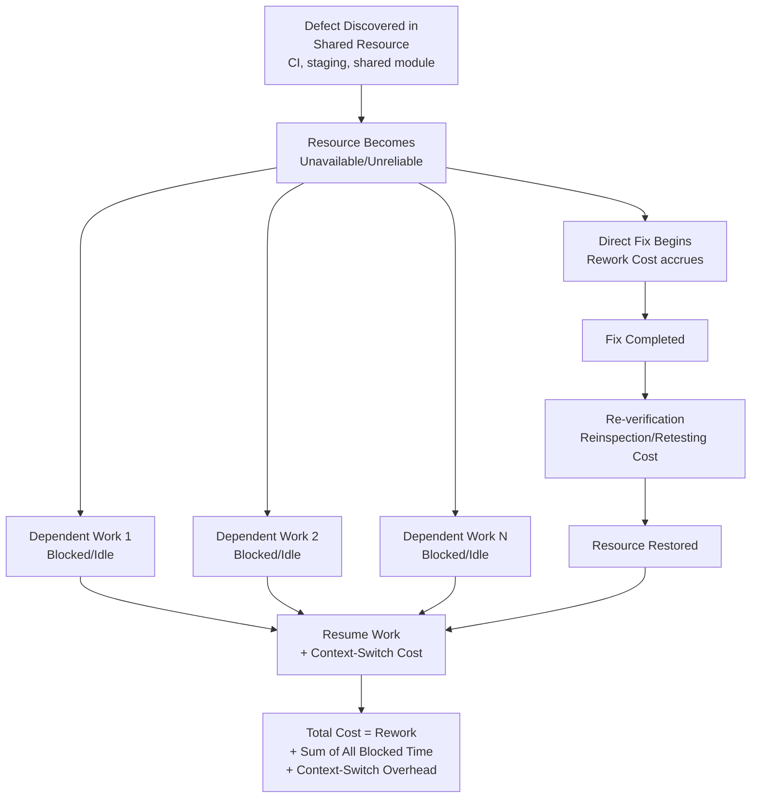

## Downtime and Delays Caused by Defects

### Definition and Classification

Downtime and Delays Caused by Defects is an Internal Failure Cost sub-category covering the cost of production stoppage, idle capacity, or schedule slippage that results directly from a defect being discovered internally — distinct from the cost of correcting the defect itself (Rework/Repair) or discarding it (Scrap). Where Rework and Scrap represent the cost of the *correction*, Downtime and Delays represent the cost of everything and everyone that is *blocked or idled* while that correction is diagnosed and applied.

$$\text{Prevention Cost} : \text{Appraisal Cost} \approx \text{Internal Failure Cost} : \text{External Failure Cost} \approx 1 : 10 : 100$$

This category is often underrepresented in cost accounting because it is diffuse and indirect: unlike Rework cost, which has an identifiable engineer or technician directly performing correction work, Downtime cost accumulates across everyone whose work is blocked, waiting, or forced into inefficient workarounds while the defect is being addressed. `[Inference]` Because this cost is spread across many people's partial idle time rather than concentrated in one identifiable task, it is frequently underestimated relative to its actual magnitude unless deliberately measured.

### Purpose and Scope

**Key Points**

- Downtime and Delays answers: "While this defect is being diagnosed and fixed, what else is blocked, idle, or degraded as a result?"
- It is a *multiplier* cost category — the same underlying defect can generate dramatically different Downtime cost depending on how many people or downstream processes depend on the blocked resource.
- This category has a close relationship to Scrap and Rework: the *choice* between scrapping and reworking often depends partly on which path minimizes Downtime, not just which minimizes direct correction labor.

### Classical (Manufacturing) Scope

| Activity | Description |
| --- | --- |
| Production Line Stoppage | Direct cost of a line halted while a defect is diagnosed, corrected, or a defective unit is removed |
| Idle Labor | Cost of workers unable to perform their normal tasks due to a stopped or blocked process |
| Equipment Idle Time | Cost of machinery sitting unused while awaiting correction of an upstream defect |
| Failure Analysis Time | Time spent specifically diagnosing *why* a defect occurred, separate from the time spent fixing it (though closely related to the diagnosis phase under Rework) |
| Schedule Slippage | Cost of a delayed production schedule, including any downstream commitments affected by the delay |
| Expediting Costs | Additional cost incurred to catch up after a delay (overtime, rush shipping, priority resource allocation) |

### Downtime/Delay vs. Rework: A Key Distinction

| Dimension | Rework and Repair | Downtime and Delays |
| --- | --- | --- |
| Who bears the cost | The person/team performing the correction | Everyone whose work depends on the blocked resource |
| Cost Shape | Concentrated, identifiable labor | Diffuse, often spread across multiple people/teams |
| Typical Visibility | High — tracked as "time spent fixing X" | Low — often invisible in standard time-tracking, appears only as reduced overall throughput |
| Software Example | Engineer-hours to fix a bug | Other developers blocked from merging because the shared branch/environment is broken |

This distinction matters because organizations that track only Rework cost (identifiable fix-labor) while ignoring Downtime cost (diffuse blocked-labor) systematically undercount the true Internal Failure Cost of a defect, particularly for defects that affect shared infrastructure or dependencies used by many people simultaneously.

### Software Engineering Translation

`[Inference]` For a TypeScript/Fastify/tRPC/Drizzle/PostgreSQL monorepo, Downtime and Delays caused by defects concretely include:

- **Broken Shared Development/Staging Environment** — A defective migration or configuration change that breaks a shared staging environment blocks *every* developer who needs that environment to validate their own unrelated work, multiplying the cost of a single defect across the whole team's idle or workaround time.
- **CI Pipeline Failure Blocking Merges** — A broken or misconfigured CI step (itself potentially a Calibration-of-Test-Equipment issue) that prevents any PR from merging until fixed, halting the entire team's integration flow rather than just the author of the triggering change.
- **Blocked Dependent Work** — A defect in a foundational module (e.g., a shared authentication utility) that other in-progress features depend on, forcing developers building on top of it to pause, work around the defect with temporary stubs, or wait entirely.
- **Database/Schema Lock Contention** — A defective or long-running migration that locks a shared development database table, blocking other developers' local testing or shared-environment work until it completes or is rolled back.
- **Context-Switching Cost** — `[Inference]` When a developer must interrupt planned work to respond to an urgent internally-discovered defect (e.g., an emergency staging rollback), the cost includes not just the direct fix time but the broader productivity loss from context-switching away from and back to their original task — a cost category not always captured in simple time-tracking.
- **Delayed Release Schedule** — Time spent internally discovering and correcting defects that pushes back a planned release date, with downstream effects on any commitments (e.g., a promised feature delivery date to LGU stakeholders) tied to that schedule.
- **Expedited/Rush Remediation** — Additional cost incurred when a defect must be fixed urgently under time pressure (e.g., overtime, deprioritizing other planned work) rather than through normal-paced correction, often because the defect is blocking many other people's work simultaneously.

### The Multiplier Effect: Why Shared-Resource Defects Are Disproportionately Costly

`[Inference]` The defining characteristic of Downtime cost is that it scales with the number of dependents on the affected resource, not with the complexity of the defect itself. A trivial one-line configuration error in a shared CI pipeline can generate far more total Downtime cost than a complex, hard-to-diagnose bug in an isolated, single-owner module — because the former blocks an entire team's throughput while the latter blocks only its author.

$$\text{Total Downtime Cost} \approx \text{Duration of Blockage} \times \text{Number of Blocked Dependents} \times \text{Cost per Blocked Hour}$$

This has a direct implication for where Prevention and Appraisal investment should concentrate: shared infrastructure (CI pipelines, staging environments, foundational modules, database schemas) warrants disproportionately higher Prevention/Appraisal rigor relative to its own complexity, precisely because a defect there generates outsized Downtime cost through the multiplier effect — not because such infrastructure is inherently more failure-prone.

### Cost Modeling Example

Consider a scenario where a Drizzle migration is applied to the shared staging database and turns out to contain a defect that leaves a critical table in a locked, inconsistent state, making the staging environment unusable.

- **Direct Rework cost**: The engineer who introduced the migration spends 2 hours diagnosing and correcting it (already counted under Rework and Repair).
- **Downtime cost — team-wide blockage**: Suppose 4 other developers were relying on the staging environment that day for their own unrelated feature validation. Each is blocked for the 2-hour window (or longer, if they can't immediately resume work once the fix lands, due to context-switching). At minimum, this represents 4 × 2 = 8 additional engineer-hours of blocked/idle time — quadruple the direct Rework cost alone.
- **Downtime cost — schedule ripple effect**: If one of the blocked developers had a planned release validation scheduled for that afternoon, the entire release may slip by a day, with follow-on effects on any external commitment tied to that release date. `[Unverified]` The specific cost of a schedule slip in this scenario — particularly any external or stakeholder-facing cost — would need to be assessed against the actual commitments involved, which can't be generically estimated.

Total Internal Failure Cost for this single migration defect, once Downtime is properly counted, is substantially higher (10+ engineer-hours) than the 2-hour Rework figure alone would suggest — illustrating why Downtime cost, though diffuse and easy to undercount, is often the larger component of total Internal Failure Cost for defects affecting shared resources.

### Process Flow: Downtime Cost Accumulation During Defect Resolution

### Downtime Multiplier Effect (svg_diagram)

<svg xmlns="http://www.w3.org/2000/svg" viewBox="0 0 900 300">
<text x="450" y="24" text-anchor="middle" font-size="16" font-weight="bold" fill="#1a1a1a">Shared-Resource Defect: Cost Multiplies Across Dependents (svg_diagram)</text>
<rect x="370" y="50" width="160" height="55" rx="8" fill="#fdecea" stroke="#c0392b" stroke-width="1.5" />
<text x="450" y="75" text-anchor="middle" font-size="12" fill="#1a1a1a">Defective Shared</text>
<text x="450" y="92" text-anchor="middle" font-size="12" fill="#1a1a1a">Resource (e.g. CI)</text>
<rect x="60" y="180" width="150" height="55" rx="8" fill="#fff4e5" stroke="#d68910" stroke-width="1.5" />
<text x="135" y="210" text-anchor="middle" font-size="11" fill="#1a1a1a">Developer A</text>
<text x="135" y="225" text-anchor="middle" font-size="10" fill="#555">Blocked</text>
<rect x="240" y="180" width="150" height="55" rx="8" fill="#fff4e5" stroke="#d68910" stroke-width="1.5" />
<text x="315" y="210" text-anchor="middle" font-size="11" fill="#1a1a1a">Developer B</text>
<text x="315" y="225" text-anchor="middle" font-size="10" fill="#555">Blocked</text>
<rect x="420" y="180" width="150" height="55" rx="8" fill="#fff4e5" stroke="#d68910" stroke-width="1.5" />
<text x="495" y="210" text-anchor="middle" font-size="11" fill="#1a1a1a">Developer C</text>
<text x="495" y="225" text-anchor="middle" font-size="10" fill="#555">Blocked</text>
<rect x="600" y="180" width="150" height="55" rx="8" fill="#fff4e5" stroke="#d68910" stroke-width="1.5" />
<text x="675" y="210" text-anchor="middle" font-size="11" fill="#1a1a1a">Release Schedule</text>
<text x="675" y="225" text-anchor="middle" font-size="10" fill="#555">Slips</text>
<path d="M400,105 L135,180" stroke="#555" stroke-width="1.3" marker-end="url(#arrow11)" />
<path d="M420,105 L315,180" stroke="#555" stroke-width="1.3" marker-end="url(#arrow11)" />
<path d="M460,105 L495,180" stroke="#555" stroke-width="1.3" marker-end="url(#arrow11)" />
<path d="M480,105 L675,180" stroke="#555" stroke-width="1.3" marker-end="url(#arrow11)" />

<text x="450" y="270" text-anchor="middle" font-size="11" fill="#555">One defect, one direct fix — but N multiplied Downtime costs</text>

</svg>

### Common Pitfalls

- **Tracking only direct fix time, not blocked-dependent time**: Reporting Internal Failure Cost using only the fixer's hours systematically undercounts total cost for defects affecting shared resources, sometimes by a large multiple.
- **Underinvesting in Prevention/Appraisal for shared infrastructure**: Applying the same rigor to shared, high-dependent-count resources (CI pipelines, staging environments, foundational modules) as to isolated, single-owner code, when the multiplier effect means shared-resource defects warrant disproportionately higher Prevention/Appraisal investment relative to their own apparent complexity.
- **No visibility into who/what is blocked**: Lacking a mechanism to know, in real time, how many people or processes are affected by a given outage/defect makes it impossible to prioritize remediation effort appropriately or to accurately estimate true cost after the fact.
- **Ignoring context-switching cost**: Counting only the literal blocked-idle time while ignoring the additional productivity loss when blocked developers resume interrupted work, understates total Downtime cost.
- **No rollback/mitigation path for shared-resource defects**: Lacking a fast way to restore a shared resource to a working state (e.g., a quick rollback for a bad migration) while the underlying fix is properly diagnosed extends the blockage window unnecessarily, multiplying Downtime cost across the same dependent count for longer.
- **Treating schedule slip as a separate, unrelated cost**: `[Inference]` Failing to trace a delayed release or missed commitment back to the specific internally-discovered defect(s) that caused it disconnects Downtime cost from its root cause, weakening the feedback signal that should inform where Prevention investment is most valuable.

**Related Topics**

- Definition and Scope of Internal Failure Costs (parent category)
- Rework and Repair (the direct correction cost this category multiplies around)
- Scrap and Material Waste (disposition decisions also weigh Downtime impact)
- Reinspection and Retesting (part of the total blockage window)
- Quality System Development Costs (shared infrastructure investment)
- Incident Response and Rollback/Recovery Procedures
- Root Cause Analysis Methodologies (5 Whys, Fishbone/Ishikawa)
- CI/CD Pipeline Design and Shared Environment Reliability