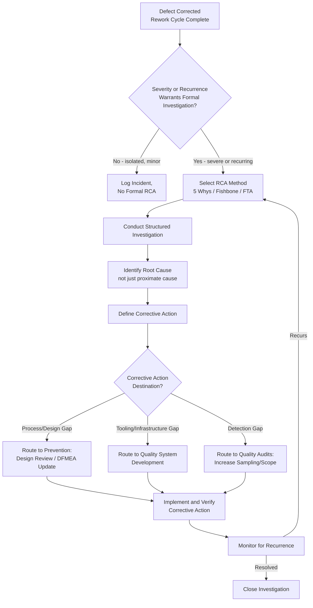

## Failure Analysis and Root Cause Investigation

### Definition and Classification

Failure Analysis and Root Cause Investigation is an Internal Failure Cost sub-category covering the systematic effort to determine *why* a defect occurred — as distinct from the effort to correct it (Rework/Repair), discard it (Scrap), re-verify the fix (Reinspection/Retesting), or absorb the disruption it caused (Downtime). Where every other Internal Failure sub-category addresses the *symptom* (the defective unit itself), Failure Analysis addresses the *cause* — and its output is the critical link connecting Internal Failure Cost back to the Prevention tier, since a defect whose cause is never understood cannot be reliably prevented from recurring.

$$\text{Prevention Cost} : \text{Appraisal Cost} \approx \text{Internal Failure Cost} : \text{External Failure Cost} \approx 1 : 10 : 100$$

Failure Analysis is unique among Internal Failure sub-categories in that its value is largely *forward-looking* rather than corrective: fixing the specific defective unit resolves that one instance, but Failure Analysis investment pays off primarily through the defects it prevents in the future by informing Prevention-tier changes (Design Review checklists, DFMEA updates, Quality System Development).

### Purpose and Scope

**Key Points**

- Failure Analysis and Root Cause Investigation answers: "Why did this happen, and what needs to change so it doesn't happen again?"
- It is distinguished from Diagnosis (the first phase of Rework, covered under Rework and Repair) by scope and intent: Diagnosis asks "what specifically is wrong with this unit so I can fix it"; Root Cause Investigation asks "what underlying condition, process gap, or systemic factor allowed this defect to be created and to escape earlier detection layers."
- Investigation depth should be proportional to defect severity and recurrence risk — not every minor, clearly isolated defect warrants a formal root-cause investigation, but any defect with high severity, unclear cause, or suspected systemic pattern does.

### Classical (Manufacturing) Scope

| Activity | Description |
| --- | --- |
| Failure Mode Investigation | Determining the specific mechanism by which a unit failed to meet specification |
| Root Cause Analysis (RCA) | Structured methodology to trace a failure back through contributing factors to its fundamental origin |
| Corrective Action Development | Defining what process, design, or training change would prevent recurrence |
| Failure Reporting and Documentation | Formal recording of the failure, its investigation, and its resolution for organizational learning |
| Trend Analysis | Aggregating failure data across multiple incidents to identify recurring patterns invisible in any single incident |
| 8D (Eight Disciplines) Problem Solving | A structured, team-based methodology (originating at Ford) for investigating and resolving significant quality failures |

### Root Cause Analysis Methodologies

**5 Whys** — A simple, iterative technique of asking "why" repeatedly (conventionally five times, though the actual number varies) to drill from a surface symptom down to an underlying systemic cause.

Example chain: *Why did the migration break production?* → It removed a column still in use. → *Why was that column still in use?* → A downstream service wasn't updated. → *Why wasn't it updated?* → No process existed to notify dependent services of schema changes. → *Why did no such process exist?* → Schema change impact analysis wasn't part of the design review checklist. → **Root cause**: Design Review process gap, not an individual engineer's error.

**Fishbone (Ishikawa) Diagram** — A structured visual technique categorizing potential contributing causes into standard buckets (commonly: People, Process, Tools/Technology, Environment, Materials, Measurement) to ensure investigation doesn't tunnel-vision on the most obvious cause while missing contributing systemic factors.

**Fault Tree Analysis (FTA)** — A top-down, deductive technique starting from the failure event and working backward through logical AND/OR gates to identify all possible combinations of contributing conditions — more rigorous and structured than 5 Whys, typically reserved for higher-severity or safety-critical failures.

### Root Cause Investigation vs. Diagnosis (Rework Phase)

| Dimension | Diagnosis (Rework phase) | Root Cause Investigation |
| --- | --- | --- |
| Question Asked | What specifically is wrong with this unit? | Why did this defect occur, and why wasn't it prevented/caught earlier? |
| Scope | The defective unit itself | The process, system, or conditions that produced and allowed the defect to escape |
| Typical Depth | Proportional to what's needed to fix this instance | Proportional to severity and recurrence risk across the system |
| Output | A correction for this instance | A corrective action targeting the systemic cause |
| Destination | Feeds into Correction (same Rework cycle) | Feeds into Prevention / Quality System Development / Quality Audits |

`[Inference]` In practice, these two activities often blend together for simple defects — the diagnosis phase naturally surfaces the root cause when the defect is straightforward. Formal, separated Root Cause Investigation becomes distinctly valuable specifically when the cause is non-obvious, the defect is severe, or the defect appears to be part of a recurring pattern.

### Software Engineering Translation

`[Inference]` For a TypeScript/Fastify/tRPC/Drizzle/PostgreSQL monorepo, Failure Analysis and Root Cause Investigation concretely includes:

- **Postmortem/Incident Review Documents** — A structured written investigation following a significant internally-caught defect (or, more commonly in software practice, a production incident), documenting timeline, contributing factors, and corrective actions — the software industry's standard implementation of formal failure analysis.
- **5-Whys Applied to Recurring Bug Categories** — When a Quality Audit or trend review reveals the same defect class recurring (e.g., repeated missing-authorization-check bugs across different tRPC procedures), applying 5 Whys to trace the pattern back to a systemic gap (e.g., no shared authorization middleware, no linter rule enforcing the pattern) rather than treating each instance as independently caused.
- **Blameless Postmortem Culture** — `[Inference]` A widely-adopted practice in software engineering organizations, explicitly separating "what process or system condition allowed this" from "who made the mistake," on the premise that individual blame discourages honest investigation and tends to surface only proximate causes rather than the systemic conditions that actually need correction. This connects directly to the Quality Audit pitfall of treating findings punitively rather than systemically.
- **Bisection/Git Bisect Investigation** — A specific software root-cause technique: systematically narrowing down which commit introduced a defect (via binary search through commit history), providing precise causal attribution before broader "why did this happen" investigation begins.
- **Schema Migration Failure Analysis** — When a Drizzle migration causes an internally-caught failure, investigating not just the immediate technical cause (e.g., missing default value) but the process gap that allowed it (e.g., no migration review checklist item for backward compatibility) — directly feeding into Quality System Development.
- **Dependency-Related Failure Investigation** — When a defect traces back to an upstream dependency's behavior, investigating whether the failure indicates a gap in Incoming Inspection (dependency vetting) or Supplier Verification (ongoing trust-tier monitoring) practices.

### From Root Cause to Corrective Action: Closing the Loop

**Key Points**

- A root cause investigation that doesn't produce an actionable corrective action is incomplete — identifying "why" without changing "what happens next" captures only half the value of the investigation.
- Corrective actions should target the *systemic* level identified by the investigation, not just the proximate individual instance — per the 5-Whys example above, the corrective action is "add schema-change impact analysis to the Design Review checklist," not merely "fix this one migration."
- Corrective actions typically route to one of several destinations: Prevention (Design Review checklist update, DFMEA revision), Quality System Development (new tooling, new process/SOP), or Quality Audits (increased sampling/audit frequency for the affected area going forward).

### Cost Modeling Example

Continuing the authorization-check defect example from Rework and Repair and Reinspection and Retesting: suppose the diagnosis phase revealed this wasn't an isolated mistake but the third similar missing-authorization defect found across the codebase in two months.

- **Formal Root Cause Investigation triggered**: Given the recurrence pattern, the team conducts a structured 5-Whys session — approximately 2 engineer-hours (facilitator + 2 participants for 40 minutes, plus writeup time).
- **Root cause identified**: No shared, enforced authorization-check pattern exists; each tRPC procedure implements authorization ad hoc, making omission easy and hard to catch in review since there's no consistent pattern reviewers can check against.
- **Corrective action defined**: Build a shared `protectedProcedure` middleware wrapper (analogous to tRPC's common context-based authorization pattern) that makes authorization checks structural rather than optional per-procedure — a Quality System Development investment, estimated at 6 engineer-hours to design, implement, and migrate existing procedures.
- **Cost comparison**: 2 hours (investigation) + 6 hours (corrective action) = 8 hours total, invested once, versus the alternative of continuing to pay the ~3–4 hour Rework/Retest cost (as calculated in the earlier examples) for each individual recurrence indefinitely. `[Inference]` Given three occurrences in two months, the systemic fix likely pays for itself within a few months relative to continuing to absorb per-incident Rework cost, though the exact break-even point depends on the true underlying recurrence rate, which the investigation itself does not by itself guarantee will drop to zero.

### Process Flow: Failure Analysis to Corrective Action

### Root Cause Investigation Depth Calibration (svg_diagram)

<svg xmlns="http://www.w3.org/2000/svg" viewBox="0 0 900 280">
<text x="450" y="24" text-anchor="middle" font-size="16" font-weight="bold" fill="#1a1a1a">Investigation Depth Scales With Severity and Recurrence (svg_diagram)</text>
<line x1="80" y1="230" x2="820" y2="230" stroke="#333" stroke-width="1.5" />
<line x1="80" y1="50" x2="80" y2="230" stroke="#333" stroke-width="1.5" />
<text x="450" y="265" text-anchor="middle" font-size="12" fill="#555">Severity / Recurrence Signal</text>
<text x="30" y="140" text-anchor="middle" font-size="12" fill="#555" transform="rotate(-90 30 140)">Investigation Depth</text>
<rect x="100" y="190" width="200" height="40" rx="6" fill="#e6f4ea" stroke="#2e8b57" stroke-width="1.5" />
<text x="200" y="215" text-anchor="middle" font-size="11" fill="#1a1a1a">Log Only, No Formal RCA</text>
<rect x="360" y="130" width="200" height="40" rx="6" fill="#fff4e5" stroke="#d68910" stroke-width="1.5" />
<text x="460" y="155" text-anchor="middle" font-size="11" fill="#1a1a1a">5 Whys</text>
<rect x="620" y="60" width="200" height="40" rx="6" fill="#fdecea" stroke="#c0392b" stroke-width="1.5" />
<text x="720" y="85" text-anchor="middle" font-size="11" fill="#1a1a1a">Fishbone / Fault Tree Analysis</text>
<path d="M300,210 L360,150" stroke="#555" stroke-width="1.5" marker-end="url(#arrow12)" />
<path d="M560,150 L620,80" stroke="#555" stroke-width="1.5" marker-end="url(#arrow12)" />
</svg>

### Common Pitfalls

- **Stopping at the proximate cause**: Ending investigation at "the developer forgot the authorization check" rather than continuing to "why was it possible to forget it" — the former blames an individual, the latter identifies an actionable systemic gap.
- **No formal investigation for recurring but individually-minor defects**: Treating each occurrence of a low-severity but recurring defect as isolated, rather than recognizing the pattern itself as a signal warranting formal investigation, misses systemic issues that only become visible in aggregate (connecting to the Quality Audit trend-analysis pitfall).
- **Investigation without corrective action**: Conducting a thorough root cause analysis that produces a clear finding, but never routing that finding into an actual Prevention-tier or Quality-System-Development change, wastes the investigation's core value.
- **Blame-oriented investigation culture**: Framing root cause investigation primarily around individual accountability discourages honest, complete information-sharing during the investigation itself, tending to surface only safe, superficial causes rather than genuine systemic gaps.
- **Disproportionate investigation depth**: Applying heavyweight Fault Tree Analysis to a trivial, clearly one-off defect (wasted investigation cost) or, conversely, using only a cursory glance for a severe, unclear-cause failure (insufficient investigation depth) — both represent miscalibration relative to the defect's actual severity and recurrence risk.
- **No trend aggregation across investigations**: `[Inference]` Conducting individual root cause investigations without periodically reviewing them collectively (a function closely related to Quality Audits) can miss cross-cutting systemic patterns that no single investigation would reveal on its own — the same underlying gap manifesting as several seemingly-unrelated individual defects.

**Related Topics**

- Definition and Scope of Internal Failure Costs (parent category)
- Rework and Repair (diagnosis phase, distinguished from formal RCA)
- 5 Whys, Fishbone/Ishikawa Diagrams, and Fault Tree Analysis
- 8D Problem-Solving Methodology
- Blameless Postmortem Culture and Practices
- Quality Audits and Assessments (trend-level pattern detection)
- Design Reviews and DFMEA (corrective action destination)
- Quality System Development Costs (corrective action destination)