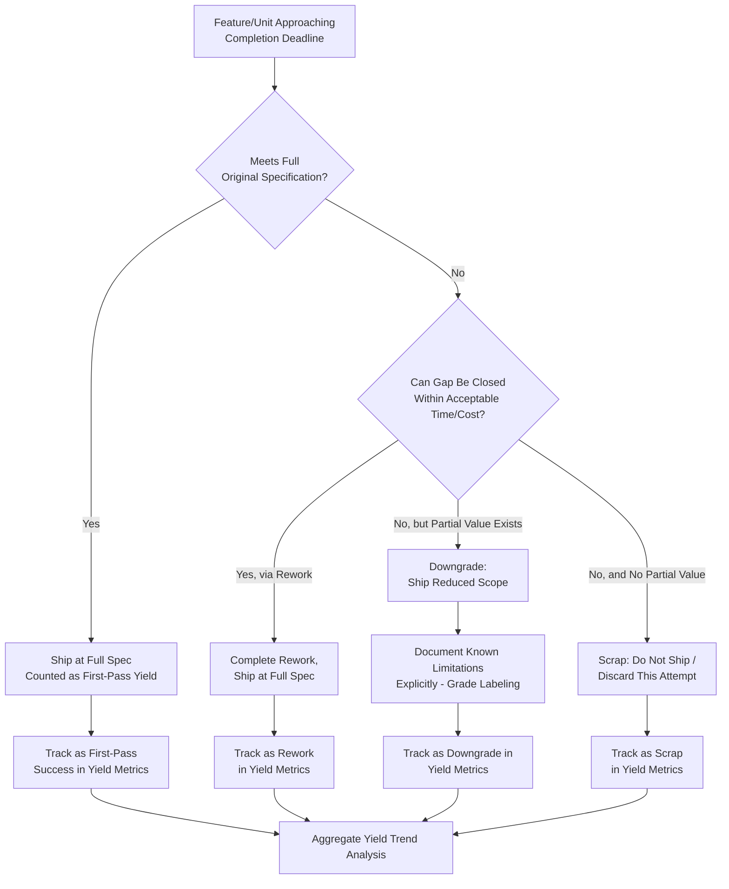

## Yield Loss and Downgrading

### Definition and Classification

Yield Loss and Downgrading is an Internal Failure Cost sub-category covering two closely related outcomes: **Yield Loss**, the gap between units started and units successfully completed to full specification within a production run, and **Downgrading**, the practice of reclassifying a nonconforming unit to a lower-grade specification (and typically lower price/value) rather than scrapping it entirely or achieving full rework to original spec. Both represent a partial, rather than total or zero, loss of value — distinguishing this category from the binary Scrap (total loss) versus Rework (full recovery) framing covered elsewhere in Internal Failure Cost.

$$\text{Prevention Cost} : \text{Appraisal Cost} \approx \text{Internal Failure Cost} : \text{External Failure Cost} \approx 1 : 10 : 100$$

Yield Loss and Downgrading occupies a middle position on the value-recovery spectrum: Scrap recovers none of the invested value, Rework aims to recover all of it (restoring the unit to full original specification), while Downgrading recovers *some* of it (the unit has real, saleable value, just less than originally intended) and Yield Loss quantifies the aggregate rate at which a process fails to produce fully-conforming output in the first place.

### Purpose and Scope

**Key Points**

- Yield Loss answers: "Of everything we started, what fraction came out fully conforming — and what does the rest represent in lost value?"
- Downgrading answers: "Given a nonconforming unit that isn't worth fully reworking, can it still be used for a lower-tier purpose rather than being scrapped entirely?"
- Both metrics are most meaningful in *aggregate*, tracked across a production run or time period, rather than as single-incident costs — they are process-health indicators as much as individual cost line items.

### Classical (Manufacturing) Scope

| Activity | Description |
| --- | --- |
| First-Pass Yield (FPY) | Percentage of units that meet full specification on the first attempt, without any rework |
| Rolled Throughput Yield (RTY) | Compounded yield across multiple sequential process steps, reflecting cumulative loss across a whole pipeline |
| Downgrading/Reclassification | Assigning a nonconforming unit to a lower-grade product tier where it still has commercial value |
| Grade Mix Shift | The economic impact of a higher-than-planned proportion of output falling into lower grades |
| Yield Trend Analysis | Tracking yield rate over time to detect gradual process degradation before it becomes a major failure |
| Value Recovery Rate | The proportion of a downgraded unit's original intended value that is actually recovered through the lower-grade sale/use |

### First-Pass Yield and Rolled Throughput Yield

**First-Pass Yield (FPY)** measures the percentage of units meeting full specification without any rework:

$$FPY = \frac{\text{Units passing without rework}}{\text{Total units started}}$$

**Rolled Throughput Yield (RTY)** extends this across a multi-step process, since a unit must pass *every* step correctly to count as a true first-pass success — and yield losses compound multiplicatively across steps:

$$RTY = FPY_1 \times FPY_2 \times \cdots \times FPY_n$$

`[Inference]` This compounding effect means that even a set of individual process steps each with a seemingly-acceptable 95% FPY can produce a surprisingly low overall RTY once enough steps are chained together (e.g., ten steps at 95% FPY each yields an RTY of roughly 60%) — a pattern that is not always intuitive without explicitly calculating the compounded figure, and one worth verifying against a given pipeline's actual step count rather than assumed.

### Downgrading: The Economic Middle Ground

The decision to downgrade rather than scrap or rework follows a similar economic logic to the Scrap-vs-Rework decision covered elsewhere, but with a third option in play:

$$\text{Downgrade if: } V_{\text{downgraded}} - C_{\text{reclassification}} > \max(V_{\text{scrap}}, V_{\text{full spec}} - C_{\text{rework}} - C_{\text{re-inspection}})$$

Where $V_{\text{downgraded}}$ is the recoverable value of the unit at the lower grade, and $C_{\text{reclassification}}$ is any cost associated with re-labeling, re-documenting, or re-routing the unit to its lower-grade use. Downgrading is economically preferable when the unit has genuine value at a lower tier that exceeds both scrapping it and the cost of bringing it fully up to original spec.

### Software Engineering Translation

`[Inference]` Software has no physical "grades," but the underlying concepts — a process yielding less-than-fully-conforming output at a measurable rate, and a nonconforming deliverable being repurposed for a lesser but still valuable use rather than fully corrected or discarded — map to identifiable, if less commonly named, practices:

| Manufacturing Concept | Software/DMS Equivalent |
| --- | --- |
| First-Pass Yield (FPY) | Percentage of PRs merged without requiring a rework/re-review cycle |
| Rolled Throughput Yield (RTY) | Compounded pass rate across an entire pipeline: code review → CI tests → staging validation → release, each stage's pass rate multiplying |
| Downgrading | Shipping a feature with reduced scope (a "degraded" version) when the full-spec implementation isn't ready, rather than shipping nothing or delaying release entirely |
| Grade Mix Shift | An increasing proportion of releases shipping with known, accepted limitations/waivers rather than full original spec |
| Yield Trend Analysis | Tracking PR first-pass-approval rate over time as a leading indicator of code quality or review effectiveness trends |
| Value Recovery Rate | The proportion of a feature's original intended value delivered when shipped in reduced/downgraded form |

Concrete examples for a TypeScript/Fastify/tRPC/Drizzle/PostgreSQL monorepo:

- **PR First-Pass Approval Rate** — Tracking what percentage of pull requests are approved on the first review pass versus requiring one or more rework cycles; a declining rate over time is a yield-loss trend signal worth investigating, potentially pointing to a Prevention-tier gap (unclear coding standards, insufficient design review) rather than treating each low-yield PR as an isolated incident.
- **Compounded Pipeline Yield** — If code review has a 90% first-pass rate, CI tests have a 95% first-pass rate, and staging validation has a 98% first-pass rate, the compounded rolled throughput yield for a change reaching production cleanly through all three stages is $0.90 \times 0.95 \times 0.98 \approx 0.84$, meaning roughly 16% of changes require at least one rework cycle somewhere in the pipeline — a figure worth tracking explicitly rather than inferring from any single stage's yield alone.
- **Feature Downgrading (Reduced Scope Ship)** — When a planned DMS feature (e.g., automated document-routing with full audit-trail integration) can't be completed to full specification by a deadline, shipping a reduced-scope version (e.g., manual routing with basic logging, audit-trail integration deferred) represents a downgrade decision: the reduced feature still has real value to the LGU, even though it doesn't meet the original full specification.
- **Documented Waivers for Known Limitations** — Formally tracking and disclosing a downgraded feature's known gaps (rather than silently shipping a degraded version as if it were the full spec) is the software equivalent of grade-labeling a downgraded manufactured unit — ensuring downstream consumers (other developers, end users, LGU stakeholders) know what they're actually getting.
- **Technical Debt as Deferred Yield Loss**: `[Inference]` A feature shipped with acknowledged technical debt (working but not built to the team's full architectural standard) can be understood as a downgraded unit — it delivers real, immediate value at a lower "grade" than the fully-realized design, with the option to invest further later to bring it up to full spec, analogous to a manufacturing downgrade-then-potentially-upgrade path.

### Yield Loss vs. Downgrading vs. Scrap vs. Rework: Full Disposition Spectrum

| Disposition | Value Recovered | When Chosen |
| --- | --- | --- |
| Rework | Full (100% of original intended value) | Correction cost is justified relative to full-spec value |
| Downgrade | Partial (reduced value at lower tier) | Full correction isn't economical/timely, but partial value still exceeds scrapping |
| Scrap | None (total loss) | Neither full correction nor partial value recovery is economically justified |
| Yield Loss (aggregate metric) | N/A — measures the *rate* across all dispositions | Used to track overall process health across many units/changes, not a per-unit decision |

### Cost Modeling Example

Consider a DMS team planning a quarter's feature: a fully-automated document classification system using machine-learning-assisted routing, originally scoped to auto-classify 95% of incoming document types with full audit-trail integration.

- **Full-spec path evaluated**: Estimated 6 weeks of engineering time to build the complete auto-classification and audit-trail integration.
- **Timeline pressure emerges**: At week 4, it becomes clear the ML classification component needs another 3 weeks beyond the original estimate to reach the 95% accuracy target reliably.
- **Downgrade decision**: Rather than delaying the entire release, the team ships a downgraded version: manual classification with a basic suggestion feature (lower accuracy target, no full ML integration) plus the audit-trail integration as originally planned. This downgraded version delivers real, immediate value (audit-trail compliance, a usable if less automated classification workflow) at a fraction of the remaining cost — roughly 1 additional week rather than 3.
- **Value recovery framing**: The downgraded release captures an estimated 60–70% of the originally intended value (`[Speculation]` this specific percentage would need to be validated against actual user/stakeholder assessment of the reduced feature's utility, rather than assumed) at roughly 40% of the remaining planned cost, with the option to invest further in full ML classification in a future cycle — directly analogous to a manufacturing downgrade decision that preserves partial value rather than either forcing full-spec completion under time pressure (risking quality shortcuts) or scrapping the release entirely.

### Process Flow: Yield/Downgrade Decision at Release Boundary

### Rolled Throughput Yield Compounding (svg_diagram)

<svg xmlns="http://www.w3.org/2000/svg" viewBox="0 0 900 260">
<text x="450" y="24" text-anchor="middle" font-size="16" font-weight="bold" fill="#1a1a1a">Yield Compounds Multiplicatively Across Pipeline Stages (svg_diagram)</text>
<rect x="30" y="70" width="180" height="70" rx="8" fill="#e8f0fe" stroke="#4a76d4" stroke-width="1.5" />
<text x="120" y="98" text-anchor="middle" font-size="12" fill="#1a1a1a">Code Review</text>
<text x="120" y="118" text-anchor="middle" font-size="13" font-weight="bold" fill="#1a1a1a">90% FPY</text>
<rect x="250" y="70" width="180" height="70" rx="8" fill="#fff4e5" stroke="#d68910" stroke-width="1.5" />
<text x="340" y="98" text-anchor="middle" font-size="12" fill="#1a1a1a">CI Tests</text>
<text x="340" y="118" text-anchor="middle" font-size="13" font-weight="bold" fill="#1a1a1a">95% FPY</text>
<rect x="470" y="70" width="180" height="70" rx="8" fill="#e6f4ea" stroke="#2e8b57" stroke-width="1.5" />
<text x="560" y="98" text-anchor="middle" font-size="12" fill="#1a1a1a">Staging Validation</text>
<text x="560" y="118" text-anchor="middle" font-size="13" font-weight="bold" fill="#1a1a1a">98% FPY</text>
<rect x="690" y="70" width="180" height="70" rx="8" fill="#eadcf7" stroke="#7d3ac1" stroke-width="1.5" />
<text x="780" y="98" text-anchor="middle" font-size="12" fill="#1a1a1a">Rolled Throughput</text>
<text x="780" y="118" text-anchor="middle" font-size="13" font-weight="bold" fill="#1a1a1a">≈ 84% RTY</text>
<path d="M210,105 H250" stroke="#555" stroke-width="1.5" marker-end="url(#arrow13)" />
<path d="M430,105 H470" stroke="#555" stroke-width="1.5" marker-end="url(#arrow13)" />
<path d="M650,105 H690" stroke="#555" stroke-width="1.5" marker-end="url(#arrow13)" />

<text x="450" y="200" text-anchor="middle" font-size="11" fill="#555">Each stage's yield looks acceptable in isolation — the compounded figure reveals</text>

<text x="450" y="216" text-anchor="middle" font-size="11" fill="#555">the true first-pass rate across the full pipeline</text>

</svg>

### Common Pitfalls

- **Tracking only final output yield, not per-stage yield**: Measuring only whether a unit eventually shipped correctly, without tracking yield at each intermediate stage, obscures *where* in the pipeline loss is concentrated and prevents targeted improvement.
- **Silent downgrading without disclosure**: Shipping a reduced-scope feature without explicitly documenting what was deferred or reduced is the software equivalent of selling a downgraded unit labeled as full-grade — it misleads downstream consumers about what they're actually receiving.
- **Treating downgrade as a permanent decision**: Failing to track and revisit downgraded features for potential future full-spec completion means genuinely valuable scope reductions become permanent technical debt rather than a deliberate, revisited trade-off.
- **Ignoring compounding effects across pipeline stages**: Evaluating each stage's yield in isolation without calculating rolled throughput yield can create false confidence — several individually-acceptable yield rates can compound into a surprisingly low overall first-pass success rate.
- **No yield trend tracking over time**: Treating yield as a static, one-time metric rather than monitoring its trend means gradual process degradation (a slowly declining first-pass approval rate, for instance) goes unnoticed until it becomes a more severe, harder-to-diagnose problem.
- **Downgrade decisions made without explicit value comparison**: `[Inference]` Defaulting to shipping a reduced-scope feature under deadline pressure without an explicit comparison against the scrap (don't ship this cycle) and full-rework (delay until complete) alternatives risks a downgrade decision driven by schedule pressure alone rather than genuine economic or value-based reasoning.

**Related Topics**

- Definition and Scope of Internal Failure Costs (parent category)
- Scrap and Material Waste (total-loss alternative)
- Rework and Repair (full-recovery alternative)
- First-Pass Yield and Rolled Throughput Yield Metrics
- Technical Debt as a Quality Cost Concept
- Feature Scoping and Minimum Viable Product Decision-Making
- Cost of Quality Measurement and Trend Analysis
- Failure Analysis and Root Cause Investigation (for declining yield trends)