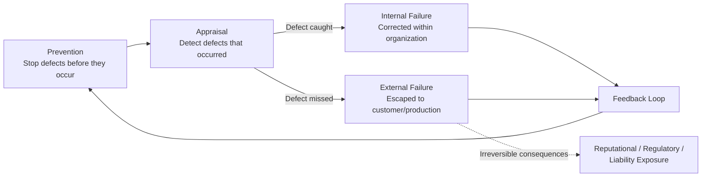
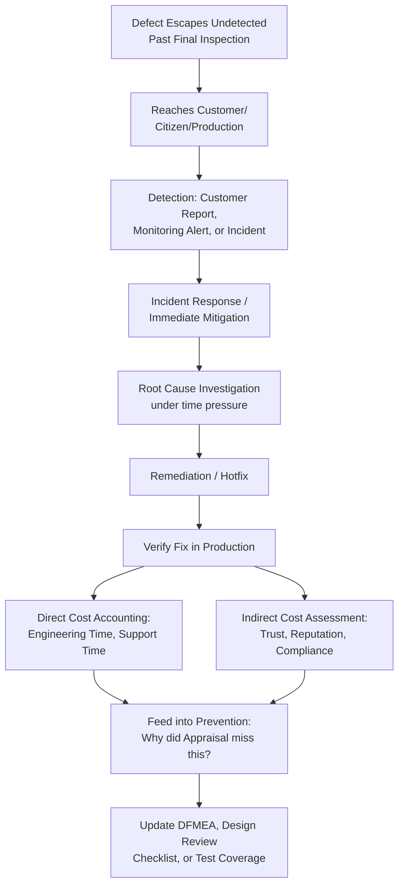

## Definition and Scope of External Failure Costs

### Definition and Classification

External Failure Costs are the fourth and final canonical Cost of Quality (CoQ) category, incurred when a defect escapes the organization's internal boundary entirely and reaches a customer, end user, or live production environment before detection. Where Internal Failure Costs represent defects caught and corrected while still fully within organizational control, External Failure Costs represent the point at which control is lost — consequences now unfold partially or fully outside the organization's direct management, involving customer trust, contractual obligations, regulatory exposure, and reputational standing in ways that internal correction cannot fully contain.

$$\text{Prevention Cost} : \text{Appraisal Cost} : \text{Failure Cost} \approx 1 : 10 : 100$$

External Failure occupies the $100 tier in the 1-10-100 Rule — the steepest cost escalation in the entire CoQ framework. This is not merely because remediation itself is more expensive (though it often is), but because External Failure introduces cost categories that simply do not exist at the Prevention, Appraisal, or Internal Failure stages: reputational damage, customer churn, regulatory penalties, and liability exposure have no internal-cost equivalent, since they depend on the reactions and decisions of parties outside the organization's control.

### Position in the Quality Cost Lifecycle

### Purpose and Scope

**Key Points**

- External Failure Cost answers: "Now that a defect has reached the customer or production, what does it cost us — directly and indirectly — to address it?"
- It is the only CoQ category where the organization does not fully control the consequence timeline or magnitude — a customer's decision to churn, a regulator's decision to investigate, or public reaction to a disclosed incident all unfold according to factors outside direct organizational control.
- External Failure Cost is often the most incompletely measured CoQ category, since reputational and trust-related costs are inherently difficult to quantify precisely, even though their long-term impact can exceed the directly measurable remediation costs.

### Standard Sub-Categories of External Failure Cost

Traditional CoQ literature (Juran, Crosby, ASQ) decomposes External Failure Costs into several recognized sub-categories:

| Sub-Category | Description | Example |
| --- | --- | --- |
| Warranty Claims | Cost of honoring warranty obligations for defective products already sold/delivered | Free repair or replacement of a defective product |
| Complaint Investigation and Adjustment | Cost of investigating and resolving customer complaints, including goodwill adjustments | Customer support time spent resolving a reported issue |
| Returned Product / Recalls | Cost of processing returns or conducting a formal product recall | Logistics, processing, and replacement cost of a recall |
| Liability and Legal Costs | Cost of legal exposure arising from a defect that caused harm or loss | Litigation defense, settlements, insurance premium increases |
| Lost Sales / Customer Churn | Revenue lost from customers who discontinue business due to a quality failure | Reduced repeat business, contract non-renewal |
| Reputational/Goodwill Damage | Long-term brand and trust erosion, difficult to quantify precisely but real in impact | Negative press coverage, reduced market trust |
| Regulatory Fines and Penalties | Cost of regulatory action resulting from a quality failure that violates compliance requirements | Fines for a data-protection or safety violation |
| Field Service / Support Cost | Cost of dispatching support or service resources to address the defect at the customer's location | On-site repair visits, extended support escalations |

### Internal Failure vs. External Failure: The Critical Boundary

| Dimension | Internal Failure | External Failure |
| --- | --- | --- |
| Where the defect is caught | Before delivery/release | After delivery/release |
| Organizational control | Full — remediation, timeline, and communication all internally managed | Partial — customer reaction, regulatory response, and public perception are outside direct control |
| Cost Categories Present | Rework, scrap, downtime, root-cause investigation | All internal categories, PLUS warranty, liability, churn, reputational damage, regulatory exposure |
| Reversibility | Fully reversible — the defect is corrected before anyone outside the organization is affected | Partially or fully irreversible — the defect's consequences (a customer's lost trust, a public incident) cannot always be fully undone even after correction |
| Cost Position (1-10-100) | $10 tier | $100 tier |

`[Inference]` The irreversibility distinction is arguably the most important conceptual difference between Internal and External Failure: internal correction can restore a defective unit to full specification, effectively erasing the defect's existence from the customer's perspective. External Failure often cannot be fully "undone" in this way — even a perfect fix, promptly issued, does not necessarily restore full customer trust or erase the fact that the failure was publicly observed, which is why External Failure cost frequently includes components with no clean internal analogue.

### Software Engineering Translation

For a TypeScript/Fastify/tRPC/Drizzle/PostgreSQL monorepo, External Failure Cost activities typically include:

- **Production Incident Response** — Engineering and operational time spent responding to a defect discovered in live production, including detection, triage, mitigation, and resolution — the direct software analogue of warranty/complaint response.
- **Data Integrity Remediation** — For a DMS specifically, cost of investigating and correcting incorrect or corrupted document records that were processed in production before the defect was caught, potentially requiring manual reconciliation.
- **Customer/Citizen-Facing Support Escalations** — Support and administrative time spent addressing citizen complaints or issues arising from a defect that affected their document submission, approval, or record.
- **Security Incident Costs** — If a defect enables unauthorized data access or exposure, cost includes incident response, forensic investigation, breach notification, and potential regulatory reporting obligations — particularly significant for a government-facing system handling citizen data.
- **Compliance/Regulatory Exposure** — For an LGU system, a defect causing incorrect processing of citizen records could trigger compliance review or audit findings from oversight bodies, distinct from routine internal Quality Audits.
- **Reputational Impact** — Public or institutional trust erosion if a defect becomes visible to citizens, local media, or oversight bodies — a cost category that is real but resists precise quantification, similar to its manufacturing counterpart.
- **Rollback and Hotfix Under Pressure** — Emergency, high-pressure remediation work conducted with less time for careful diagnosis than internally-caught defects typically allow, sometimes increasing the risk of introducing a secondary defect during rushed remediation.
- **SLA Breach Penalties** — If the DMS operates under a formal service-level agreement (internal to the LGU or with an external vendor/integrator), a defect causing an SLA breach may trigger contractually defined penalties.

### Why External Failure Cost Resists Precise Measurement

**Key Points**

- Direct costs (incident response hours, remediation engineering time, support escalation time) are readily measurable using the same time-tracking approaches applied to Internal Failure Cost.
- Indirect costs (reputational damage, long-term trust erosion, opportunity cost of citizens avoiding a digital service due to a prior bad experience) are real but require estimation, survey data, or longer-term trend analysis to approximate — they cannot be captured through simple time-tracking.
- `[Inference]` Organizations that measure only the directly-trackable portion of External Failure Cost (incident response hours) while omitting the harder-to-measure portion (reputational/trust impact) will systematically underestimate the true cost of external escapes relative to internal ones — this is a commonly cited limitation of CoQ measurement systems in practice, though the specific magnitude of underestimation varies and would need organization-specific study to quantify.

### Cost Modeling Example

Consider the connection-pool exhaustion scenario introduced under Final Inspection and Product Testing, now assuming the defect was *not* caught during load testing and reached production during a permit-renewal deadline period.

- **Direct incident response**: Emergency engineering time to diagnose and mitigate — approximately 8–10 engineer-hours during the incident, likely including off-hours response given the urgency.
- **Data reconciliation**: If any document submissions were partially processed or lost during the outage, additional time to identify and manually reconcile affected records — potentially several additional hours, with the added complexity that this work occurs under time pressure and scrutiny rather than during normal internal correction.
- **Citizen-facing impact**: Citizens unable to submit or track documents during a compliance deadline window experience direct harm (missed deadlines, need to resubmit, in-person follow-up) — a cost borne partly by citizens and partly by the LGU's support/administrative capacity to handle the resulting inquiries.
- **Institutional trust impact**: `[Unverified]` The specific reputational cost to the LGU from a public-facing outage during a compliance-critical period would depend on media attention, citizen sentiment, and oversight response — factors that cannot be estimated generically and would require direct assessment specific to the actual incident and institutional context.

This illustrates the qualitative shift from Internal to External Failure Cost: the same underlying defect (connection-pool exhaustion) generates a similar order of direct engineering cost whether caught internally or externally, but the External Failure scenario adds categories of cost — citizen impact, institutional trust, potential compliance scrutiny — that have no equivalent in the Internal Failure version of the same incident.

### Process Flow: Defect Escape to External Failure

### The Cost Escalation Curve (svg_diagram)

<svg xmlns="http://www.w3.org/2000/svg" viewBox="0 0 900 300">
<text x="450" y="24" text-anchor="middle" font-size="16" font-weight="bold" fill="#1a1a1a">Cost Escalation Across the CoQ Lifecycle (svg_diagram)</text>
<line x1="80" y1="250" x2="820" y2="250" stroke="#333" stroke-width="1.5" />
<line x1="80" y1="50" x2="80" y2="250" stroke="#333" stroke-width="1.5" />
<text x="450" y="285" text-anchor="middle" font-size="12" fill="#555">Stage of Detection</text>
<text x="30" y="150" text-anchor="middle" font-size="12" fill="#555" transform="rotate(-90 30 150)">Cost Magnitude</text>
<rect x="110" y="225" width="140" height="20" fill="#e6f4ea" stroke="#2e8b57" />
<text x="180" y="260" text-anchor="middle" font-size="10" fill="#555">Prevention</text>
<text x="180" y="215" text-anchor="middle" font-size="10" fill="#2e8b57">$1</text>
<rect x="290" y="190" width="140" height="55" fill="#fff4e5" stroke="#d68910" />
<text x="360" y="260" text-anchor="middle" font-size="10" fill="#555">Appraisal</text>
<text x="360" y="180" text-anchor="middle" font-size="10" fill="#d68910">$10</text>
<rect x="470" y="190" width="140" height="55" fill="#fdecea" stroke="#e07856" />
<text x="540" y="260" text-anchor="middle" font-size="10" fill="#555">Internal Failure</text>
<text x="540" y="180" text-anchor="middle" font-size="10" fill="#e07856">~$10-30</text>
<rect x="650" y="60" width="140" height="185" fill="#fdecea" stroke="#c0392b" stroke-width="2" />
<text x="720" y="260" text-anchor="middle" font-size="10" fill="#555">External Failure</text>
<text x="720" y="50" text-anchor="middle" font-size="11" font-weight="bold" fill="#c0392b">$100+</text>
<text x="720" y="140" text-anchor="middle" font-size="10" fill="#1a1a1a">+ reputational,</text>
<text x="720" y="155" text-anchor="middle" font-size="10" fill="#1a1a1a">regulatory, liability</text>
<text x="720" y="170" text-anchor="middle" font-size="10" fill="#1a1a1a">costs with no</text>
<text x="720" y="185" text-anchor="middle" font-size="10" fill="#1a1a1a">internal equivalent</text>
</svg>

### Common Pitfalls

- **Measuring only directly-trackable External Failure costs**: Reporting External Failure Cost using only incident-response engineer-hours while omitting reputational, trust, and long-term churn impact systematically understates the true cost, sometimes dramatically.
- **Treating External Failure as "the same defect, just found later"**: Assuming External Failure cost is a simple linear extension of Internal Failure cost ignores the qualitatively different cost categories (regulatory, reputational, liability) that exist only once a defect has escaped organizational control.
- **No distinction between contained and uncontained External Failure**: Treating a quickly-caught, narrowly-scoped production incident the same as a widely-visible, prolonged public failure obscures meaningful differences in actual cost magnitude within the External Failure category itself.
- **Insufficient investment in understanding why Appraisal missed the defect**: Focusing entirely on remediating the immediate external impact without root-causing *why* the defect passed through Final Inspection undetected forfeits the opportunity to close the specific Appraisal or Prevention gap that allowed the escape.
- **No differentiation by defect severity/impact for cost tracking**: `[Inference]` Aggregating all External Failure incidents into a single cost total without categorizing by severity or root cause makes it difficult to target Prevention and Appraisal investment at the specific defect classes most likely to escape — mirroring the same categorization pitfall noted for Internal Failure Cost.
- **Underinvesting in Prevention/Appraisal because External Failure feels rare**: Low apparent frequency of external escapes can create false confidence, particularly when the true cost of the rare incidents that do occur (including hard-to-measure reputational impact) would justify substantially more Prevention/Appraisal investment than the raw incident count alone suggests.

**Related Topics**

- Definition and Scope of Internal Failure Costs (upstream boundary)
- Warranty Claims and Complaint Investigation
- Product Recalls and Returned Product Processing
- Liability and Legal Cost Exposure
- Reputational and Goodwill Damage Assessment
- Regulatory Fines and Compliance Penalties
- Production Incident Response and Postmortem Practices
- Root Cause Analysis Methodologies (5 Whys, Fishbone/Ishikawa)