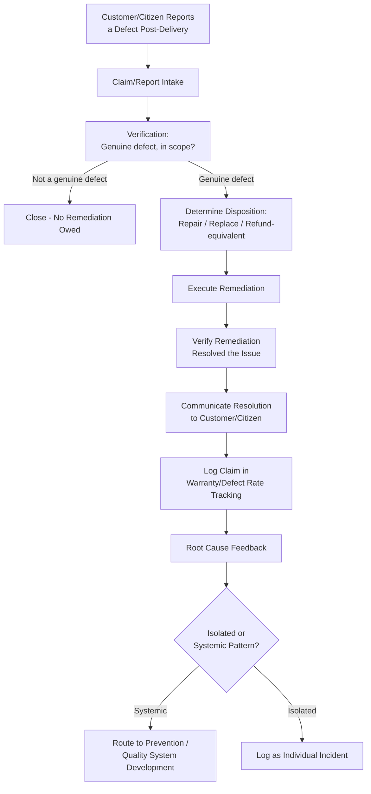

## Warranty Claims and Product Returns

### Definition and Classification

Warranty Claims and Product Returns is an External Failure Cost sub-category covering the cost of honoring formal or informal obligations to repair, replace, refund, or otherwise remediate a product or deliverable after it has been delivered to the customer and found defective. It is typically the most structured and predictable component of External Failure Cost, since warranty terms are usually explicitly defined in advance — in contrast to more open-ended External Failure categories like reputational damage, which lack a predefined scope or process.

$$\text{Prevention Cost} : \text{Appraisal Cost} : \text{Failure Cost} \approx 1 : 10 : 100$$

Warranty and Returns cost sits within the $100 tier of External Failure, but is generally the most *directly measurable* component of that tier — organizations typically track warranty cost formally (warranty reserves, claim processing budgets) even when other External Failure categories (reputational impact, customer churn) go largely unmeasured, making Warranty Claims and Product Returns often the anchor metric through which External Failure Cost is first introduced into an organization's quality accounting.

### Purpose and Scope

**Key Points**

- Warranty Claims and Product Returns answers: "What does it cost us to make good on our commitment to the customer when a delivered product fails to meet specification?"
- It differs from Internal Failure remediation primarily in *where* the correction happens and *who* is inconvenienced: the customer has already taken possession, used the product, and experienced the failure firsthand — the correction process itself is now a customer-facing interaction, not an internal one.
- Warranty cost is typically tracked as a **rate** (claims per units sold/delivered) rather than only an absolute total, since the rate is what reveals whether the underlying defect-creation process is improving or degrading over time.

### Classical (Manufacturing) Scope

| Activity | Description |
| --- | --- |
| Warranty Repair Cost | Direct labor and materials cost to repair a defective product under warranty terms |
| Warranty Replacement Cost | Cost of providing a replacement unit when repair isn't economical or the warranty terms specify replacement |
| Warranty Administration | Cost of processing warranty claims: intake, verification, approval, logistics coordination |
| Product Return Processing | Cost of receiving, inspecting, and dispositioning returned products (whether under formal warranty or general return policy) |
| Warranty Reserve/Accrual | Financial provisioning set aside in advance, based on historical claim rates, to cover expected future warranty obligations |
| Extended Warranty Cost | Cost associated with claims under extended or premium warranty programs beyond the base warranty period |
| Field Failure Rate Tracking | Ongoing measurement of the rate at which delivered units generate warranty claims, segmented by defect type, production batch, or time-in-service |

### Warranty Claim Lifecycle

`[Inference]` Most formal warranty processes follow a broadly consistent structure, though specific steps vary by industry and organization:

1. **Claim Submission** — Customer reports a defect and requests remediation under warranty terms.
2. **Verification** — Confirming the reported issue is genuine, within warranty scope (coverage period, defect type, not caused by misuse), and attributable to a manufacturing/design defect rather than external factors.
3. **Disposition Decision** — Repair, replace, or refund, following economic logic similar to the Scrap-vs-Rework decision but now applied in a customer-facing context with contractual/policy constraints.
4. **Remediation Execution** — Performing the repair, shipping the replacement, or processing the refund.
5. **Root Cause Feedback** — Feeding the claim's underlying defect information back into Prevention-tier processes (Design Review, DFMEA) and Appraisal-tier processes (why didn't Final Inspection catch this?).

### Warranty Cost as a Rate Metric

$$\text{Warranty Claim Rate} = \frac{\text{Number of Warranty Claims}}{\text{Total Units Delivered}}$$

**Key Points**

- Tracking warranty cost only as an absolute total (e.g., "$50,000 in warranty costs this quarter") without normalizing by units delivered obscures whether quality is actually improving or simply tracking overall sales volume.
- A rising claim rate, even with stable absolute warranty spend, indicates the underlying defect-creation or detection process is degrading relative to output volume — a trend that should route back into Prevention and Appraisal investment review.
- Segmenting the claim rate by defect category, production batch, or release version allows warranty data to function as a diagnostic tool, not just a cost figure — directly analogous to the defect-categorization emphasis discussed under Internal Failure Cost tracking.

### Software Engineering Translation

`[Inference]` Software rarely uses the literal term "warranty," but the underlying concept — formal or informal post-delivery obligations to correct defects a customer discovers after receiving the product — maps to identifiable practices, particularly relevant for a government-facing system with implicit service-continuity obligations:

| Manufacturing Concept | Software/DMS Equivalent |
| --- | --- |
| Warranty repair | A hotfix or patch issued in response to a production defect a user reported |
| Warranty replacement | Reprocessing or regenerating a corrupted/incorrectly-processed document record for a citizen |
| Warranty administration | Support ticket intake, triage, and tracking process for production-defect reports |
| Product return processing | User-reported bug triage: verifying the report is a genuine defect (not user error or a misunderstanding) before committing remediation resources |
| Warranty reserve/accrual | Reserved engineering capacity (a standing "bug-fix" allocation each sprint) set aside based on historical defect-report rates |
| Field failure rate tracking | Production defect/incident rate per release or per active user, tracked over time as a quality trend indicator |
| Extended warranty | Ongoing support/maintenance obligations for a long-lived system like a government DMS, where "warranty" is effectively continuous rather than time-bounded |

Concrete examples for a TypeScript/Fastify/tRPC/Drizzle/PostgreSQL monorepo:

- **User-Reported Bug Triage and Remediation** — The direct software analogue of a warranty claim: a citizen or LGU staff member reports that a document submission failed or produced an incorrect result, triggering a verification, disposition, and remediation cycle structurally similar to a manufacturing warranty claim.
- **Hotfix Release Process** — A formal, expedited release path for correcting production defects reported post-deployment, distinct from the normal release cadence — the software equivalent of a warranty repair process with its own tracked cost and cycle time.
- **Data Correction for Affected Records** — When a production defect caused incorrect data to be written for specific documents/citizens, the cost of identifying all affected records and correcting them individually — analogous to a targeted product recall scoped to a specific defective batch.
- **Defect Report Rate Tracking** — Tracking the number of production bug reports per release or per active period, normalized against usage volume, as a direct warranty-claim-rate analogue that reveals whether release quality is improving or degrading over time.
- **Standing Bug-Fix Capacity Allocation** — Reserving a portion of each development cycle's capacity specifically for addressing post-release defects, analogous to a warranty reserve — an explicit acknowledgment that some volume of External Failure remediation is a predictable, budgetable cost rather than purely reactive overhead.
- **Long-Term Support Obligation** — For an LGU system with no defined "end of warranty," the ongoing, indefinite obligation to correct production defects throughout the system's operational life, distinguishing it from consumer products with a bounded warranty period.

### Cost Modeling Example

Consider a scenario where a batch of document submissions processed during a specific two-week window were found to have an incorrect timestamp recorded due to a timezone-handling defect, discovered only after several citizens reported discrepancies between their submission time and the recorded time.

- **Claim Verification**: Support/engineering time to confirm the pattern is genuine, determine the defect's scope (which submissions, over what time window), and confirm root cause — approximately 3–4 hours.
- **Disposition Decision**: Given the defect is isolated to a specific timestamp field rather than affecting document content or approval status, the team determines a targeted data correction (not a full resubmission or refund-equivalent) is the appropriate remediation — a "repair" rather than "replace" disposition.
- **Remediation Execution**: Writing and carefully testing a script to identify and correct the specific affected records (with appropriate audit-trail logging of the correction itself, given the government-records context), plus verification that the correction is accurate — approximately 5–6 hours.
- **Citizen-Facing Communication**: Time spent communicating the correction to affected citizens or relevant LGU staff, to maintain transparency about what happened and what was corrected — a cost category with no clean manufacturing-warranty equivalent but directly analogous to warranty-claim customer communication.
- **Root-cause feedback**: The timezone-handling defect is routed to a Root Cause Investigation, given its systemic nature (a single root cause affecting multiple records), with corrective action likely landing in Prevention (updated design review checklist for timezone handling) or Quality System Development (standardized timezone-handling utility). `[Unverified]` Whether this defect should have been caught during Final Inspection load/edge-case testing would need to be verified against what test coverage existed for timezone edge cases at the time, rather than assumed.

Total External Failure cost for this incident: roughly 8–10 engineer-hours of direct remediation, plus the harder-to-quantify cost of citizen trust impact from the discrepancy being noticed and reported in the first place — illustrating the pattern noted under Definition and Scope of External Failure Costs, where direct remediation cost is measurable but coexists with a less-measurable trust dimension.

### Process Flow: Warranty Claim / Defect Report Lifecycle

### Warranty Claim Rate Trend (svg_diagram)

<svg xmlns="http://www.w3.org/2000/svg" viewBox="0 0 900 280">
<text x="450" y="24" text-anchor="middle" font-size="16" font-weight="bold" fill="#1a1a1a">Claim Rate as a Quality Trend Indicator (svg_diagram)</text>
<line x1="80" y1="230" x2="820" y2="230" stroke="#333" stroke-width="1.5" />
<line x1="80" y1="50" x2="80" y2="230" stroke="#333" stroke-width="1.5" />
<text x="450" y="265" text-anchor="middle" font-size="12" fill="#555">Release / Time Period</text>
<text x="30" y="140" text-anchor="middle" font-size="12" fill="#555" transform="rotate(-90 30 140)">Defect Reports per Unit Delivered</text>

<polyline points="120,180 220,170 320,175 420,120 520,95 620,70 720,55" fill="none" stroke="`#c0392b`" stroke-width="2.5" />

<circle cx="420" cy="120" r="5" fill="#d68910" />
<text x="420" y="105" text-anchor="middle" font-size="10" fill="#d68910">Rate rising despite</text>
<text x="420" y="118" text-anchor="middle" font-size="10" fill="#d68910">stable absolute spend</text>

<text x="150" y="200" text-anchor="middle" font-size="10" fill="`#2e8b57`">Stable, low rate</text>

<text x="650" y="40" text-anchor="middle" font-size="11" fill="`#c0392b`">Trend signals Prevention/Appraisal</text>

<text x="650" y="53" text-anchor="middle" font-size="11" fill="`#c0392b`">investment review needed</text>

</svg>

### Common Pitfalls

- **Tracking absolute cost without normalizing by volume**: Reporting only total warranty/defect-remediation spend, without dividing by units delivered or active usage, makes it impossible to distinguish genuine quality degradation from simple growth in delivered volume.
- **No verification step before remediation**: Committing to fix or replace before confirming the reported issue is a genuine defect (rather than user error, misuse, or a misunderstanding) risks misallocating remediation resources and mis-recording defect rates.
- **Disposition decisions made without economic comparison**: Defaulting to full replacement/resubmission when a targeted repair/correction would fully resolve the issue at lower cost, or vice versa, without an explicit comparison — echoing the same Scrap-vs-Rework economic logic covered under Internal Failure Cost, now applied in the more visible external context.
- **No root-cause feedback loop from claims to Prevention**: Treating each warranty claim or defect report as a closed, one-off transaction without feeding the underlying defect pattern back into Design Review, DFMEA, or Quality System Development means the same defect class can continue generating claims indefinitely.
- **Underestimating administration/communication cost**: Focusing cost estimates only on the technical remediation while omitting the intake, verification, and customer-communication overhead, which for a government-facing system carries particular importance for maintaining institutional trust.
- **No long-term support obligation planning for indefinite-lifespan systems**: `[Inference]` Unlike a consumer product with a bounded warranty period, a government system like a DMS has an effectively indefinite "warranty" obligation for as long as it remains in service — failing to budget standing capacity for this ongoing remediation need (rather than treating each defect report as an unplanned emergency) can leave the team perpetually under-resourced for a predictable category of work.

**Related Topics**

- Definition and Scope of External Failure Costs (parent category)
- Product Recalls and Returned Product Processing
- Root Cause Analysis Methodologies (5 Whys, Fishbone/Ishikawa)
- Failure Analysis and Root Cause Investigation (systemic pattern routing)
- Field Failure Rate Tracking and Trend Analysis
- Hotfix and Emergency Release Processes
- Regulatory Fines and Compliance Penalties (for regulated defect categories)
- Reputational and Goodwill Damage Assessment