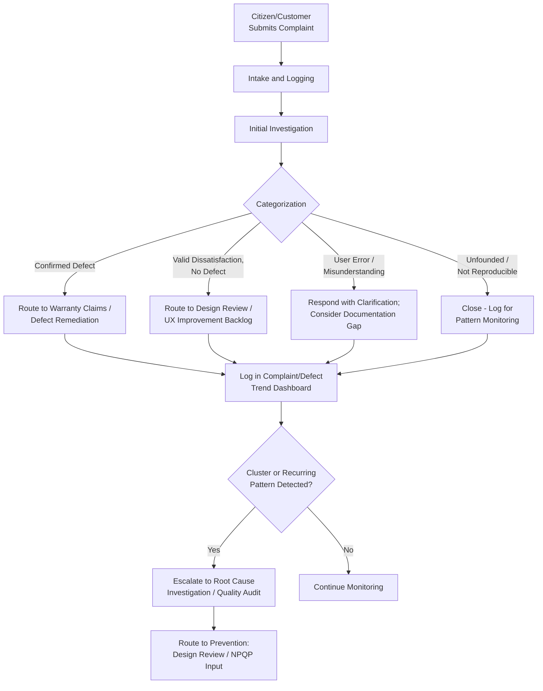

## Customer Complaint Handling

### Definition and Classification

Customer Complaint Handling is an External Failure Cost sub-category covering the cost of receiving, investigating, responding to, and resolving customer-reported dissatisfaction — whether or not the underlying issue turns out to be a verified product defect. It is distinguished from Warranty Claims and Product Returns by scope: Warranty Claims specifically addresses *verified defects* with a defined remediation path (repair, replace, refund), while Complaint Handling encompasses the broader, often messier intake and investigation process that precedes that determination, including complaints that turn out to be user error, misunderstanding, or valid dissatisfaction with something other than a strict defect (service quality, communication, unmet expectations).

$$\text{Prevention Cost} : \text{Appraisal Cost} : \text{Failure Cost} \approx 1 : 10 : 100$$

Complaint Handling sits within the $100 tier of External Failure, but it is notable for including cost even when no defect is ultimately confirmed — the investigation and response effort is a real cost regardless of outcome, making this category broader in scope (and often higher in volume) than Warranty Claims alone.

### Purpose and Scope

**Key Points**

- Customer Complaint Handling answers: "What does it cost us to properly receive, investigate, and respond to a customer's expression of dissatisfaction, regardless of whether it turns out to be a confirmed defect?"
- Unlike Warranty Claims (which assumes a verified defect), Complaint Handling cost is incurred at the *point of intake*, before verification determines whether the complaint reflects a genuine product/service failure.
- Complaint data, aggregated and categorized, is one of the richest sources of Voice of Customer (VOC) information feeding back into Design Reviews and New Product Quality Planning — making this category valuable as a signal source, not just a cost center.

### Classical (Manufacturing/Service) Scope

| Activity | Description |
| --- | --- |
| Complaint Intake and Logging | Receiving and formally recording a customer complaint through whatever channel it arrives |
| Complaint Investigation | Determining whether the complaint reflects a genuine defect, user error, or unmet expectation |
| Customer Communication | Responding to the customer throughout the investigation and resolution process |
| Goodwill Adjustments | Concessions made to preserve the customer relationship even when a strict defect isn't confirmed (partial refund, expedited service, apology gesture) |
| Complaint Categorization and Trending | Classifying complaints by type/root cause to identify patterns across the complaint volume |
| Escalation Management | Cost of handling complaints that escalate beyond frontline resolution (management involvement, formal dispute processes) |

### Complaint Handling vs. Warranty Claims: A Key Distinction

| Dimension | Customer Complaint Handling | Warranty Claims and Returns |
| --- | --- | --- |
| Trigger | Any expression of customer dissatisfaction | Specifically, a reported product defect |
| Verification Outcome | May or may not confirm an actual defect | By definition addresses a verified (or presumptively verified) defect |
| Cost Incurred Regardless of Outcome | Yes — investigation cost exists even if no defect is found | No — remediation cost only applies once a defect is confirmed |
| Typical Volume | Higher — includes all dissatisfaction, not just confirmed defects | Lower — filtered to confirmed defect cases |
| Primary Value Beyond Direct Cost | Rich Voice-of-Customer signal for Prevention-tier planning | Defect-rate signal for Prevention-tier planning |

This means Complaint Handling functions as the *front door* through which Warranty Claims (and other External Failure categories) are typically discovered — a complaint arrives, is investigated, and depending on the outcome, may be reclassified as a confirmed warranty claim, resolved as a non-defect goodwill gesture, or closed as unfounded.

### Complaint Categorization Framework

`[Inference]` A commonly useful way to categorize incoming complaints, adapted from standard customer-service and quality-management practice:

1. **Confirmed Defect** — Investigation verifies a genuine product/service failure; routes to Warranty Claims or equivalent remediation.
2. **Valid Dissatisfaction, No Defect** — The product/service performed as designed, but the customer's experience or expectation wasn't met (e.g., a confusing interface, unclear communication) — often the richest source of Design Review/UX-related Prevention insight, even though no "defect" in the strict sense exists.
3. **User Error / Misunderstanding** — The complaint stems from incorrect usage or a misunderstanding of intended functionality; may still indicate a documentation or onboarding gap worth addressing, even without a product defect.
4. **Unfounded / Not Reproducible** — Investigation cannot substantiate the complaint; closed without further action, though repeated similar unfounded complaints may still warrant investigation into whether something less obvious is occurring.

### Software Engineering Translation

`[Inference]` For a TypeScript/Fastify/tRPC/Drizzle/PostgreSQL monorepo serving a Philippine LGU's document management needs, Customer Complaint Handling concretely includes:

- **Citizen Support Ticket Intake** — The direct software analogue of complaint intake: citizens or LGU staff reporting confusion, frustration, or apparent malfunction through a support channel, help desk, or feedback mechanism.
- **Bug Report Triage (Pre-Verification)** — The investigation phase where a support or engineering team determines whether a reported issue reflects a genuine defect, a misunderstanding of expected behavior, or user error — directly mirroring the manufacturing complaint-categorization framework above.
- **UX/Usability Complaints Without a Strict Defect** — Reports where the DMS functioned exactly as designed, but a citizen found a workflow confusing (e.g., unclear status labels, unintuitive document upload steps) — valuable Voice-of-Customer signal even though no code defect exists, often the most actionable category for improving the system without requiring bug fixes.
- **Escalation Handling** — Complaints that move beyond frontline support to involve engineering leads or LGU administrative staff, particularly for complaints touching compliance-sensitive workflows (e.g., a citizen disputing whether their submission was properly received before a deadline).
- **Goodwill/Non-Defect Remediation** — Cases where, even though no defect is confirmed, the team takes proactive action to help the citizen (e.g., manually assisting with a resubmission, extending a soft deadline) to preserve institutional trust — a cost incurred without a corresponding "fix," but still a real component of External Failure-adjacent cost.
- **Complaint Trend Dashboards** — Aggregating and categorizing support tickets over time to identify recurring pain points, feeding directly into the Design Review and Quality Audit processes as a Voice-of-Customer data source distinct from, but complementary to, defect-rate tracking.

### Complaint Handling as a Voice-of-Customer Feedback Mechanism

**Key Points**

- The "Valid Dissatisfaction, No Defect" category (category 2 above) deserves particular attention in software contexts: a feature that works exactly as coded but confuses or frustrates users represents a design/UX gap that traditional defect-tracking (bug reports) may never surface, since nothing is technically "broken."
- Feeding this category of complaint data back into the Plan and Define phase of NPQP (establishing customer/stakeholder requirements) closes the loop between External Failure-adjacent signal and Prevention-tier planning for future features or releases.
- `[Inference]` For a public-sector system specifically, complaint patterns may carry additional weight beyond typical commercial customer feedback, since citizens often have no alternative provider to switch to — meaning dissatisfaction that in a competitive market might show up as churn instead surfaces primarily through complaints and reduced voluntary engagement with the digital system (e.g., citizens reverting to in-person processes), a dynamic worth accounting for when interpreting complaint volume trends.

### Cost Modeling Example

Consider a scenario where the DMS support channel receives a cluster of complaints over one week from citizens confused about why their document submissions show a status of "Pending Review" for several days without any visible update or expected-timeline information.

- **Individual Complaint Investigation**: Each complaint requires support staff to check the specific submission's actual status, confirm it's progressing normally (not stuck due to a defect), and respond to the citizen — approximately 20–30 minutes per complaint. With 15 complaints in the cluster, this totals roughly 5–7.5 hours of direct investigation/response time.
- **Escalation and Pattern Recognition**: A support lead notices the clustering and escalates to engineering, prompting a review of whether this reflects a genuine defect (e.g., a broken status-update notification) or a pure UX gap (the system is working correctly, but citizens have no visibility into expected review timelines) — approximately 2 hours of review time.
- **Categorization Outcome**: Investigation confirms Category 2 — Valid Dissatisfaction, No Defect: the review process is functioning correctly, but the interface provides no indication of typical review duration, leaving citizens uncertain whether anything is wrong.
- **Corrective Action Routing**: Rather than a bug fix, the corrective action becomes a Design Review-tier improvement — adding an estimated-timeline indicator or status-update notification to the submission tracking interface, estimated at 8 engineer-hours to design and implement.
- **Cost comparison**: The complaint-handling cost of this cluster (roughly 7.5–9.5 hours) is a real, measurable External Failure-adjacent cost — even though, notably, no code defect was ever found. `[Inference]` Without complaint categorization distinguishing this as a UX gap rather than a defect, the pattern might be dismissed as "nothing wrong, closing ticket" repeatedly, missing the systemic improvement opportunity the aggregated complaint volume actually revealed.

### Process Flow: Complaint Handling and Categorization

### Complaint Categorization Distribution (svg_diagram)

<svg xmlns="http://www.w3.org/2000/svg" viewBox="0 0 900 300">
<text x="450" y="24" text-anchor="middle" font-size="16" font-weight="bold" fill="#1a1a1a">Complaint Investigation Outcomes (svg_diagram)</text>
<rect x="40" y="70" width="190" height="100" rx="8" fill="#fdecea" stroke="#c0392b" stroke-width="1.5" />
<text x="135" y="100" text-anchor="middle" font-size="12" font-weight="bold" fill="#1a1a1a">Confirmed Defect</text>
<text x="135" y="120" text-anchor="middle" font-size="11" fill="#555">Genuine product/</text>
<text x="135" y="136" text-anchor="middle" font-size="11" fill="#555">service failure</text>
<text x="135" y="155" text-anchor="middle" font-size="10" fill="#c0392b">→ Warranty Claim</text>
<rect x="250" y="70" width="190" height="100" rx="8" fill="#fff4e5" stroke="#d68910" stroke-width="1.5" />
<text x="345" y="100" text-anchor="middle" font-size="12" font-weight="bold" fill="#1a1a1a">Valid Dissatisfaction</text>
<text x="345" y="120" text-anchor="middle" font-size="11" fill="#555">Works as designed,</text>
<text x="345" y="136" text-anchor="middle" font-size="11" fill="#555">expectation unmet</text>
<text x="345" y="155" text-anchor="middle" font-size="10" fill="#d68910">→ Design Review Input</text>
<rect x="460" y="70" width="190" height="100" rx="8" fill="#e8f0fe" stroke="#4a76d4" stroke-width="1.5" />
<text x="555" y="100" text-anchor="middle" font-size="12" font-weight="bold" fill="#1a1a1a">User Error</text>
<text x="555" y="120" text-anchor="middle" font-size="11" fill="#555">Misunderstanding of</text>
<text x="555" y="136" text-anchor="middle" font-size="11" fill="#555">intended use</text>
<text x="555" y="155" text-anchor="middle" font-size="10" fill="#4a76d4">→ Docs/Onboarding Gap?</text>
<rect x="670" y="70" width="190" height="100" rx="8" fill="#e6f4ea" stroke="#2e8b57" stroke-width="1.5" />
<text x="765" y="100" text-anchor="middle" font-size="12" font-weight="bold" fill="#1a1a1a">Unfounded</text>
<text x="765" y="120" text-anchor="middle" font-size="11" fill="#555">Not reproducible</text>
<text x="765" y="136" text-anchor="middle" font-size="11" fill="#555">or substantiated</text>
<text x="765" y="155" text-anchor="middle" font-size="10" fill="#2e8b57">→ Close, Monitor Pattern</text>

<text x="450" y="220" text-anchor="middle" font-size="11" fill="#555">All four outcomes incur investigation cost — only the first two</text>

<text x="450" y="236" text-anchor="middle" font-size="11" fill="#555">produce a defined remediation, but all four generate real information</text>

</svg>

### Common Pitfalls

- **Closing "no defect found" complaints without categorization nuance**: Treating every complaint that doesn't confirm a strict code defect as "unfounded" and closing it identically to a genuinely unreproducible report discards the valuable "Valid Dissatisfaction, No Defect" signal that could otherwise inform Design Review.
- **No aggregation across individual complaints**: Resolving each complaint independently without periodically reviewing them in aggregate misses clustering patterns that only become visible when complaint volume is analyzed collectively (as in the status-visibility example above).
- **Treating complaint handling as pure cost with no upside**: Viewing complaint-response time solely as overhead, without recognizing complaint data's value as a Voice-of-Customer input to Prevention-tier planning, undersells this category's role beyond direct remediation.
- **Inconsistent categorization criteria across support staff**: Without a shared, explicit framework (like the four-category model above) for classifying complaints, different staff may categorize similar complaints inconsistently, degrading the reliability of trend data drawn from the categorization.
- **No escalation path for clustering patterns**: Lacking a defined process for recognizing when individually-minor complaints form a meaningful cluster (as opposed to noise) means genuine systemic issues can be resolved one ticket at a time indefinitely without ever reaching root-cause investigation or Design Review.
- **Underestimating goodwill/non-defect remediation cost**: `[Inference]` Focusing cost tracking only on confirmed-defect remediation while omitting the time spent on goodwill gestures and non-defect assistance (which, for a public-sector system with a captive user base, may carry particular importance for maintaining trust) understates the true cost and value of the complaint-handling function.

**Related Topics**

- Definition and Scope of External Failure Costs (parent category)
- Warranty Claims and Product Returns (confirmed-defect remediation path)
- Voice of Customer (VOC) Input to New Product Quality Planning
- Design Reviews and New Product Quality Planning (destination for UX-gap findings)
- Complaint Trend Analysis and Root Cause Investigation
- Reputational and Goodwill Damage Assessment
- Support Ticket Triage and Categorization Frameworks
- Quality Audits and Assessments (periodic complaint-pattern review)