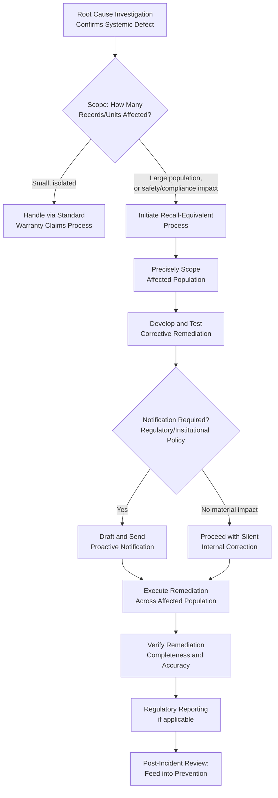

## Product Recalls and Field Service Costs

### Definition and Classification

Product Recalls and Field Service Costs is an External Failure Cost sub-category covering the cost of proactively removing, correcting, or servicing defective products already in customers' possession — at scale, for recalls, or individually, for field service — when the defect cannot be adequately addressed through routine warranty claim intake alone. It represents the most operationally intensive tier of External Failure remediation: unlike Warranty Claims (typically customer-initiated, one unit at a time) or Complaint Handling (reactive, investigation-driven), Recalls and Field Service are often organization-initiated, proactive, and executed at scale once a systemic defect pattern is confirmed.

$$\text{Prevention Cost} : \text{Appraisal Cost} : \text{Failure Cost} \approx 1 : 10 : 100$$

This category typically represents the highest-magnitude individual incidents within the External Failure tier, since a recall implies the defect is severe enough (safety-related, compliance-related, or affecting a large population of units) to warrant organization-initiated, systematic remediation rather than waiting for individual customers to notice and report the issue.

### Purpose and Scope

**Key Points**

- Product Recalls and Field Service Costs answers: "When a defect is confirmed to affect a population of already-delivered units, what does it cost to proactively find, notify, and remediate all of them — rather than waiting for each customer to individually complain?"
- Recalls are distinguished from Warranty Claims primarily by *initiation direction*: warranty claims are customer-initiated (a customer notices a problem and reports it); recalls are organization-initiated (the organization identifies a systemic issue and proactively reaches out).
- Field Service specifically refers to on-site remediation — dispatching personnel or resources to the customer's location — as opposed to remediation performed at the organization's own facility or shipped to the customer.

### Classical (Manufacturing) Scope

| Activity | Description |
| --- | --- |
| Recall Identification and Scoping | Determining which units, batches, or serial ranges are affected by a confirmed systemic defect |
| Customer/Owner Notification | Identifying and contacting all affected customers, often required to meet regulatory notification standards |
| Recall Logistics | Coordinating collection, shipping, or on-site correction of affected units at scale |
| Regulatory Reporting | Formal reporting to relevant regulatory bodies, particularly for safety-related recalls in regulated industries |
| Field Service Dispatch | Cost of sending technicians to customer locations to inspect, repair, or replace affected units on-site |
| Replacement Part/Unit Production | Cost of producing sufficient replacement parts or units to service the affected population |
| Recall Communication and PR Management | Public communication strategy to manage the recall's visibility and impact on brand trust |

### Recall vs. Warranty Claim: Initiation and Scale

| Dimension | Warranty Claim | Product Recall |
| --- | --- | --- |
| Initiation | Customer-initiated (reports an issue) | Organization-initiated (proactively identifies affected population) |
| Trigger | Individual customer complaint | Confirmed systemic defect pattern, often via trend analysis or safety investigation |
| Scale | One unit at a time | An entire batch, production run, or population of units |
| Regulatory Involvement | Typically none, unless pattern triggers investigation | Often mandatory reporting, particularly for safety-related defects |
| Customer Awareness | Customer already aware (they reported it) | Organization must proactively create awareness among potentially-unaware customers |
| Cost Driver | Per-claim remediation cost | Notification reach, logistics coordination, and remediation cost multiplied across the entire affected population |

### The Recall Decision: When Does a Pattern Become a Recall?

`[Inference]` The threshold at which an organization moves from passively handling individual warranty claims/complaints to proactively initiating a recall is typically driven by a combination of factors: severity of the defect (particularly safety implications), the size of the affected population, and — in regulated industries — specific legal/regulatory triggers that mandate recall action once certain conditions are met. This decision connects directly back to the Failure Analysis and Root Cause Investigation process: it is precisely when root cause investigation confirms a defect is systemic (not isolated) and affects an identifiable population of already-delivered units that the recall question arises.

### Software Engineering Translation

`[Inference]` Software has no literal physical recall process, but the underlying concept — proactively identifying and remediating an entire population of already-affected units, rather than waiting for individual reports — maps directly to several well-established software practices, particularly relevant once Root Cause Investigation (covered under Internal Failure Costs) confirms a defect is systemic:

| Manufacturing Concept | Software/DMS Equivalent |
| --- | --- |
| Recall scoping | Querying the production database to identify all records affected by a confirmed systemic defect |
| Customer/owner notification | Proactively notifying affected citizens/users, rather than waiting for them to notice and complain |
| Recall logistics | Coordinated, often scripted, bulk data-correction or reprocessing of all affected records |
| Regulatory reporting | Formal breach or incident notification to data-protection or oversight authorities, where a defect involves citizen data |
| Field service dispatch | Direct staff assistance for affected citizens who need in-person help resolving a system-caused issue (e.g., manually reprocessing a submission) |
| Replacement part production | Development and testing of the corrective patch/migration that will be applied at scale across all affected records |
| Recall communication/PR | Public or institutional notice explaining what happened, what's affected, and what's being done — particularly significant for a government system's citizen trust |

Concrete examples for a TypeScript/Fastify/tRPC/Drizzle/PostgreSQL monorepo:

- **Proactive Data Correction at Scale** — When Root Cause Investigation confirms a defect affected a specific population of records (e.g., the timezone-handling defect from the Warranty Claims example, if found to affect hundreds rather than a handful of submissions), scoping and executing a bulk correction across all affected records rather than waiting for individual citizen reports.
- **Proactive Citizen Notification** — For a government DMS, formally notifying all citizens whose records were affected by a confirmed defect, particularly where the defect could affect their standing with a deadline or compliance requirement — directly analogous to a manufacturing recall notice, and arguably carrying heightened institutional obligation given the government context.
- **Security Incident Disclosure** — If a defect exposed citizen data inappropriately, the combination of scoping the affected population, notifying them, and reporting to relevant data-protection oversight bodies mirrors the regulatory-reporting dimension of a manufacturing safety recall closely.
- **Coordinated Migration/Reprocessing Scripts** — The software equivalent of "replacement part production": developing, testing, and carefully executing a corrective script or migration designed specifically to remediate the confirmed-affected population, with the same rigor as a production code change given its scale of impact.
- **In-Person/Direct Assistance for Complex Cases** — The Field Service equivalent: for citizens whose affected records can't be automatically corrected (e.g., a submission that was lost entirely rather than merely mis-timestamped), providing direct staff assistance to manually resolve their specific case.
- **Post-Incident Public Statement** — For significant incidents, a public-facing explanation (analogous to recall communication/PR) balancing transparency with avoiding unnecessary alarm, particularly important for maintaining citizen trust in a public-sector digital service.

### Cost Modeling Example

Consider an escalated version of the timezone-handling defect from the Warranty Claims example: Root Cause Investigation determines the defect actually affected approximately 400 document submissions over a three-week window, not just the handful initially reported — discovered only once the pattern was investigated systemically rather than handled complaint-by-complaint.

- **Recall Scoping**: Engineering time to write and carefully verify a query identifying all 400 affected submissions with certainty (avoiding both false positives and false negatives in the affected set) — approximately 4–6 hours, given the need for accuracy before proactive action is taken.
- **Corrective Script Development and Testing**: Building, testing, and validating a correction script for the confirmed defect, with particular care given it will be applied at scale rather than to a single record — approximately 6–8 hours, reflecting higher rigor than a single-record manual fix would require.
- **Proactive Notification**: Drafting and sending notification to all 400 affected citizens (or, if the timestamp discrepancy has no material impact on their standing, potentially an internal-only correction with no citizen-facing notification required — a determination that itself requires careful judgment) — cost varies significantly based on this determination, but drafting and review of notification content alone might require 2–3 hours.
- **Execution and Verification**: Applying the correction across all 400 records, with spot-check verification that the correction was applied accurately and completely — approximately 3–4 hours.
- **Total**: Roughly 15–21 engineer-hours for the at-scale remediation, substantially more than the individual per-complaint handling cost calculated in the Warranty Claims example, but far more efficient and complete than attempting to resolve all 400 cases through the standard one-at-a-time complaint-handling channel — which would likely generate proportionally higher aggregate cost and leave many citizens whose discrepancy was never significant enough for them to notice and report, permanently uncorrected. `[Unverified]` Whether proactive notification is warranted for this specific defect (versus a silent internal-only correction) depends on regulatory and institutional policy considerations specific to the LGU's obligations, which would need direct determination rather than generic assumption.

### Process Flow: Recall Decision and Execution

### Recall Scale Cost Comparison (svg_diagram)

<svg xmlns="http://www.w3.org/2000/svg" viewBox="0 0 900 280">
<text x="450" y="24" text-anchor="middle" font-size="16" font-weight="bold" fill="#1a1a1a">Proactive Recall vs. Reactive Per-Complaint Handling (svg_diagram)</text>
<rect x="60" y="60" width="340" height="160" rx="8" fill="#fff4e5" stroke="#d68910" stroke-width="1.5" />
<text x="230" y="90" text-anchor="middle" font-size="13" font-weight="bold" fill="#1a1a1a">Reactive: Wait for Complaints</text>
<text x="230" y="115" text-anchor="middle" font-size="11" fill="#555">~400 affected, only a fraction</text>
<text x="230" y="131" text-anchor="middle" font-size="11" fill="#555">ever notice/report</text>
<text x="230" y="155" text-anchor="middle" font-size="11" fill="#555">Per-complaint cost × reported count</text>
<text x="230" y="175" text-anchor="middle" font-size="11" fill="#555">+ many records permanently</text>
<text x="230" y="191" text-anchor="middle" font-size="11" fill="#555">uncorrected</text>
<rect x="500" y="60" width="340" height="160" rx="8" fill="#e6f4ea" stroke="#2e8b57" stroke-width="1.5" />
<text x="670" y="90" text-anchor="middle" font-size="13" font-weight="bold" fill="#1a1a1a">Proactive: Recall-Equivalent</text>
<text x="670" y="115" text-anchor="middle" font-size="11" fill="#555">All 400 identified and</text>
<text x="670" y="131" text-anchor="middle" font-size="11" fill="#555">addressed systematically</text>
<text x="670" y="155" text-anchor="middle" font-size="11" fill="#555">Fixed scoping + script cost</text>
<text x="670" y="171" text-anchor="middle" font-size="11" fill="#555">regardless of population size</text>
<text x="670" y="191" text-anchor="middle" font-size="11" fill="#555">+ complete remediation</text>

<text x="450" y="250" text-anchor="middle" font-size="11" fill="#555">Proactive remediation cost scales sub-linearly with affected population,</text>

<text x="450" y="266" text-anchor="middle" font-size="11" fill="#555">unlike per-complaint handling, which scales with report volume alone</text>

</svg>

### Common Pitfalls

- **Delaying recall-equivalent action while individual complaints trickle in**: Continuing to handle a systemic defect one complaint at a time, even after Root Cause Investigation reveals a large affected population, leaves most of that population permanently uncorrected (since not every affected party will notice or report) and generates higher aggregate cost than proactive remediation.
- **Imprecise scoping of the affected population**: Executing a bulk correction based on an inaccurate query that includes false positives (correcting unaffected records unnecessarily) or misses false negatives (leaving genuinely affected records uncorrected) — accuracy in scoping is critical precisely because the remediation will be applied without individual case-by-case verification.
- **Under-testing at-scale corrective scripts**: Applying insufficient rigor to a correction script simply because each individual change seems simple, when the script's scale of application (hundreds or thousands of records) means an undetected flaw in the script itself could constitute a new, larger-scale defect — connecting to the Calibration and Maintenance of Test Equipment concern about verifying the correctness of tools used to make widespread changes.
- **No clear notification policy**: Lacking an established framework for deciding when proactive notification is warranted versus when silent correction suffices means each incident requires ad hoc judgment under time pressure, risking inconsistent handling of comparable situations.
- **Treating recall cost as purely remediation, ignoring institutional trust dimension**: Focusing cost estimates only on engineering/logistics time while underweighting the notification and communication component, particularly significant for a public-sector system where institutional trust has long-term value beyond any single incident.
- **No connection back to why Appraisal missed the systemic pattern**: `[Inference]` Completing a large-scale remediation without separately investigating why the defect wasn't caught earlier — at Final Inspection, or even earlier through better test coverage of the specific edge case involved — forfeits the Prevention-tier learning opportunity that the scale of this incident should prompt.

**Related Topics**

- Definition and Scope of External Failure Costs (parent category)
- Warranty Claims and Product Returns (individual-scale counterpart)
- Customer Complaint Handling (typical discovery path for recall-triggering patterns)
- Failure Analysis and Root Cause Investigation (determines recall scope and necessity)
- Regulatory Fines and Compliance Penalties
- Data Breach Notification and Security Incident Response
- Reputational and Goodwill Damage Assessment
- Calibration and Maintenance of Test Equipment (verifying at-scale remediation tools)