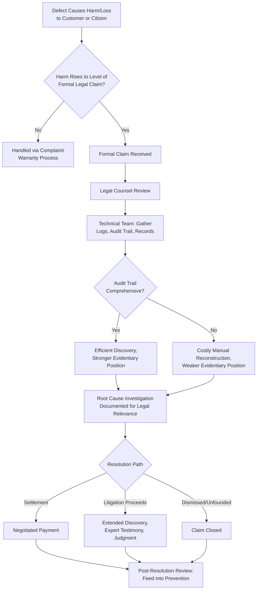

## Liability Claims and Litigation

### Definition and Classification

Liability Claims and Litigation is an External Failure Cost sub-category covering the cost of legal exposure arising when a defect causes harm, loss, or damage to a customer, third party, or their property — extending beyond remediation of the defect itself into formal legal proceedings, claims of damages, and the associated defense, settlement, or judgment costs. It represents the most legally consequential tier of External Failure: where Warranty Claims and Recalls address the *product* or *service* defect directly, Liability and Litigation address the *harm* the defect is alleged to have caused, introducing an entirely different set of processes (legal defense, discovery, settlement negotiation) governed by law rather than internal quality procedure.

$$\text{Prevention Cost} : \text{Appraisal Cost} : \text{Failure Cost} \approx 1 : 10 : 100$$

Liability and Litigation cost sits at the most severe and least controllable end of the External Failure tier. Unlike Warranty Claims (a defined, bounded process) or even Recalls (large-scale but organizationally-driven), litigation timelines, outcomes, and costs are substantially determined by external legal processes, opposing parties, and judicial or regulatory bodies — placing this category at the furthest extreme of the control spectrum introduced under Definition and Scope of External Failure Costs.

### Purpose and Scope

**Key Points**

- Liability Claims and Litigation answers: "When a defect is alleged to have caused actual harm or loss, what does it cost the organization to defend against, negotiate, or resolve the resulting legal claim?"
- It is distinguished from other External Failure categories by the presence of an *adversarial legal process* — a claim of liability implies the organization's conduct or product is being formally scrutinized against a legal standard, not just a quality standard.
- Unlike Warranty Claims and Recalls, where the organization typically controls the remediation process and timeline, Liability and Litigation timelines and outcomes are substantially shaped by external parties: claimants, their legal counsel, courts, and applicable regulatory bodies.

### Classical (Manufacturing/Service) Scope

| Activity | Description |
| --- | --- |
| Legal Defense Costs | Attorney fees and legal team time spent defending against a liability claim |
| Settlement Costs | Negotiated payments made to resolve a claim without proceeding to full litigation or judgment |
| Judgment/Damages Costs | Court-ordered payments if litigation proceeds to an adverse judgment |
| Insurance Premium Increases | Higher future insurance costs resulting from claims history, even when a specific claim is covered |
| Discovery and Investigation Costs | Cost of gathering, reviewing, and producing evidence during the legal discovery process |
| Expert Witness and Consultant Fees | Cost of technical experts engaged to support the organization's legal position |
| Regulatory Investigation Costs | Cost of responding to regulatory bodies that may investigate in parallel with or independent of private litigation |

### Liability and Litigation vs. Other External Failure Categories

| Dimension | Warranty Claims | Product Recalls | Liability/Litigation |
| --- | --- | --- | --- |
| Trigger | Customer reports a defect | Organization identifies systemic defect pattern | A claim that the defect caused actual harm/loss |
| Process Governing Resolution | Internal warranty policy | Internal recall procedure + regulatory notification | External legal system, courts, applicable law |
| Organizational Control Over Timeline | High | Moderate — organization drives the process | Low — substantially determined by claimant, courts, legal process |
| Typical Cost Driver | Per-unit remediation | Scope of affected population | Severity of alleged harm, complexity of legal proceedings |
| Outcome Certainty | High — remediation path is defined | Moderate — execution risk exists but goal is clear | Low — settlement vs. judgment vs. dismissal outcomes vary widely |

### The Liability Threshold: When Does a Defect Become a Legal Claim?

`[Inference]` Not every defect that reaches a customer generates liability exposure — the threshold typically depends on whether the defect is alleged to have caused actual, legally cognizable harm (financial loss, physical injury, breach of a legal duty or contractual obligation) rather than mere dissatisfaction or inconvenience, which would more typically remain in the Complaint Handling or Warranty Claims categories. For a government-facing system, this threshold may also involve considerations specific to public-sector liability frameworks, which can differ meaningfully from private commercial liability exposure.

### Software Engineering Translation

`[Inference]` For a TypeScript/Fastify/tRPC/Drizzle/PostgreSQL monorepo serving a Philippine LGU, Liability Claims and Litigation concretely relates to:

- **Data Breach Liability** — If a defect exposes citizen personal data inappropriately, potential legal exposure under applicable data-protection law (in the Philippines, the Data Privacy Act of 2012 and its implementing rules, enforced by the National Privacy Commission) — a defect-triggered liability pathway distinct from, though related to, the regulatory reporting obligations discussed under Product Recalls.
- **Missed-Deadline Liability** — If a software defect caused a citizen's document submission to fail or be delayed past a legally significant deadline (e.g., a permit renewal, a compliance filing), and that citizen suffered a demonstrable loss as a result, this could constitute grounds for a liability claim against the LGU, depending on applicable public-sector liability frameworks. `[Unverified]` The specific liability exposure of a Philippine LGU for a software-caused processing delay would depend on the applicable legal framework governing government liability for administrative errors, which is outside the scope of what can be determined generically here and would require actual legal consultation.
- **Contractual Liability (Vendor/Integration Context)** — If the DMS integrates with third-party services under contract (e.g., an OCR vendor, an identity-verification provider), a defect in that integration could trigger contractual liability claims either from or against those vendors, depending on which party's defect caused the harm.
- **Discovery and Evidence Production** — In the event of litigation, the technical team's time spent producing logs, audit trails, code history, and other technical evidence in response to legal discovery requests — a cost category with direct connection to the DMS's audit-trail architecture (discussed under Quality System Development Costs), since well-maintained audit trails can significantly reduce the cost and difficulty of discovery.
- **Expert/Technical Consultation for Legal Defense** — Engineering time spent explaining technical system behavior to legal counsel, or serving as a technical expert if litigation proceeds, translating the defect's technical root cause into terms relevant to the legal question of liability.

### Why Litigation Cost Is Especially Difficult to Plan For

**Key Points**

- Unlike Warranty Claims (predictable via historical claim rate) or even Recalls (bounded by a known affected population), litigation frequency and outcome are influenced by factors largely outside the organization's technical quality processes — claimant decisions, legal strategy, jurisdictional variation, and case-specific circumstances.
- Insurance (where applicable) can convert some litigation cost into a more predictable premium expense, but doesn't eliminate the underlying risk, deductibles, or the non-financial costs (time, attention, reputational exposure during proceedings) that accompany a claim.
- `[Inference]` Because litigation cost is both high-severity and low-frequency for most defects (only a small fraction of defects, even serious ones, escalate to formal legal claims), it is a category where standard CoQ trend-tracking (defect rate, complaint rate) is less directly predictive — a low historical litigation rate does not necessarily indicate low exposure, since a single severe, well-substantiated claim can generate cost far exceeding the aggregate of many smaller External Failure incidents.

### Connection to Audit Trail and Documentation Quality

A distinctive aspect of Liability and Litigation cost, particularly relevant to a government records system, is that the *quality of the organization's own documentation and audit trail* directly affects litigation cost and outcome — independent of whether the original defect was serious.

- **Strong audit trails** (comprehensive, tamper-evident logging of who did what and when, discussed under Quality System Development Costs) can substantially reduce discovery cost and support a stronger legal position, since the technical record of events is readily available and credible.
- **Weak or missing audit trails** can increase both discovery cost (more manual reconstruction effort) and litigation risk (an inability to demonstrate what actually happened can weaken the organization's position even when the underlying conduct was reasonable).

`[Inference]` This creates a direct, quantifiable link between a Prevention-tier investment (building robust audit-trail architecture) and a potential future reduction in External Failure Cost specifically within the Liability/Litigation category — one of the clearer cross-tier connections in the CoQ framework, though the actual magnitude of risk reduction would depend on case-specific factors that cannot be estimated generically.

### Cost Modeling Example

Consider a hypothetical scenario building on the missed-deadline concern above: a citizen alleges that a DMS defect caused their permit renewal submission to be lost or delayed past a legal deadline, resulting in a lapsed permit and associated financial loss, and the citizen formally pursues a claim against the LGU.

- **Initial Legal Review**: LGU legal counsel time reviewing the claim's merits and requesting technical information from the engineering team — engineering time to gather relevant logs and system records: approximately 4–6 hours, substantially reduced if audit-trail data is comprehensive and readily queryable versus requiring manual reconstruction.
- **Technical Discovery Support**: If the claim proceeds, ongoing engineering time to respond to specific technical discovery requests (explaining system behavior, producing additional records, clarifying timeline of events) — potentially spread over weeks or months depending on legal process timeline, difficult to estimate precisely given dependence on external legal proceedings.
- **Root Cause Documentation**: Engineering time to conduct and thoroughly document a Root Cause Investigation specifically because its findings may be directly relevant to the legal question of whether the LGU's system (and by extension, its processes) functioned with reasonable care — connecting the technical Root Cause Investigation practice directly to legal defense needs.
- **Outcome-Dependent Cost**: `[Unverified]` Whether this scenario results in settlement, dismissal, or an adverse outcome — and the associated cost of each path — depends entirely on case-specific legal factors (the strength of the citizen's claim, applicable LGU liability framework, quality of the LGU's evidence) that cannot be estimated generically and would require actual legal assessment specific to the real circumstances.

This example illustrates why, unlike the more mechanically-estimable examples in other External Failure sub-categories, Liability and Litigation cost modeling is inherently more uncertain — the technical team's primary controllable contribution is in reducing the *probability* of the underlying defect (Prevention/Appraisal investment) and in ensuring strong audit-trail quality that supports efficient, credible discovery if a claim does arise.

### Process Flow: Defect to Potential Liability Claim

### Audit Trail Quality vs. Litigation Cost/Risk (svg_diagram)

<svg xmlns="http://www.w3.org/2000/svg" viewBox="0 0 900 280">
<text x="450" y="24" text-anchor="middle" font-size="16" font-weight="bold" fill="#1a1a1a">Prevention-Tier Investment Reduces Litigation Exposure (svg_diagram)</text>
<rect x="60" y="60" width="340" height="160" rx="8" fill="#fdecea" stroke="#c0392b" stroke-width="1.5" />
<text x="230" y="90" text-anchor="middle" font-size="13" font-weight="bold" fill="#1a1a1a">Weak Audit Trail</text>
<text x="230" y="115" text-anchor="middle" font-size="11" fill="#555">Manual reconstruction</text>
<text x="230" y="131" text-anchor="middle" font-size="11" fill="#555">of events required</text>
<text x="230" y="155" text-anchor="middle" font-size="11" fill="#555">Higher discovery cost</text>
<text x="230" y="171" text-anchor="middle" font-size="11" fill="#555">Weaker evidentiary position</text>
<text x="230" y="191" text-anchor="middle" font-size="11" fill="#c0392b">Higher litigation risk/cost</text>
<rect x="500" y="60" width="340" height="160" rx="8" fill="#e6f4ea" stroke="#2e8b57" stroke-width="1.5" />
<text x="670" y="90" text-anchor="middle" font-size="13" font-weight="bold" fill="#1a1a1a">Strong Audit Trail</text>
<text x="670" y="115" text-anchor="middle" font-size="11" fill="#555">Comprehensive, tamper-</text>
<text x="670" y="131" text-anchor="middle" font-size="11" fill="#555">evident logging in place</text>
<text x="670" y="155" text-anchor="middle" font-size="11" fill="#555">Lower discovery cost</text>
<text x="670" y="171" text-anchor="middle" font-size="11" fill="#555">Credible evidentiary position</text>
<text x="670" y="191" text-anchor="middle" font-size="11" fill="#2e8b57">Reduced litigation risk/cost</text>

<text x="450" y="250" text-anchor="middle" font-size="11" fill="#555">Quality System Development investment in audit-trail architecture</text>

<text x="450" y="266" text-anchor="middle" font-size="11" fill="#555">directly affects downstream External Failure liability exposure</text>

</svg>

### Common Pitfalls

- **No connection between technical root-cause findings and legal defense needs**: Conducting a Root Cause Investigation purely as a technical exercise without recognizing its potential relevance to legal proceedings means findings may not be documented with the rigor or clarity that later legal review would benefit from.
- **Underinvesting in audit-trail architecture until litigation makes the gap painfully apparent**: Treating comprehensive audit logging as a "nice to have" Quality System Development item rather than recognizing its direct link to future litigation cost and risk reduction, particularly significant for a government records system with inherent public accountability.
- **Assuming low historical litigation frequency means low exposure**: Because liability claims are typically low-frequency but potentially high-severity, a clean litigation history doesn't necessarily indicate the organization's practices are well-protected against future claims — a single severe, well-substantiated incident can generate outsized cost regardless of prior track record.
- **Treating legal and technical teams as separate, non-communicating functions**: Failing to establish a clear process for technical staff to support legal counsel efficiently (providing accurate, well-organized technical evidence) can inflate discovery cost and weaken the organization's position during actual proceedings.
- **No proactive assessment of public-sector liability exposure specific to the jurisdiction**: `[Unverified]` Assuming general commercial liability principles apply without verifying the specific liability framework governing a Philippine LGU's exposure for software-related administrative failures would be a significant gap; this determination requires actual legal consultation rather than technical assumption.
- **Conflating litigation risk reduction with defect elimination alone**: Focusing purely on reducing defect rate (Prevention/Appraisal investment) while neglecting audit-trail quality and documentation practices misses that litigation cost is shaped by *both* the underlying defect rate *and* the organization's ability to demonstrate reasonable care when a claim does arise.

**Related Topics**

- Definition and Scope of External Failure Costs (parent category)
- Product Recalls and Field Service Costs (related regulatory/notification obligations)
- Quality System Development Costs (audit-trail architecture as Prevention investment)
- Failure Analysis and Root Cause Investigation (documentation relevant to legal defense)
- Regulatory Fines and Compliance Penalties
- Data Privacy Act Compliance and Data Breach Liability (Philippine context)
- Reputational and Goodwill Damage Assessment
- Insurance and Risk Transfer in Quality Cost Management