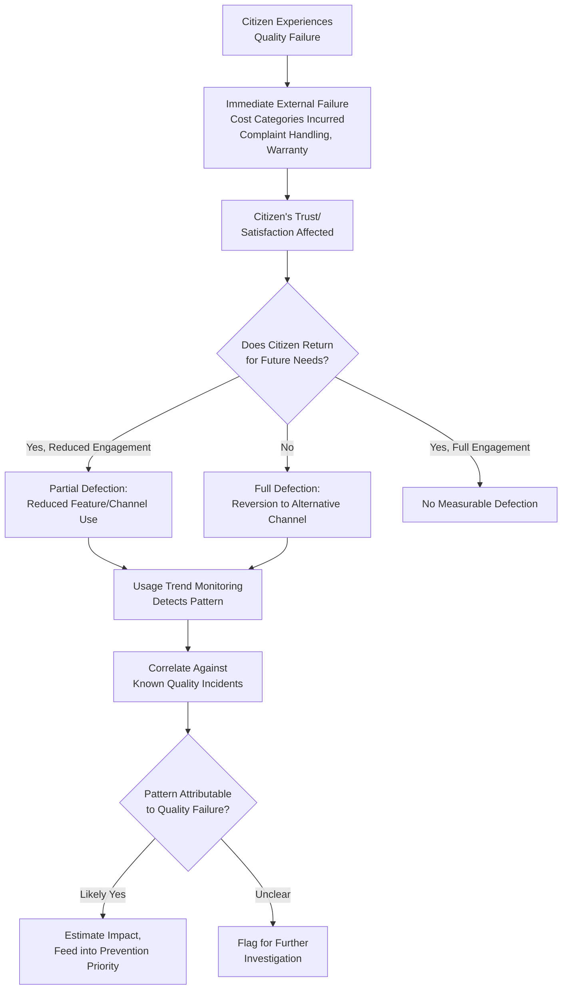

## Lost Sales and Customer Defection

### Definition and Classification

Lost Sales and Customer Defection is an External Failure Cost sub-category covering the revenue and relationship value lost when a customer, having experienced a quality failure, reduces or discontinues their business with the organization entirely — as distinct from the direct remediation costs (warranty, recall, litigation) already incurred to address the underlying defect. It represents a forward-looking, opportunity-cost category rather than a direct expenditure: the organization doesn't necessarily spend money reacting to defection, but forgoes future revenue and relationship value it would otherwise have realized.

$$\text{Prevention Cost} : \text{Appraisal Cost} : \text{Failure Cost} \approx 1 : 10 : 100$$

Lost Sales and Customer Defection sits within the $100 tier of External Failure, but is distinctive among External Failure sub-categories in being almost entirely an *opportunity cost* rather than a direct cash outlay — this makes it, alongside Reputational/Goodwill Damage, one of the most difficult External Failure categories to measure precisely, since it requires estimating a counterfactual (what revenue *would* have been realized absent the defection) rather than tallying an actual expenditure.

### Purpose and Scope

**Key Points**

- Lost Sales and Customer Defection answers: "What future revenue and relationship value do we forfeit because a customer's trust was damaged by a quality failure?"
- Unlike Warranty Claims or Recalls, where the cost is a bounded, identifiable transaction, defection cost is diffuse and often only becomes visible through trend analysis (declining repeat business, non-renewal rates) rather than a single traceable incident.
- The relationship between a specific defect and eventual customer defection is frequently indirect and cumulative — a single failure may not by itself trigger defection, but repeated or severe failures compound a customer's declining trust until a threshold is crossed.

### Classical (Commercial) Scope

| Activity | Description |
| --- | --- |
| Customer Churn | A customer discontinuing their relationship with the organization entirely |
| Reduced Repeat Business | A retained customer purchasing/engaging less than they otherwise would have |
| Contract Non-Renewal | A customer with a recurring or contractual relationship choosing not to renew |
| Referral Loss | Lost future business from word-of-mouth or referral that would have occurred absent the quality failure |
| Market Share Erosion | Aggregate competitive position loss when quality failures become widely known within a market segment |
| Customer Lifetime Value (CLV) Reduction | The reduced total future value of a retained-but-less-engaged customer relationship |

### Measuring Lost Sales: The Counterfactual Problem

`[Inference]` The fundamental measurement challenge in this category is that it requires estimating what *would have happened* absent the quality failure — a counterfactual that can never be directly observed, only approximated through methods such as:

$$\text{Estimated Lost Value} \approx \text{CLV}_{\text{baseline}} - \text{CLV}_{\text{post-failure, actual}}$$

Where $\text{CLV}_{\text{baseline}}$ is drawn from comparable customers who did not experience the failure, or from the customer's own pre-failure engagement trajectory, and $\text{CLV}_{\text{post-failure, actual}}$ reflects their observed behavior afterward. This approach requires reasonably good baseline data and carries inherent uncertainty, since factors other than the quality failure (market conditions, the customer's own changing needs, competitor actions) also influence retention independent of any single incident.

### Lost Sales/Defection vs. Other External Failure Categories

| Dimension | Warranty Claims / Recalls | Complaint Handling | Lost Sales / Defection |
| --- | --- | --- | --- |
| Cost Type | Direct expenditure | Direct expenditure (investigation/response time) | Opportunity cost (forgone future revenue) |
| Measurability | High — bounded, traceable transactions | Moderate — traceable interactions | Low — requires counterfactual estimation |
| Timing | Immediate, at time of claim | Immediate, at time of complaint | Delayed — often manifests over subsequent months/years |
| Visibility | High — explicit financial transaction | High — explicit support interaction | Low — often invisible without deliberate trend tracking |
| Root Cause Traceability | Usually clear (linked to specific claim) | Usually clear (linked to specific complaint) | Often unclear — defection is frequently multi-causal and cumulative |

### Software/Public-Sector Translation

`[Inference]` For a government-facing DMS specifically, the commercial concept of "lost sales" doesn't translate directly (there is typically no alternative competing LGU service a citizen can switch to), but the underlying concern — citizens disengaging from or losing trust in the digital service due to quality failures — maps to a distinct but analogous set of concerns:

| Commercial Concept | Public-Sector DMS Equivalent |
| --- | --- |
| Customer churn to a competitor | Citizens reverting to in-person, paper-based processes instead of using the digital system |
| Reduced repeat business | Citizens who use the DMS but avoid features or workflows they previously had a bad experience with |
| Contract non-renewal | Reduced institutional/departmental adoption of the DMS for workflows where it was optional |
| Referral loss | Reduced organic word-of-mouth adoption among citizens or between LGU departments |
| Market share erosion | `[Inference]` Less directly applicable given the LGU's typically non-competitive service position, though a comparable dynamic could manifest as reduced political/administrative support for continued digital-service investment if the system develops a poor reputation |
| Customer Lifetime Value reduction | Reduced long-term digital engagement per citizen, increasing the LGU's ongoing burden of parallel in-person service capacity |

Concrete examples for the batac-dms context:

- **Reversion to Paper-Based Processes** — Citizens who experienced a defect (a lost submission, a confusing error, a delayed approval with no visibility) choosing to bypass the digital system for future submissions in favor of in-person processing, even after the underlying defect is fixed — the direct public-sector analogue of customer churn, and one that undermines the core value proposition of having built the DMS in the first place.
- **Departmental Workflow Abandonment** — If specific LGU departments or staff adopted the DMS for internal workflows but encountered reliability issues, their potential reversion to legacy manual or spreadsheet-based processes for those workflows, representing lost internal "adoption value" analogous to contract non-renewal.
- **Reduced Feature Engagement** — Citizens who continue using the DMS overall but specifically avoid a feature that previously failed them (e.g., avoiding the online status-tracking feature after a prior confusing experience, even once the underlying UX or defect issue is resolved) — a partial, feature-specific defection rather than full abandonment.
- **Erosion of Digital-First Policy Support** — `[Speculation]` If quality failures become visible enough to affect broader institutional or public perception of the DMS initiative, this could plausibly affect ongoing organizational commitment to digital-service expansion, though this specific causal chain would need direct evidence from the LGU's actual institutional context to substantiate rather than assumed.

### Why This Category Is Frequently Underestimated

**Key Points**

- Because Lost Sales/Defection cost rarely presents as a single, attributable transaction, it is the External Failure category most likely to be entirely absent from an organization's quality cost accounting, even when other categories (Warranty Claims, Recalls) are tracked rigorously.
- The delayed and cumulative nature of defection means the causal link back to a specific quality failure — or even to quality as a general factor — can be genuinely difficult to establish with confidence, distinct from categories like Warranty Claims where causation is typically clear at the point of the claim itself.
- `[Inference]` Organizations that track only the directly-measurable External Failure categories (warranty, recalls, litigation) risk systematically underweighting Prevention and Appraisal investment relative to true total External Failure cost, since the harder-to-measure categories (defection, reputational damage) may in aggregate represent a substantial, if invisible, share of total quality cost.

### Approaches to Making Defection Visible

`[Inference]` Given the inherent measurement difficulty, several complementary approaches can make this otherwise-invisible cost category more tractable:

1. **Usage Trend Monitoring** — Tracking engagement/usage metrics (submission volume per citizen, feature adoption rates, repeat-usage rates) over time and correlating dips against known quality incidents, even without perfect causal certainty.
2. **Direct Feedback Correlation** — Cross-referencing Complaint Handling data (particularly the "Valid Dissatisfaction, No Defect" category) against subsequent engagement drop-off for the citizens involved, where feasible and appropriate given privacy considerations.
3. **Exit/Abandonment Surveys** — Where citizens do revert to alternative (e.g., in-person) channels, understanding why, if a feedback mechanism exists to capture that information.
4. **Benchmark Comparison** — Comparing engagement trends against a baseline period or against comparable services, to distinguish quality-driven defection from other explanatory factors (seasonal variation, broader digital-adoption trends).

### Cost Modeling Example

Consider a scenario where, following a period of visible reliability issues with the DMS's document-status tracking feature (including the timezone-discrepancy and status-visibility issues discussed in earlier examples), usage-trend monitoring reveals that citizens who experienced a tracking-related issue show a measurably lower rate of using the DMS for subsequent submissions over the following six months, compared to citizens who did not experience such an issue.

- **Baseline comparison**: Among citizens with no reported tracking issue, 70% of those who submit once return to use the DMS again within six months for a subsequent need; among citizens who reported a tracking-related issue, only 45% return, with the remainder presumably reverting to in-person processing (though this can't be confirmed with certainty from DMS usage data alone).
- **Estimated impact**: `[Speculation]` If this gap is attributable to the quality issue rather than confounding factors (a determination that would require more rigorous analysis than usage data alone provides), the difference represents a meaningful loss of ongoing digital engagement per affected citizen — with downstream costs including continued burden on in-person processing capacity and reduced realization of the DMS's intended efficiency gains — though the specific magnitude of this cost in concrete terms would require further institutional analysis to quantify credibly.
- **Actionable insight regardless of precise quantification**: Even without a precise dollar figure, the *existence* of this usage gap is itself valuable diagnostic information, prompting targeted investigation into whether the underlying reliability issues have been adequately addressed and whether proactive re-engagement (e.g., a follow-up notification once the issue is resolved) might help recover some of the lost engagement.

### Process Flow: From Quality Failure to Measurable Defection Signal

### Visible vs. Invisible External Failure Cost (svg_diagram)

<svg xmlns="http://www.w3.org/2000/svg" viewBox="0 0 900 280">
<text x="450" y="24" text-anchor="middle" font-size="16" font-weight="bold" fill="#1a1a1a">The Measurement Gap in External Failure Cost (svg_diagram)</text>
<rect x="60" y="60" width="340" height="160" rx="8" fill="#e8f0fe" stroke="#4a76d4" stroke-width="1.5" />
<text x="230" y="90" text-anchor="middle" font-size="13" font-weight="bold" fill="#1a1a1a">Directly Measurable</text>
<text x="230" y="115" text-anchor="middle" font-size="11" fill="#555">Warranty Claims</text>
<text x="230" y="133" text-anchor="middle" font-size="11" fill="#555">Complaint Handling</text>
<text x="230" y="151" text-anchor="middle" font-size="11" fill="#555">Recalls / Field Service</text>
<text x="230" y="169" text-anchor="middle" font-size="11" fill="#555">Litigation</text>
<text x="230" y="195" text-anchor="middle" font-size="10" fill="#4a76d4">Bounded transactions,</text>
<text x="230" y="209" text-anchor="middle" font-size="10" fill="#4a76d4">immediate visibility</text>
<rect x="500" y="60" width="340" height="160" rx="8" fill="#fdecea" stroke="#c0392b" stroke-width="1.5" />
<text x="670" y="90" text-anchor="middle" font-size="13" font-weight="bold" fill="#1a1a1a">Often Invisible</text>
<text x="670" y="115" text-anchor="middle" font-size="11" fill="#555">Lost Sales / Customer</text>
<text x="670" y="131" text-anchor="middle" font-size="11" fill="#555">Defection</text>
<text x="670" y="151" text-anchor="middle" font-size="11" fill="#555">Reputational / Goodwill</text>
<text x="670" y="167" text-anchor="middle" font-size="11" fill="#555">Damage</text>
<text x="670" y="193" text-anchor="middle" font-size="10" fill="#c0392b">Diffuse, delayed,</text>
<text x="670" y="207" text-anchor="middle" font-size="10" fill="#c0392b">counterfactual-dependent</text>

<text x="450" y="250" text-anchor="middle" font-size="11" fill="#555">Both categories are real cost — only one is easy to see in standard accounting</text>

</svg>

### Common Pitfalls

- **Ignoring this category entirely due to measurement difficulty**: Excluding Lost Sales/Defection from quality cost tracking simply because it resists precise measurement, rather than using approximate/directional methods (trend monitoring, cohort comparison), understates total External Failure Cost and can lead to underinvestment in Prevention relative to true total quality cost.
- **Attributing defection to quality failure without considering confounding factors**: Assuming any observed engagement decline is quality-driven without ruling out other explanations (seasonal patterns, unrelated policy changes, broader digital-adoption trends) risks drawing incorrect conclusions from correlational data.
- **No baseline for comparison**: Attempting to assess defection impact without any baseline (comparable unaffected customers, or the customer's own prior engagement trajectory) makes the counterfactual estimation effectively impossible.
- **Treating a single failure and cumulative failures identically**: Assuming defection results from a single incident when it is frequently the cumulative effect of repeated smaller failures crossing a trust threshold — this distinction matters for where corrective attention should focus (systemic reliability improvement vs. addressing one isolated incident).
- **No mechanism to detect partial defection**: Focusing only on full customer/citizen churn while missing partial defection (reduced feature use, reduced engagement frequency) undercounts the actual scope of trust erosion occurring.
- **For public-sector systems, assuming no defection risk exists**: `[Inference]` Because citizens may lack an alternative "competitor" to switch to, it can be tempting to assume defection isn't a meaningful risk category for a government system — but reversion to costlier in-person/manual processes represents a real, analogous form of defection with genuine institutional cost, even without a competitive marketplace dynamic.

**Related Topics**

- Definition and Scope of External Failure Costs (parent category)
- Customer Complaint Handling (feedback source correlating to defection)
- Reputational and Goodwill Damage Assessment (closely related, similarly hard-to-measure category)
- Customer Lifetime Value (CLV) Measurement Approaches
- Voice of Customer (VOC) Input to New Product Quality Planning
- Usage Trend Analysis and Cohort Comparison Methods
- Digital Service Adoption in Public-Sector Contexts
- Cost of Quality Measurement and Reporting Systems