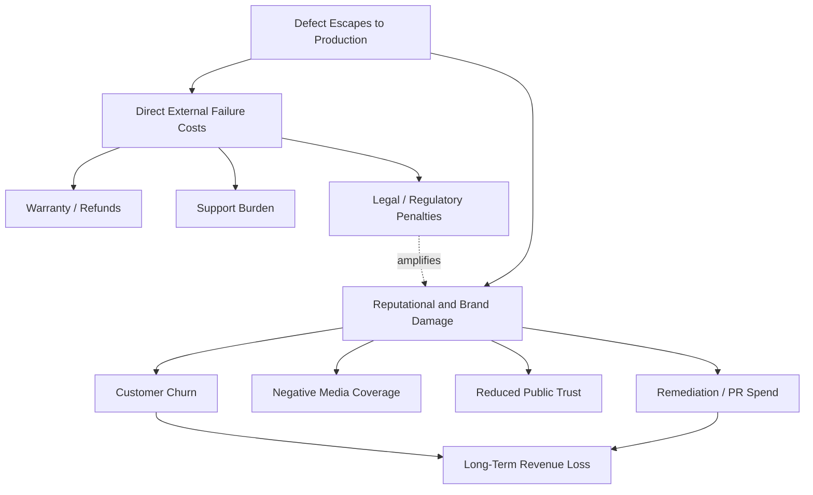

## Reputational and Brand Damage

### Definition and Position in the Cost of Quality Framework

Reputational and brand damage is a category of **external failure cost** under the Cost of Quality (CoQ) model. External failure costs are costs incurred when a defect, service failure, or quality lapse reaches the customer or the public after the product/service has been delivered — as opposed to internal failure costs, which are caught before release.

Within the 1-10-100 Rule, reputational damage represents the far end of the cost escalation curve:

- **$1** — cost to prevent a defect at the design/development stage
- **$10** — cost to correct it during internal QA/testing
- **$100** — cost to fix it after it reaches the customer (external failure)

Reputational damage is not simply another instance of "$100" — it is often the **multiplier that makes the $100 figure understated**. A single external failure can produce a fixed repair/refund cost, but if that failure becomes visible to the public, the cost compounds through lost trust, lost future revenue, and remediation activities that are difficult to bound in advance.

### Why Reputational Damage Is Treated Separately

Traditional CoQ accounting (warranty costs, returns, recalls, liability claims) captures **direct, transactional** costs. Reputational damage is distinct because it is:

1. **Indirect** — it does not appear as a line item on an invoice; it appears as reduced conversion rates, customer churn, or stock price movement.
2. **Delayed** — the damage may not materialize for months, long after the technical root cause is fixed.
3. **Non-linear** — a single high-visibility failure (e.g., a data breach at a government agency) can outweigh thousands of minor, unreported failures combined.
4. **Difficult to reverse** — unlike a refunded transaction, lost trust requires sustained remediation to rebuild, if it can be rebuilt at all.

### Mechanisms of Reputational Damage

**Key Points**

- **Direct customer experience** — a user personally encounters a bug, outage, or service failure and adjusts their trust in the organization.
- **Word-of-mouth / social amplification** — dissatisfied users publicize the failure (social media, review sites, forums), reaching audiences far beyond those directly affected.
- **Media coverage** — failures with public interest (safety issues, data breaches, service outages affecting government/public services) attract press attention, which is harder to control and often outlives the technical incident.
- **Regulatory and compliance fallout** — in sectors like government, healthcare, and finance, a failure can trigger audits or sanctions that are publicly disclosed, compounding reputational harm.
- **Competitive exploitation** — competitors may use a publicized failure in their own marketing or sales conversations.

### Quantifying Reputational Cost (Proxy Metrics)

Because reputational damage cannot be measured directly in currency at the time of failure, organizations use **proxy metrics** to estimate its financial impact:

| Proxy Metric | What It Measures | Typical Data Source |
| --- | --- | --- |
| Customer churn rate (post-incident) | % of users who stop using the service after a failure | Product analytics, subscription records |
| Net Promoter Score (NPS) delta | Change in willingness to recommend | Customer surveys |
| Customer Lifetime Value (CLV) loss | Revenue foregone from churned users | Financial + CRM data |
| Media sentiment score | Positive/negative tone of press coverage | Media monitoring tools |
| Social media sentiment | Public sentiment trend around brand mentions | Social listening tools |
| Stock price movement (public companies) | Market's immediate valuation of the incident | Public market data |
| Support ticket volume spike | Increased burden on support channels post-incident | Helpdesk system logs |
| Cost of remediation campaigns | PR, legal, customer outreach spend to recover trust | Internal accounting |

**Example**

A simplified reputational cost estimate:

$$\text{Reputational Cost} = (\text{Churned Customers} \times \text{Average CLV}) + \text{Remediation Spend} + \text{Opportunity Cost of Lost New Customers}$$

If a service outage causes 500 customers to churn, each with an average CLV of $1,200, plus $50,000 in PR/remediation spend:

$$(500 \times 1200) + 50000 = 650000$$

This $650,000 figure sits far above the "$100" tier of the 1-10-100 Rule and illustrates why prevention-stage investment (the "$1" tier) is economically justified even when individual defects seem minor.

### Reputational Risk in Civic/Government Software Contexts

For systems like a Local Government Unit (LGU) document management system, reputational damage carries distinct characteristics compared to commercial software:

- **Public trust in institutions** — failures (e.g., lost records, unauthorized data exposure, prolonged downtime for public-facing services) damage not just the vendor's reputation but public confidence in the LGU itself.
- **No "customer churn" escape valve** — citizens cannot switch providers the way commercial customers can, so damage manifests as political and social friction rather than lost sales, but is still a real operational cost (complaints, formal inquiries, reduced compliance/cooperation from the public).
- **Amplification via local media and social channels** — in municipal contexts, failures are often reported through local news outlets and community social media groups, which can spread faster than formal channels.
- **Audit and compliance exposure** — government systems are frequently subject to public audits (e.g., Commission on Audit in the Philippines); a quality failure discovered during audit compounds reputational risk for both the implementing office and any contracted developers.
- **Accountability chain** — reputational damage in this context often extends to identifiable individuals or offices (department heads, IT officers), not just an abstract "brand."

### Mitigation Strategies

**Key Points**

- **Invest at the $1 tier** — rigorous requirements review, code review, and design validation reduce the probability of failures reaching production.
- **Robust internal QA ($10 tier)** — thorough testing (unit, integration, UAT) catches defects before external exposure.
- **Incident response planning** — predefined communication protocols reduce the *duration* and *tone* of negative exposure when failures do occur.
- **Transparency and rapid disclosure** — proactive, honest communication about an incident generally produces less reputational damage than delayed or evasive responses.
- **Post-incident remediation visibility** — publicly demonstrating fixes and process improvements helps rebuild trust over time.
- **SLA and uptime monitoring** — for systems with public-facing components, proactive monitoring reduces the likelihood that failures are discovered by users/media before the organization is aware.

### Relationship to Other External Failure Cost Categories

Reputational damage typically co-occurs with, and amplifies, other external failure costs:

[Inference] The relative weight of reputational damage versus direct costs varies significantly by industry and by whether the failure is a one-time incident or indicates a systemic pattern; organizations should calibrate proxy metrics to their own historical incident data rather than relying solely on generic industry benchmarks.

**Next Steps**

- Customer Lifetime Value (CLV) modeling for churn impact estimation
- Incident response and crisis communication planning
- Regulatory/compliance failure costs (specific to government and public-sector software)
- Building a quality cost dashboard incorporating proxy reputational metrics
- Case study analysis: high-profile data breach cost breakdowns
- SLA design for public-facing government digital services