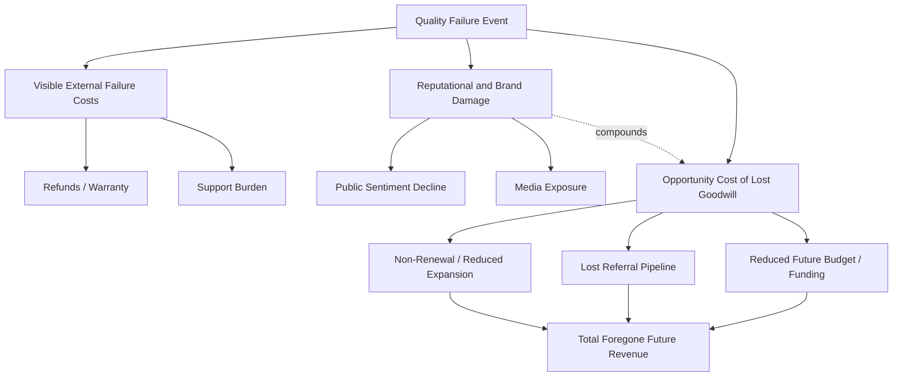

## Opportunity Cost of Lost Customer Goodwill

### Definition and Position in the Cost of Quality Framework

Opportunity cost of lost customer goodwill is an **external failure cost** in the Cost of Quality (CoQ) model that captures the value of business that is *never realized* because a quality failure eroded a customer's (or stakeholder's) willingness to continue engaging, referring, or expanding their relationship with an organization. Unlike direct external failure costs (refunds, warranty claims, support tickets), this cost is not a cash outflow — it is **foregone revenue and foregone value that would otherwise have occurred**.

In the 1-10-100 Rule:

- **$1** — prevention at design/development
- **$10** — internal correction during QA
- **$100** — direct cost of external failure (refund, fix, support)

Opportunity cost of lost goodwill sits **outside and beyond** the $100 figure. It is frequently the largest but least visible component of total failure cost, because it never appears as an expense — it appears as *revenue that should have existed but doesn't*.

### Distinguishing Opportunity Cost from Direct Reputational Cost

These two concepts are related but analytically distinct:

| Aspect | Reputational/Brand Damage | Opportunity Cost of Lost Goodwill |
| --- | --- | --- |
| Nature | Damage to public perception/image | Foregone future value from a specific relationship |
| Scope | Broad, often public-facing | Can be narrow — a single customer, partner, or stakeholder relationship |
| Measurement | Sentiment, media coverage, churn rate | Lost Customer Lifetime Value (CLV), lost referrals, lost upsell/cross-sell |
| Visibility | Often externally visible (press, social media) | Often invisible — silent disengagement |
| Timeframe | Can be acute (a single incident) | Typically cumulative, realized over the remaining relationship horizon |

**Key Points**

- Reputational damage is about *perception*; opportunity cost of lost goodwill is about *forgone economic value* resulting from that perception (or from a private failure with no public visibility at all).
- A customer can quietly stop expanding their usage, decline to renew, or simply not refer others — with **no public complaint, no support ticket, no visible incident** — and this still constitutes a real opportunity cost.

### Components of Lost Goodwill

**Key Points**

- **Lost renewal/retention revenue** — a customer who would have renewed a contract or subscription chooses not to.
- **Lost expansion/upsell revenue** — an existing customer who would have purchased additional services or scaled usage declines to do so.
- **Lost referral value** — a satisfied customer would have referred new customers (word-of-mouth); a dissatisfied one does not, and this lost pipeline is invisible in financial statements.
- **Lost partnership/collaboration opportunities** — in B2B and civic contexts, a failure can quietly end consideration for future joint initiatives, grants, or collaborative programs.
- **Reduced willingness to pay a premium** — goodwill often allows an organization to charge higher prices or negotiate more favorable terms; erosion of goodwill forces price concessions to retain business.
- **Slower adoption of new offerings** — existing customers with damaged goodwill are less likely to trial new products/features, reducing the addressable market for future releases.

### Quantification Approaches

Because this cost is, by definition, the absence of a transaction, it must be estimated using **counterfactual modeling** — comparing observed behavior after a failure against an expected baseline.

**Example**

A basic lost-CLV model:

$$\text{Lost Goodwill Value} = \text{CLV}_{\text{expected}} - \text{CLV}_{\text{actual}}$$

Where $\text{CLV}_{\text{expected}}$ is projected from the customer's historical trajectory prior to the failure, and $\text{CLV}_{\text{actual}}$ is the customer's realized value after the incident (including partial churn, reduced usage, or non-renewal).

A referral-based extension:

$$\text{Lost Referral Value} = N_{\text{expected referrals}} \times \text{Conversion Rate} \times \text{Average CLV}$$

**Example**

If a customer with an expected annual value of $20,000 reduces their engagement to $8,000 post-incident, and was statistically likely to refer 3 new customers per year at a 30% conversion rate with an average CLV of $5,000:

$$\text{Direct Lost Value} = 20000 - 8000 = 12000$$

$$\text{Lost Referral Value} = 3 \times 0.30 \times 5000 = 4500$$

$$\text{Total Opportunity Cost} = 12000 + 4500 = 16500$$

This $16,500 never appears on an invoice or expense report — it is a modeled estimate requiring baseline behavioral data, which is why many organizations underinvest in tracking it.

### Why This Cost Category Is Systematically Underestimated

1. **No transaction trigger** — accounting systems record money that moves; they do not record money that *would have* moved.
2. **Attribution difficulty** — a customer's reduced engagement may have multiple causes, making it hard to isolate the quality failure as the driver. [Inference] Organizations without controlled cohort analysis or pre/post-incident baselines will tend to underattribute churn to specific quality events, since customers rarely state "I am reducing spend because of Incident X" explicitly.
3. **Delayed realization** — the foregone renewal may not occur until a contract renewal date months or years after the original failure, obscuring the causal link.
4. **Silent disengagement** — many customers do not complain; they simply reduce engagement or quietly do not renew, leaving no support ticket or survey response to analyze.

### Relevance to Civic/Government Software Contexts

For a system like a Local Government Unit document management platform, "customer goodwill" maps onto relationships with several distinct stakeholder groups, each with its own opportunity-cost dynamics:

- **Citizens/constituents** — goodwill loss manifests as reduced trust in digital government services, leading citizens to prefer in-person or paper-based processes even when digital alternatives exist, undermining the efficiency gains the system was built to achieve.
- **Inter-office/inter-department stakeholders** — if the DMS fails to reliably serve one department (e.g., delayed record retrieval for a legislative session), that department's willingness to expand usage or advocate for the system internally can quietly erode.
- **Oversight and funding bodies** — goodwill with budget-approving bodies (city council, provincial oversight) affects the likelihood of continued or expanded funding for digital transformation initiatives; a visible failure can suppress future budget allocations, an opportunity cost realized at the institutional level rather than the individual customer level.
- **Vendor/developer relationship** — for a contracted development team, lost goodwill with the LGU client reduces the likelihood of contract renewal, scope expansion, or being referred to other LGUs — a direct opportunity cost to the development organization itself.

### Mitigation Strategies

**Key Points**

- **Proactive relationship management** — regular check-ins with key stakeholders surface silent dissatisfaction before it manifests as non-renewal.
- **Baseline and cohort tracking** — establishing pre-incident behavioral baselines (usage trends, engagement frequency) makes post-incident opportunity cost measurable rather than purely speculative.
- **Service recovery programs** — structured "win-back" efforts after a known failure (credits, dedicated support, transparent remediation updates) can partially recover goodwill that would otherwise be permanently lost.
- **Feedback loop instrumentation** — surveys (e.g., NPS, CSAT) at key touchpoints help surface early goodwill erosion before it becomes a churn/non-renewal event.
- **Executive/sponsor engagement** — in institutional contexts (government, enterprise), maintaining goodwill with decision-makers and budget sponsors — not just end users — protects against opportunity costs realized at the funding/contract level.

### Relationship to Overall External Failure Cost Structure

**Next Steps**

- Customer Lifetime Value (CLV) modeling techniques for churn/goodwill analysis
- Cohort-based baseline tracking for post-incident impact measurement
- Service recovery and win-back program design
- Stakeholder mapping for institutional/government software relationships
- NPS and CSAT instrumentation as early-warning systems for goodwill erosion
- Budget/funding risk modeling for public-sector digital transformation projects