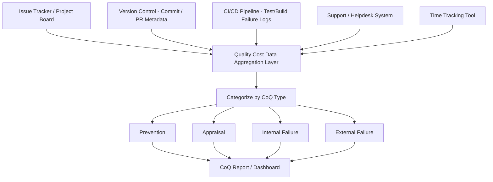

## Methods for Collecting Quality Cost Data

### Definition and Purpose

Collecting quality cost data is the practice of systematically capturing, categorizing, and quantifying the costs associated with the Cost of Quality (CoQ) model — Prevention, Appraisal, Internal Failure, and External Failure costs (the PAF model). Without reliable collection methods, the 1-10-100 Rule and related CoQ analyses remain theoretical; the value of the framework depends entirely on the accuracy and consistency of the underlying data.

The core challenge is that quality costs are **not naturally segregated** in standard financial or operational systems. A developer's time spent debugging, a support agent's time resolving a customer complaint, and a QA engineer's time writing test cases are all typically recorded simply as "labor cost" or "hours worked" — not tagged by which CoQ category they belong to. Collection methods exist to bridge this gap.

### The Four CoQ Categories as a Collection Framework

Before data can be collected, it must be mapped to categories:

| Category | Definition | Example Data Points |
| --- | --- | --- |
| Prevention | Costs to prevent defects before they occur | Training hours, design review time, requirements analysis effort |
| Appraisal | Costs to detect defects before release | QA/testing hours, code review time, inspection costs |
| Internal Failure | Costs of defects found before release | Rework hours, scrap, re-testing cycles |
| External Failure | Costs of defects found after release | Support tickets, refunds, warranty claims, incident response time |

### Primary Collection Methods

**Key Points**

**1. Activity-Based Costing (ABC)**

Time and cost are tracked at the level of specific activities rather than broad departmental budgets. Each activity (e.g., "code review," "bug triage," "customer incident response") is pre-tagged to a CoQ category, and actual hours/costs logged against that activity roll up automatically into category totals.

**2. Time Tracking with Category Tagging**

Team members log hours against tasks that are tagged with a CoQ category (often via project management or issue-tracking tools). This is the most common method in software development contexts because it integrates with tools already in use (e.g., issue trackers, sprint boards).

**3. Defect/Incident Tracking Systems**

Every defect or incident is logged with metadata: where it was found (development, QA, production), time to resolve, and downstream impact (customer-facing or not). Aggregating this data by discovery stage directly produces Internal vs. External Failure cost estimates.

**4. Financial System Cost Extraction**

Existing accounting/ERP systems are queried for cost centers or general ledger accounts that map to quality-related activities (e.g., "warranty reserve," "customer refunds," "QA department payroll"). This method is more common in manufacturing but applicable wherever formal cost centers exist.

**5. Sampling and Estimation**

When full data capture is impractical, a representative sample of work is analyzed in detail (e.g., one sprint's worth of tickets categorized manually) and the resulting ratios are extrapolated to the full period. Used when instrumentation is incomplete or when introducing full tracking would be too costly relative to the insight gained.

**6. Surveys and Self-Reporting**

Team members periodically estimate how their time was allocated across CoQ categories (e.g., "what % of your week was spent on rework vs. new development vs. testing?"). Lower precision than direct tracking but faster to implement and useful as a starting point or validation cross-check.

### Data Collection Architecture (Software Development Context)

For a software project, quality cost data typically flows from several integrated sources:

**Key Points**

- **Issue trackers** (Jira, Linear, GitHub Issues) — tag issues by type (bug found in dev vs. bug found in production, feature vs. rework) to feed Internal/External Failure and Prevention categories.
- **Version control metadata** — commits labeled as "fix" vs. "feature" vs. "refactor," combined with PR review time, can approximate Appraisal and Internal Failure effort.
- **CI/CD pipeline logs** — automated test failure rates and build failure frequency provide a low-effort, high-consistency data source for Appraisal and Internal Failure costs, since these are captured automatically without relying on manual tagging.
- **Support/helpdesk systems** — ticket volume, resolution time, and severity classification are the primary source for External Failure cost data.
- **Time tracking tools** — where available, provide the most direct hour-to-cost conversion, especially for Prevention activities (training, design review) that don't naturally generate tickets or commits.

### Practical Implementation Steps

**Key Points**

1. **Define a CoQ taxonomy** — agree on explicit category definitions and sub-categories before collecting any data, so tagging is consistent across the team.
2. **Instrument existing tools rather than building new ones** — add custom fields/labels to the issue tracker, CI pipeline, and helpdesk system rather than introducing a separate quality-cost-only tool, to minimize friction and improve adoption.
3. **Establish a consistent unit of measurement** — typically labor hours converted to cost using a loaded hourly rate (salary + overhead), plus direct costs (tooling, refunds, penalties) recorded separately.
4. **Automate wherever possible** — manual self-reporting has the lowest data quality; automated extraction from CI logs, commit metadata, and ticket systems has the highest.
5. **Validate with periodic sampling** — even with automated collection, periodically manually review a sample of tagged items to check for misclassification.
6. **Aggregate on a consistent cadence** — weekly or per-sprint aggregation for software teams allows CoQ trends to be tracked alongside normal development cadence (see related chapter on reporting).

### Common Data Quality Challenges

| Challenge | Description | Mitigation |
| --- | --- | --- |
| Inconsistent tagging | Different team members categorize similar work differently | Shared taxonomy documentation, periodic calibration reviews |
| Incomplete capture | Not all rework/incident time is logged | Automated capture from CI/CD and version control reduces reliance on manual logging |
| Cost attribution ambiguity | Time spent is easy to capture; downstream costs (reputational, opportunity cost) are not | Combine direct time-tracking data with proxy metrics and estimation models (see related chapters) |
| Tool fragmentation | Data lives across multiple disconnected systems | Central aggregation layer/dashboard that pulls from each source system via API |
| Retroactive tagging fatigue | Requiring detailed tagging after the fact reduces compliance | Tag at time of creation (e.g., issue creation form requires CoQ category) rather than after resolution |

### Considerations for Civic/Government Software Projects

In a project such as a Local Government Unit document management system, quality cost data collection typically relies more heavily on manual and semi-structured sources than fully automated commercial pipelines, since:

- Smaller development teams may not have dedicated time-tracking infrastructure, making issue-tracker tagging (via labels on GitHub Issues, for example) the most practical low-overhead method.
- External Failure cost signals (citizen complaints, inter-office escalations) often arrive through informal channels (phone calls, in-person reports to an LGU office) rather than a structured helpdesk system, requiring a lightweight intake process to convert them into trackable data points.
- [Unverified] The specific tooling and processes used for quality cost tracking on a given project will depend on team size, available budget for tooling, and whether the client (LGU) mandates any particular reporting format for audit purposes.

**Next Steps**

- The PAF (Prevention-Appraisal-Failure) Model in detail
- Building a CoQ dashboard from issue tracker and CI/CD data
- Quality cost reporting cadence and stakeholder communication
- Calibration techniques for consistent defect/cost categorization across teams
- Estimation models for proxy metrics (reputational and opportunity cost data)