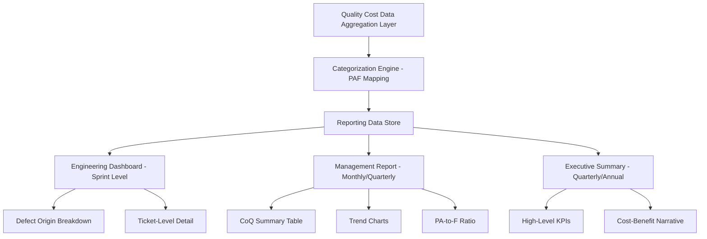

## Designing a Quality Cost Reporting System

### Purpose and Scope

A quality cost reporting system is the mechanism that transforms raw quality cost data (collected via the methods discussed in the preceding topic — activity-based costing, time tracking, defect tracking, financial extraction) into structured, decision-useful information for stakeholders. Collection answers "how do we capture the data?"; reporting answers "how do we present it so that it drives action?"

A well-designed reporting system serves three distinct audiences with different needs:

| Audience | Primary Question | Typical Format |
| --- | --- | --- |
| Engineering/QA teams | Where are defects originating and why? | Detailed, granular, frequent (sprint-level) |
| Management/Product leadership | Is quality investment paying off? Where should we invest? | Trend summaries, category breakdowns, moderate frequency |
| Executive/Client/Oversight bodies | What is the overall cost-benefit of quality efforts? | High-level KPIs, cost ratios, infrequent (quarterly/annual) |

### Core Design Principles

**Key Points**

- **Categorize consistently** — every reported figure must map cleanly to the PAF model (Prevention, Appraisal, Internal Failure, External Failure) established during data collection; inconsistent categorization undermines trend analysis.
- **Normalize costs for comparability** — report costs as a ratio (e.g., % of total development cost, cost per feature shipped, cost per user) rather than raw currency alone, so trends remain meaningful as team size or project scope changes.
- **Balance granularity with clarity** — engineering audiences need ticket-level detail; leadership needs aggregated trends. A single report format rarely serves both well.
- **Make the 1-10-100 escalation visible** — an effective report highlights not just totals per category, but the *ratio* between prevention/appraisal spend and failure spend, since this ratio is the actionable signal for where to invest.
- **Report trends, not just snapshots** — a single period's CoQ breakdown is far less useful than a trend line showing whether failure costs are rising or falling relative to prevention investment over time.
- **Tie costs back to specific initiatives** — where possible, link failure cost reductions to specific prevention/appraisal investments (e.g., "increased code review time by X hours reduced production defects by Y%") to make the business case for continued investment legible.

### Standard Report Components

**1. Cost of Quality Summary Table**

The foundational component — total cost per PAF category for the reporting period.

| Category | Cost (Period) | % of Total CoQ | % of Total Dev Cost |
| --- | --- | --- | --- |
| Prevention | — | — | — |
| Appraisal | — | — | — |
| Internal Failure | — | — | — |
| External Failure | — | — | — |
| **Total** | — | 100% | — |

**2. Trend Charts**

Time-series visualization of each category over multiple reporting periods (sprints, months, quarters), typically as a stacked area or line chart, to show whether the cost mix is shifting toward prevention (desirable) or failure (undesirable).

**3. Prevention/Appraisal-to-Failure Ratio**

A single derived metric summarizing overall quality health:

$$\text{PA-to-F Ratio} = \frac{\text{Prevention Cost} + \text{Appraisal Cost}}{\text{Internal Failure Cost} + \text{External Failure Cost}}$$

**Example**

If Prevention + Appraisal costs total $15,000 and Internal + External Failure costs total $45,000 for a period:

$$\text{PA-to-F Ratio} = \frac{15000}{45000} = 0.33$$

A ratio below 1 indicates failure costs currently outweigh proactive investment — a signal that shifting investment toward prevention/appraisal is likely to reduce total CoQ over time, consistent with the 1-10-100 Rule's underlying logic.

**4. Defect Origin Breakdown**

Categorization of where defects are discovered (design review, code review, QA testing, staging/UAT, production) to identify which stage is systematically under-catching issues.

**5. External Failure Detail Panel**

Given that external failure costs include the hard-to-quantify categories (reputational damage, opportunity cost of lost goodwill covered in prior topics), this panel typically separates **direct** external failure costs (refunds, support hours) from **estimated/proxy** costs (churn-based goodwill loss, sentiment scores), clearly labeling the latter as modeled estimates rather than measured figures.

### Reporting System Architecture

### Reporting Cadence and Frequency

| Report Type | Recommended Frequency | Rationale |
| --- | --- | --- |
| Engineering-level defect/rework detail | Per sprint (1-2 weeks) | Matches development cadence; enables rapid course correction |
| Management CoQ summary | Monthly | Balances timeliness with enough data volume for meaningful trends |
| Executive/client summary | Quarterly | Aligns with budget/planning cycles; avoids noise from short-term fluctuations |
| Ad hoc incident report | Immediately following a significant external failure | Captures detail while fresh; feeds into both failure cost tracking and reputational/goodwill estimation |

### Implementation Approaches

**Key Points**

- **Spreadsheet-based reporting** — lowest implementation cost; suitable for small teams or early-stage adoption. Data manually or semi-automatically exported from issue trackers/CI systems into a structured template.
- **BI/dashboard tools** (e.g., connecting a data warehouse to a visualization layer) — automates aggregation and trend visualization; higher setup cost but scales better and reduces manual reporting overhead over time.
- **Embedded reporting within existing project tools** — some issue trackers and CI platforms offer native reporting/dashboard features that can be configured with custom fields for CoQ categories, avoiding the need for a separate reporting system entirely.
- **Custom internal tooling** — for organizations with specific reporting requirements (e.g., government audit formats), a purpose-built reporting module may be justified despite higher development cost. [Inference] This is more likely to be warranted when an external stakeholder (auditor, client, oversight body) mandates a specific report structure that off-the-shelf BI tools cannot easily produce.

### Considerations for Civic/Government Software Projects

For a project such as a Local Government Unit document management system, the reporting system design should account for:

- **Audit-readiness** — reports should be structured to withstand external audit scrutiny (e.g., by a national audit body), meaning categorization and cost basis should be clearly documented and traceable to source data, not just summarized figures.
- **Non-technical stakeholder accessibility** — reports intended for LGU officials or council members should minimize technical jargon and lead with high-level ratios/trends rather than raw defect counts, since this audience's primary concern is service reliability and public accountability rather than engineering process detail.
- **Small-team practicality** — given limited dedicated QA/reporting resources typical of civic software projects, a lightweight spreadsheet or native issue-tracker dashboard is often more sustainable than a custom BI pipeline, at least in early project phases.
- **Linking to service continuity narratives** — because external failure in this context affects public service delivery rather than commercial revenue, reports may need to frame External Failure costs in terms of citizen impact (e.g., "X hours of service disruption affecting Y department requests") rather than purely financial terms.

**Next Steps**

- Building CoQ dashboards with BI tools (data source integration patterns)
- Communicating quality cost trends to non-technical executive/oversight stakeholders
- Audit-ready documentation practices for quality cost reporting
- Linking prevention/appraisal investment decisions to reporting outcomes
- Incident-driven ad hoc reporting workflows