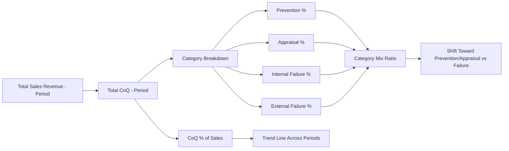

## Expressing Cost of Quality as a Percentage of Sales

### Definition and Purpose

Expressing Cost of Quality (CoQ) as a percentage of sales is a normalization technique that converts absolute quality cost figures into a relative metric, enabling meaningful comparison across time periods, product lines, business units, or even industry benchmarks. Raw CoQ totals in currency are difficult to interpret in isolation — a company spending $500,000 on quality costs could be performing excellently or poorly depending entirely on the scale of its revenue.

The standard formula:

$$\text{CoQ \% of Sales} = \frac{\text{Total Cost of Quality}}{\text{Total Sales Revenue}} \times 100$$

Where Total Cost of Quality is the sum of all four PAF categories:

$$\text{Total CoQ} = \text{Prevention} + \text{Appraisal} + \text{Internal Failure} + \text{External Failure}$$

### Why Normalize Against Sales Specifically

**Key Points**

- **Scale independence** — a growing company's absolute quality costs will naturally rise; normalizing against sales reveals whether quality costs are growing *faster or slower* than the business itself.
- **Cross-period comparability** — allows quarter-over-quarter or year-over-year comparison without revenue growth or contraction distorting the trend.
- **Industry benchmarking** — because it is a ratio, CoQ % of sales can be compared against published industry averages regardless of company size.
- **Executive legibility** — a single percentage figure is more digestible for leadership and board-level reporting than a breakdown of raw costs across four categories.
- **Investment justification** — framing quality costs as a percentage of revenue makes it easier to argue for reallocating that percentage toward prevention rather than failure, since the total "pie" is held constant in the comparison.

### Historical Benchmarks and Industry Context

**Key Points**

- Classical quality management literature (associated with quality pioneers such as Philip Crosby and Joseph Juran) commonly cited total CoQ figures in the range of roughly 15-25% of sales for organizations with immature quality processes, with well-managed organizations achieving figures closer to 2-5% of sales.
- [Unverified] Specific benchmark percentages vary considerably by industry, product complexity, and regulatory environment (e.g., safety-critical industries such as aerospace or medical devices typically report higher CoQ percentages due to elevated appraisal and compliance costs), so any single benchmark figure should be treated as indicative rather than a universal target.
- The general principle underlying these benchmarks — that total CoQ tends to fall as an organization matures its prevention and appraisal practices — is a widely accepted premise in quality management, though exact percentage figures should be validated against current, industry-specific sources rather than treated as fixed constants.

### Calculation Example

**Example**

A hypothetical software company reports the following for a fiscal quarter:

| Category | Cost |
| --- | --- |
| Prevention | $40,000 |
| Appraisal | $60,000 |
| Internal Failure | $50,000 |
| External Failure | $150,000 |
| **Total CoQ** | $300,000 |

If total sales revenue for the same quarter was $4,000,000:

$$\text{CoQ \% of Sales} = \frac{300000}{4000000} \times 100 = 7.5\%$$

This single figure can then be tracked quarter over quarter. A useful secondary breakdown expresses each category as its own percentage of sales:

| Category | % of Sales |
| --- | --- |
| Prevention | 1.0% |
| Appraisal | 1.5% |
| Internal Failure | 1.25% |
| External Failure | 3.75% |

This breakdown immediately reveals that External Failure costs (3.75%) dominate the total, more than the other three categories combined — a strong signal, consistent with the 1-10-100 Rule, that shifting investment toward the Prevention and Appraisal categories (currently only 2.5% combined) would likely reduce the External Failure percentage over subsequent periods.

### Category Mix Ratio (Complementary Metric)

Beyond the aggregate percentage, it is useful to express each category as a percentage **of total CoQ** (not of sales) to track whether the internal *mix* is shifting favorably, independent of overall revenue changes:

$$\text{Category Mix \%} = \frac{\text{Category Cost}}{\text{Total CoQ}} \times 100$$

Using the example above:

$$\text{External Failure Mix \%} = \frac{150000}{300000} \times 100 = 50\%$$

A declining External Failure mix percentage over time — even if total CoQ % of sales stays flat — indicates the organization is successfully shifting spend toward proactive categories, which classical quality cost theory associates with lower total costs over the longer term.

### Visualizing the Trend

### Limitations and Caveats

**Key Points**

- **Revenue volatility distorts the ratio** — in periods of unusually high or low sales (e.g., seasonal businesses, one-off large contracts), the percentage can swing without any actual change in quality performance, so it should be interpreted alongside absolute figures and revenue context.
- **Non-revenue-generating contexts** — for organizations or projects without direct "sales" in the traditional sense (e.g., internal enterprise systems, public-sector software delivered under a fixed development contract rather than ongoing sales revenue), an alternative denominator is typically substituted (see below).
- **Excludes unquantified costs** — reputational damage and opportunity cost of lost goodwill (covered in prior topics) are often only partially captured in the External Failure figure feeding this ratio, since these costs rely on proxy/estimated metrics; the percentage may understate true total quality cost as a result.
- **Lag effects** — sales in a given period may reflect goodwill or reputation built (or damaged) in prior periods, meaning the ratio in any single period does not necessarily reflect that period's quality performance in isolation.

### Alternative Denominators for Non-Sales Contexts

For organizations or projects without a direct sales revenue figure — such as internally developed systems, cost-center IT departments, or fixed-budget civic/government software contracts — the same normalization principle can be applied using an alternative denominator:

| Alternative Denominator | Best Suited For |
| --- | --- |
| Total project/development budget | Fixed-scope contracted projects (e.g., a government software contract) |
| Total operating cost | Internal enterprise systems without direct revenue attribution |
| Cost per unit shipped/deployed | Manufacturing or discrete product contexts |
| Cost per user/transaction served | Public-facing service systems, including civic digital services |

$$\text{CoQ \% of Budget} = \frac{\text{Total Cost of Quality}}{\text{Total Project Budget}} \times 100$$

### Application to Civic/Government Software Projects

For a Local Government Unit document management system delivered under a development contract rather than a sales-driven revenue model, "CoQ % of sales" is typically reframed as **CoQ % of total project/development budget**. This preserves the core value of the metric — a normalized, comparable figure for tracking quality investment efficiency — while fitting a context where "sales" has no direct equivalent. A rising CoQ % of budget over the project lifecycle, driven primarily by External Failure costs, would signal the same underlying issue the classical metric is designed to surface: insufficient upstream investment in prevention and appraisal relative to the cost of failures reaching production or public use.

**Next Steps**

- Industry-specific CoQ benchmark research and sourcing
- Category mix ratio tracking as a leading indicator
- Adapting CoQ metrics for fixed-budget/contract-based software delivery
- Integrating proxy reputational/goodwill cost estimates into the External Failure figure
- Building automated CoQ % dashboards from financial and quality cost data sources