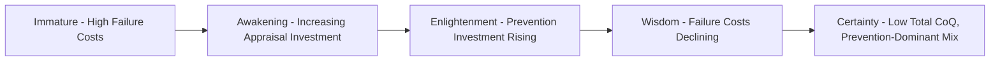

## Benchmarking Quality Costs Across Industries

### Definition and Purpose

Benchmarking quality costs across industries is the practice of comparing an organization's Cost of Quality (CoQ) metrics — typically expressed as a percentage of sales or budget, as covered in the preceding topic — against reference figures from other organizations, ideally within the same or comparable industries. The purpose is to answer a question that internal trend analysis alone cannot: **is our CoQ level actually good, or merely improving from a poor baseline?**

Internal trending (quarter-over-quarter, year-over-year) shows *direction*. Benchmarking shows *position* — where an organization sits relative to industry peers, best-in-class performers, and historical maturity models.

### Why Benchmarking Requires Caution

**Key Points**

- **Definitional inconsistency** — organizations vary widely in which costs they classify under Prevention, Appraisal, Internal Failure, and External Failure (the PAF model); a published "industry average" may reflect a different accounting boundary than an organization's own figures.
- **Incomplete cost capture** — as established in prior topics, indirect costs such as reputational damage and lost customer goodwill are frequently excluded or only partially estimated; published benchmarks likely undercount total CoQ to varying degrees across different studies.
- **Industry structural differences** — regulatory intensity, product complexity, safety criticality, and typical defect consequences vary enormously by sector, making cross-industry comparison meaningful only within a similar risk/complexity tier.
- **Survivorship and self-selection bias** — organizations that voluntarily report or participate in benchmarking studies tend to be more quality-mature than the broader population, which can bias published averages toward more favorable figures than the true industry-wide baseline.
- **Reporting period and methodology differences** — some studies use annual figures, others quarterly; some include indirect/opportunity costs, others only direct measured costs — these differences should be checked before comparing any two data sources.

Given these caveats, benchmarking figures should be treated as **directional reference points**, not precise targets.

### Common Benchmarking Dimensions

| Dimension | What It Compares | Typical Use |
| --- | --- | --- |
| CoQ as % of sales/revenue | Overall quality investment relative to business scale | Cross-company, cross-industry comparison |
| Category mix (Prevention/Appraisal vs. Failure) | Whether spend is proactive or reactive | Maturity assessment, independent of absolute scale |
| Cost per defect | Average cost to resolve a single defect | Process efficiency comparison |
| Failure cost ratio (External:Internal) | Whether defects are being caught before or after release | Indicator of appraisal/testing effectiveness |
| Time-to-detect | How long defects go unnoticed before discovery | Process maturity and monitoring effectiveness |

### Quality Maturity Models as a Benchmarking Framework

Rather than comparing raw percentages alone, many benchmarking approaches situate an organization along a **quality maturity curve**, drawing on the classical premise (associated with quality management pioneers such as Philip Crosby and Joseph Juran) that the *mix* of quality costs shifts predictably as an organization matures:

**Key Points**

- **Immature organizations** typically show External Failure costs dominating total CoQ, with minimal Prevention investment — consistent with the high end of the 1-10-100 escalation curve being realized frequently.
- **Mature organizations** typically show the inverse mix: Prevention and Appraisal dominate, External Failure is a small minority of total CoQ, and total CoQ as a percentage of sales is lower overall, since fewer defects reach the costly downstream stages.
- [Inference] An organization's position on such a maturity curve is better assessed by tracking its own category mix ratio over multiple periods than by a single cross-sectional benchmark comparison, since the mix trend is less sensitive to the definitional inconsistencies described above than an absolute percentage comparison would be.

### Sourcing Reliable Benchmark Data

**Key Points**

- **Industry associations and professional bodies** (e.g., quality management organizations such as ASQ) periodically publish survey-based CoQ studies; these should be checked for currency, since figures can become outdated as industry practices evolve.
- **Academic and consulting research** — management consulting firms and academic quality management literature occasionally publish sector-specific studies; methodology sections should be reviewed to confirm what cost categories were included.
- **Peer networks and industry consortia** — in some sectors, informal or formal benchmarking consortia allow member organizations to share standardized CoQ data under common definitions, reducing the definitional-inconsistency problem inherent in public benchmarks.
- **Regulatory and public-sector disclosures** — in regulated industries (aerospace, medical devices, financial services), quality/compliance cost disclosures may be embedded in regulatory filings or audit reports, offering an indirect benchmarking source.
- [Unverified] Because quality cost benchmarking studies are not standardized or continuously updated in the way some financial benchmarks are, any specific percentage figures cited from older literature should be re-verified against current, industry-specific sources before being used to set internal targets.

### Sector-Level Directional Patterns

While precise figures vary and should be sourced current to the specific industry and period, some general directional patterns are widely recognized in quality management practice:

| Sector Type | Typical CoQ Characteristics |
| --- | --- |
| Safety-critical / highly regulated (aerospace, medical devices, pharmaceuticals) | Higher Appraisal costs (extensive testing/certification); External Failure costs carry outsized severity even at low frequency due to safety/regulatory consequences |
| Mass-market consumer software/SaaS | External Failure often dominated by support burden and churn-driven opportunity cost rather than physical defect/recall costs |
| Manufacturing (discrete/process) | Historically the origin of PAF-model CoQ tracking; often has the most mature internal benchmarking infrastructure (scrap, rework, warranty tracking) |
| Public sector / government services | Limited standardized benchmarking infrastructure; External Failure often manifests as service disruption and public trust cost rather than direct financial claims (see prior topics on reputational damage and lost goodwill) |

### Constructing an Internal Benchmarking Practice

**Key Points**

1. **Standardize internal category definitions first** — before comparing externally, ensure internal CoQ reporting (from the reporting system design covered previously) uses consistent, documented category boundaries so that internal trend data itself is comparable across periods.
2. **Select comparators carefully** — prioritize organizations of similar scale, regulatory exposure, and product/service complexity over broad cross-industry averages.
3. **Benchmark the mix ratio, not just the total** — the Prevention+Appraisal-to-Failure ratio is more robust to definitional differences across organizations than absolute percentage-of-sales figures.
4. **Treat benchmarks as directional targets, not compliance thresholds** — given the data quality caveats above, benchmark figures are best used to motivate investment discussions rather than as precise pass/fail criteria.
5. **Re-baseline periodically** — industry benchmarks and internal organizational context both evolve; a benchmarking exercise conducted years earlier may no longer reflect current best practice.

### Application to Civic/Government Software Contexts

Benchmarking is particularly challenging for civic/government software projects, such as a Local Government Unit document management system, because:

- **No mature public-sector CoQ benchmarking body** typically exists at the scale seen in manufacturing or aerospace, making sector-specific comparators harder to source.
- **Cross-LGU or cross-agency comparison** may be more relevant than cross-industry comparison — comparing quality cost patterns against other government digital service implementations (where obtainable) rather than commercial software benchmarks, since risk tolerance, budget structures, and failure consequences differ substantially from commercial contexts.
- **Alternative reference points** — in the absence of formal benchmarks, a project may benchmark against its own historical baseline (pre- and post-adoption of formal CoQ tracking) or against general software industry failure-cost patterns as a rough proxy, while explicitly noting the limitations of that comparison given the sector mismatch.
- **Emphasis on category mix over absolute percentage** — given the CoQ % of budget reframing discussed in the prior topic, tracking whether the *mix* shifts toward Prevention/Appraisal over the project lifecycle is likely a more defensible internal management signal than attempting to benchmark against an external percentage figure that may not exist for this sector.

**Next Steps**

- Quality maturity model assessment frameworks (Crosby's Quality Management Maturity Grid and related models)
- Constructing standardized internal CoQ category definitions for consistent benchmarking
- Sourcing and validating current industry-specific CoQ benchmark data
- Peer consortium and industry-association benchmarking participation
- Adapting benchmarking practices for sectors lacking mature CoQ infrastructure (public sector, civic tech)