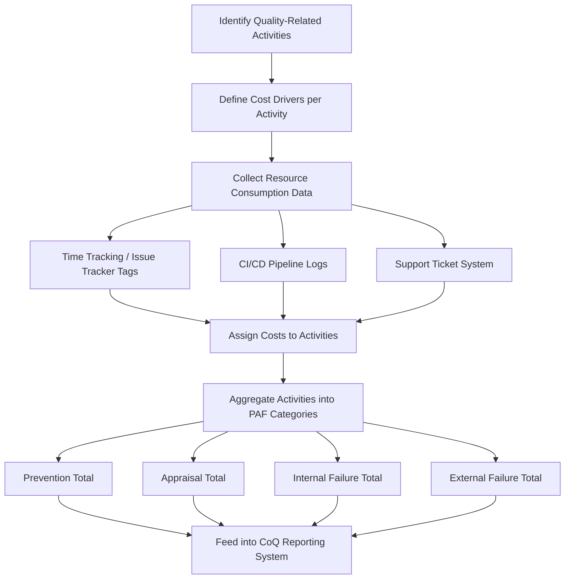

## Activity Based Costing Applied to Quality

### Definition and Purpose

Activity Based Costing (ABC) applied to quality is a costing methodology that assigns quality-related costs to the specific **activities** that generate them, rather than allocating costs broadly across departments or using overhead-based approximations. Where traditional cost accounting might lump "engineering costs" into a single departmental budget line, ABC decomposes that budget into discrete activities — code review, defect triage, regression testing, incident response — and assigns cost to each based on actual resource consumption.

Applied to the Cost of Quality (CoQ) framework, ABC provides the mechanism to answer a question that aggregate departmental budgets cannot: **which specific activities drive Prevention, Appraisal, Internal Failure, and External Failure costs, and by how much?**

### Why Traditional Costing Falls Short for Quality Cost Analysis

**Key Points**

- **Departmental budgets blur activity boundaries** — a single engineering team's budget contains a mix of new feature development, defect fixing, code review, and testing, all recorded as one cost pool unless activities are separately tracked.
- **Overhead allocation obscures causation** — traditional costing often allocates overhead (e.g., management, tooling licenses) proportionally to headcount or revenue, which does not reflect which specific quality activities actually consume those resources.
- **PAF categorization requires activity-level granularity** — correctly assigning a cost to Prevention versus Appraisal versus Internal Failure (as required by the PAF model covered in prior topics) is only possible when the underlying activity is identified, not just the department or cost center.

ABC directly addresses this by making the **activity** — not the department — the unit of cost assignment.

### Core ABC Methodology Applied to Quality

**Key Points**

**1. Identify Quality-Related Activities**

Enumerate discrete activities that consume resources and can be mapped to a PAF category. Examples:

| Activity | PAF Category |
| --- | --- |
| Requirements review meetings | Prevention |
| Design review sessions | Prevention |
| Developer training on secure coding practices | Prevention |
| Code review (pull request review) | Appraisal |
| Automated test execution (CI pipeline) | Appraisal |
| Manual QA/exploratory testing | Appraisal |
| Bug fixing before release (caught in dev/QA) | Internal Failure |
| Re-testing after a fix | Internal Failure |
| Production incident response | External Failure |
| Customer support ticket resolution | External Failure |
| Post-incident retrospective and remediation | External Failure |

**2. Identify Cost Drivers**

For each activity, determine the measurable unit that drives its cost — typically time (hours) multiplied by a loaded labor rate, plus any direct costs (tooling, infrastructure).

$$\text{Activity Cost} = (\text{Hours Consumed} \times \text{Loaded Hourly Rate}) + \text{Direct Costs}$$

**3. Assign Resource Costs to Activities**

Using time tracking, issue tracker labels, or CI/CD metadata (as established in the data collection methods discussed previously), allocate actual hours worked to each activity.

**4. Aggregate by PAF Category**

Sum all activity costs within each PAF category to produce the category totals that feed the CoQ reporting system.

**5. Calculate Cost Drivers per Unit of Output**

Express activity costs relative to a meaningful output unit (per feature shipped, per defect, per release) to enable comparison across periods regardless of volume changes.

### ABC Process Flow

### Worked Example

**Example**

A software team tracks the following activities over one sprint, with a loaded hourly rate of $85/hour:

| Activity | Hours | PAF Category | Cost |
| --- | --- | --- | --- |
| Design review sessions | 12 | Prevention | $1,020 |
| Secure coding training | 8 | Prevention | $680 |
| Code review | 25 | Appraisal | $2,125 |
| Automated test maintenance | 15 | Appraisal | $1,275 |
| Manual QA testing | 30 | Appraisal | $2,550 |
| Bug fixing (caught in QA) | 20 | Internal Failure | $1,700 |
| Re-testing after fixes | 10 | Internal Failure | $850 |
| Production incident response | 18 | External Failure | $1,530 |
| Support ticket resolution | 22 | External Failure | $1,870 |

Aggregating by category:

$$\text{Prevention} = 1020 + 680 = 1700$$

$$\text{Appraisal} = 2125 + 1275 + 2550 = 5950$$

$$\text{Internal Failure} = 1700 + 850 = 2550$$

$$\text{External Failure} = 1530 + 1870 = 3400$$

$$\text{Total CoQ} = 1700 + 5950 + 2550 + 3400 = 13600$$

This activity-level breakdown is materially more actionable than a single "$13,600 quality cost" figure — it reveals, for instance, that Appraisal ($5,950) is the largest single category, and that manual QA testing alone ($2,550) is the single largest activity, informing where automation investment might yield the greatest return.

### Advantages of ABC for Quality Cost Analysis

**Key Points**

- **Precision in PAF categorization** — because costs are tied to specific activities rather than broad cost centers, miscategorization between Prevention/Appraisal/Failure is significantly reduced compared to department-level allocation.
- **Actionable granularity** — identifying that a specific activity (e.g., manual regression testing) disproportionately drives Appraisal costs enables targeted process improvement (e.g., test automation investment) rather than vague department-wide cost-cutting.
- **Supports cost-driver analysis** — by isolating activities, ABC enables asking "what specifically drives this cost?" rather than only "how much did this cost?"
- **Enables what-if modeling** — because costs are tied to discrete, measurable activities, the impact of process changes (e.g., adding a new code review gate) can be estimated by modeling the added activity cost against expected downstream Internal/External Failure cost reduction.

### Limitations and Implementation Challenges

| Challenge | Description | Mitigation |
| --- | --- | --- |
| Activity identification overhead | Defining a comprehensive, non-overlapping activity list requires upfront analysis effort | Start with a coarse activity list and refine iteratively rather than attempting full granularity immediately |
| Time-tracking burden | Requiring granular time logging against specific activities can create friction and reduce compliance | Leverage automated sources (CI/CD logs, issue tracker labels) over manual time entry wherever possible, consistent with the data collection methods discussed previously |
| Activities spanning multiple PAF categories | Some activities (e.g., a code review that catches a bug) blur Appraisal and Internal Failure boundaries | Establish clear categorization rules in the CoQ taxonomy (e.g., the review activity itself is Appraisal; the subsequent fix is Internal Failure) and apply consistently |
| Indirect/proxy costs remain outside ABC's scope | ABC is well-suited to labor/time-based direct costs but does not natively capture reputational damage or lost goodwill (covered in prior topics), which require separate estimation models | Combine ABC-derived direct cost figures with proxy/estimated indirect cost models for a complete CoQ picture |

### Application to Software Development and Civic/Government Contexts

For a software project such as a Local Government Unit document management system, ABC can be implemented with relatively low tooling overhead by leveraging systems already in use:

- **Issue tracker labels as the activity taxonomy** — tagging issues/tickets with activity-level labels (e.g., "design-review," "qa-testing," "prod-incident") allows ABC-style aggregation without introducing a separate costing tool.
- **CI/CD pipeline metadata for Appraisal activities** — automated test run time and frequency can approximate the Appraisal-category cost of automated testing without manual time entry.
- **Loaded rate approximation for government/contracted teams** — where formal loaded hourly rates are not readily available (common in smaller civic tech teams or fixed-price contracts), a reasonable approximation (blended developer rate including estimated overhead) can be used, with the understanding that precision is secondary to directional insight for smaller-scale projects.
- **Practical starting point** — given limited dedicated quality-costing infrastructure typical of civic software projects, a minimal viable ABC implementation (a handful of well-defined activity tags mapped to the four PAF categories) is likely to deliver most of the analytical value at a fraction of the implementation cost of a full enterprise ABC system.

**Next Steps**

- Designing an activity taxonomy for software development quality costing
- Automating activity cost data capture from issue trackers and CI/CD pipelines
- Cost-driver analysis and process improvement prioritization using ABC output
- Integrating ABC-derived direct costs with proxy models for reputational/goodwill costs
- Loaded labor rate calculation methods for engineering teams