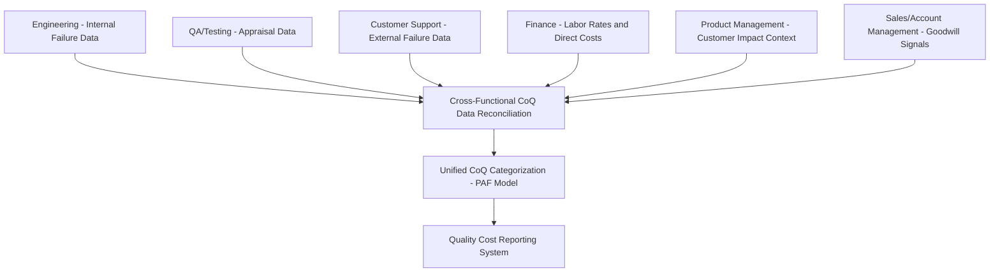

## Cross Functional Collaboration in Cost Data Gathering

### Definition and Purpose

Cross-functional collaboration in cost data gathering is the practice of coordinating multiple organizational functions — engineering, QA, product management, customer support, finance, and (in institutional contexts) external stakeholders — to collect a complete and accurate Cost of Quality (CoQ) picture. No single function possesses full visibility into all four PAF categories (Prevention, Appraisal, Internal Failure, External Failure); each function typically owns data for only a subset, and without deliberate coordination, CoQ reporting systems systematically undercount categories that fall outside the reporting team's direct visibility.

### Why Single-Function Data Gathering Is Insufficient

**Key Points**

- **Engineering** typically has strong visibility into Internal Failure costs (bug fixing, rework) but limited visibility into what happens after release.
- **Customer support/success** holds the primary data on External Failure costs (tickets, complaints, churn signals) but often lacks the technical context to map incidents back to root-cause defects or original development decisions.
- **QA/testing** owns Appraisal cost data (test execution, inspection time) but may not track how defects caught late in the cycle compare in cost to defects that would have been prevented earlier.
- **Finance/accounting** holds the authoritative loaded labor rates, budget figures, and any direct financial costs (refunds, penalties, legal costs) needed to convert activity hours into dollar figures, but does not typically track activity-level engineering data.
- **Product management** often holds context on customer impact and business priority that is necessary to accurately estimate opportunity cost of lost goodwill, but does not own the underlying technical or financial data directly.
- **Sales/account management** (in B2B or client-relationship contexts) often has the earliest signal of eroding customer goodwill — renewal hesitancy, reduced engagement — but this signal rarely flows automatically into engineering-owned quality metrics.

No CoQ figure is complete unless data from each of these functions is reconciled into a single reporting framework, consistent with the activity-based costing (ABC) and reporting system architectures discussed in prior topics.

### Cross-Functional Data Flow Architecture

### Common Collaboration Failure Modes

| Failure Mode | Description | Consequence |
| --- | --- | --- |
| Data silos | Each function tracks its own metrics in isolated tools with no shared taxonomy | Duplicate or inconsistent categorization; totals cannot be reliably aggregated |
| Incentive misalignment | Functions are measured on metrics that may discourage transparent cost reporting (e.g., support teams incentivized on ticket closure speed rather than root-cause escalation) | Underreporting of External Failure costs or root-cause data |
| Terminology mismatch | "Defect," "incident," and "issue" mean different things to engineering versus support versus product | Miscategorized or double-counted cost data |
| Ownership ambiguity | No single function is accountable for aggregating cross-functional data into the CoQ report | Data gathering stalls or falls to whichever team has the most bandwidth, producing inconsistent coverage over time |
| Infrequent handoff cadence | Cross-functional data reconciliation happens too rarely (e.g., only annually) | Trend data loses granularity; issues are identified long after they could have been acted upon |

### Structural Mechanisms for Effective Collaboration

**Key Points**

- **Shared taxonomy and definitions** — establishing a single, cross-functionally agreed CoQ taxonomy (mapping specific activities and incident types to PAF categories) before data gathering begins, as emphasized in the data collection methods and ABC topics, is the foundational prerequisite for reconciliation.
- **Designated data stewardship roles** — assigning a specific owner within each function responsible for supplying their function's CoQ-relevant data on a defined cadence, rather than relying on ad hoc requests.
- **Regular cross-functional review cadence** — periodic (e.g., monthly or per-release) meetings where engineering, QA, support, and product jointly review the aggregated CoQ report, catching miscategorizations and surfacing context that a single function would miss.
- **Shared tooling or integration layer** — connecting the systems each function already uses (issue trackers, helpdesk platforms, CI/CD pipelines, financial systems) into a common aggregation layer, as described in the reporting system architecture, reduces the manual handoff burden that causes collaboration to break down over time.
- **Escalation and feedback loops** — establishing a clear path for a support-identified issue to be traced back to engineering for root-cause classification, and for engineering-identified risk areas to be communicated to support for proactive incident anticipation.

### Reconciliation Workflow Example

**Example**

A production incident is reported. Cross-functional data gathering for this single incident typically requires:

1. **Customer support** logs the initial ticket, resolution time, and number of affected customers (raw External Failure data).
2. **Engineering** investigates root cause, logs the defect's origin (e.g., missed in code review) and remediation time (Internal Failure vs. External Failure boundary classification, plus data feeding future Prevention/Appraisal process improvement).
3. **Product management** assesses customer impact severity and whether affected accounts show renewal/expansion risk (feeding the opportunity-cost-of-lost-goodwill estimate).
4. **Finance** supplies the loaded cost rate for the engineering hours involved and confirms whether any direct costs (SLA credits, refunds) apply.
5. **Sales/account management** (if a B2B relationship is affected) reports any explicit customer sentiment or renewal-risk signals surfaced during the incident.

Only when all five inputs are reconciled does the incident's true CoQ contribution — spanning Internal Failure, External Failure, and proxy goodwill/reputational estimates — become visible; any single function's data alone would materially understate the total.

### Governance Considerations

**Key Points**

- **Executive sponsorship** — cross-functional data gathering initiatives are more likely to sustain participation when visibly supported by leadership spanning the functions involved, since without this, data requests from one function to another can be deprioritized against each team's own operational priorities.
- **Standardized reporting cadence tied to existing rituals** — embedding CoQ data reconciliation into existing cross-functional meetings (e.g., release retrospectives, quarterly business reviews) rather than creating an entirely new standalone process reduces adoption friction.
- **Clear accountability for the aggregation step** — a designated role (whether a dedicated quality/process owner or a rotating responsibility) should own final reconciliation and reporting, distinct from the individual functions supplying raw data.

### Application to Civic/Government Software Projects

For a project such as a Local Government Unit document management system, cross-functional collaboration in cost data gathering spans a somewhat different set of stakeholders than a typical commercial software organization:

- **Development team** — owns Internal Failure data and technical root-cause analysis, analogous to engineering in a commercial context.
- **LGU office staff / end users** — function similarly to customer support in surfacing External Failure signals, but often through informal channels (direct reports, phone calls) rather than a structured ticketing system, meaning the data-gathering mechanism itself may need to be lighter-weight (e.g., a simple shared incident log) to fit realistic reporting behavior.
- **LGU IT officer or project sponsor** — analogous to product management/finance combined, often holding both budget context and institutional priority context needed to interpret the significance of a given failure.
- **Council or oversight body** — analogous to executive sponsorship; their visibility into and endorsement of a quality cost tracking practice affects whether cross-functional participation is sustained over the life of the project.
- [Unverified] Given the typically smaller team size and informal reporting channels common in civic software projects relative to commercial organizations, a lightweight, manually-facilitated reconciliation process (e.g., a recurring short sync between the development team and the LGU point of contact) is likely to be more sustainable than attempting a fully automated cross-functional data pipeline, at least in early project phases.

**Next Steps**

- Establishing a shared CoQ taxonomy across engineering, support, and product functions
- Designing data stewardship roles and reconciliation cadences
- Incentive alignment for transparent quality cost reporting across functions
- Lightweight cross-functional workflows for small/resource-constrained teams
- Integrating cross-functional CoQ data into the reporting system architecture