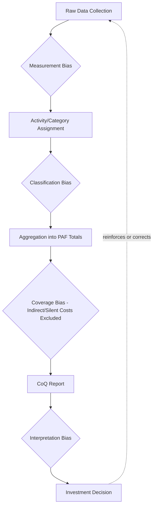

## Pitfalls and Biases in Quality Cost Data

### Definition and Purpose

Pitfalls and biases in quality cost data refer to the systematic errors, distortions, and blind spots that compromise the accuracy and usefulness of Cost of Quality (CoQ) figures, even when data collection methods, activity-based costing, and cross-functional processes (as covered in prior topics) are diligently applied. Understanding these pitfalls is essential because CoQ data directly informs investment decisions — a systematically biased dataset can lead an organization to misallocate resources away from the areas the 1-10-100 Rule suggests would yield the highest return.

### Categories of Pitfalls

Quality cost data errors generally fall into four broad categories: **measurement bias** (the data collected is systematically wrong), **classification bias** (correctly measured data is assigned to the wrong category), **coverage bias** (some costs are structurally excluded from measurement), and **interpretation bias** (correctly measured and classified data is misread by decision-makers).

### Measurement Bias

**Key Points**

- **Self-reporting inflation/deflation** — when individuals estimate their own time allocation across PAF categories (as in survey-based collection methods), they may unconsciously overstate time on categories perceived as valuable (Prevention) and understate time on categories perceived as reflecting poorly on them (Internal Failure/rework).
- **Rounding and estimation error accumulation** — small individual rounding errors in time tracking, when aggregated across many contributors and periods, can compound into materially skewed totals.
- **Automation blind spots** — automated data sources (CI/CD logs, issue tracker timestamps) can systematically miscount activity duration if, for example, a ticket remains "open" during idle time rather than active work, inflating apparent cost.
- **Loaded rate miscalculation** — using an incorrect or outdated loaded hourly rate (failing to account for benefits, overhead, or role-based rate differences) skews every cost figure derived from time data, regardless of how accurately the hours themselves were tracked.

### Classification Bias

**Key Points**

- **Boundary ambiguity between categories** — as noted in the ABC topic, activities that span two PAF categories (e.g., a code review that both appraises quality and catches an actual defect) are prone to inconsistent classification depending on who is tagging the work.
- **Incentive-driven miscategorization** — teams measured or evaluated partly on failure rates may have an unconscious (or conscious) tendency to classify ambiguous costs as Appraisal or Prevention rather than Internal/External Failure, since the latter categories may be perceived as reflecting negatively on team performance.
- **Temporal misclassification** — a cost incurred fixing a defect discovered in production but caused by a change from months earlier may be recorded against the current period rather than the period in which the root-cause decision was made, distorting trend analysis tied to specific process changes.
- **Severity-blind categorization** — treating all defects within a category as equivalent regardless of severity can obscure the fact that a small number of high-severity issues may drive a disproportionate share of actual cost, especially in the External Failure category.

### Coverage Bias

**Key Points**

- **Systematic exclusion of indirect costs** — as established in the reputational damage and opportunity cost of lost goodwill topics, these costs are inherently harder to measure directly and are frequently omitted or only partially estimated, meaning most CoQ figures understate true External Failure cost by an unknown and variable margin.
- **Silent/unreported failures** — defects or dissatisfaction that never generate a support ticket, complaint, or visible incident (silent churn, quiet workarounds by users) leave no data trail at all, creating a structural blind spot regardless of how well the tracking systems capture *reported* issues.
- **Unmeasured Prevention activities** — informal prevention behaviors (a senior developer mentoring a junior on a subtle design pitfall in passing, institutional knowledge that prevents a class of errors without a formal training program) are rarely captured in any tracking system, potentially understating true Prevention investment.
- **Survivorship bias in defect data** — analysis of defects that were caught and fixed says nothing about the defects that were never caught at all; a low Internal/External Failure figure could reflect genuinely good quality or simply poor detection capability, and these two scenarios look identical in the data without additional context.

### Interpretation Bias

**Key Points**

- **Confirmation bias in trend reading** — decision-makers who already believe an initiative (e.g., a new testing tool) is working may interpret ambiguous or noisy CoQ trend data as confirming that belief, rather than applying consistent statistical scrutiny.
- **Correlation-causation conflation** — a decline in External Failure costs following a Prevention investment may be attributed to that investment when other factors (reduced release volume, seasonal demand changes, unrelated process changes) may be the actual driver.
- **Over-reliance on point-in-time snapshots** — as cautioned in the reporting system design topic, a single period's CoQ figures can be misleading without trend context; interpreting one anomalous quarter as a durable pattern is a common analytical error.
- **Percentage-of-sales distortion during revenue volatility** — as noted in the benchmarking topic, CoQ as a percentage of sales can shift purely due to revenue changes unrelated to actual quality performance, and this can be misread as a genuine quality signal if revenue context is not checked.

### Bias Propagation Through the CoQ Pipeline

**Key Points**

- Bias introduced at any stage propagates forward — a measurement error at data collection is not corrected by careful classification, and correct classification does not compensate for coverage gaps.
- Because each stage can introduce independent bias, the cumulative distortion in a final CoQ figure can be substantially larger than the error at any single stage, which argues for validation checks at each stage rather than only at the final reporting step.

### Mitigation Strategies

**Key Points**

- **Prefer automated over self-reported data sources** where feasible, since automated capture (CI/CD logs, ticket timestamps) is less susceptible to the motivated-reasoning distortions inherent in self-reporting, though it introduces its own measurement bias risks (e.g., idle-time inflation) that should be separately validated.
- **Periodic calibration reviews** — as suggested in the data collection methods topic, having a small group periodically manually review and re-classify a sample of tagged items surfaces classification drift before it compounds across a full reporting period.
- **Explicitly flag estimated/proxy figures** — clearly distinguishing directly measured costs from modeled/estimated costs (as recommended in the reporting system's External Failure detail panel) prevents proxy estimates from being treated with false precision during interpretation.
- **Separate root-cause period from discovery period in trend analysis** — tracking both when a defect was introduced and when it was discovered allows trend analysis to correctly attribute cost changes to the process changes that actually caused them, mitigating temporal misclassification.
- **Triangulate with multiple independent signals** — cross-referencing quantitative CoQ data against qualitative signals (customer interviews, team retrospective feedback) helps surface coverage gaps that pure quantitative tracking would miss, particularly for silent/unreported failures.
- **Decouple performance evaluation from raw failure-cost reporting** — where feasible, structuring team evaluation to avoid direct penalization for reporting failure costs reduces the incentive for classification bias described above, since accurate reporting becomes less personally costly to the reporter.

### Application to Civic/Government Software Contexts

For a project such as a Local Government Unit document management system, several of these pitfalls carry distinct emphasis:

- **Coverage bias is likely more pronounced** — given the informal reporting channels discussed in the cross-functional collaboration topic (citizens reporting issues via phone calls or in-person visits rather than structured tickets), silent/unreported failures are plausibly a larger share of true External Failure cost than in commercial software contexts with mature helpdesk infrastructure.
- **Classification bias risk from institutional sensitivity** — in a government/public accountability context, there may be additional incentive to under-classify issues as External Failure (which could imply public service disruption) in favor of more neutral classifications, making clear, depersonalized taxonomy definitions (as emphasized in the cross-functional collaboration topic) particularly important.
- **Small-sample volatility** — with typically lower defect/incident volume than large commercial systems, individual high-severity incidents can disproportionately swing period-over-period CoQ figures, making trend interpretation over single short periods especially prone to the point-in-time snapshot pitfall described above.
- [Inference] Given resource constraints typical of civic software projects, prioritizing mitigation effort on the highest-impact pitfalls — likely coverage bias (silent failures) and classification consistency — over building sophisticated bias-correction infrastructure is probably the more practical approach than attempting to address all four bias categories with equal rigor.

**Next Steps**

- Designing periodic calibration review processes for CoQ data classification
- Triangulating quantitative CoQ data with qualitative stakeholder feedback
- Statistical methods for distinguishing genuine trends from noise in small-sample quality data
- Structuring performance evaluation to avoid quality-cost reporting disincentives
- Root-cause versus discovery-period tracking for accurate trend attribution