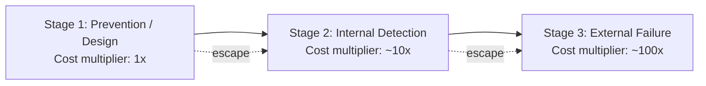

## Origin and History of the 1-10-100 Rule

### Overview

The 1-10-100 Rule is a heuristic within the Cost of Quality (CoQ) framework describing how the cost of correcting a defect escalates by roughly an order of magnitude at each successive stage it goes undetected — from prevention, through internal correction, to external failure. Unlike many formally attributed management theories, the 1-10-100 Rule's exact origin is less precisely documented in mainstream literature than its widespread current usage might suggest, and multiple traditions of quality management contributed to its development and popularization.

### Roots in Total Quality Management (TQM) and Statistical Process Control

**Key Points**

- The conceptual foundation of the 1-10-100 Rule traces back to the broader mid-20th-century quality management movement, particularly the work of quality pioneers such as W. Edwards Deming, Joseph Juran, and Philip Crosby, whose writings on the "cost of quality" and "cost of poor quality" established the premise that prevention is systematically cheaper than correction.
- Juran's cost of quality categorization (Prevention, Appraisal, Internal Failure, External Failure — the PAF model referenced throughout this curriculum) provided the categorical structure that the 1-10-100 Rule later mapped onto a simplified escalating-cost heuristic.
- Crosby's maxim that "quality is free," from his 1979 book of the same name, reinforced the underlying economic argument: investment in prevention pays for itself many times over by avoiding the much larger downstream costs of failure.
- [Unverified] The specific "1-10-100" numeric framing, as opposed to the broader cost-of-quality concept it summarizes, does not have a single universally agreed-upon originating publication in the historical record; various sources attribute popularization of the specific ratio to different origins, and this should be treated as an area of some historical ambiguity rather than a settled attribution.

### Attribution to Data Quality Literature

The 1-10-100 rule was initially introduced in 1992 pertaining to data quality, in work associated with authors George Labovitz and Yu Sang Chang. In this framing, the rule was applied to the cost of correcting errors in business data: an error is cheap to prevent at the point of data entry, more expensive to correct once it has propagated into downstream systems, and most expensive once it has caused a business decision or customer-facing consequence based on bad data. [akfpartners](https://akfpartners.com/growth-blog/1-10-100-rule-in-quality-software-development)

[Unverified] This data-quality attribution appears across multiple secondary sources but is not independently corroborated by a primary bibliographic record found during research for this material; readers seeking to cite the precise originating publication should verify against the original source before relying on it for formal academic or professional citation purposes.

### Attribution to Manufacturing and Service Industry Practice

A parallel and commonly cited origin story places the rule's popularization in industrial manufacturing quality control, independent of the data-quality lineage:

**Key Points**

- The 1-10-100 rule states that detecting quality problems early in the manufacturing process is less costly than catching a quality challenge later in the manufacturing process — finding a mistake in product development costs less than in production, and finding it in production costs less than once the product is out the door, with costs ballooning by a factor of 10 each time a problem escapes detection. [Substack](https://workclout.substack.com/p/1-10-100-rule-cost-of-quality)
- In this manufacturing framing, the first stage corresponds to a defect detected early in production where corrective actions (process parameter changes, operating procedure changes, inspection adjustments) are relatively low-cost; the second stage occurs when a defect escapes production and is noticed further down the supply chain, with substantially higher correction costs; and the third stage occurs when a defective product reaches the end customer. [ispatguru](https://www.ispatguru.com/?p=507)
- A commonly repeated (though not independently verified in the sources reviewed for this material) origin narrative attributes popularization of the rule to FedEx's service quality philosophy, applying the same escalating-cost logic to service failures rather than physical manufacturing defects. [Speculation] Given the rule's generality and independent emergence across multiple quality management traditions, it is plausible that several organizations and authors arrived at similar order-of-magnitude framings independently rather than a single definitive origin point existing.

### Convergence into a General Heuristic

Regardless of its precise point of origin, the rule converged into a general-purpose heuristic applicable across domains by generalizing three recurring stages:

**Key Points**

- The generalized three-stage structure (prevention, internal correction, external failure) maps directly onto the PAF cost-of-quality categories used throughout this curriculum's coverage of quality cost measurement and reporting.
- A commonly cited modern articulation frames the rule as: $1 for prevention through training or process improvement upfront, $10 for detection within the system such as during an internal audit or inspection, and $100 for failure when defects reach the customer, resulting in rework, recalls, or brand damage — directly connecting the rule to the reputational and brand damage costs covered in the External Failure Costs chapter of this curriculum. [rilong-mold](https://rilong-mold.com/zh/wp-json/wp/v2/posts/6308)

### Adaptation to Software Development

**Key Points**

- The concepts underlying the 1-10-100 rule, while more traditionally applicable to waterfall-style manufacturing and product development processes, have been adapted to apply to Agile software development methodology as well. [akfpartners](https://akfpartners.com/growth-blog/1-10-100-rule-in-quality-software-development)
- In the software development framing, preventing a bug by catching it while writing code costs little to nothing, catching it in QA costs roughly $10, and a bug that reaches and impacts customers costs $100 or more, directly paralleling this curriculum's software-context framing of the rule across the preceding chapters on external failure costs and quality cost measurement. [akfpartners](https://akfpartners.com/growth-blog/1-10-100-rule-in-quality-software-development)
- This adaptation underlies the modern software engineering practice known as "shift-left" testing — moving detection activities (code review, static analysis, automated testing) as early as possible in the development lifecycle, on the premise that the 1-10-100 escalation applies as directly to code defects as it does to manufacturing defects or data quality errors.

### Interpretation as an Illustrative Heuristic, Not a Precise Measurement

**Key Points**

- The 1-10-100 rule is explicitly understood in the quality management literature as a tool that allows organizations to quickly approximate or guesstimate the impact of quality costs, rather than a precisely derived empirical ratio. [Substack](https://workclout.substack.com/p/1-10-100-rule-cost-of-quality)
- Sources explicitly caveat that the rule is certainly not an exact measurement, but rather one that is easy to remember and keep in mind when making quality-related decisions. [akfpartners](https://akfpartners.com/growth-blog/1-10-100-rule-in-quality-software-development)
- [Inference] The rule's continued popularity across manufacturing, data quality, and software development contexts likely owes more to its mnemonic clarity and directional correctness — that costs escalate substantially with detection delay — than to any claim of precise numeric accuracy, which is consistent with how this curriculum has applied the rule throughout: as a framework for prioritizing prevention and appraisal investment, not as a literal cost-prediction formula.

### Relationship to This Curriculum's Structure

The chapters preceding this one — covering Prevention, Appraisal, Internal Failure, and especially External Failure costs (reputational damage, opportunity cost of lost goodwill) — represent the detailed expansion of what the 1-10-100 Rule compresses into a simple three-number mnemonic. Understanding the rule's historical development across manufacturing, data quality, and software contexts clarifies why it generalizes so readily: each domain independently observed the same underlying economic pattern, that the cost of correction is a function of how far a defect has propagated through a process before detection.

**Next Steps**

- Detailed treatment of Philip Crosby's "Quality is Free" and its influence on modern CoQ practice
- Joseph Juran's PAF cost model and its historical development
- Shift-left testing practices in modern software development
- Comparative case studies of the rule's application across manufacturing, data quality, and software domains
- Critiques and limitations of the 1-10-100 Rule as a decision-making heuristic